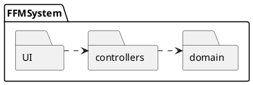
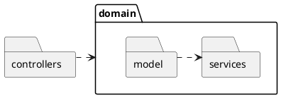
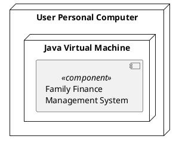

# Implementation View

## Level Two
For now, our approach is the following:

```puml
@startuml
folder "FFMSystem" as ffms {
folder ui as "UI"

folder controllers as "controllers"

folder domain as "domain"
}

ui .> controllers
controllers .> domain
@enduml
```

## Level Three

```puml
@startuml
folder controllers {
}

folder domain {
folder services
folder model
}

controllers .> domain
model .> services
@enduml
```

## Deployment View

```puml
@startuml
node UPC as "User Personal Computer" {
node JVM as "Java Virtual Machine" {
component FFMS <<component>>  as "Family Finance\nManagement System" {
}
}
}
@enduml
```
