# US001 Create standard category

# 1. Requirements

_As a system manager I want to create a standard category._

To create a root standard category we first need to know if the name already exists. If it does not
exist, then it can be added to the category list.

To create a child standard category, the name should not exist within the child categories of the
same parent, and the parent category has to exist.

## 1.1. System Sequence Diagram

The System Sequence Diagram below represents the interaction between a System Manager and the
Application.

<!--
@startuml US001_SSD
header SSD
title Create a standard category
autonumber
actor "System Manager" as SM
participant ": Application" as App

SM -> App : Create a new category
activate SM
activate App
return ask category name and parentId
deactivate App

SM -> App : input category name and parentId
activate App

return inform result
deactivate App

deactivate SM
@enduml
-->

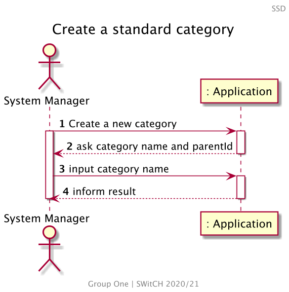

## 1.2. Dependency of other user stories

This US has no dependencies of any other User Stories, nevertheless [US002] needs to create
categories to show the categories tree and [US110] needs categories associated with the Family
[US010].

# 2. Analysis

## 2.1 Category entry

According to what was presented in the US, a standard category is created upon request from the
System Manager.

These categories can be used by any user of the Application.

A category should be created with an alphanumeric string as its description/title, and repeated
categories (i.e. with the same name and parent) should not exist among the standard categories
names.

Using this strategy, it was decided that it would be better to create the category, verify if its
name already exists and, if not, then add it to the list of categories.

The identification of the categories across the application is obtained by the combination  
of its name and its parent.

Regarding [US002], categories should also have a tree structure (i.e. levels), such as:

```
CATEGORIES
|-- Shopping (1)
|   |-- Groceries (1.1)
|   |   |-- Vegetables (1.1.1)
|   |   |-- Protein (1.1.2)
|   |   |-- Carbs (1.1.3)
|   |-- Clothes (1.2)
|-- Bills (2)
|   |-- Energy (2.1)
(...)
```

With that said, a category should have the following attributes:

| Attributes | Rules                                                                  |
| ---------- | --------------------------------------------------------------         |
| name       | required, alphanumeric, String                                         |
| id         | numeric. The identification of the category                            |
| parentId   | numeric. The identification of the parent category                     |
| isStandard | a boolean to identify what categories are shipped with the Application |

The default isStandard value is false.

## 2.2 Domain Model Excerpt

For quick reference, there's a relevant extract of the domain model.

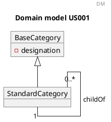

<!--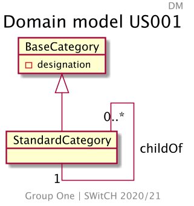-->

# 3. Design

## 3.1. Functionality Development

Regarding the creation of a new standard category, the requirements specified
in [Analysis](#2-analysis) should be accommodated.

The System Diagram is the following:

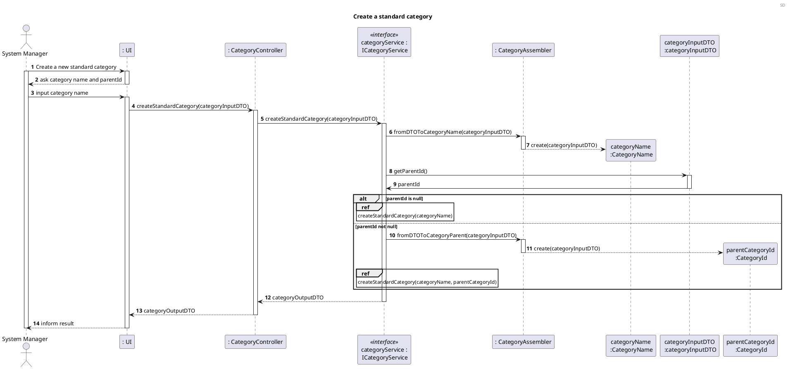

<!-- 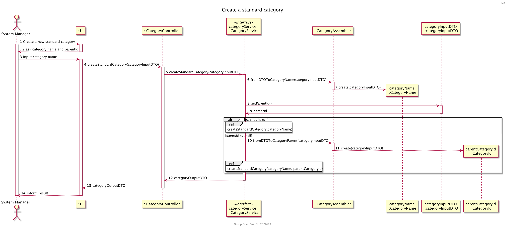-->

- To create a root category, the sequence action createStandardCategory(name) is the following:

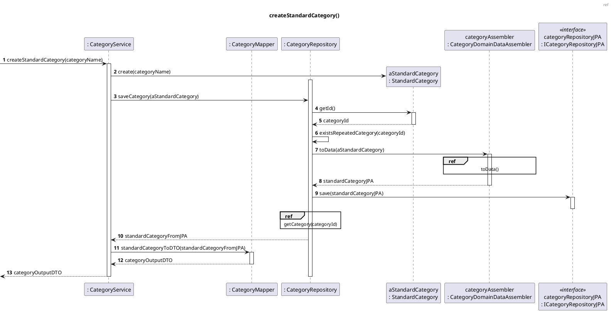

<!-- 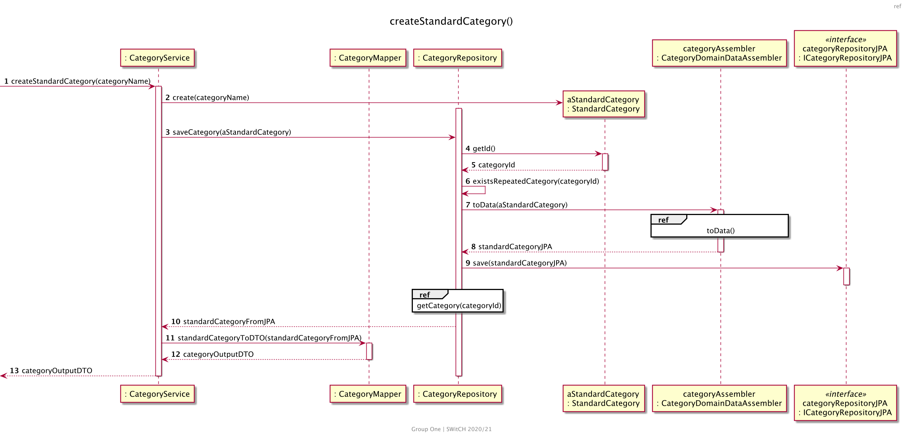 -->

- To create a child category, the sequence action createStandardCategory(categoryName, parentId) is
  the following:

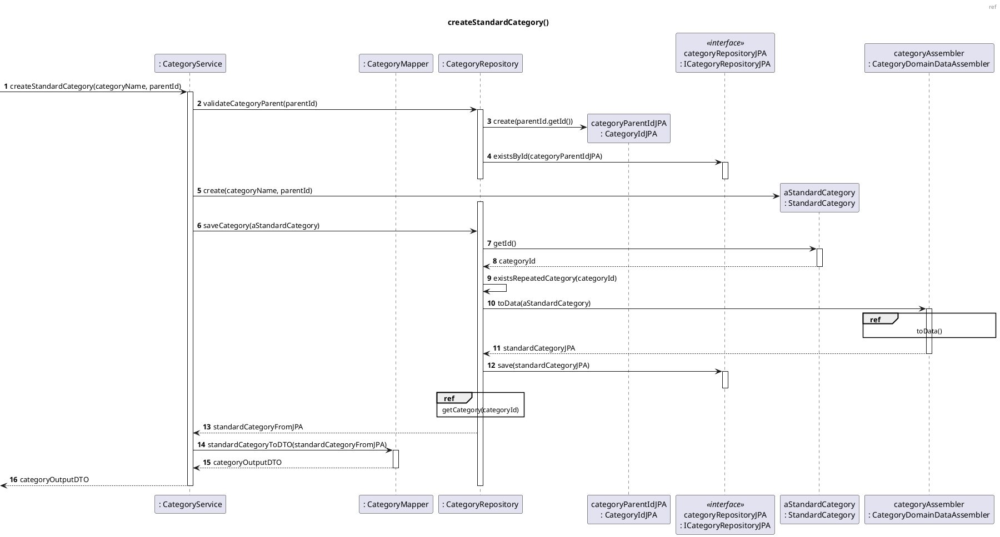

<!-- 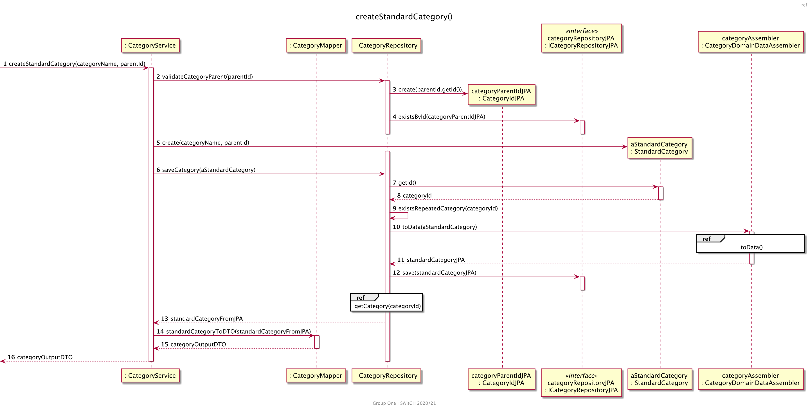 -->

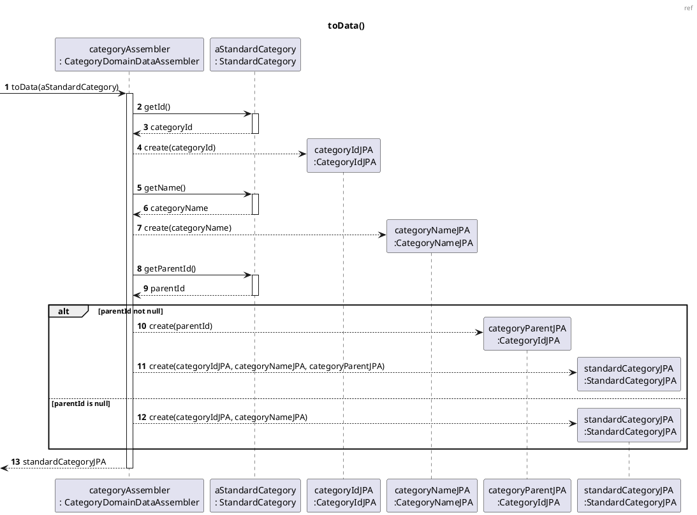

<!--  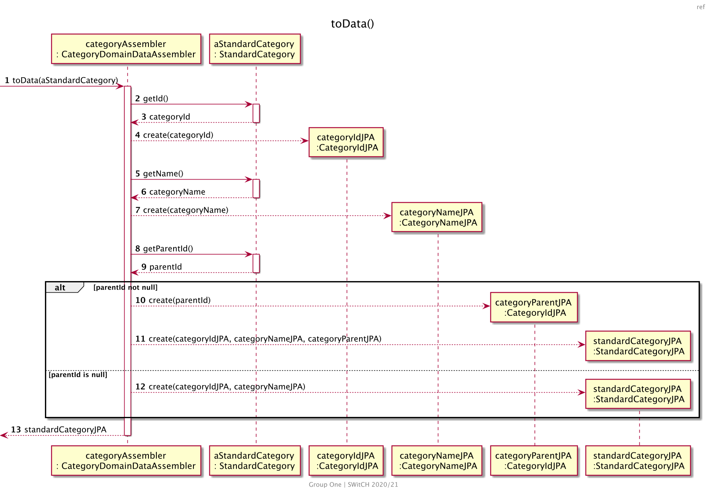 -->

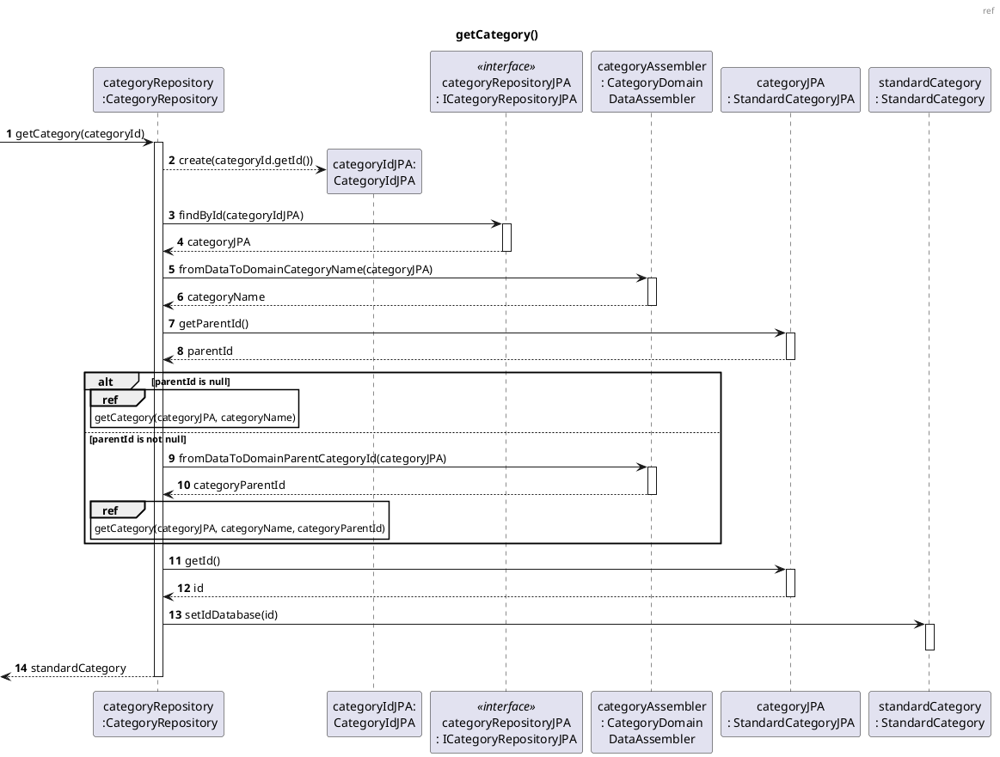

<!--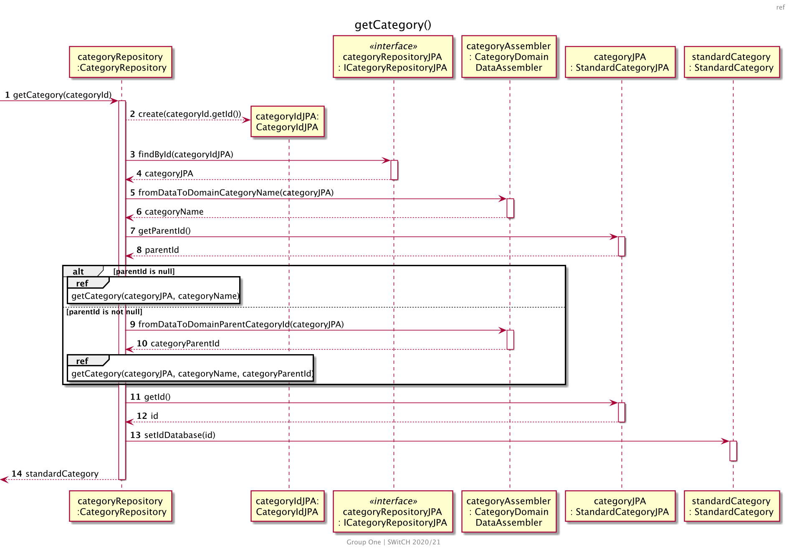-->


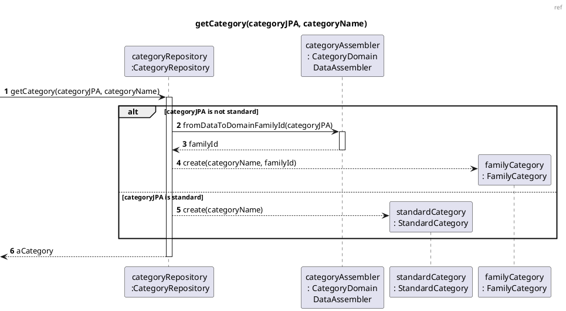

<!--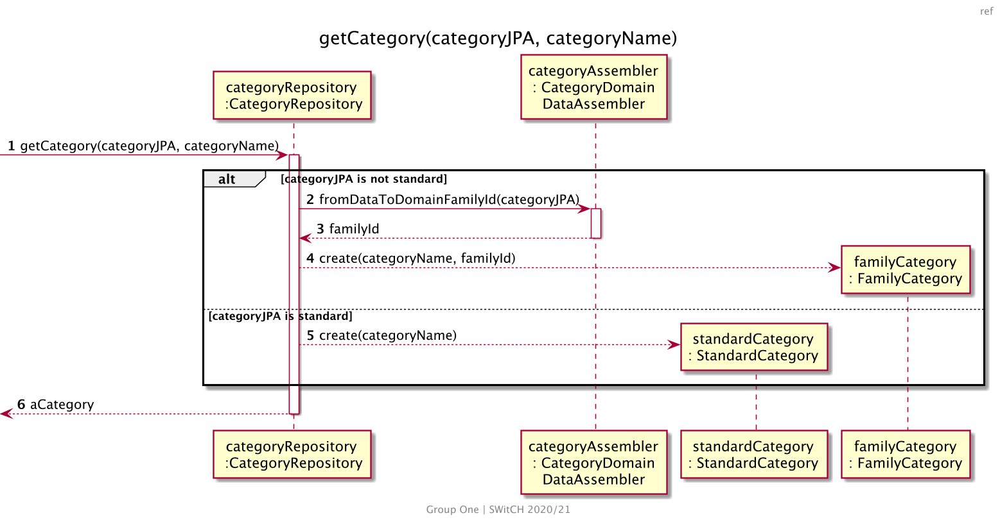-->

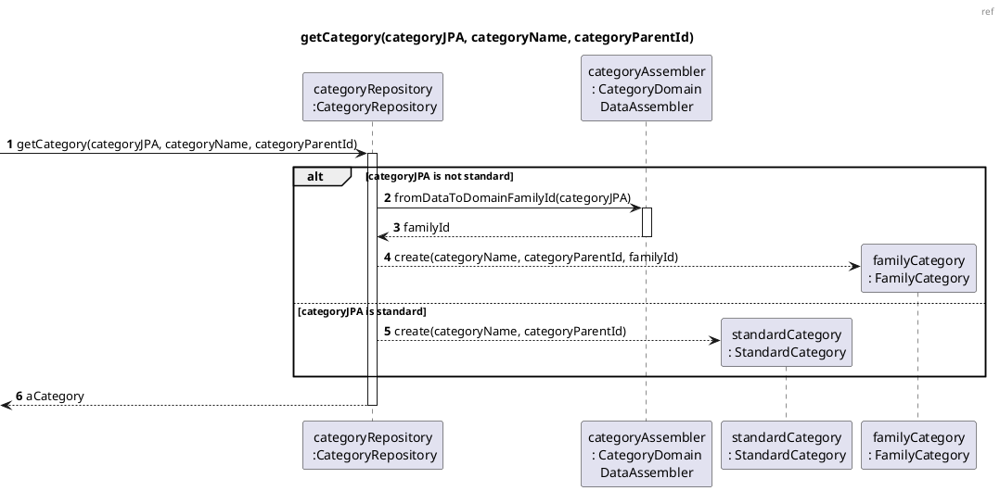

<!--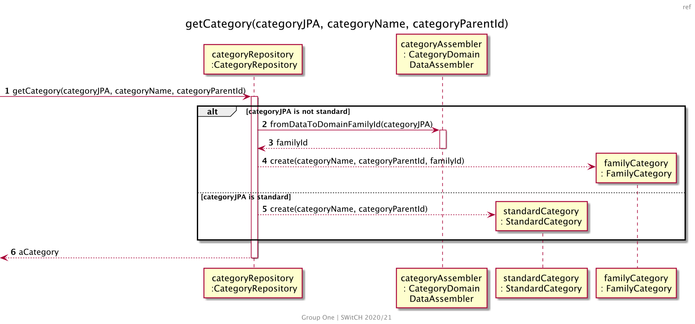-->


When the System Manager inputs the required data for a standard category to be created, the
Application should then operate the required methods creating a new and valid standard category.

## 3.2. Class Diagram

The Class Diagram is the following:

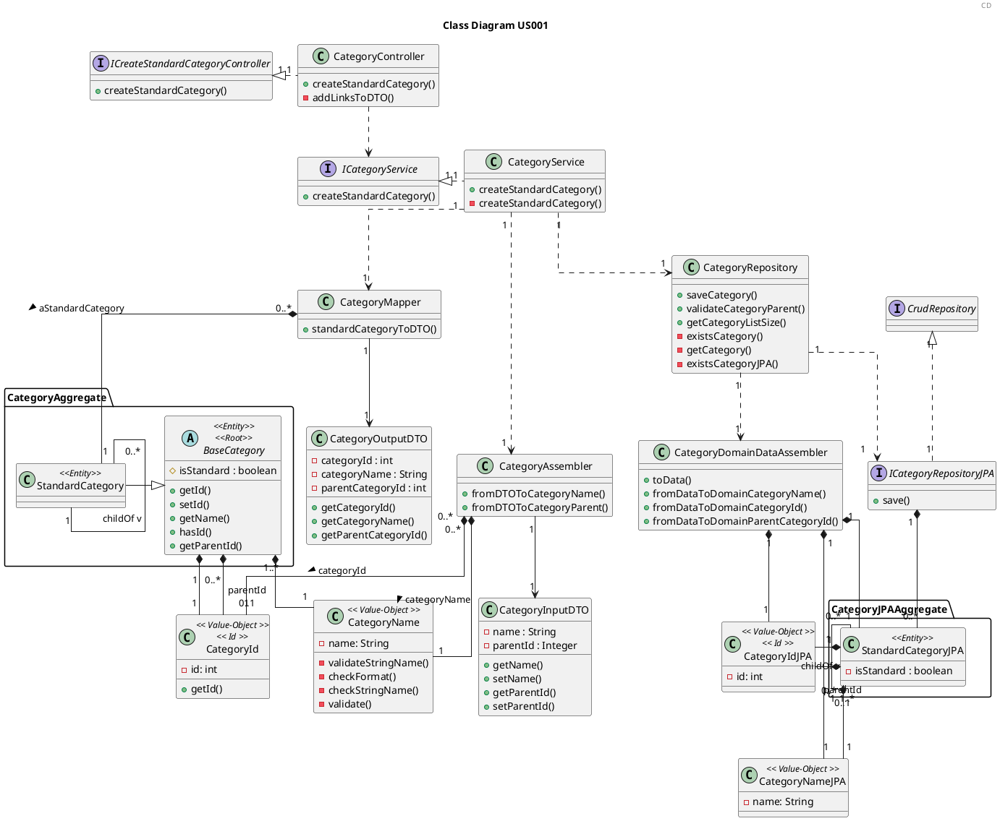

<!---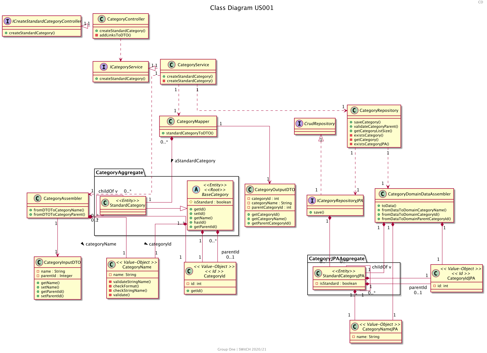-->

## 3.3. Applied Patterns

In order to achieve best practices in software development, to implement this US the following were
used:

- *Single Responsibility Principle* - Classes should have one responsibility, which means, only one
  reason to change;
- *Information Expert* - Assign a responsibility to the class that has the information needed to
  fulfill it;
- *Pure Fabrication* - CategoryService was implemented to manage all things related to add a
  Category.
- *Creator* - To create a category we need to check if the category name doesn't exist. 
- *Controller* - CreateStandardCategoryController was created;
- *Low Coupling* - Classes were assigned responsibilities so that coupling remains as low as
  possible, reducing the impact of any changes made to the objects later on;
- *High Cohesion* - Classes were assigned responsibilities so that cohesion remains high(they are
  strongly related and highly focused). This helps to keep the objects understandable and
  manageable, and also goes hand in hand with the low coupling principle.

## 3.4. Tests

### 3.4.1 Unit Tests

Referring different aspects of the Categories attributes, it is necessary to establish a set of unit
tests in relation to the domain classes, namely the **StandardCategory** and the Value Objects that
make up the aggregate. The unit tests are defined below, organized by the corresponding classes:

- **Unit Test 1:** Assert the creation of a new root standard category.

```java
 @Test
    void createRootStandardCategory(){
        //arrange
            String name="Shopping";
            CategoryInputDTO categoryInputDTO=new CategoryInputDTO();
            categoryInputDTO.setName(name);
            CategoryId categoryId=new CategoryId(new Random().nextInt());

            CategoryOutputDTO categoryDTO=new CategoryOutputDTO(categoryId.getId(),name);
            when(categoryService.createStandardCategory(categoryInputDTO)).thenReturn(categoryDTO);

            ResponseEntity<Object> result;
            HttpStatus expected=HttpStatus.CREATED;

        //act
            result=categoryController.createStandardCategory(categoryInputDTO);

        //assert
            assertNotNull(result);
            assertEquals(expected,result.getStatusCode());
        }
```

- **Unit Test 2:** Assert the creation of a new child standard category.

```java
@Test
    void createChildStandardCategory(){
            //arrange
            String name="Shopping";
            CategoryInputDTO categoryInputDTO=new CategoryInputDTO();
            categoryInputDTO.setName(name);
            CategoryId categoryId=new CategoryId(new Random().nextInt());
            CategoryOutputDTO categoryDTO=new CategoryOutputDTO(categoryId.getId(),name);
            when(categoryService.createStandardCategory(categoryInputDTO)).thenReturn(categoryDTO);
            categoryController.createStandardCategory(categoryInputDTO);


            String childName="Clothing";
            CategoryInputDTO categoryChildInputDTO=new CategoryInputDTO();
            categoryChildInputDTO.setName(childName);
            categoryChildInputDTO.setParentId(categoryId.getId());
            CategoryId childId=new CategoryId(new Random().nextInt());
            CategoryOutputDTO categoryChildDTO=new CategoryOutputDTO(childId.getId(),childName,categoryId.getId());
            when(categoryService.createStandardCategory(categoryChildInputDTO)).thenReturn(categoryChildDTO);

            ResponseEntity<Object> result;
            HttpStatus expected=HttpStatus.CREATED;

        //act
            result=categoryController.createStandardCategory(categoryChildInputDTO);

        //assert
            assertNotNull(result);
            assertEquals(expected,result.getStatusCode());
        }
```

- **Unit Test 3:** Throw an error when creating a category with invalid name.

```java
@ParameterizedTest
@NullAndEmptySource
    void ensureRootStandardCategoryNotCreatedWhenInvalidName(String name){
        //arrange
            CategoryInputDTO categoryInputDTO=new CategoryInputDTO();
            categoryInputDTO.setName(name);
            when(categoryService.createStandardCategory(categoryInputDTO)).thenThrow(InvalidNameException.class);

            ResponseEntity<Object> result;
            HttpStatus expected=HttpStatus.BAD_REQUEST;

        //act
        result=categoryController.createStandardCategory(categoryInputDTO);

        //assert
        assertEquals(expected,result.getStatusCode());
        }
```

- **Unit Test 4:** Do not create child category when parent category does not exist.

```java
@Test
    void ensureChildStandardCategoryNotCreatedWithNonExistingParent(){
        //arrange
            String childName="Vegetables";
            int childParentId=new Random().nextInt();
            CategoryInputDTO categoryInputDTO=new CategoryInputDTO();
            categoryInputDTO.setName(childName);
            categoryInputDTO.setParentId(childParentId);
            when(categoryService.createStandardCategory(categoryInputDTO)).thenThrow(ObjectDoesNotExistException.class);

            ResponseEntity<Object> result;
            HttpStatus expected=HttpStatus.BAD_REQUEST;

        //act
            result=categoryController.createStandardCategory(categoryInputDTO);
    
        //assert
            assertEquals(expected,result.getStatusCode());
        }
```

- **Unit Test 5:** Do not create category already existing.

```java
@Test
    void ensureExistingStandardRootCategoryNotCreatedAgain(){
        //arrange
            String name="Shopping";
            CategoryId categoryId=new CategoryId(new Random().nextInt());
            CategoryInputDTO categoryInputDTO=new CategoryInputDTO();
            categoryInputDTO.setName(name);
            CategoryOutputDTO categoryDTO=new CategoryOutputDTO(categoryId.getId(),name);
            when(categoryService.createStandardCategory(categoryInputDTO)).thenReturn(categoryDTO);
            categoryController.createStandardCategory(categoryInputDTO);

            when(categoryService.createStandardCategory(categoryInputDTO)).thenThrow(DuplicateObjectException.class);

            ResponseEntity<Object> result;
            HttpStatus expected=HttpStatus.BAD_REQUEST;

        //act
            result=categoryController.createStandardCategory(categoryInputDTO);

        //assert
            assertEquals(expected,result.getStatusCode());
        }
```

### 3.4.2 Integration Tests

In order to ensure that of all parts of the system and functionalities are working correctly (e.g.
Controller, Service, Repository, Model), it is necessary to define a set of Integration Tests that
will simulate the system use cases, such as:

- **Integration Test 1:** Assert the creation of a new root standard category.

```java
 @Test
    void ensureRootStandardCategoryIsCreated(){
        //arrange
            String name="Shopping";
            ResponseEntity<Object> result;

            CategoryInputDTO categoryInputDTO=new CategoryInputDTO();
            categoryInputDTO.setName(name);

        //act
             result=categoryController.createStandardCategory(categoryInputDTO);

        //assert
             assertNotNull(result);
            assertEquals(HttpStatus.CREATED,result.getStatusCode());
        }
```

- **Integration Test 2:** Assert the creation of a new child standard category.

```java
@Test
    void ensureChildStandardCategoryIsCreated(){
        //arrange
            String name="Shopping";
            CategoryInputDTO categoryInputDTO=new CategoryInputDTO();
            categoryInputDTO.setName(name);

            CategoryOutputDTO categoryDTO=
            (CategoryOutputDTO)categoryController.createStandardCategory(categoryInputDTO).getBody();
            int parentId=categoryDTO.getCategoryId();

            String childName="Clothing";
            CategoryInputDTO childInputDTO=new CategoryInputDTO();
            childInputDTO.setName(childName);
            childInputDTO.setParentId(parentId);

            ResponseEntity<Object> result;
            HttpStatus expected=HttpStatus.CREATED;

        //act
            result=categoryController.createStandardCategory(childInputDTO);

        //assert
            assertNotNull(result);
            assertEquals(expected,result.getStatusCode());
        }

```

- **Integration Test 3:** Throw an error when creating a category with invalid name.

```java
@ParameterizedTest
@NullAndEmptySource
    void ensureRootStandardCategoryNotCreatedWhenInvalidName(String name){
        //arrange
            CategoryInputDTO categoryInputDTO=new CategoryInputDTO();
            categoryInputDTO.setName(name);

            ResponseEntity<Object> result;
            HttpStatus expected=HttpStatus.BAD_REQUEST;

        //act
            result=categoryController.createStandardCategory(categoryInputDTO);

        //assert
            assertEquals(expected,result.getStatusCode());
        }
```

- **Integration Test 4:** Do not create child category when parent category does not exist.

```java
@Test
    void ensureChildStandardCategoryNotCreatedWithNonExistingParent(){
        //arrange
            String childName="Vegetables";
            int childParentId=new Random().nextInt();
            CategoryInputDTO categoryInputDTO=new CategoryInputDTO();
            categoryInputDTO.setName(childName);
            categoryInputDTO.setParentId(childParentId);

            ResponseEntity<Object> result;
            HttpStatus expected=HttpStatus.BAD_REQUEST;

        //act
        result=categoryController.createStandardCategory(categoryInputDTO);

        //assert
        assertEquals(expected,result.getStatusCode());
        }

```

- **Integration Test 5:** Do not create child category already existing.

```java
@Test
    void ensureExistingStandardChildCategoryNotCreatedAgain(){
        //arrange
            String name="Shopping";
            CategoryInputDTO categoryInputDTO=new CategoryInputDTO();
            categoryInputDTO.setName(name);
            CategoryOutputDTO categoryDTO=
            (CategoryOutputDTO)categoryController.createStandardCategory(categoryInputDTO).getBody();

            int childParentId=categoryDTO.getCategoryId();
            String childName="Clothing";
            CategoryInputDTO childInputDTO=new CategoryInputDTO();
            childInputDTO.setName(childName);
            childInputDTO.setParentId(childParentId);
            categoryController.createStandardCategory(childInputDTO);

            ResponseEntity<Object> result;
            HttpStatus expected=HttpStatus.BAD_REQUEST;

        //act
            result=categoryController.createStandardCategory(childInputDTO);

        //assert
            assertNotNull(result);
            assertEquals(expected,result.getStatusCode());
        }
```

# 4. Implementation

The main challenges that were found while implementing this functionality were:

- The need to identify a parent;

To minimize these difficulties, a lot of research and study of reliable documentation was done.

So that we could present a reliable functionality, many tests were done, to identify as many
possible errors in the implementation as possible.

# 5. Integration/Demonstration

As mentioned before, this functionality will be indirectly necessary for [US002], the standard
categories will be shown in the category tree of the [US002] and for [US110], this User Story will
associate the categories with some instance of Family [US010].

At the moment, no other user stories are dependent on this one, so its integration with other
functionalities cannot be tested further.

# 6. Comments

[us002]: US002_Get_Standard_Categories.md

[us010]: US010_Create_Family_And_Set_Family_Administrator.md

[us110]: US110_Get_Family_Category_Tree.md
