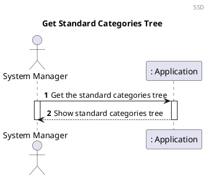
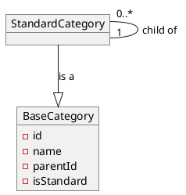
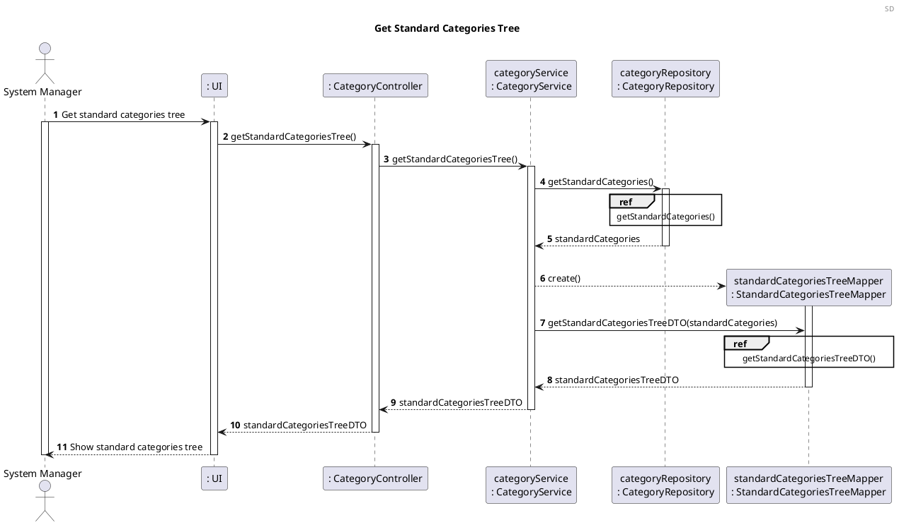
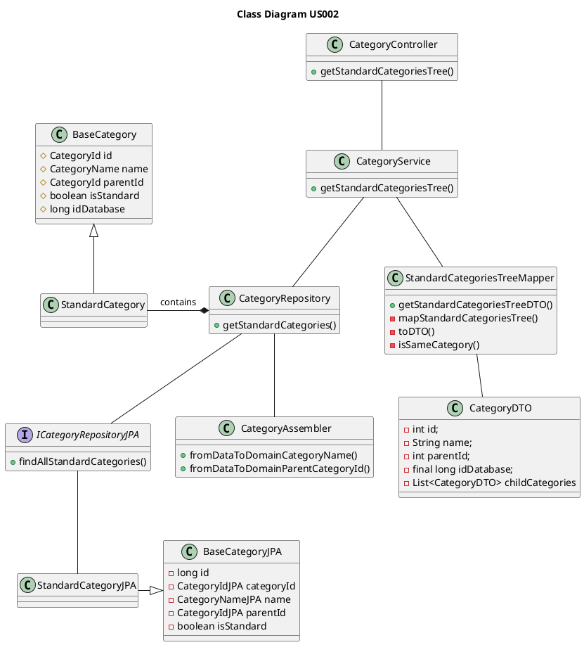

US002 Get Standard Categories
=======================================

# 1. Requirements

*As a system manager, I want to get the standard categories tree.*

This US depends on the [US001](US001_Create_Standard_Category.md) because we first need to create standard categories, so we can present the category tree.



# 2. Analysis

A category is a way to classify a transaction. It will allow the user to analyse monthly and annual 
spending per category and/or class of categories. 

These categories can either be standard ones, created by the system manager, or custom/family ones, 
created by the family administrator.

This distinction makes us assume that every standard category should be
accessible by any family and every custom category should be associated
with those standard ones. (*SWS provides a standard category tree that can be
customized by the family, i.e. the addition of new branches and leaves.*)

The standard categories should be stored in a way that every family has access
to them, allowing a single change to be applied to all families. They cannot be changed by the 
families.

Besides the standard categories tree, we should also have the family's category tree, containing
the standard categories and the ones created by the family. We will only be considering the first one in this US.

## 2.1 Domain Model Excerpt

For a quick reference, here is an extract of the project's domain model that is relevant to this US:



# 3. Design

## 3.1. Functionality Development




```puml
autonumber
header ref
title getStandardCategories()

participant "categoryRepository\n: CategoryRepository" as CR
participant "iCategoryRepositoryJPA\n: ICategoryRepositoryJPA" as ICR
participant "categoryDomainDataAssembler\n: CategoryDomainDataAssembler" as CDDA
participant "standardCategory\n: StandardCategory" as SC
participant "standardCategories\n: List<StandardCategory>" as SCL
participant "standardCategoriesJPA\n: List<StandardCategoryJPA>" as SCLJPA

-> CR : getStandardCategories()
activate CR

CR -> ICR : findAll()
activate ICR

ICR --> CR : standardCategoriesJPAIterable
deactivate ICR

|||

CR -> CR : convertIterableToList(standardCategoriesJPAIterable)
activate CR

CR --> SCLJPA** : create

loop for each standardCategoriesJPA in standardCategoriesJPAIterable

CR -> SCLJPA : add(standardCategoriesJPA)
activate SCLJPA
deactivate SCLJPA

end

return : standardCategoriesJPA
deactivate CDDA

|||

CR --> SCL** : create

loop for each standardCategoryJPA in standardCategoriesJPA

CR -> CDDA : fromDataToDomainCategoryName(standardCategoryJPA) 
activate CDDA

CDDA --> CR : categoryName
deactivate CDDA

CR -> CDDA : fromDataToDomainParentCategoryId(standardCategoryJPA) 
activate CDDA

CDDA --> CR : parentCategoryId
deactivate CDDA

|||

alt parentCategoryId == null
    CR --> SC** : create(categoryName)
else parentCategoryId != null
    CR --> SC** : create(categoryName, parentCategoryId)
end
   
CR -> SCL : add(standardCategory)
activate SCL
deactivate SCL

end

<-- CR: standardCategories

deactivate CR
```

```puml
autonumber
title getStandardCategoriesTreeDTO()

participant "standardCategoriesTreeMapper\n: StandardCategoriesTreeMapper" as mapper
participant "standardCategoriesTreeDTO\n: StandardCategoriesTreeDTO" as DTO
participant "standardCategory\n: StandardCategory" as SC
participant "standardCategoryDTOs\n: List<StandardCategoryDTO>" as SCL
participant "filetredCategories\n: List<StandardCategory>" as FC
participant "childCategories\n: List<StandardCategoryDTO>" as SCCL
participant "standardCategoryDTO\n: StandardCategoryDTO" as SCDTO

-> mapper : getStandardCategoriesTreeDTO(standardCategories)
activate mapper


mapper -> mapper : mapStandardCategoriesTree(standardCategories, null)

mapper --> SCL** : create()
activate mapper

mapper -> FC** : standardCategories.stream().filter(getParentId() != parentId)

loop for each standardCategory in standardCategories

mapper -> SC : getId()
activate SC

return categoryIdVO
deactivate SC

mapper -> SC : getParentId()
activate SC

return parentCategoryIdVO

mapper -> mapper : result = isSameCategory(parentCategoryIdVO, parentId)

alt result == true 

    mapper -> SCCL** : mapStandardCategoriesTree(filteredCategories, categoryIdVO)
    
    mapper -> SCDTO** : toDTO(standardCategory)
        
    mapper -> SCDTO : setChildCategories(childCategories)
    activate SCDTO
    deactivate SCDTO
    
    mapper -> SCL : add(standardCategoryDTO)
    activate SCL
    deactivate SCL
    deactivate mapper
    
end loop

end alt

|||

mapper -> DTO** : create(standardCategoryDTOs)

<-- mapper: standardCategoriesTreeDTO
    deactivate mapper


```

## 3.2. Class Diagram



## 3.3. Applied Patterns

In order to achieve best practices in software development, to implement this US
we're using the following:

- *Single Responsibility Principle* - Classes should have one responsibility,
  which means, only one reason to change;
- *Information Expert* - Assign a responsibility to the class that has the
  information needed to fulfill it;
- *Pure Fabrication* - Category Service was implemented to manage all things
  category related.
- *Creator* - Standard categories are created by Category Service;
- *Controller* - GetStandardCategoriesTreeController was created;
- *Low Coupling* - CategoryService is the only class responsible to return the
  tree.
- *High Cohesion* - CategoryService is the only class responsible to return the
  tree.

## 3.4. Tests

### 3.4.1 Unit Tests

**Test 1:** Obtain the Standard Category List Tree as a DTO:

```java
@Test
    void getStandardCategoryTree_AsExpected() {
            String name = "Shopping";
            CreateStandardCategoryController createStandardCategoryController = new CreateStandardCategoryController(application);
            createStandardCategoryController.createStandardCategory(name);

            CategoryTreeDTO result = getStandardCategoryController.getStandardCategoryTree();

            assertNotNull(result);
            }
```

**Test 2:** Obtain the Standard Category List Tree as a String:

```java
@Test
    void getStandardCategoryToString_AsExpected() {
            String name = "Shopping";
            String expected = "|-- Shopping";
            CreateStandardCategoryController createStandardCategoryController = new CreateStandardCategoryController(application);
            createStandardCategoryController.createStandardCategory(name);

            String result = getStandardCategoryController.getStandardCategoryToString();

            assertEquals(expected, result);
            }
```

**Test 3:** Get an empty category tree list:
```java
@Test
    void getStandardCategoryTree_NullList() {
        List<Category> expectedList = new ArrayList<>();
        CategoryTreeDTO expectedDTO = new CategoryTreeDTO(expectedList);

        CategoryTreeDTO resultDTO = getStandardCategoryController.getStandardCategoryTree();

        assertEquals(expectedDTO.getCategoryTreeList(), resultDTO.getCategoryTreeList());
    }
```

# 4. Implementation

The main challenges found while implementing this functionality were:
 
 - The dependency on other functionalities to implement and test this functionality correctly.
 
 To minimize this difficulty, a lot of research and study of reliable documentation was done.
 
 In order to have a reliable functionality, many tests were done, 
 to identify as many possible errors in the
 implementation as possible.

# 5. Integration/Demonstration
As mentioned before, this functionality has dependency from [US001](US001_Create_Standard_Category.md). 
The development of this functionality helps to prove a good integration 
of the [US001](US001_Create_Standard_Category.md) functionality and its system components.

At the moment, there are no User Stories dependent on the development of this User Story, 
therefore its integration with other functionalities/features
cannot be tested further.

# 6. Observations
A feature that would be interesting to implement, in the future, is the possibility to add, remove or edit standard categories.