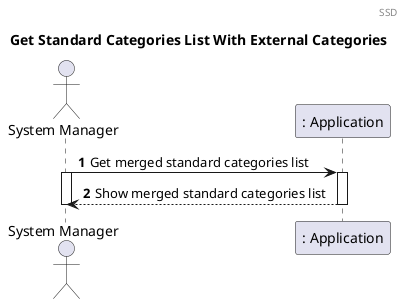
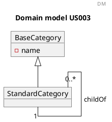
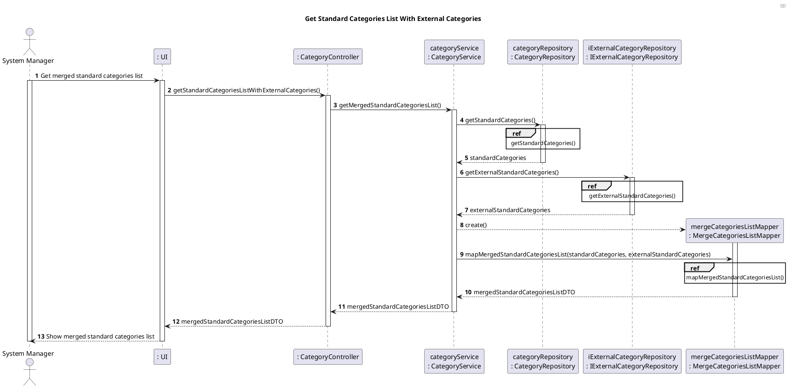
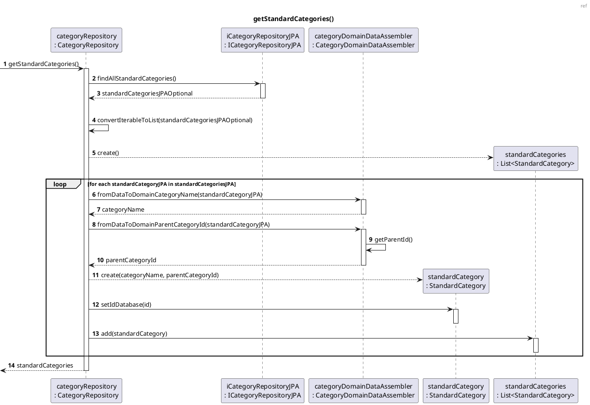
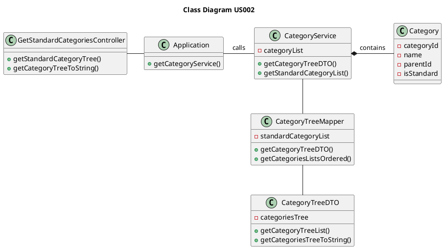

US003 Get list of standard categories to include those loaded from a complementary system defined by configuration
=======================================

# 1. Requirements

*US003 As a System Manager I want that the list of standard categories to include those loaded 
(whenever needed) from a complementary system defined by configuration.*



# 2. Analysis

Categories are a concept of our domain model, in which it will be possible to
create standard and non-standard categories.

This distinction makes us assume that every standard category should be
accessible by any family and every non-standard category should be associated
with those standard ones.

## 2.1 Domain Model Excerpt

For quick reference, there's a relevant extract of the domain model.



# 3. Design

## 3.1. Functionality Development

The Sequence Diagram for this user story:





```puml
@startuml US003_SD_Ref2
autonumber
header ref
title getExternalStandardCategories()

participant "externalCategoryRepository\n: ExternalCategoryRepository" as ECR
participant "categoryAdapter\n: CategoryAdapter" as CA
participant "externalCategoryPrimitivesList\n: List<ExternalCategoryDTO>" as ECPL
participant "array\n: JSONarray" as array
participant "externalCategoryDTO\n: ExatenalCategoryDTO" as DTO
participant "externalStandardCategories\n: List<StandardCategory>" as ESC
participant "externalCategoryAssembler\n: ExternalCategoryAssembler" as ECA
participant "standardCategory\n: StandardCategory" as SC

-> ECR : getExternalStandardCategories()

activate ECR
ECR -> ECR : response = sendHttpClientRequestGet()

ECR -> CA : fromHttpToPrimitivesGroupTwo(response, URI)
activate CA
CA --> ECPL** : create()

CA -> array** : create(response)

loop for (int i = 0; i < array.length(); i++)
CA -> array : getJSONObject(i)
activate array
array --> CA : object
deactivate array

CA -> array : getString("name")
activate array
array --> CA : name
deactivate array

CA -> array : getString("categoryId")
activate array
array --> CA : categoryId
deactivate array

CA -> array : optString("parentId, null")
activate array
array --> CA : parentId
deactivate array

CA -> DTO : toExternalCategoryDTO(categoryId, name, parentId, URI)
activate DTO
DTO --> DTO : create(fullQualifiedName, name,\nfullQualifiedParentName)
DTO --> CA : externalCategoryDTO
deactivate DTO

CA -> ECPL : add(externalCategoryDTO)
end

CA --> ECR : externalCategoryPrimitivesList
deactivate CA

ECR -> ESC* : create()

loop for each externalPrimitivesDTO in externalCategoryPrimitivesList
ECR -> ECA : fromPrimitiveToCategoryId(externalPrimitivesDTO)
activate ECA
ECA --> ECR : categoryId
deactivate ECA

ECR -> ECA : fromPrimitiveToCategoryName(externalPrimitivesDTO)
activate ECA
ECA --> ECR : categoryName
deactivate ECA

ECR -> ECA : fromPrimitiveToParentId(externalPrimitivesDTO)
activate ECA
ECA --> ECR : parentId
deactivate ECA

ECR --> SC* : create(categoryId, categoryName, parentId)
ECR -> ESC : add(standardCategory)
end

<-- ECR: externalStandardCategories
deactivate ECR
@enduml
```

```puml
@startuml US003_SD_Ref3
autonumber
title mapMergedStandardCategoriesList()

participant "mergeCategoriesListMapper\n: MergeCategoriesListMapper" as MM
participant "mergedCategories\n: List<StandardCategory>" as MCL
participant "mergedCategoriesDTO\n: List<CategoryDTO>" as DTOL
participant "standardCategoriesTreeMapper\n: StandardCategoriesTreeMapper" as SCM
participant "mergedStandardCategoriesListDTO\n: MergedStandardCategoriesListDTO" as SCDTO

-> MM : mapMergedStandardCategoriesList\n(standardCategories, externalStandardCategories)

activate MM
MM --> MCL* : create()
MM -> MCL : addAll(standardCategories)
activate MCL
deactivate MCL

MM -> MCL : addAll(externalStandardCategories)
activate MCL
deactivate MCL

MM --> DTOL* : create()

loop for each aStandardCategory in mergedCategories
MM -> SCM : toDTO(aStandardCategory)
activate SCM
SCM --> MM : aStandardCategoryDTO
deactivate SCM
MM -> DTOL: add(aStandardCategoryDTO)
activate DTOL
deactivate DTOL
end

MM --> SCDTO* : create(mergedCategoriesDTO)
activate SCDTO
SCDTO --> MM : mergedStandardCategoriesListDTO
deactivate SCDTO

<-- MM : mergedStandardCategoriesListDTO
deactivate MM
@enduml
```

## 3.2. Class Diagram



## 3.3. Applied Patterns

In order to achieve best practices in software development, to implement this US
we're using the following:

- *Single Responsibility Principle* - Classes should have one responsibility,
  which means, only one reason to change;
- *Information Expert* - Assign a responsibility to the class that has the
  information needed to fulfill it;
- *Pure Fabrication* - Category Service was implemented to manage all things
  category related.
- *Creator* - Standard categories are created by Category Service;
- *Controller* - GetStandardCategoriesTreeController was created;
- *Low Coupling* - CategoryService is the only class responsible to return the
  tree.
- *High Cohesion* - CategoryService is the only class responsible to return the
  tree.

## 3.4. Tests

### 3.4.1 Unit Tests

**Test 1:** Obtain the Standard Category List Tree as a DTO:

```java
@Test
    void getStandardCategoryTree_AsExpected() {
            String name = "Shopping";
            CreateStandardCategoryController createStandardCategoryController = new CreateStandardCategoryController(application);
            createStandardCategoryController.createStandardCategory(name);

            CategoryTreeDTO result = getStandardCategoryController.getStandardCategoryTree();

            assertNotNull(result);
            }
```

**Test 2:** Obtain the Standard Category List Tree as a String:

```java
@Test
    void getStandardCategoryToString_AsExpected() {
            String name = "Shopping";
            String expected = "|-- Shopping";
            CreateStandardCategoryController createStandardCategoryController = new CreateStandardCategoryController(application);
            createStandardCategoryController.createStandardCategory(name);

            String result = getStandardCategoryController.getStandardCategoryToString();

            assertEquals(expected, result);
            }
```

**Test 3:** Get an empty category tree list:
```java
@Test
    void getStandardCategoryTree_NullList() {
        List<Category> expectedList = new ArrayList<>();
        CategoryTreeDTO expectedDTO = new CategoryTreeDTO(expectedList);

        CategoryTreeDTO resultDTO = getStandardCategoryController.getStandardCategoryTree();

        assertEquals(expectedDTO.getCategoryTreeList(), resultDTO.getCategoryTreeList());
    }
```

# 4. Implementation

The main challenges found while implementing this functionality were:
 
 - The dependency on other functionalities to implement and test this functionality correctly.
 
 To minimize this difficulty, a lot of research and study of reliable documentation was done.
 
 In order to have a reliable functionality, many tests were done, 
 to identify as many possible errors in the
 implementation as possible.

# 5. Integration/Demonstration
As mentioned before, this functionality has dependency from [US001](US001_Create_Standard_Category.md). 
The development of this functionality helps to prove a good integration 
of the [US001](US001_Create_Standard_Category.md) functionality and its system components.

At the moment, there are no User Stories dependent on the development of this User Story, 
therefore its integration with other functionalities/features
cannot be tested further.

# 6. Observations
A feature that would be interesting to implement, in the future, is the possibility to add, remove or edit standard categories.