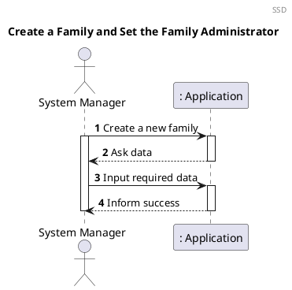
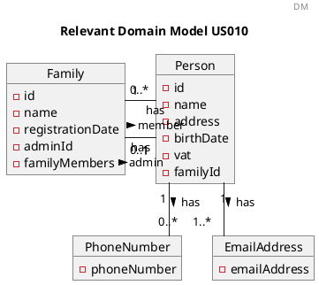
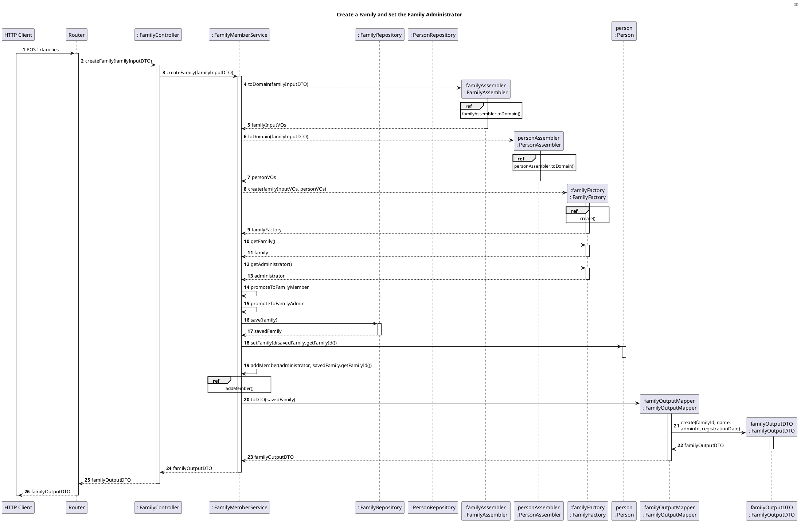
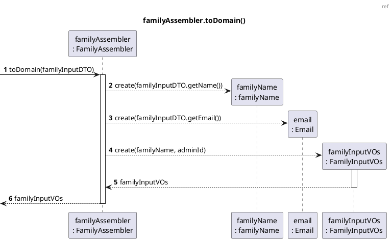
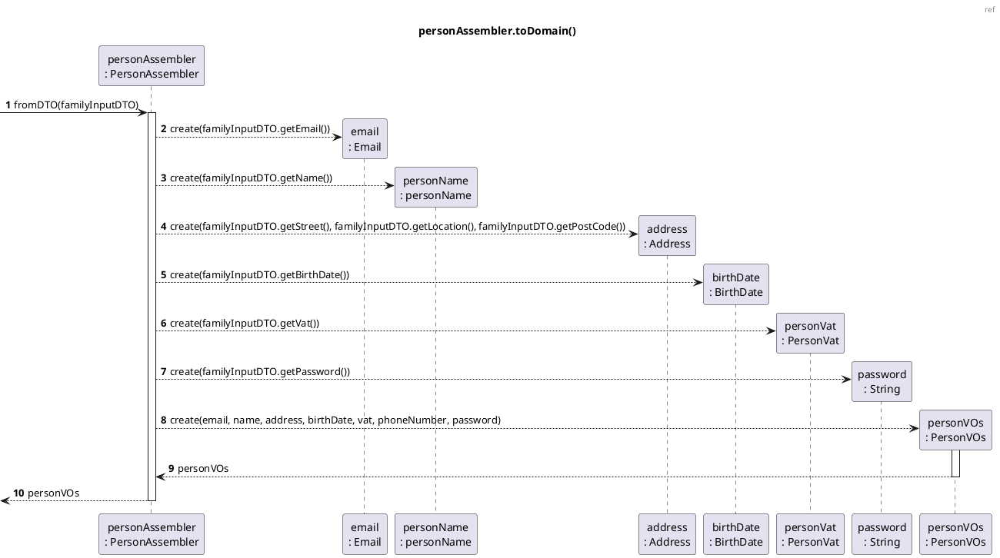
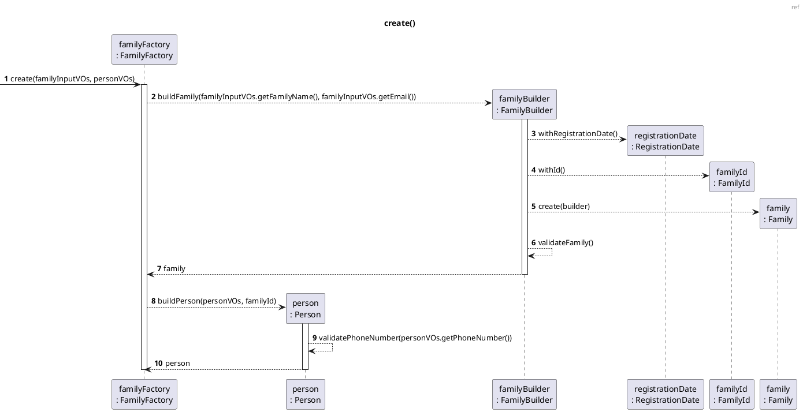
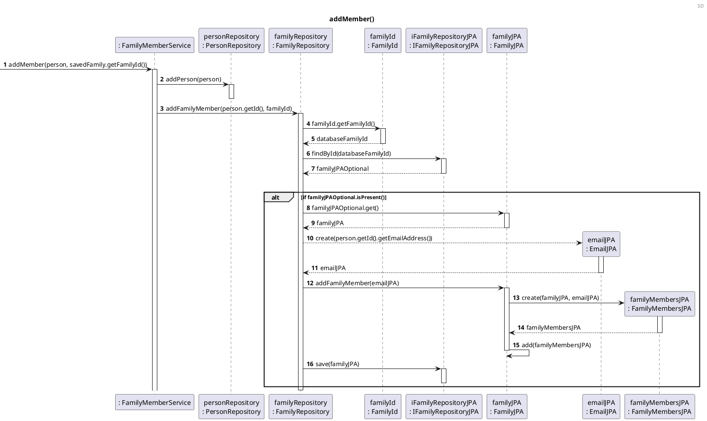
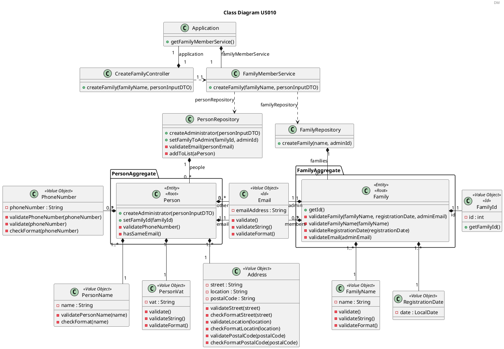
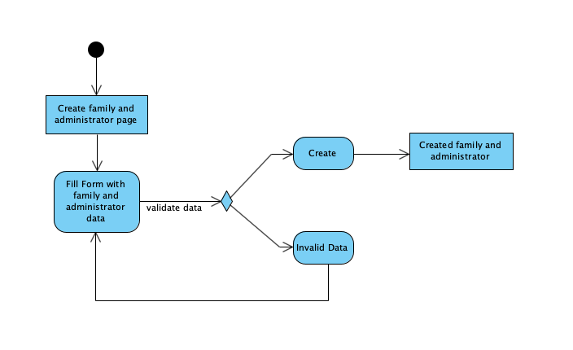
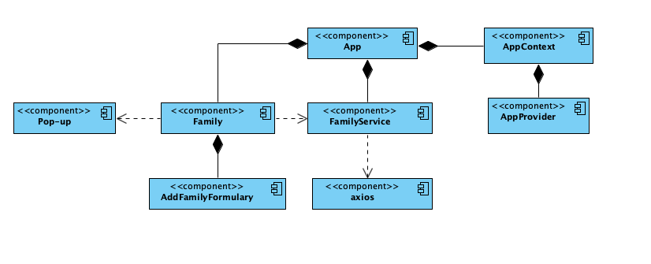

# US010 Create a Family and Set the Family Administrator

# 1. Requirements

_As a system manager, I want to create a family and set the family administrator._

## 1.1. Client notes

This user story was interpreted as the creation of a new family and the allocation of the concerned family administrator to be managed by the application.

It is of utmost importance to the core development of this application. Families gather the core responsibility of aggregating users, and it is about the whole family that the application structure will work.

When creating a family, there are some criteria that must be met. Otherwise, the family must not be created.
To this effect the system manager must provide basic data for the family, namely its name and registration date, as well as the data of the family administrator, namely name, vat, birthdate, address, phone number and email.

According to the client a family should aggregate their members and a number of properties specific to that family.
Also, a family should not be created without the administrator being successfully created.

## 1.2. System Sequence Diagram

The System Sequence Diagram below represents the communication between the system manager and the application.

## 1.3. Dependency of other user stories

This user story is dependent on the [US101](US101_Add_Family_Member.md) because a family cannot be created without having an administrator.
In addition, all other user stories are dependent on it, namely [US101](US101_Add_Family_Member.md) and [US105](US105_Create_Relationship.md).

# 2. Analysis

## 2.1 Business Rules

The family must have the following characteristics with the following rules:

| **_Value Objects_**         | **_Business Rules_**                                                                   |
| :-------------------------- | :------------------------------------------------------------------------------------- |
| **Family Name**             | Required, alphabetic, non-blank                                                        |
| **Registration Date**       | Required, date(year-month-day)                                                         |
| **Family ID**               | Required, unique, integer                                                              |
| **Family Members**          | A list that should aggregate all person that belongs to one family                     |
| **Person ID**               | Required, unique, alphanumeric                                                         |

The Person ID is the email os family administrator and this is a characteristic of the family because it is necessary set the family administrator at the time os its creation.

## 2.2. Relevant Domain Model excerpt

The relevant excerpt of the Domain Model for this user story is as follows:

# 3. Design

## 3.1. Functionality Development

The Sequence Diagram for realizing the functionality of this user story is as follows:

Note: number 8, 9 and 10 of buildPerson(personVOs, familyId) are more detailed in the US101_Add_Family_Member documentation because it is a more specific feature of this user story.

## 3.2. Class Diagram

The Class Diagram of the functionality of this user story is as follows:

## 3.3. Applied Patterns

| **_Pattern_**               |                                                          |
| :-------------------------- | :------------------------------------------------------------------------------------- |
| **Creator**                      | Family Creates the Family                                |
| **Controller**                   | CreateFamilyController is an Use Case Controller for this function |
| **Pure Fabrication**             | FamilyMemberService does not correlate to a domain model entity and was implemented to contain and manage the Family Repository and Person Repository |
| **Information Expert**           | The information about the Family attributes is known by the Family object and it's validations are handled by it |
| **High Cohesion / Low Coupling** | The implementation of FamilyMemberService class reduced the dependency and increased the level of cohesion between Controller and the Repositories |

## 3.4. Tests

Below is the list of tests:

**Controller Tests**

**Test 1:** Success

    @Test
    void createFamily_Successfully() {
        Application application = new Application();
        CreateFamilyController controller = new CreateFamilyController(application);
        int lastFamilyIdNumber = 0;
        String familyName = "Silva";
        PersonInputDTO administratorDTO = new PersonInputDTO();
        administratorDTO.setName("António");
        administratorDTO.setEmail("antonio@gmail.com");
        administratorDTO.setStreet("Rua clara");
        administratorDTO.setLocation("Porto");
        administratorDTO.setPostCode("4000-000");
        administratorDTO.setPhoneNumber("911111111");
        administratorDTO.setVat("222333222");
        administratorDTO.setBirthDate("11/09/1999");
        FamilyId expected = new FamilyId(lastFamilyIdNumber);

        FamilyId result = controller.createFamily(familyName, administratorDTO);

        assertNotNull(result);
        assertEquals(expected, result);
    }

**Test 2:** Failure due to invalid input in family name

    @Test
    void createFamily_Invalid_NullFamilyName() {
        Application application = new Application();
        CreateFamilyController controller = new CreateFamilyController(application);
        String familyName = null;
        PersonInputDTO administratorDTO = new PersonInputDTO();
        administratorDTO.setName("António");
        administratorDTO.setEmail("antonio@gmail.com");
        administratorDTO.setStreet("Rua clara");
        administratorDTO.setLocation("Porto");
        administratorDTO.setPostCode("4000-000");
        administratorDTO.setPhoneNumber("911111111");
        administratorDTO.setVat("222333222");
        administratorDTO.setBirthDate("11/09/1999");

        assertThrows(IllegalArgumentException.class, ()-> controller.createFamily(familyName,
                administratorDTO));
    }

**Test 3:** Failure due to invalid input in administratorDTO

    @Test
    void createFamily_Invalid_NullAdministratorDTO() {
        Application application = new Application();
        CreateFamilyController controller = new CreateFamilyController(application);
        String familyName = "Silva";
        PersonInputDTO administratorDTO = null;

        assertThrows(IllegalArgumentException.class, ()-> controller.createFamily(familyName,
                administratorDTO));
    }

**Test 4:** Failure due to non existing application

    @Test
    void applicationNull() {
        Application application = null;

        assertThrows(ApplicationException.class,
                () -> new CreateFamilyController(application));
    }

**Tests for the FamilyMemberService**

**Test 1:** Verify that a family is created when the data is valid

    @Test
    void createFamily_Successfully() {
        FamilyRepository familyRepository = new FamilyRepository();
        PersonRepository personRepository = new PersonRepository();
        FamilyMemberService familyMemberService =
                new FamilyMemberService(familyRepository, personRepository);
        String familyName = "Silva";
        PersonInputDTO administratorDTO = new PersonInputDTO();
        administratorDTO.setName("António");
        administratorDTO.setEmail("antonio@gmail.com");
        administratorDTO.setStreet("Rua clara");
        administratorDTO.setLocation("Porto");
        administratorDTO.setPostCode("4000-000");
        administratorDTO.setPhoneNumber("911111111");
        administratorDTO.setVat("222333222");
        administratorDTO.setBirthDate("11/09/1999");
        FamilyId expected = new FamilyId(0);

        FamilyId result = familyMemberService.createFamily(familyName, administratorDTO);

        assertNotNull(result);
        assertEquals(expected, result);
    }

**Test 2:** Verify that a family is not created with null family name

    @Test
    void createFamily_Invalid_NullFamilyName() {
        FamilyRepository familyRepository = new FamilyRepository();
        PersonRepository personRepository = new PersonRepository();
        FamilyMemberService familyMemberService =
                new FamilyMemberService(familyRepository, personRepository);
        String familyName = null;
        PersonInputDTO administratorDTO = new PersonInputDTO();
        administratorDTO.setName("António");
        administratorDTO.setEmail("antonio@gmail.com");
        administratorDTO.setStreet("Rua clara");
        administratorDTO.setLocation("Porto");
        administratorDTO.setPostCode("4000-000");
        administratorDTO.setPhoneNumber("911111111");
        administratorDTO.setVat("222333222");
        administratorDTO.setBirthDate("11/09/1999");

        assertThrows(IllegalArgumentException.class,
                () -> familyMemberService.createFamily(familyName, administratorDTO));
    }

**Test 3:** Verify that a family is not created with null administrator

    @Test
    void createFamily_Invalid_NullAdministrator() {
        FamilyRepository familyRepository = new FamilyRepository();
        PersonRepository personRepository = new PersonRepository();
        FamilyMemberService familyMemberService =
                new FamilyMemberService(familyRepository, personRepository);
        String familyName = "Silva";
        PersonInputDTO administratorDTO = null;

        assertThrows(NullPointerException.class,
                () -> familyMemberService.createFamily(familyName, administratorDTO));
    }

**Tests for the FamilyRepository**

**Test 1:** Verify that a family is created when the data is valid

    @Test
    void createFamily_Successfully() {
        FamilyRepository familyRepository = new FamilyRepository();
        int lastFamilyIdNumber = 0;
        String familyName = "Silva";
        PersonInputDTO administratorDTO = new PersonInputDTO();
        administratorDTO.setName("António");
        administratorDTO.setEmail("antonio@gmail.com");
        administratorDTO.setStreet("Rua clara");
        administratorDTO.setLocation("Porto");
        administratorDTO.setPostCode("4000-000");
        administratorDTO.setPhoneNumber("911111111");
        administratorDTO.setVat("222333222");
        administratorDTO.setBirthDate("11/09/1999");
        Person administrator = Person.createAdministrator(administratorDTO);
        int expected = 1;
        Family expectedFamily = new Family(lastFamilyIdNumber, familyName, administrator);

        FamilyId aFamilyId = familyRepository.createFamily(familyName, administrator);

        assertEquals(expected, familyRepository.getFamiliesSize());
        assertEquals(expectedFamily, familyRepository.getFamilyById(aFamilyId));
    }

**Test 2:** Verify that a family is not created with invalid family name

    @ParameterizedTest
    @NullAndEmptySource
    @ValueSource(strings = {"123", "Name.@"})
    void createFamily_Invalid_NullAndEmptyAndFormatName(String name) {
        FamilyRepository familyRepository = new FamilyRepository();
        PersonInputDTO administratorDTO = new PersonInputDTO();
        administratorDTO.setName("António");
        administratorDTO.setEmail("antonio@gmail.com");
        administratorDTO.setStreet("Rua clara");
        administratorDTO.setLocation("Porto");
        administratorDTO.setPostCode("4000-000");
        administratorDTO.setPhoneNumber("911111111");
        administratorDTO.setVat("222333222");
        administratorDTO.setBirthDate("11/09/1999");
        Person administrator = Person.createAdministrator(administratorDTO);

        assertThrows(IllegalArgumentException.class,
                () -> familyRepository.createFamily(name, administrator));
    }

**Test 3:** Verify that a family is not created with null administrator

    @Test
    void createFamily_Invalid_NullAdministrator() {
        FamilyRepository familyRepository = new FamilyRepository();
        String familyName = "Silva";
        Person administrator = null;

        assertThrows(IllegalArgumentException.class,
                () -> familyRepository.createFamily(familyName, administrator));
    }

**Tests for the PersonRepository**

**Test 1:** Verify that an administrator is created when the data is valid

    @Test
    void createAdministrator_Successfully() {
        PersonInputDTO administratorDTO = new PersonInputDTO();
        administratorDTO.setName("António");
        administratorDTO.setEmail("antonio@gmail.com");
        administratorDTO.setStreet("Rua clara");
        administratorDTO.setLocation("Porto");
        administratorDTO.setPostCode("4000-000");
        administratorDTO.setPhoneNumber("911111111");
        administratorDTO.setVat("222333222");
        administratorDTO.setBirthDate("11/09/1999");
        int sizeExpected = 1;

        Person result = personRepository.createAdministrator(administratorDTO);
        int sizeResult = personRepository.getNumberOfPeople();

        assertNotNull(result);
        assertEquals(sizeExpected, sizeResult);
    }

**Test 2:** Verify that an administrator is not created when existing another administrator with 
same email 

    @Test
    void createAdministrator_Invalid_ExistingEmail() {
        PersonInputDTO administratorDTO = new PersonInputDTO();
        administratorDTO.setName("António");
        administratorDTO.setEmail("antonio@gmail.com");
        administratorDTO.setStreet("Rua clara");
        administratorDTO.setLocation("Porto");
        administratorDTO.setPostCode("4000-000");
        administratorDTO.setPhoneNumber("911111111");
        administratorDTO.setVat("222333222");
        administratorDTO.setBirthDate("11/09/1999");
        personRepository.createAdministrator(administratorDTO);
        PersonInputDTO otherAdministratorDTO = new PersonInputDTO();
        otherAdministratorDTO.setName("Maria");
        otherAdministratorDTO.setEmail("antonio@gmail.com");
        otherAdministratorDTO.setStreet("Rua escura");
        otherAdministratorDTO.setLocation("Braga");
        otherAdministratorDTO.setPostCode("4030-000");
        otherAdministratorDTO.setPhoneNumber("911112211");
        otherAdministratorDTO.setVat("221133222");
        otherAdministratorDTO.setBirthDate("11/09/1999");

        assertThrows(DuplicateObjectException.class,
                () -> personRepository.createAdministrator(otherAdministratorDTO));
    }

**Tests for the Family**

**Test 1:** Verify that a family is created when the data is valid

    @Test
    void createFamily_Successfully() {
        int lastFamilyIdNumber = 0;
        String familyName = "Silva";
        FamilyId id = new FamilyId(lastFamilyIdNumber);
        RegistrationDate today = new RegistrationDate();
        FamilyName name = new FamilyName(familyName);
        PersonInputDTO administratorDTO = new PersonInputDTO();
        administratorDTO.setName("António");
        administratorDTO.setEmail("antonio@gmail.com");
        administratorDTO.setStreet("Rua clara");
        administratorDTO.setLocation("Porto");
        administratorDTO.setPostCode("4000-000");
        administratorDTO.setPhoneNumber("911111111");
        administratorDTO.setVat("222333222");
        administratorDTO.setBirthDate("11/09/1999");
        Person administrator = Person.createAdministrator(administratorDTO);

        Family result = new Family(lastFamilyIdNumber, familyName, administrator);

        assertNotNull(result);
        assertEquals(id, result.getFamilyId());
        assertEquals(today, result.getRegistrationDate());
        assertEquals(name, result.getFamilyName());
        assertEquals(administrator, result.getAdmin());
    }

**Test 2:** Verify that a family is not created with invalid data

    @Test
    void createFamily_Invalid_NullId() {
        Integer lastFamilyIdNumber = null;
        String familyName = "Silva";
        PersonInputDTO administratorDTO = new PersonInputDTO();
        administratorDTO.setName("António");
        administratorDTO.setEmail("antonio@gmail.com");
        administratorDTO.setStreet("Rua clara");
        administratorDTO.setLocation("Porto");
        administratorDTO.setPostCode("4000-000");
        administratorDTO.setPhoneNumber("911111111");
        administratorDTO.setVat("222333222");
        administratorDTO.setBirthDate("11/09/1999");
        Person administrator = Person.createAdministrator(administratorDTO);

        assertThrows(NullPointerException.class, () -> new Family(lastFamilyIdNumber, familyName,
                administrator));
    }

    @ParameterizedTest
    @NullAndEmptySource
    @ValueSource(strings = {"123", "Name.@"})
    void createFamily_Invalid_NullAndEmptyAndFormatName(String name) {
        int lastFamilyIdNumber = 0;
        PersonInputDTO administratorDTO = new PersonInputDTO();
        administratorDTO.setName("António");
        administratorDTO.setEmail("antonio@gmail.com");
        administratorDTO.setStreet("Rua clara");
        administratorDTO.setLocation("Porto");
        administratorDTO.setPostCode("4000-000");
        administratorDTO.setPhoneNumber("911111111");
        administratorDTO.setVat("222333222");
        administratorDTO.setBirthDate("11/09/1999");
        Person administrator = Person.createAdministrator(administratorDTO);

        assertThrows(IllegalArgumentException.class,
                () -> new Family(lastFamilyIdNumber, name, administrator));
    }

    @Test
    void createFamily_Invalid_NullAdministrator() {
        int lastFamilyIdNumber = 0;
        String familyName = "Silva";
        Person administrator = null;

        assertThrows(IllegalArgumentException.class, () -> new Family(lastFamilyIdNumber,
                familyName, administrator));
    }

**Tests for the FamilyId**

**Test 1:** Verify that a FamilyId is created when the data is valid

    @Test
    void createFamilyId_Successfully_NoFamilies() {
        int lastFamilyIdNumber = 0;
        int expected = 1;

        FamilyId result = new FamilyId(lastFamilyIdNumber);

        assertNotNull(result);
        assertEquals(expected, result.getFamilyId());
    }

**Test 2:** Verify that a FamilyId is not created with invalid data

    @Test
    void createFamilyId_Invalid_Null() {
        Integer lastFamilyIdNumber = null;

        assertThrows(NullPointerException.class, () -> new FamilyId(lastFamilyIdNumber));
    }

    @Test
    void createFamilyId_Invalid_NegativeNumber() {
        int lastFamilyIdNumber = -1;

        assertThrows(IllegalArgumentException.class, () -> new FamilyId(lastFamilyIdNumber));
    }

**Tests for the FamilyName**

**Test 1:** Verify that a FamilyName is created when the data is valid

    @ParameterizedTest
    @ValueSource(strings = {"Silva", "Borges-Silva", "Borges Silva"})
    void createFamilyName_Successfully_NoFamilies(String name) {
        String expected = name;

        FamilyName result = new FamilyName(name);

        assertNotNull(result);
        assertEquals(expected, result.getPersonName());
    }

**Test 2:** Verify that a FamilyName is not created with invalid data

    @ParameterizedTest
    @ValueSource(strings = {"Borges-Silva", "Borges Silva"})
    void createFamilyName_Invalid_DifferentName(String name) {
        String expected = "Silva";

        FamilyName result = new FamilyName(name);

        assertNotNull(result);
        assertNotEquals(expected, result.getPersonName());
    }

    @ParameterizedTest
    @NullAndEmptySource
    @ValueSource(strings = {"Filipe203", "123", "Filipe_Antonio"})
    void createFamilyName_Invalid_NullName(String name) {
        assertThrows(IllegalArgumentException.class, () -> new FamilyName(name));
    }

**Tests for the RegistrationDate**

**Test 1:** Verify that a RegistrationDate is created when the data is valid

    @Test
    void createRegistrationDate_Successfully_SameDate() {
        LocalDate expected = LocalDate.now();

        RegistrationDate result = new RegistrationDate();

        assertNotNull(result);
        assertEquals(expected, result.getDate());
    }

**Test 2:** Verify that a RegistrationDate is not created with invalid data

    @Test
    void createRegistrationDate_Invalid_DifferentDate() {
        LocalDate expected = LocalDate.of(2020, 3, 2);

        RegistrationDate result = new RegistrationDate();

        assertNotNull(result);
        assertNotEquals(expected, result.getDate());
    }

## 3.5 Frontend Design

#### 3.5.1. Activity Diagram

#### 3.5.2. Component Diagram

# 4. Implementation

The possibility of creating the family before the creation of the administrator was considered. 
However, the development team decided that the current implementation makes more sense to ensure 
that there is no possibility of creating a family without an administrator.

# 5. Integration/Demonstration

As previously mentioned, this user story is dependent on the [US101](US101_Add_Family_Member.md).
Also, this feature will be directly necessary for the [US101](US101_Add_Family_Member.md) and 
[US105](US105_Create_Relationship.md) because without a family, the member and relationship cannot be registered.
When testing the functionality developed for the user story mentioned above, this functionality will also be indirectly tested.

# 6. Observations

Currently, there are no observations for this user story.