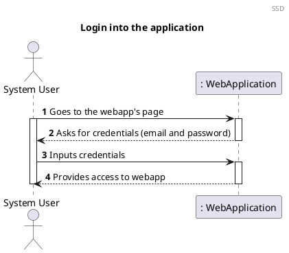
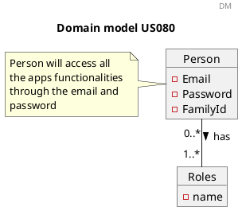
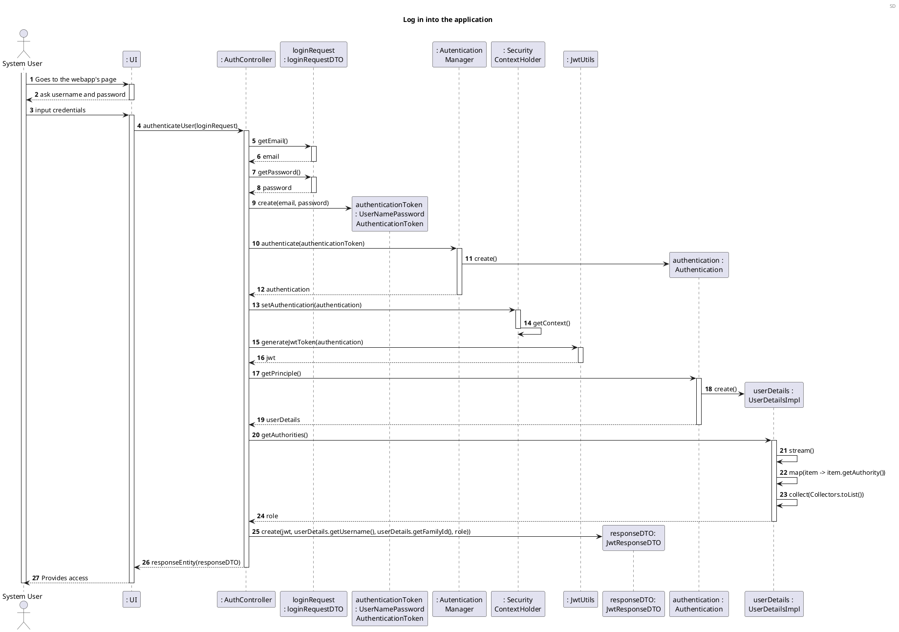
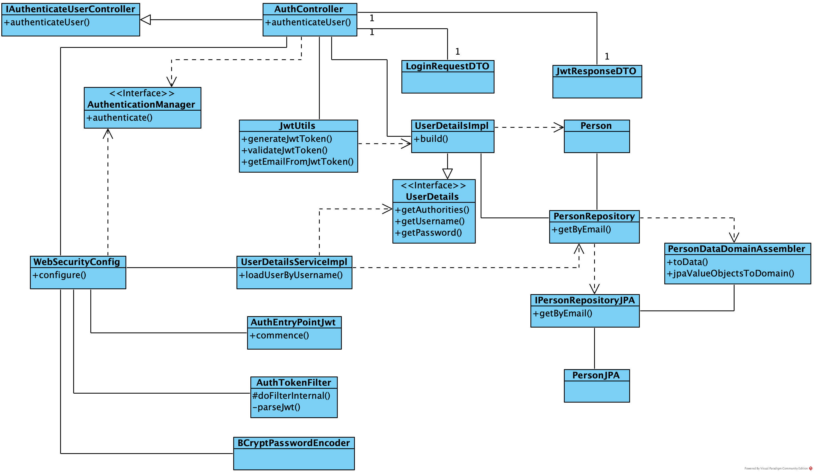

US080 As a System User, I want to login into the application in order to use it.
=======================================

# 1. Requirements

*US080 As a System User, I want to login into the application in order to use it.*

Below is the System Sequence Diagram (SSD) for this user story:



# 2. Analysis

For now, what is intended for this sprint is to create an authentication mechanism for the web application and not yet an authorization system.

The development team's goal is only to create a login system for the application user, without there having a registration/signup system in place yet.

When the user tries to access the web page, he will come across the login screen, that will ask for their credentials (email and password). Once the user inputs the credentials, he will have access to all of the application.
There won't be any roles yet, all the system users (system manager, family administrator and family member) will have the same access to all of the app's functionalities for the moment.

## 2.1 Domain Model Excerpt

For quick reference, there's a relevant extract of the domain model.



# 3. Design

## 3.1. Functionality Development

The Sequence Diagram for this user story:



## 3.2. Class Diagram



## 3.3. Applied Patterns

In order to achieve best practices in software development, to implement this US
we're using the following:

- *Single Responsibility Principle* - Classes should have one responsibility,
  which means, only one reason to change;
- *Information Expert* - Assign a responsibility to the class that has the
  information needed to fulfill it;
- *Pure Fabrication* - UserDetailsService was implemented to manage all things
  related to the user details.
- *Creator* - UserDetails are created by UserDetailsService;
- *Controller* - AuthController was created;
- *Low Coupling* - Classes were assigned responsibilities so that coupling
  remains as low as possible, reducing the impact of any changes made to objects
  later on. The implementation of interfaces for the controller, service and repository 
  classes reduced the dependency level between them.
- *High Cohesion* - Classes were assigned responsibilities so that cohesion
  remains as high as possible, to keep objects understandable and manageable.
  They are strongly related and highly focused.

## 3.4. Tests

### 3.4.1 Unit Tests

**Test 1:** 

```java

```

**Test 2:**

```java

```

**Test 3:** 

```java

```

### 3.4.2 Integration Tests

**Test 1:**

```java

```

**Test 2:**

```java

```

**Test 3:**

```java

```


# 4. Implementation

The main challenges found while implementing this functionality were the novelty of implementing a login system and lack of knowledge about the JWT authentication system.
 
To minimize this difficulty, a lot of research and study of reliable documentation was done.
 
In order to have a reliable functionality, many tests were done, 
to identify as many possible errors in the
implementation as possible.

# 5. Integration/Demonstration

This US is not directly dependent on any other that we've had so far.

At the moment, all other frontend USs are dependent on this one, since to access other functionalities we now need to login to the web app with the right credentials. 
This means that the integration of this functionality with the others already developed can be tested successfully.

# 6. Observations

The functionality implemented for this user story is very simple and a few improvements will need to be made for it to be more functional.
Adding a registration system to the app will be crucial, as well as adding an authorization mechanism and adding different roles, for different types of users to have access to specific app functionalities.