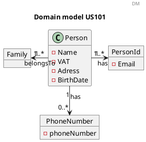
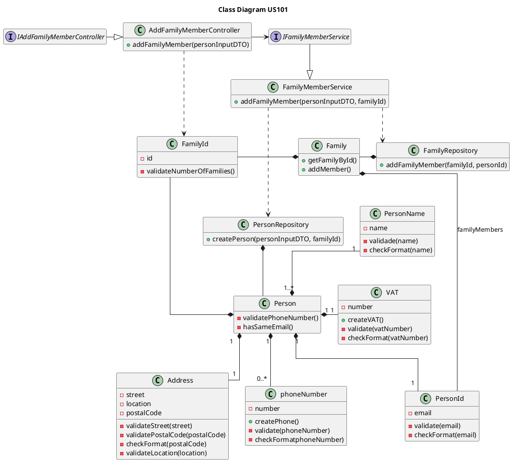
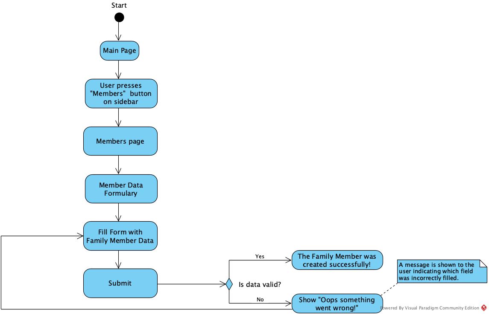
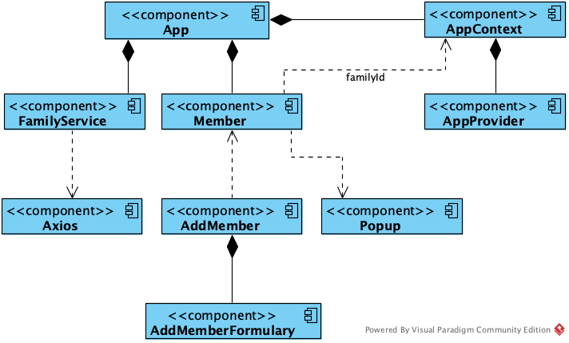

US101 Add Family Members
=======================================

# 1. Requirements

*As a family administrator, I want to add family members.*

This functionality will allow the family administrator to add members to the family.

The addition of family members is crucial to the objective of this app which is to manage all the finances of a given
family.

To include a family member the following data must be provided:

- name,

- VAT,

- street, location, post code,

- birthdate,

- phone number,

- e-mail address.
  
This user story is dependent of [US010](US010_Create_Family.md) because we need to have at least one family with the admin created to add a member
and it will be the administrator that adds new members to a given family.

However, the user stories [US104](US104_Get_List_Of_Members_And_Relations.md)
, [US105](US105_Create_Relationship.md), [US150](US150_Get_Profile_Information.md) and [US151](US151_Add_EmailAccount.md) depend on this functionality to add a family member.

The user story 104, 105, 150 and 151 are directly related to this one because if we are not able to add a family member none of the other functionalities will be possible.
## 1.1 System Sequence Diagram

```puml

header SSD
title Add a Family Member
autonumber
actor "Family Administrator" as Ad
participant ": App" as App


Ad-> App : add a family member
activate Ad
activate App
App--> Ad : Ask data
deactivate App


Ad-> App : Input data
activate App
App --> Ad : inform result
deactivate App
deactivate Ad 

```

# 2. Analysis

## 2.1 Person Entry

A Family member should have the following attributes:

| **_Attributes_**    | **_Rules_**       |
| :--------------------------------- | :----------------- |
| **name**          | Required, alphanumeric (String), follows the regex : `^[-'a-zA-ZÀ-ÖØ-öø-ÿ\s]*$`|
| **VAT**           | Unique, required, alphanumeric (String), follows the regex : `^[123][0-9]{8}$` |
| **street**        | Required, alphanumeric (String), follows the regex : `^[-'a-zA-ZÀ-ÖØ-öø-ÿ\s,]+[0-9]*$`|
| **location**      | Required, alphanumeric (String), follows the regex : `^[-'a-zA-ZÀ-ÖØ-öø-ÿ\s]*$`|
| **postCode**      | Required, alphanumeric (String), follows the regex : `^[1-9][0-9]{3}(?:-[0-9]{3})$`|
| **birthDate**     | Required, alphanumeric (String), with format "31/12/2021" |
| **phoneNumber**   | Optional, alphanumeric (String), follows the regex : `^9[1236][0-9]{7}$^2[1-9][0-9]{7}$`|
| **emailAddress**  | Unique, required, alphanumeric (String), follows the regex: `^[a-zA-Z0-9_+&*-]+(?:\\." +"[a-zA-Z0-9_+&*-]+)*@" + "(?:[a-zA-Z0-9-]+\\.)+[a-z" + "A-Z]{2,7}$"` |
| **familyId**      | Unique, required, numeric (int) |

## 2.2 Domain Model



# 3. Design

## 3.1. Functionality Development

### 3.1.1 Sequence Diagrams

```puml

header SD
title Add a Family member
autonumber
actor "Family Administrator" as Ad
participant ": UI" as UI
participant ": Family\nController" as AFM
participant ": FamilyMemberService" as FMS
participant ": PersonRepository" as ps
participant ": FamilyRepository" as fr
participant ": PersonFactory" as pf


Ad-> UI : add a person
activate Ad
activate UI
UI--> Ad : ask data(email, data,\n birthdate, vat, street,\n location, postcode)
deactivate UI

Ad-> UI : Inputs data
activate UI
UI-> AFM : addFamilyMember(personInputDTO, familyId)
activate AFM

AFM->FMS :addFamilyMember(personInputDTO, familyId)
activate FMS
FMS --> fid as "aFamilyId\n : FamilyId"** : create(familyId)

FMS --> pm as "personAssembler\n: PersonAssembler"** : fromDTO(personInputDTO, familyID)
ref over pm : fromDto(personInputDTO)
activate pm
pm --> FMS : personVOs
deactivate pm
FMS -> pf : buildPerson(personVOs, familyId)
activate pf
pf -> person as "aPerson\n Person" ** : buildPerson(personVos, familyId)
activate person
person -> person : validatePhoneNumber(personInputDTO.getPhoneNumber())
deactivate person
deactivate pf
FMS -> FMS : addMember(person, familyId)
activate FMS
FMS -> ps : addPerson(person)
activate ps
return databaseId
FMS -> person : setDatabaseId(databaseId)
activate person
deactivate person
deactivate ps
FMS -> fr : addFamilyMember(personId, familyId)


activate fr

deactivate fr
deactivate FMS

FMS -> fmm as "familyMemberMapper\n: FamilyMemberMapper"** : toDTO(person)
activate fmm
return aFamilyMemberDTO
FMS --> AFM : aFamilyMemberDTO
deactivate FMS
AFM --> UI : aFamilyMemberDTO
deactivate AFM
UI --> Ad : inform sucess
deactivate UI
```

```puml
header ref
title fromDTO()
autonumber
participant "personAssembler\n: PersonAssembler" as ps

[-> ps: fromDTO(personInputDTO)

activate ps
ps-->"anEmailAddress\n:EmailAddress"** : create(personDTO.getEmailAddress)
ps-->"aPersonName\n:PersonName"** : create(personDTO.getName)
ps-->"anAddress:\nAddress"** : create(personDTO.getAddress)
ps-->"aBirthDate\n:BirthDate"** : create(personDTO.getBirthDate)
ps-->"aVAT\n:VAT"** : create(personDTO.getVat)

ps --> pb as "personVOs\n: PersonVOs"** : create()


[<-- ps : personVOs
deactivate ps

```

```puml
header ref
title addPerson()
autonumber
participant "personRepository\n: PersonRepository" as pr
participant "personDomainDataAssembler\n: PersonDomainDataAssembler" as pdda
participant "repositoryJPA\n: iPersonRepository" as jpa

[-> pr: addPerson(person)

activate pr
pr -> pdda : toData(person)
activate pdda
return personJPA
pr -> jpa : save(personJPA)
activate jpa
return resultPerson
deactivate jpa
pr -> pr : resultPerson.getDatabaseId()

[<-- pr : databaseId
deactivate pr

```

```puml
header ref
title addFamilyMember()
autonumber
participant " :FamilyRepository" as fr
participant " :Family" as f
participant " : iFamilyRepository" as i
participant " : FamilyJPA" as fjpa

[-> fr: addFamilyMember(personId, familyId)
activate fr

fr --> famIdJPA as "aFamilyIdJPA\n: FamilyIdJPA"** : create(familyId)
fr -> i : findById(aFamilyIdJPA)
activate i
deactivate i
alt if Optional.isPresent()
fr -> fjpa : familyJPAOptional.get()
activate fjpa
fr -> email as "anEmailJPA\n: EmailJPA"** : create(personId)
fr -> fjpa : addFamilyMember(anEmailJPA)
fjpa -> fmjpa as " aFamilyMemberJPA\n: FamilyMemberJPA"** : create(anEmailJPA)
fjpa -> fjpa : add(aFamilyMemberJPA)
deactivate fjpa
fr -> i : save(familyJPA)
activate i
deactivate i
end
deactivate f
deactivate fr


```

## 3.2. Class Diagram



## 3.3. Applied Standards

As to achieve the best practices in software development, in order to implement this US
we used the following:

- *Single Responsibility Principle* - Classes should have one responsibility,
  which means, only one reason to change;
  

- *Information Expert* - Assign a responsibility to the class that has the
  information needed to fulfill it;
  

- *Pure Fabrication* - Person Service was implemented to manage all things related to adding a member.
  

- *Creator* - To add a member we first need to create the person. First the Person Service creates the person and then the Family Service adds the member to the family.


- *Controller* - AddFamilyMemberController was created;
  

- *Low Coupling* - The family class depends on the person class because we always need to create the person first and then add to the family.


- *High Cohesion* - The class Person in this US is the more cohesive class.


## 3.4. Tests

**Test 1:** Add Family Member Successfully
```java
@Test
    void ensureFamilyMemberIsAdded() {
            FamilyId familyId = familyMemberService.createFamily(familyInputDTO);
            PersonInputDTO personInputDTO = new PersonInputDTO();
            personInputDTO.setName("António");
            personInputDTO.setEmail("toni@gmail.com");
            personInputDTO.setStreet("Rua clara");
            personInputDTO.setLocation("Porto");
            personInputDTO.setPostCode("4000-000");
            personInputDTO.setPhoneNumber("911111111");
            personInputDTO.setVat("222333222");
            personInputDTO.setBirthDate("05/03/2000");
            int expected = 2;

            ResponseEntity<Object> objectResult = controller.addFamilyMember(personInputDTO,
        familyId.getFamilyId());
        AddFamilyMemberDTO resultDTO = (AddFamilyMemberDTO) objectResult.getBody();
        AddFamilyMemberDTO expectedDTO = new AddFamilyMemberDTO(personInputDTO.getEmail());
        Link selfLink = linkTo(FamilyController.class).slash("families").slash(familyId).slash("members").withSelfRel();
        Link profileInformation =
        linkTo(PersonController.class).slash("members").slash(personInputDTO.getEmail()).withRel(
        "profileInformation");
        expectedDTO.add(selfLink, profileInformation);
        long result = personRepositoryJPA.count();

        assertEquals(expected, result);
        assertEquals(expectedDTO, resultDTO);
        }
```

**Test 2:** Fail to add a family members because it's the same e-mail as the administrator
```java
 @Test
    void ensureNotPossibleToAddTwoPersonsWithSameEmail() {
            FamilyId familyId = familyMemberService.createFamily(familyInputDTO);
            PersonInputDTO personInputDTO = new PersonInputDTO();
            personInputDTO.setName("António");
            personInputDTO.setEmail("antonio@gmail.com");
            personInputDTO.setStreet("Rua clara");
            personInputDTO.setLocation("Porto");
            personInputDTO.setPostCode("4000-000");
            personInputDTO.setPhoneNumber("911111111");
            personInputDTO.setVat("222333222");
            personInputDTO.setBirthDate("05/03/2000");
            controller.addFamilyMember(personInputDTO,familyId.getFamilyId());

            ResponseEntity<Object> result = controller.addFamilyMember(personInputDTO,
        familyId.getFamilyId());

        assertEquals(HttpStatus.BAD_REQUEST, result.getStatusCode());
        }
```

**Test 3:** Fail to add a family members without data
```java
 @Test
    void personIsNotCreatedWithNullDTO() {
            FamilyId familyId = familyMemberService.createFamily(familyInputDTO);

            ResponseEntity<Object> result = controller.addFamilyMember(null,
        familyId.getFamilyId());

        assertEquals(HttpStatus.BAD_REQUEST, result.getStatusCode());
        }
```
## 3.5. Frontend design

The family administrator goal is to add family members.

### 3.5.1. Taskflow

To accomplish this, the following taskflow was designed:



### 3.5.2. Component Tree

On the frontend implementation, the following components were created:




# 4. Implementation

The main challenge of this US was to decide either to implement a service or not and if we 
should have the personId on the family or the familyId on the Person. We decided that would be 
better to implement both of the options because it will save as time for the new features. Also, 
we implemented the service because otherwise one repository nedeed to know the other and this is 
now correct because we would be breaking the encapsulation principle.

# 5. Integration/Demonstration
The implementation of this user story is fundamental to the core objective of this application since its purpose is managing the finances of several people in the same family is only possible if there are members added to said family. 

# 6. Observations

https://stackoverflow.com/questions/19105134/regex-for-date-of-birth
https://howtodoinjava.com/java/regex/us-postal-zip-code-validation/
https://stackoverflow.com/questions/201323/how-to-validate-an-email-address-using-a-regular-expression
https://stackoverflow.com/a/48925757

