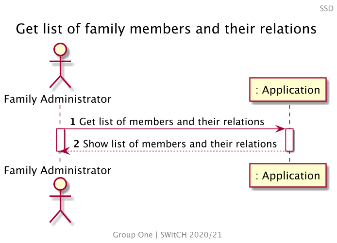
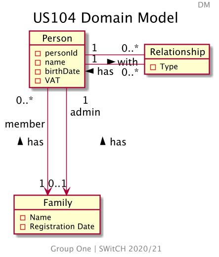
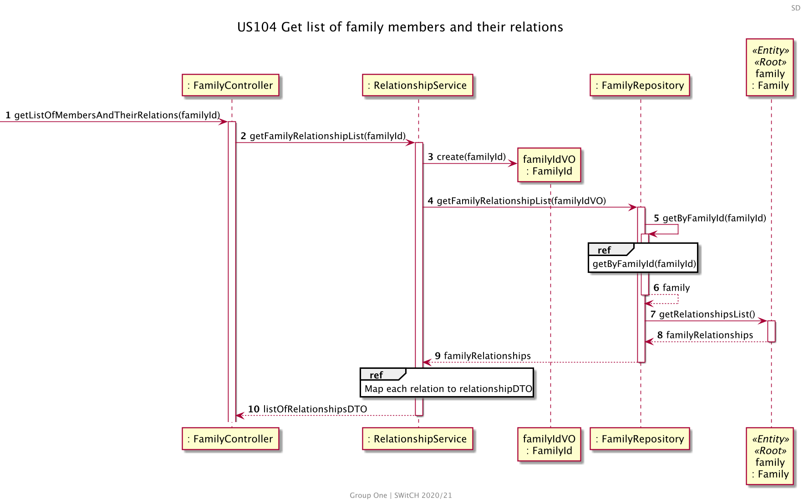
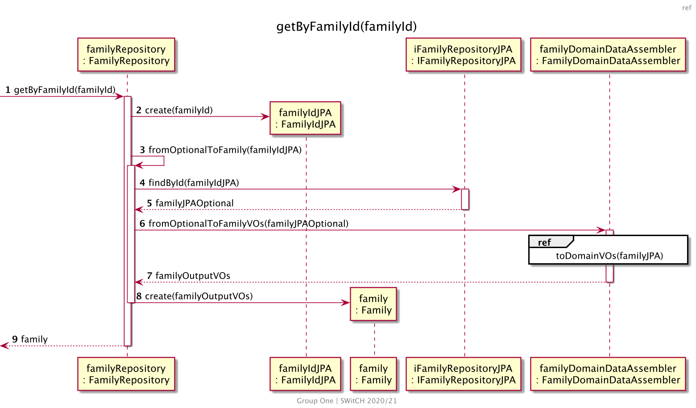
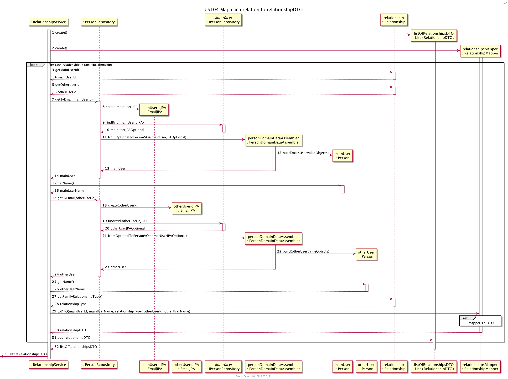
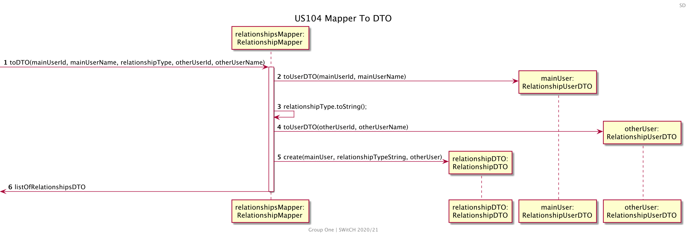
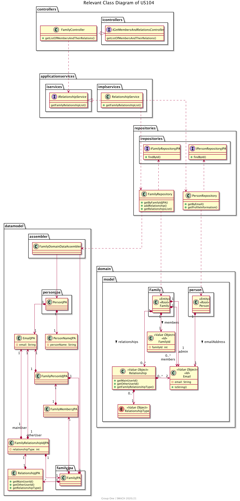
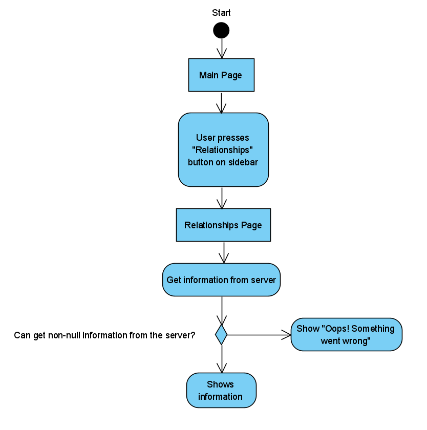
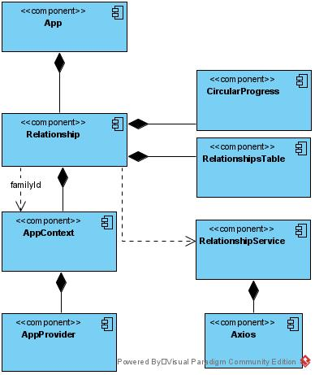

# US104 Get list of family members and their relations

# 1. Requirements

_As a family administrator, I want to get the list of family members and their relations._

The Family Administrator wants to retrieve all registered relationships in the application related
to their family. Each relationship will display two user information and the relation between them.

## 1.1 System Sequence Diagram

The system sequence diagram below represents the interaction between Family Administrator and the
Application.

<!--
@startuml US104_SSD
autonumber
header SSD
title Get list of family members and their relations
actor "Family Administrator" as FM
participant ": Application" as App

FM -> App ++: Get list of members and their relations
activate FM

return Show list of members and their relations
deactivate FM
@enduml
-->



## 1.2. Dependency of other user stories

US104 is dependent on [US010] and [US101], because it must exist a family, a family administrator
and family members (at least one) in order to get the list of family members.

US104 is also dependent on [US105], so relationships between members in a family can be retrieved
and displayed on a list.

# 2. Analysis

We should tackle this through a Family point of view. Relationships only exist in its context, and
the Family has all the needed information. The other information needed is the familyId, in order to
retrieve them. This information is an attribute of the logged person, that the whole application has
access to.

Following [US105], a Relationship between two family members is characterized by the relationship
type (designation of the relation) and the two members ID's. Once it is created, it's added to the
family.

Retrieving this information, we should get something like:

| First Member          | relationship type | Second Member               |
| --------------------- | ----------------- | --------------------------- |
| John (john@email.com) | Spouse            | Mary (mary@email.com)       |
| John (john@email.com) | Father            | Charles (charles@email.com) |
| Mary (mary@email.com) | Mother            | Charles (charles@email.com) |

## 2.1. Domain Model Excerpt

The relevant domain concepts for this user story:

<!---
@startuml US104_DM
title US104 Domain Model
header DM
hide methods
skinparam linetype ortho

object Family {
- Name
- Registration Date
}

object Relationship {
- Type
}

object Person {
  - personId
  - name
  - birthDate
  - VAT
}

Person "1" -r- "0..*" Relationship : with >
Person "1" -r- "0..*" Relationship : has <

Person "0..*\n\nmember" --d-> "1" Family : has <
Person "1\nadmin" --d-> "0..1" Family : has <

@enduml
-->



# 3. Design

## 3.1. Functionality Development

Getting the list of all family members and their relations involves providing the family ID, so the
corresponding family can be retrieved from the list of all families in the application. Each family
will contain the designated list of relationships.

<!--
@startuml US104_SD
autonumber
header SD
title US104 Get list of family members and their relations
participant ": FamilyController" as FC
participant ": RelationshipService" as RS
participant "familyIdVO\n: FamilyId" as FIVO
participant ": FamilyRepository" as FR
participant "family\n: Family" as F <<Entity>> <<Root>>


[-> FC ++: getListOfMembersAndTheirRelations(familyId)
FC -> RS ++ : getFamilyRelationshipList(familyId)
RS -> FIVO ** : create(familyId)
RS -> FR ++: getFamilyRelationshipList(familyIdVO)
FR -> FR ++: getByFamilyId(familyId)
ref over FR
  getByFamilyId(familyId)
end
return family
FR -> F ++: getRelationshipsList()
return familyRelationships
return familyRelationships
ref over RS
  Map each relation to relationshipOutputDTO
end
return listOfRelationshipsDTO
@enduml
-->




<!---
@startuml US104_Ref_getByFamilyId
header ref
title getByFamilyId(familyId)
autonumber
participant "familyRepository\n: FamilyRepository" as familyRepository
participant "familyIdJPA\n: FamilyIdJPA" as familyIdJPA
participant "family\n: Family" as family
participant "iFamilyRepositoryJPA\n: IFamilyRepositoryJPA" as iFamilyRepositoryJPA
participant "familyDomainDataAssembler\n: FamilyDomainDataAssembler" as familyDomainDataAssembler


[-> familyRepository: getByFamilyId(familyId)
activate familyRepository

familyRepository -> familyIdJPA** : create(familyId)

familyRepository -> familyRepository : fromOptionalToFamily(familyIdJPA)
activate familyRepository

familyRepository -> iFamilyRepositoryJPA : findById(familyIdJPA)
activate iFamilyRepositoryJPA
return familyJPAOptional

familyRepository -> familyDomainDataAssembler : fromOptionalToFamilyVOs(familyJPAOptional)
activate familyDomainDataAssembler

ref over familyDomainDataAssembler
    toDomainVOs(familyJPA)
end ref

return familyOutputVOs
familyRepository -> family ** : create(familyOutputVOs)
deactivate familyRepository
return family
@enduml
-->



<!---
@startuml US104_SD_Ref
autonumber
header SD
title US104 Map each relation to relationshipOutputDTO
participant ": RelationshipService" as RS
participant ": PersonRepository" as PR
participant "mainUserIdJPA\n: EmailJPA" as MUEJPA
participant "otherUserIdJPA\n: EmailJPA" as OUEJPA
participant ": IPersonRepository" as IPR <<interface>>
participant "personDomainDataAssembler\n: PersonDomainDataAssembler" as PDDA
participant "mainUser\n: Person" as MU
participant "otherUser\n: Person" as OU
participant "relationship\n: Relationship" as Rel
participant "listOfRelationshipsDTO\n: List<RelationshipOutputDTO>" as RLDTO
participant "relationshipsMapper\n: RelationshipMapper" as RM

activate RS
RS -> RLDTO **: create()
activate RLDTO
RS -> RM **: create()
activate RM
loop for each relationship in familyRelationships
RS -> Rel ++ : getMainUserId()
return mainUserId
RS -> Rel ++ : getOtherUserId()
return otherUserId

RS -> PR ++ : getByEmail(mainUserId)
PR -> MUEJPA ** : create(mainUserId)
PR -> IPR ++ : findById(mainUserIdJPA)
return mainUserJPAOptional
PR -> PDDA ** : fromOptionalToPersonVOs(mainUserJPAOptional)
activate PDDA
PDDA -> MU **: build(mainUserValueObjects)
return mainUser
return mainUser
RS -> MU ++: getName()
return mainUserName

RS -> PR ++ : getByEmail(otherUserId)
PR -> OUEJPA ** : create(otherUserId)
PR -> IPR ++ : findById(otherUserIdJPA)
return otherUserJPAOptional
PR -> PDDA ** : fromOptionalToPersonVOs(otherUserJPAOptional)
activate PDDA
PDDA -> OU ** : build(otherUserValueObjects)
return otherUser
return otherUser
RS -> OU ++: getName()
return otherUserName

RS -> Rel ++ : getFamilyRelationshipType()
return relationshipType
RS -> RM : toDTO(mainUserId, mainUserName, relationshipType, otherUserId, otherUserName)
ref over RM
Mapper To DTO
end
return relationshipOutputDTO
RS -> RLDTO : add(relationshipOutputDTO)
end
return listOfRelationshipsDTO
[<- RS : listOfRelationshipsDTO
@enduml
-->



<!--
@startuml US104_SD_Ref2
autonumber
header SD
title US104 Mapper To DTO
participant "relationshipsMapper:\nRelationshipMapper" as RM
participant "relationshipOutputDTO:\nRelationshipDTO" as RDTO

[-> RM : toDTO(mainUserId, mainUserName, relationshipType, otherUserId, otherUserName)
activate RM
RM -> "mainUser:\nRelationshipUserDTO" **: toUserDTO(mainUserId, mainUserName)
RM -> RM : relationshipType.toString();
RM -> "otherUser:\nRelationshipUserDTO" **: toUserDTO(otherUserId, otherUserName)
RM -> RDTO **: create(mainUser, relationshipTypeString, otherUser)
[<- RM : listOfRelationshipsDTO
deactivate RM
@enduml
-->



## 3.2. Class Diagram

The Class Diagram for this functionality is as follows:

<!--
@startuml US104_CD
title Relevant Class Diagram of US104
skinparam linetype ortho

package "controllers" {
  package "icontrollers" {
    interface IGetMembersAndRelationsController {
      getListOfMembersAndTheirRelations()
    }
  }

  class FamilyController {
    + getListOfMembersAndTheirRelations()
  }
}

FamilyController .-l-|> IGetMembersAndRelationsController

package "applicationservices" {
  package "implservices" {
    class RelationshipService {
      + getFamilyRelationshipList()
    }
  }
  package "iservices" {
  interface IRelationshipService {
    getFamilyRelationshipList()
  }
  }
}

RelationshipService .-l-|> IRelationshipService
FamilyController .-d-> IRelationshipService

package "domain" {
  package "model" {
    package "person" {
      class Person <<Entity>> <<Root>> {
      }
    }
    
    class Email <<Value Object>> <<Id>>{
      - email: String
      + toString()
    }
    
    Person "1" *--d-> "1" Email : emailAddress >
    
    package "Family" {
      class Family <<Entity>> <<Root>> {
      }
    }
    
    class FamilyId <<Value Object>> <<Id>> {
      - familyId: int
    }
    
    class Relationship <<Value Object>> {
      + getMainUserId()
      + getOtherUserId()
      + getFamilyRelationshipType()
    }
    
    enum RelationshipType <<Value Object>> {
    }
  }
}

Family "1" *-d-> "0..*" Relationship : relationships >
Relationship "1" *-d-> "0..*" RelationshipType

Relationship "2" *-l-> "0..*" Email
Family "1" *--d-> "0..*\nmembers\n" Email
Family "1" *--d-> "1\nadmin\n\n\n" Email
Family "1" *-d-> "1" FamilyId : members >

package "repositories" {
  class FamilyRepository {
    + getByFamilyIdJPA()
    + addRelationship()
    + getRelationshipsList()
  }

  class PersonRepository {
    + getByEmail()
    + getProfileInformation()
  }

  package irepositories {
    interface IFamilyRepositoryJPA {
      + findById()
    }
    interface IPersonRepositoryJPA {
      + findById()
    }
  }
}

FamilyRepository .-u-> IFamilyRepositoryJPA
PersonRepository .-u-> IPersonRepositoryJPA
FamilyRepository .-d-> Family
PersonRepository .-d-> Person

RelationshipService .--d-> PersonRepository
RelationshipService .--d-> FamilyRepository

package "datamodel" {
  package "assembler" {
    class FamilyDomainDataAssembler {
    }
  }
  
  package "personjpa" {
    class PersonJPA {
    }
  }
  
  class EmailJPA {
    - email: String
  }
  
  class PersonNameJPA {
    - personName: String
  }
  
  package "familyjpa" {
    class FamilyJPA {
    }
  }
  
  class FamilyMembersJPA {
  }
  
  class FamilyPersonIdJPA {
  }
  
  class RelationshipJPA {
    + getMainUserId()
    + getOtherUserId()
    + getRelationshipType()
  }
  
  class FamilyRelationshipIdJPA {
    - relationshipType: int
  }
}

FamilyDomainDataAssembler -d-> PersonJPA
FamilyDomainDataAssembler -d-> FamilyJPA
PersonJPA "1" *-d-> "1" EmailJPA
PersonJPA "1" *-d-> "1" PersonNameJPA
FamilyPersonIdJPA "1" *-u-> "1" EmailJPA
FamilyPersonIdJPA "1" *-d-> "1" FamilyJPA
FamilyJPA "*" *--u-> "1" FamilyMembersJPA
FamilyMembersJPA "1" *-u-> "1" FamilyPersonIdJPA
RelationshipJPA "1" *-u-> "1" FamilyRelationshipIdJPA
FamilyRelationshipIdJPA "1" *---u-> "1\nmainUser\n\n" EmailJPA
FamilyRelationshipIdJPA "1" *---u-> "1\n     otherUser" EmailJPA
FamilyRelationshipIdJPA "1" *-u-> "1" FamilyJPA
FamilyJPA "*" *-u-> "1" RelationshipJPA

FamilyRepository .-> FamilyDomainDataAssembler

@enduml
-->



## 3.3. Applied Patterns

- Single Responsibility Principle - All classes have only one and well-defined responsibility.

- Controller - A controller (FamilyController) receives and coordinates system operations connecting
  the UI layer to the App's logic layer.

- Information Expert - The flow of this process is entirely made following this principle: for a
  particular responsibility, it is determined the information needed to fulfill it and where that
  information is stored.

- Pure Fabrication - A service (RelationshipService) represents a concept outside the problem's
  domain, but they have set of responsibilities designed to achieve low coupling, high cohesion and
  the potential for reuse.

- Low Coupling - Dependencies between classes are at their lowest point possible. The use of
  Services classes reduced the dependency level between them.

- High Cohesion - Due to low coupling, the responsibilities of each class are highly focused,
  therefore cohesion's high.

## 3.4. Tests

**Test 1:** Get a valid list

```java
    @Test
    void getListOfMembersAndTheirRelations(){
            familyInputDTO = new FamilyInputDTO();
            familyInputDTO.setName("David");
            familyInputDTO.setEmail("admin@gmail.com");
            familyInputDTO.setStreet("Rua clara");
            familyInputDTO.setLocation("Porto");
            familyInputDTO.setPostCode("4000-000");
            familyInputDTO.setPhoneNumber("911111111");
            familyInputDTO.setVat("222333555");
            familyInputDTO.setBirthDate("11/09/1999");
            familyInputDTO.setFamilyName("Silva");
            FamilyId familyIdVO = familyMemberService.createFamily(familyInputDTO);
            int familyId = familyIdVO.getFamilyId();
            PersonInputDTO otherUserInputDTO = new PersonInputDTO();
            otherUserInputDTO.setEmail("maria@teste.com");
            otherUserInputDTO.setName("Maria");
            otherUserInputDTO.setVat("223456789");
            otherUserInputDTO.setStreet("Maria St");
            otherUserInputDTO.setLocation("Porto");
            otherUserInputDTO.setPostCode("1234-123");
            otherUserInputDTO.setBirthDate("10/01/2000");
            otherUserInputDTO.setPhoneNumber("919999999");
            AddFamilyMemberDTO otherUserId = familyMemberService.addFamilyMember(otherUserInputDTO,
            familyId);
            RelationshipInputDTO relationshipInputDTO = new RelationshipInputDTO(familyInputDTO.getEmail(), otherUserId.getEmail(), "4");
            relationshipService.createRelationship(String.valueOf(familyId), relationshipInputDTO);

            List<RelationshipDTO> dtoList = new ArrayList<>();
            RelationshipUserDTO mainUser = new RelationshipUserDTO(familyInputDTO.getName(), familyInputDTO.getEmail());
            RelationshipUserDTO otherUser = new RelationshipUserDTO(otherUserInputDTO.getName(), otherUserInputDTO.getEmail());
            dtoList.add(new RelationshipDTO(mainUser, "CHILD", otherUser));
            RelationshipListDTO expectedList = new RelationshipListDTO(dtoList);

            HttpStatus expected = HttpStatus.OK;

            ResponseEntity<Object> result =
            controller.getListOfMembersAndTheirRelations(familyId);
    
            assertEquals(expected, result.getStatusCode());
            assertEquals(expectedList, (RelationshipListDTO) result.getBody());
        }
```

**Test 2:** Get an empty list

```java
    @Test
    void getEmptyList(){
            familyInputDTO = new FamilyInputDTO();
            familyInputDTO.setName("David");
            familyInputDTO.setEmail("admin@gmail.com");
            familyInputDTO.setStreet("Rua clara");
            familyInputDTO.setLocation("Porto");
            familyInputDTO.setPostCode("4000-000");
            familyInputDTO.setPhoneNumber("911111111");
            familyInputDTO.setVat("222333555");
            familyInputDTO.setBirthDate("11/09/1999");
            familyInputDTO.setFamilyName("Silva");
            FamilyId familyIdVO = familyMemberService.createFamily(familyInputDTO);
            int familyId = familyIdVO.getFamilyId();

            List<RelationshipDTO> dtoList = new ArrayList<>();
            RelationshipListDTO expectedList = new RelationshipListDTO(dtoList);
    
            HttpStatus expected = HttpStatus.OK;
    
            ResponseEntity<Object> result =
            controller.getListOfMembersAndTheirRelations(familyId);
    
            assertEquals(expected, result.getStatusCode());
            assertEquals(expectedList, result.getBody());
        }
```

**Test 3:** Test exception when the family doesn't exist

```java
    @Test
    void tryToRetrieveRelationshipFromNonExistingFamily() {
            ResponseEntity<Object> responseEntity;
        HttpStatus expected = HttpStatus.BAD_REQUEST;

        responseEntity = controller.getListOfMembersAndTheirRelations(0);

        assertNotNull(responseEntity);
        assertEquals(expected, responseEntity.getStatusCode());
    }
```

## 3.5. Frontend design

The administrator goal is to get the list of family members and their relations.

  ### 3.5.1. Activity Diagram

To accomplish this, the following activity diagram was designed:



### 3.5.2. Component Tree

On the frontend implementation, the following components were created:




# 4. Implementation

The implementation of this user story had a coordination with the [US105], due to their close
dependency. No major challenges were observed. It was used the implementation of [US150] to retrieve
profile information.

# 5. Integration/Demonstration

The functionalities developed for this user story were successfully integrated with the US105. Right
now, no other user stories depend on this one.

# 6. Comments

In the context of the Domain Driven Design, this user story was redone. Now it uses DTO and
immutable Value Objects.

This User Story has to take data from two repositories. For this, a Service was created
(FamilyMemberService), in order to reduce coupling.

[us010]: US010_Create_Family_And_Set_Family_Administrator.md
[us101]: US101_Add_Family_Member.md
[us105]: US105_Create_Relationship.md
[us150]: US150_Get_Profile_Information.md
