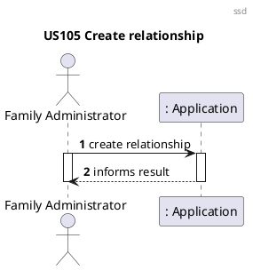
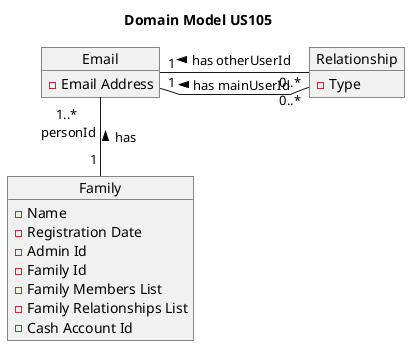
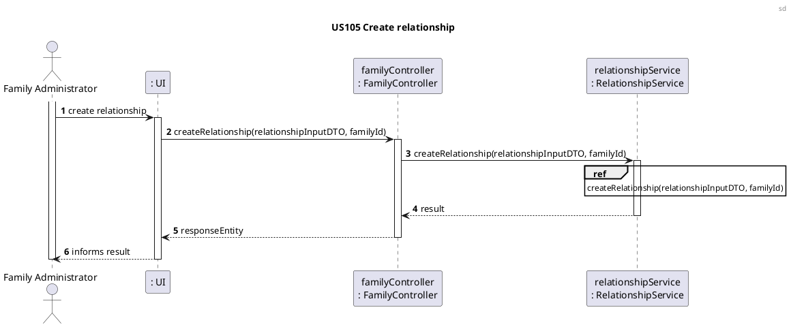
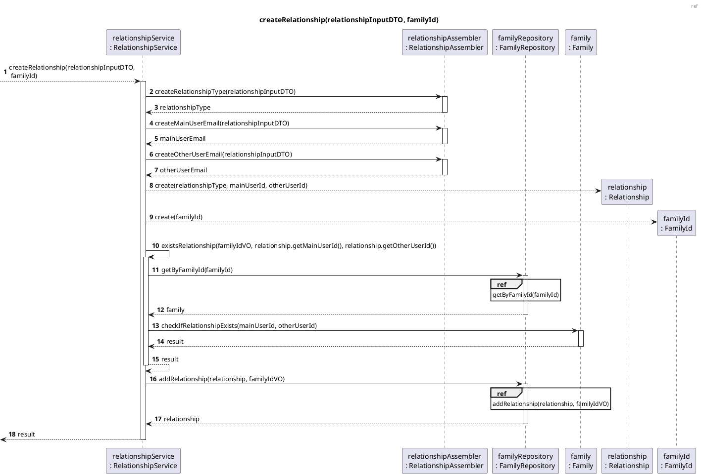
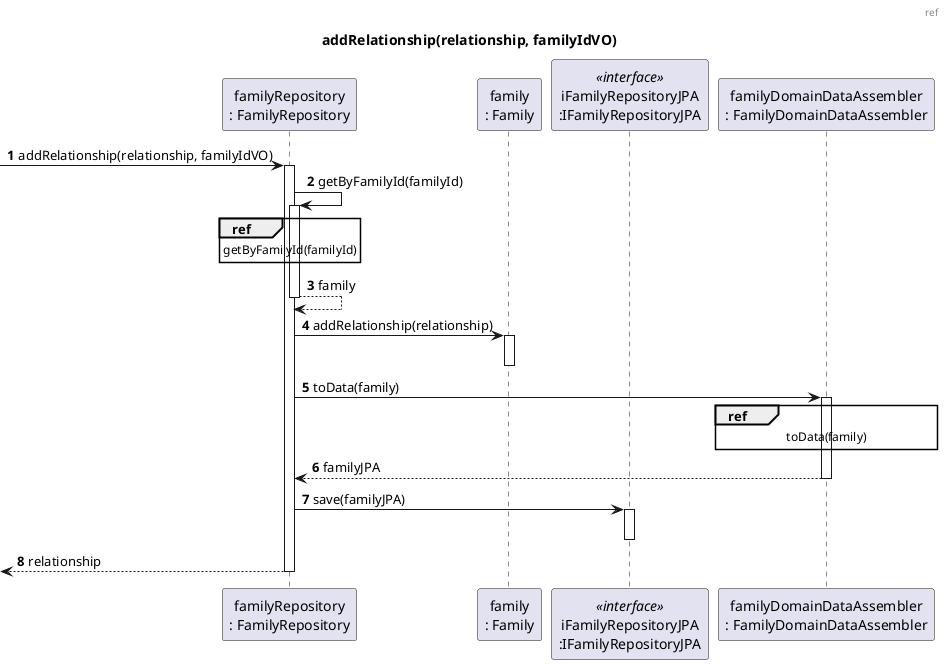
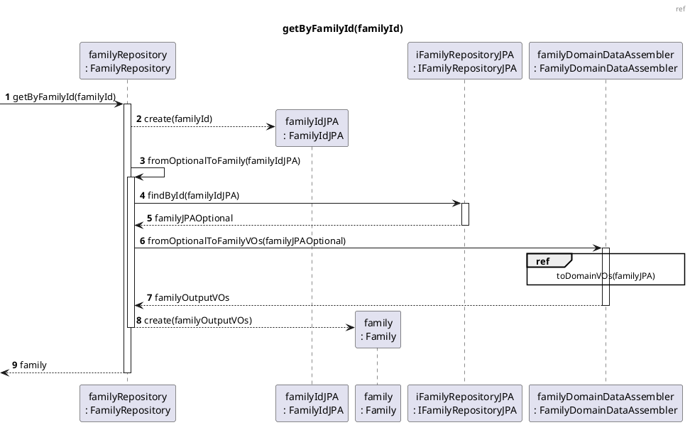
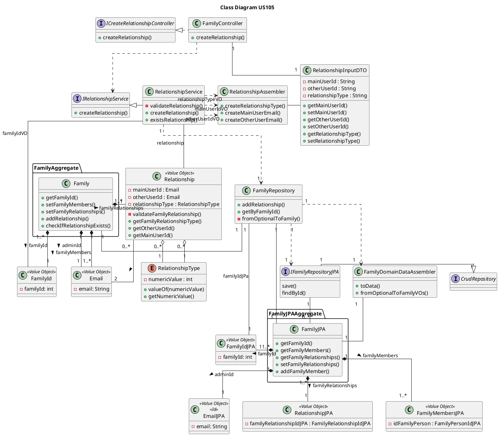
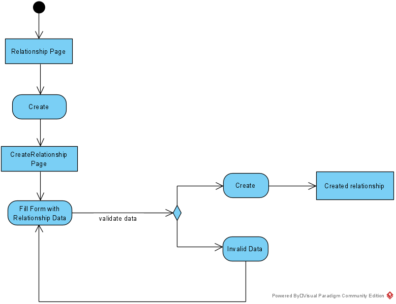
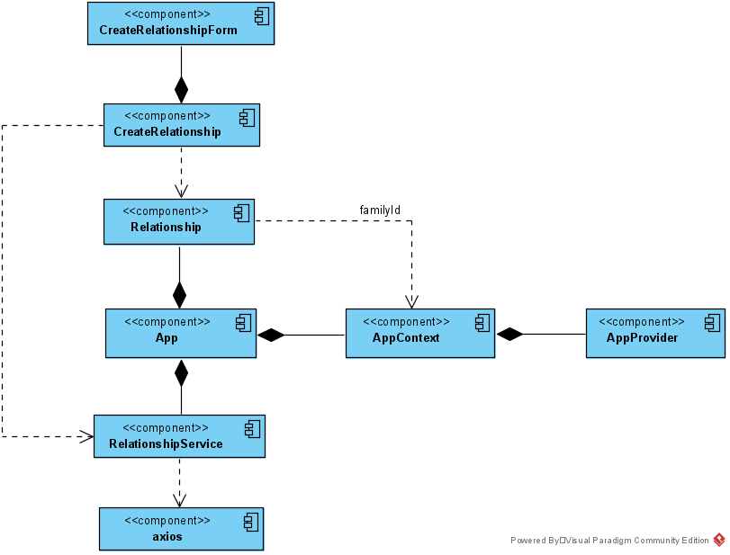

US105 Create a Relation Between Two Family Members
=======================================

# 1. Requirements

*As a family administrator, I want to create a relation between two family
members.*

From the project proposal: *"There are family relations in a family (son,
daughter, husband, wife, father, mother, etc.). All relations use the level of
the main user as a reference."*

The functionality will allow a family administrator to create a relationship
between themselves and another member of the same family. It was designed to
respond to the user story/requirement referred above.

The development team designed this functionality to allow the creation of these
relationships between any member of the family using its unique id, in order to simplify the information provided to the user.

## 1.1 System sequence diagram



# 1.2. Dependency of other user stories

This user story is dependent on [US010] and [US101], because without
having a family with at least another two family members, it
would be impossible to create a relationship.

Directly, this functionality will be necessary for [US104] because without it no
relationships between members would exist to be retrieved.

# 2. Analysis

The analysis of this user story is divided in two main sections:

### 2.1 Relationship creation

The relationship object, that corresponds to the relationship between two members of the same family, as mentioned before, will
have the following attributes:

Attributes       | Rules
-----------------|------------------
relationshipType | required, enum type constant
mainUserId       | required, email
otherUserId      | required, email
relationshipId   | unique, required, long

The possible relationship types implemented are:

- Spouse
- Partner
- Parent
- Child
- Sibling
- Grandparent
- Grandchild
- Uncle/Aunt
- Nephew/Niece
- Cousin

Each of these types will be represented by an _enum_ type constant, with a
numeric value attributed to it. Either the constant value and its numeric value
can be used to choose a relationship type. This list can be incremented in the
future, if necessary, with no repercussions.

### 2.2 Relevant domain model excerpt

Below is the excerpt of the domain model that is relevant for this user story.



# 3. Design

## 3.1. Functionality development

In the diagrams below, it is possible to see the implementation strategy for
this user story.

### 3.1.1 Sequence diagrams









```puml
autonumber
header ref

title createMainUserEmail(relationshipInputDTO)

participant "relationshipAssembler\n: RelationshipAssembler" as relationshipAssembler
participant "relationshipInputDTO\n: RelationshipInputDTO" as relationshipInputDTO
participant "mainUserId\n: Email" as mainUserId

[-> relationshipAssembler : createMainUserEmail(relationshipInputDTO)
activate relationshipAssembler
relationshipAssembler -> relationshipInputDTO: getMainUserId()
activate relationshipInputDTO
return mainUserIdString
relationshipAssembler --> mainUserId ** : create(mainUserIdString)

return mainUserId
```

```puml
autonumber
header ref

title createOtherUserEmail(relationshipInputDTO)

participant "relationshipAssembler\n: RelationshipAssembler" as relationshipAssembler
participant "relationshipInputDTO\n: RelationshipInputDTO" as relationshipInputDTO
participant "otherUserId\n: Email" as otherUserId

[-> relationshipAssembler : createOtherUserEmail(relationshipInputDTO)
activate relationshipAssembler
relationshipAssembler -> relationshipInputDTO: getOtherUserId()
activate relationshipInputDTO
return otherUserIdString
relationshipAssembler --> otherUserId ** : create(otherUserIdString)

return otherUserId
```

```puml
autonumber
header ref

title createRelationshipType(relationshipInputDTO)

participant "relationshipAssembler\n: RelationshipAssembler" as relationshipAssembler
participant "relationshipInputDTO\n: RelationshipInputDTO" as relationshipInputDTO
participant "relationshipType\n: RelationshipType" as relationshipType

[-> relationshipAssembler : getRelationshipType(relationshipInputDTO)
activate relationshipAssembler
relationshipAssembler -> relationshipInputDTO: getRelationshipType()
activate relationshipInputDTO
return relationshipTypeString
relationshipAssembler -> relationshipAssembler : parseInt(relationshipTypeString)
relationshipAssembler --> relationshipType ** : create(relationshipTypeInt)

return relationshipType
```

```puml
autonumber
header ref

title toDomainVOs(familyJPA)

participant "familyDomainDataAssembler\n: FamilyDomainDataAssembler" as familyDDA
participant "familyJPA\n: FamilyJPA" as familyJPA
participant "familyId\n: FamilyIdJPA" as familyId
participant "familyName\n: FamilyNameJPA" as familyName
participant "registrationDate\n: RegistrationDateJPA" as registrationDate
participant "adminId\n: EmailJPA" as adminId
participant "accountId\n: AccountIdJPA" as accountId
participant "relationships\n: Relationships" as relationships
participant "family\n: Family" as family
participant "familyMembersJPA\n: FamilyMembersJPA" as familyMembersJPA
participant "familyMembers\n: FamilyMembers" as familyMembers
participant "email\n: Email" as email


[-> familyDDA: toDomainVOs(familyJPA)
activate familyDDA

familyDDA -> familyJPA: getFamilyId()
activate familyJPA
return familyIdJPA
familyDDA --> familyId ** : create(familyIdJPA)

familyDDA -> familyJPA: getFamilyName()
activate familyJPA
return familyNameJPA
familyDDA --> familyName ** : create(familyName)

familyDDA -> familyJPA: getRegistrationDate()
activate familyJPA
return registrationDateJPA
familyDDA --> registrationDate ** : create(registrationDateJPA)

familyDDA --> familyJPA: getAdminId().getEmailAddress()
activate familyJPA
return emailAddressJPA
familyDDA --> adminId ** : create(emailAddressJPA)

familyDDA -> familyJPA: getCashAccountIdJPA()
activate familyJPA
return accountIdJPA
familyDDA --> accountId ** : create(accountIdJPA)

familyDDA -> familyJPA: getFamilyMembers()
activate familyJPA
familyJPA --> familyMembersJPA ** : fetch()
return familyMembersJPA
familyDDA --> familyDDA : familyMembersToDomain(familyMembersJPA)
activate familyDDA
familyDDA --> familyMembers ** : create()
loop for each family member in familyMembersJPA
    familyDDA -> familyMembersJPA : getPersonId()
    activate familyMembersJPA
    return emailPA
    familyDDA --> email ** : create(personIdJPA)
    familyDDA -> familyMembers : add(email)
end
return familyMembers

familyDDA -> familyJPA: getFamilyRelationships()
activate familyJPA
familyJPA --> familyRelationshipsJPA ** : fetch()
return familyRelationshipsJPA
familyDDA --> familyDDA : relationshipJPAtoDomain(familyRelationshipsJPA)
activate familyDDA
familyDDA --> relationships ** : create()
loop for each relationship in relationshipJPA
    familyDDA -> familyRelationshipsJPA : getMainUserId()
    activate familyRelationshipsJPA
    return mainUser
    
    familyDDA -> familyRelationshipsJPA : getOtherUserId()
    activate familyRelationshipsJPA
    return otherUser
    
    familyDDA -> familyRelationshipsJPA : getRelationshipType()
    activate familyRelationshipsJPA
    return relationshipType
    
    familyDDA --> relationship ** : create(relationshipType, mainUser, otherUser)
    familyDDA -> relationships : add(relationship)
end
return relationships

familyDDA --> family** : create(familyId, familyName, registrationDate, adminId, accountId)

return familyJPA
```

```puml
autonumber
header ref

title toData(family)

participant "familyDomainDataAssembler\n: FamilyDomainDataAssembler" as familyDDA
participant "family\n: Family" as family
participant "familyIdJPA\n: FamilyIdJPA" as familyIdJPA
participant "familyNameJPA\n: FamilyNameJPA" as familyNameJPA
participant "registrationDateJPA\n: RegistrationDateJPA" as registrationDateJPA
participant "adminId\n: EmailJPA" as adminId
participant "accountIdJPA\n: AccountIdJPA" as accountIdJPA
participant "relationshipsJPA\n: RelationshipsJPA" as relationshipsJPA
participant "familyJPA\n: FamilyJPA" as familyJPA

[-> familyDDA: toData(family)
activate familyDDA

familyDDA -> family: getFamilyId()
activate family
return familyId
familyDDA --> familyIdJPA ** : create(familyId)

familyDDA -> family: getFamilyName()
activate family
return familyName
familyDDA --> familyNameJPA ** : create(familyName)

familyDDA -> family: getRegistrationDate()
activate family
return registrationDate
familyDDA --> registrationDateJPA ** : create(registrationDate)

familyDDA --> family: getAdminId().getEmailAddress()
activate family
return emailAddress
familyDDA --> adminId ** : create(emailAddress)

familyDDA -> family: getCashAccountId()
activate family
return accountId
familyDDA --> accountIdJPA ** : create(accountId)

familyDDA --> familyJPA ** : create(familyIdJPA, familyNameJPA, registrationDateJPA, adminId, accountIdJPA)

familyDDA -> family: getRelationships()
activate family
return relationships
familyDDA --> relationshipsJPA ** : create(relationships)

familyDDA --> familyJPA : setFamilyRelationships(relationshipsJPA)
activate familyJPA
deactivate familyJPA

return familyJPA
```

## 3.2. Class Diagram

**FALTA**

- Tudo

In the diagram below, all classes involved in this US are represented, as well
as their interactions.



## 3.3. Applied patterns

- *Single Responsibility Principle (SRP)* - Relationship and
  RelationshipType classes follow this principle, as they have one
  responsibility, which is to manage the information included within them.
- *Information Expert* - To each class were assigned responsibilities that can
  be fulfilled because they have the information needed to do so;
- *Creator* - FamilyRepository class was assigned the responsibility to instantiate
  a Relationship, because it had the necessary data that would be passed
  on to it.
- *Pure Fabrication* - FamilyRepository class is a class that does not represent a
  domain concept, and it was assigned a set of responsibilities to support high
  cohesion, low coupling and reuse.
- *Low Coupling* - Classes were assigned responsibilities so that coupling
  remains as low as possible, reducing the impact of any changes made to objects
  later on;
- *High Cohesion* - Classes were assigned responsibilities so that cohesion
  remains high (they are strongly related and highly focused). This helps to
  keep objects understandable and manageable, and also goes hand in hand with
  the low coupling principle.

## 3.4. Domain tests

### 3.4.1. Integration testing

Below is the list of integration tests, organized by the correspondent class:

- **Controller**

  - **Integration test 1:** Verify that it is possible to create a
      relationship successfully

```java
    @Test
    void createRelationships_Successfully() {
        ResponseEntity<Object> responseEntity1;
        ResponseEntity<Object> responseEntity2;
        ResponseEntity<Object> responseEntity3;
        HttpStatus expected = HttpStatus.CREATED;

        PersonInputDTO personInputDTO1 = new PersonInputDTO();
        personInputDTO1.setName("António");
        personInputDTO1.setEmail("antonio@gmail.com");
        personInputDTO1.setStreet("Rua clara");
        personInputDTO1.setLocation("Porto");
        personInputDTO1.setPostCode("4000-000");
        personInputDTO1.setPhoneNumber("911111111");
        personInputDTO1.setVat("222333222");
        personInputDTO1.setBirthDate("05/03/2000");

        PersonInputDTO personInputDTO2 = new PersonInputDTO();
        personInputDTO2.setName("Maria");
        personInputDTO2.setEmail("maria@gmail.com");
        personInputDTO2.setStreet("Rua escura");
        personInputDTO2.setLocation("Lisboa");
        personInputDTO2.setPostCode("5000-000");
        personInputDTO2.setPhoneNumber("912222222");
        personInputDTO2.setVat("212333444");
        personInputDTO2.setBirthDate("11/03/2000");

        PersonInputDTO personInputDTO3 = new PersonInputDTO();
        personInputDTO3.setName("Ze");
        personInputDTO3.setEmail("zedebraga@gmail.com");
        personInputDTO3.setStreet("Rua cansada");
        personInputDTO3.setLocation("Braga");
        personInputDTO3.setPostCode("3000-000");
        personInputDTO3.setPhoneNumber("913333333");
        personInputDTO3.setVat("253333445");
        personInputDTO3.setBirthDate("18/07/2003");

        FamilyOutputDTO familyOutputDTO = familyMemberService.createFamily(familyInputDTO);
        int familyIdInt = familyOutputDTO.getFamilyId();

        AddFamilyMemberDTO person1Id = familyMemberService.addFamilyMember(personInputDTO1, familyOutputDTO.getFamilyId());
        AddFamilyMemberDTO person2Id = familyMemberService.addFamilyMember(personInputDTO2, familyOutputDTO.getFamilyId());
        AddFamilyMemberDTO person3Id = familyMemberService.addFamilyMember(personInputDTO3, familyOutputDTO.getFamilyId());

        RelationshipInputDTO relationshipInputDTO1 = new RelationshipInputDTO(person1Id.getEmail(), person2Id.getEmail(), "1");

        RelationshipInputDTO relationshipInputDTO2 = new RelationshipInputDTO(person2Id.getEmail(), person3Id.getEmail(), "4");

        RelationshipInputDTO relationshipInputDTO3 = new RelationshipInputDTO(person3Id.getEmail(), person1Id.getEmail(), "10");

        responseEntity1 = controller.createRelationship(relationshipInputDTO1, familyIdInt);
        responseEntity2 = controller.createRelationship(relationshipInputDTO2, familyIdInt);
        responseEntity3 = controller.createRelationship(relationshipInputDTO3, familyIdInt);

        assertNotNull(responseEntity1);
        assertEquals(expected, responseEntity1.getStatusCode());

        assertNotNull(responseEntity2);
        assertEquals(expected, responseEntity2.getStatusCode());

        assertNotNull(responseEntity3);
        assertEquals(expected, responseEntity3.getStatusCode());
    }
```

  - **Integration test 2:** Verify that it is not possible to create a relationship with two family member that are the same

```java
    @Test
    void createRelationship_WithTwoPeopleThatAreTheSame() {
        ResponseEntity<Object> responseEntity;
        HttpStatus expected = HttpStatus.BAD_REQUEST;

        PersonInputDTO personInputDTO1 = new PersonInputDTO();
        personInputDTO1.setName("António");
        personInputDTO1.setEmail("antonio@gmail.com");
        personInputDTO1.setStreet("Rua clara");
        personInputDTO1.setLocation("Porto");
        personInputDTO1.setPostCode("4000-000");
        personInputDTO1.setPhoneNumber("911111111");
        personInputDTO1.setVat("222333222");
        personInputDTO1.setBirthDate("05/03/2000");

        FamilyOutputDTO familyOutputDTO = familyMemberService.createFamily(familyInputDTO);
        int familyIdInt = familyOutputDTO.getFamilyId();

        AddFamilyMemberDTO person1Id = familyMemberService.addFamilyMember(personInputDTO1,
                familyOutputDTO.getFamilyId());

        RelationshipInputDTO relationshipInputDTO = new RelationshipInputDTO(person1Id.getEmail(), person1Id.getEmail(),
                "1");

        responseEntity = controller.createRelationship(relationshipInputDTO, familyIdInt);

        assertNotNull(responseEntity);
        assertEquals(expected, responseEntity.getStatusCode());
    }
```

  - **Integration test 3:** Verify that it is not possible to create a relationship with a person id that does not exist

```java
    @Test
    void createRelationships_NullUserId() {
        ResponseEntity<Object> responseEntity1;
        ResponseEntity<Object> responseEntity2;
        HttpStatus expected = HttpStatus.BAD_REQUEST;

        PersonInputDTO personInputDTO1 = new PersonInputDTO();
        personInputDTO1.setName("António");
        personInputDTO1.setEmail("antonio@gmail.com");
        personInputDTO1.setStreet("Rua clara");
        personInputDTO1.setLocation("Porto");
        personInputDTO1.setPostCode("4000-000");
        personInputDTO1.setPhoneNumber("911111111");
        personInputDTO1.setVat("222333222");
        personInputDTO1.setBirthDate("05/03/2000");

        FamilyOutputDTO familyOutputDTO = familyMemberService.createFamily(familyInputDTO);
        int familyIdInt = familyOutputDTO.getFamilyId();

        AddFamilyMemberDTO person1Id = familyMemberService.addFamilyMember(personInputDTO1, familyOutputDTO.getFamilyId());

        RelationshipInputDTO relationshipInputDTO1 = new RelationshipInputDTO(null, person1Id.getEmail(), "1");

        RelationshipInputDTO relationshipInputDTO2 = new RelationshipInputDTO(person1Id.getEmail(), null, "4");

        responseEntity1 = controller.createRelationship(relationshipInputDTO1, familyIdInt);
        responseEntity2 = controller.createRelationship(relationshipInputDTO2, familyIdInt);

        assertNotNull(responseEntity1);
        assertEquals(expected, responseEntity1.getStatusCode());

        assertNotNull(responseEntity2);
        assertEquals(expected, responseEntity2.getStatusCode());
    }
```

  - **Integration test 4:** Verify that it is not possible to create a relationship with a null relationship type

```java
    @Test
    void createRelationships_NullRelationshipType() {
        ResponseEntity<Object> responseEntity1;
        HttpStatus expected = HttpStatus.BAD_REQUEST;

        PersonInputDTO personInputDTO1 = new PersonInputDTO();
        personInputDTO1.setName("António");
        personInputDTO1.setEmail("antonio@gmail.com");
        personInputDTO1.setStreet("Rua clara");
        personInputDTO1.setLocation("Porto");
        personInputDTO1.setPostCode("4000-000");
        personInputDTO1.setPhoneNumber("911111111");
        personInputDTO1.setVat("222333222");
        personInputDTO1.setBirthDate("05/03/2000");

        PersonInputDTO personInputDTO2 = new PersonInputDTO();
        personInputDTO2.setName("Maria");
        personInputDTO2.setEmail("maria@gmail.com");
        personInputDTO2.setStreet("Rua escura");
        personInputDTO2.setLocation("Lisboa");
        personInputDTO2.setPostCode("5000-000");
        personInputDTO2.setPhoneNumber("912222222");
        personInputDTO2.setVat("212333444");
        personInputDTO2.setBirthDate("11/03/2000");

        FamilyOutputDTO familyOutputDTO = familyMemberService.createFamily(familyInputDTO);
        int familyIdInt = familyOutputDTO.getFamilyId();

        AddFamilyMemberDTO person1Id = familyMemberService.addFamilyMember(personInputDTO1, familyOutputDTO.getFamilyId());
        AddFamilyMemberDTO person2Id = familyMemberService.addFamilyMember(personInputDTO2, familyOutputDTO.getFamilyId());

        RelationshipInputDTO relationshipInputDTO1 = new RelationshipInputDTO(person1Id.getEmail(), person2Id.getEmail(), null);

        responseEntity1 = controller.createRelationship(relationshipInputDTO1, familyIdInt);

        assertNotNull(responseEntity1);
        assertEquals(expected, responseEntity1.getStatusCode());
    }
```

  - **Integration test 5:** Verify that it is not possible to create a
  relationship with a family id that does not exist
  
```java
    @Test
    void createRelationships_WrongFamilyId() {
        ResponseEntity<Object> responseEntity1;
        HttpStatus expected = HttpStatus.BAD_REQUEST;

        PersonInputDTO personInputDTO1 = new PersonInputDTO();
        personInputDTO1.setName("António");
        personInputDTO1.setEmail("antonio@gmail.com");
        personInputDTO1.setStreet("Rua clara");
        personInputDTO1.setLocation("Porto");
        personInputDTO1.setPostCode("4000-000");
        personInputDTO1.setPhoneNumber("911111111");
        personInputDTO1.setVat("222333222");
        personInputDTO1.setBirthDate("05/03/2000");

        PersonInputDTO personInputDTO2 = new PersonInputDTO();
        personInputDTO2.setName("Maria");
        personInputDTO2.setEmail("maria@gmail.com");
        personInputDTO2.setStreet("Rua escura");
        personInputDTO2.setLocation("Lisboa");
        personInputDTO2.setPostCode("5000-000");
        personInputDTO2.setPhoneNumber("912222222");
        personInputDTO2.setVat("212333444");
        personInputDTO2.setBirthDate("11/03/2000");

        FamilyInputDTO familyInputDTO2 = new FamilyInputDTO();
        familyInputDTO2.setName("Golias");
        familyInputDTO2.setEmail("admin2@gmail.com");
        familyInputDTO2.setStreet("Rua escura");
        familyInputDTO2.setLocation("Lisboa");
        familyInputDTO2.setPostCode("4300-000");
        familyInputDTO2.setPhoneNumber("919999999");
        familyInputDTO2.setVat("222333666");
        familyInputDTO2.setBirthDate("11/09/1998");
        familyInputDTO2.setFamilyName("Gomes");

        FamilyOutputDTO familyOutputDTO = familyMemberService.createFamily(familyInputDTO);
        int familyIdInt = familyOutputDTO.getFamilyId();

        FamilyOutputDTO familyOutputDTO2 = familyMemberService.createFamily(familyInputDTO2);

        AddFamilyMemberDTO person1Id = familyMemberService.addFamilyMember(personInputDTO1, familyOutputDTO.getFamilyId());
        AddFamilyMemberDTO person2Id = familyMemberService.addFamilyMember(personInputDTO2, familyOutputDTO2.getFamilyId());

        RelationshipInputDTO relationshipInputDTO1 = new RelationshipInputDTO(person1Id.getEmail(), person2Id.getEmail(), "1");

        responseEntity1 = controller.createRelationship(relationshipInputDTO1, familyIdInt);

        assertNotNull(responseEntity1);
        assertEquals(expected, responseEntity1.getStatusCode());
    }
```

### 3.4.1. Unit testing

Below is the list of unit tests, organized by the correspondent class:

- **Controller**

  - **Integration test 1:** Verify that it is possible to create a
      relationship successfully
    
```java
    @ParameterizedTest
    @MethodSource("provideParameters")
    void createRelationshipsSuccessfully(String person1Id, String person2Id,
                                         String relationshipType) {
        //Arrange
        ResponseEntity<Object> responseEntity;
        HttpStatus expected = HttpStatus.CREATED;
        int familyId = 0;

        RelationshipInputDTO relationshipInputDTO = new RelationshipInputDTO(person1Id, person2Id, relationshipType);

        when(relationshipService.createRelationship(familyId, relationshipInputDTO)).thenReturn(true);

        //Act
        responseEntity = controller.createRelationship(relationshipInputDTO, familyId);

        //Assert
        assertNotNull(responseEntity);
        assertEquals(expected, responseEntity.getStatusCode());
    }
```

  - **Integration test 2:** Verify that it is not possible to create a relationship with two family member that are the same

```java
    @Test
    void createRelationshipWithTwoPeopleThatAreTheSame() {
        //Arrange
        PersonInputDTO personInputDTO1 = new PersonInputDTO();
        personInputDTO1.setName("António");
        personInputDTO1.setEmail("antonio@gmail.com");
        personInputDTO1.setStreet("Rua clara");
        personInputDTO1.setLocation("Porto");
        personInputDTO1.setPostCode("4000-000");
        personInputDTO1.setPhoneNumber("911111111");
        personInputDTO1.setVat("222333222");
        personInputDTO1.setBirthDate("05/03/2000");

        ResponseEntity<Object> responseEntity;
        HttpStatus expected = HttpStatus.BAD_REQUEST;

        String relationshipType;
        relationshipType = "4";

        int familyId = 0;

        RelationshipInputDTO relationshipInputDTO = new RelationshipInputDTO(person1IdString, person1IdString, relationshipType);

        when(relationshipService.createRelationship(familyId, relationshipInputDTO)).thenThrow(DuplicateObjectException.class);

        //Act
        responseEntity = controller.createRelationship(relationshipInputDTO, familyId);

        //Assert
        assertEquals(expected, responseEntity.getStatusCode());
    }
```


## 3.5. Frontend design

The main task is to create a relationship between two family members and their relations.

### 3.5.1. Activity Diagram




### 3.5.2. Component Tree




# 4. Implementation

The main challenges that were found while implementing this functionality were:

- The need for a strategy to store the relationship types that would allow the
  tester to choose from a numeric value if necessary;
- The dependency of other functionalities to be ready, to be able to test the
  implementation properly;
- The novelty of having to interpret a user story that may contain a few
  ambiguities;

To minimize these difficulties, a lot of research and study of reliable
documentation was done. There was communication with the Product Owner whenever
needed, to clarify some requirements.

So that we could present a reliable functionality, many tests were done, to
identify as many possible errors in the implementation as possible.

# 5. Integration/Demonstration

As mentioned before, this functionality will be indirectly necessary for
[US104] (*"As a family administrator, I want to get the list of family members
and their relations"*). The development of [US104] helps to prove a good
integration with this functionality and its system components.

At the moment, no other user stories are dependent on this one, so its
integration with other functionalities cannot be tested further.

# 6. Observations

As mentioned before, at the moment, only relationships between the administrator
and another family member are possible. For future sprints, broadening this
functionality so that relationships could be created between any two family
members is a possibility, if agreed or seen as necessary by the Product Owner.

# 7. Changelog

02/02/2021, Jaqueline Andre:
The team saw the need to change the implementation of this user story, so as to allow the 
creation of a relationship between any two members of the family and not just with the administrator and another 
family member. This facilitates the implementation of [US188].

[US010]: US010_Create_Family_And_Set_Family_Administrator.md
[US101]: US101_Add_Family_Member.md
[US104]: US104_Get_List_Of_Members_And_Relations.md
[US188]: US188_Check_Balance_Of_A_Family_s_Children.md