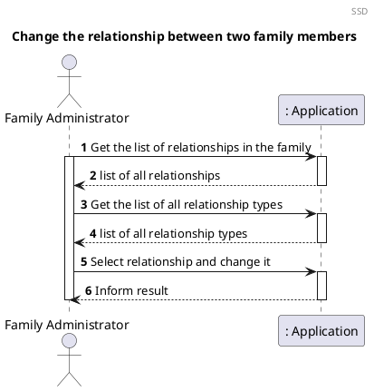
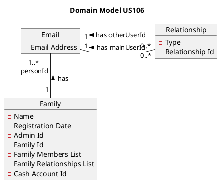
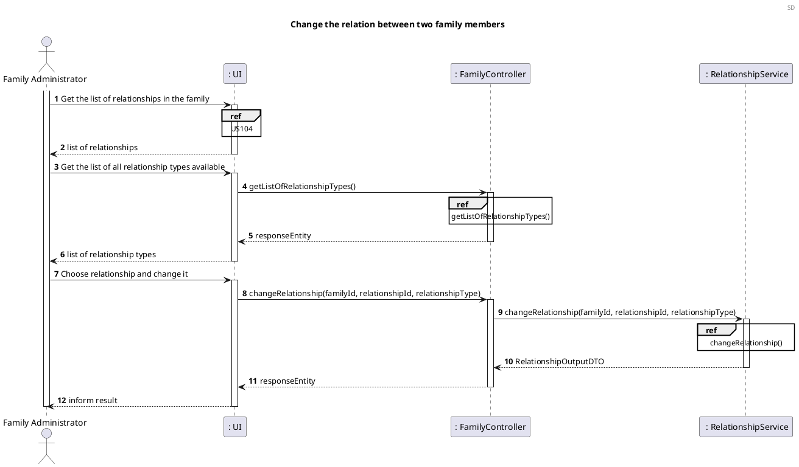
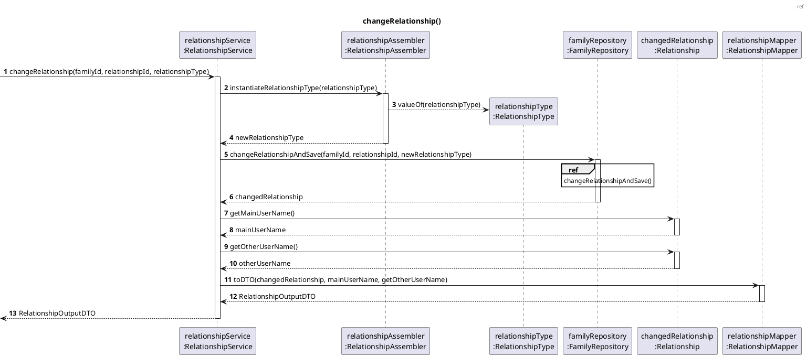
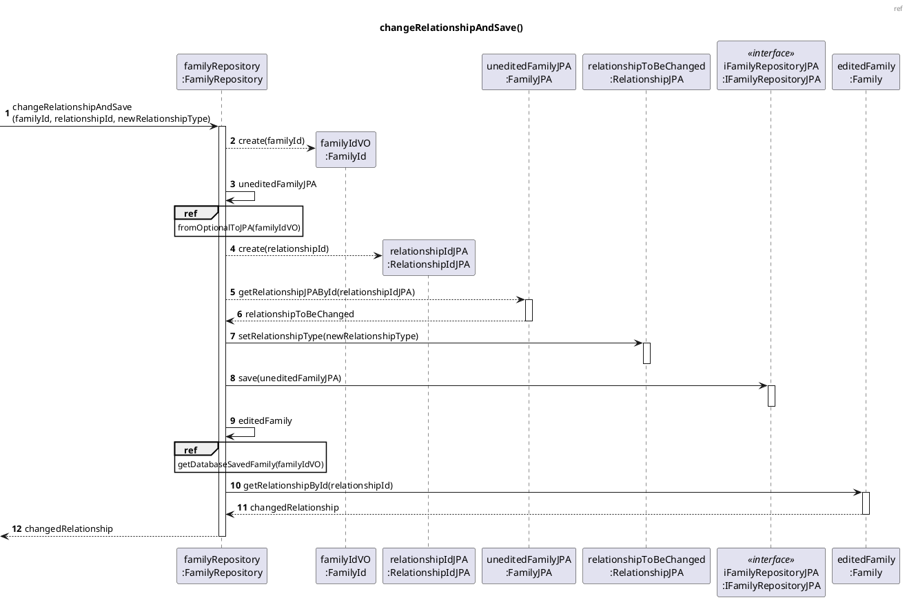
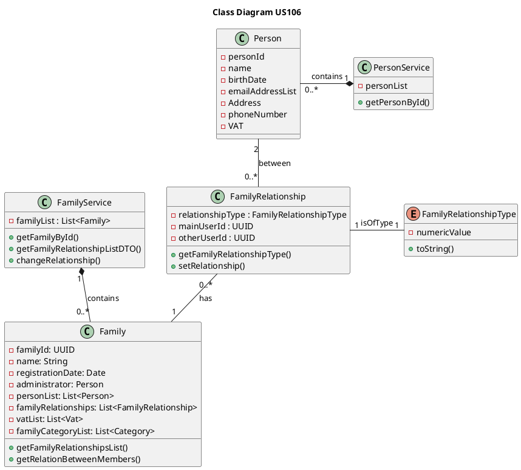

# US106 Change The Relation Between Two Family Members

# 1. Requirements

_As a family administrator, I want to change a relation between two family
members._

From the project proposal: _"There are family relations in a family (son,
daughter, husband, wife, father, mother, etc.). All relations use the level of
the main user as a reference."_

The functionality will allow a family administrator to change a relationship
between two members of the same family. It was designed to respond to the user story/requirement 
referred above.

## 1.1 System sequence diagram

The system sequence diagram below represents the interaction between Family Administrator and the 
Application.



# 1.2. Dependency of other user stories

This user story is dependent on [US010], [US011], [US101] and [US105] because
without having a family with an administrator and at least another family member
it would be impossible to have a relationship. As well as the relation we want
to change has to have been created previously, or else the purpose of this
functionality wouldn't be needed.


# 2. Analysis

### 2.1 Relationship change

The relationship object, that corresponds to the relationship between two
members of the same family, as mentioned before, will have the following
attributes:

| Attributes       | Rules                        |
| ---------------- | ---------------------------- |
| relationshipType | required, enum type constant |
| mainPersonId     | unique, required, Email      |
| otherPersonId    | unique, required, Email      |
| relationshipId   | unique, required, int        |


The possible relationship types are:
- Spouse
- Partner
- Parent
- Child
- Sibling
- Grandparent
- Grandchild
- Uncle/Aunt
- Nephew/Niece
- Cousin

The change of a relationship refers to a modification in the relationshipType attribute represented 
above.


### 2.2 Relevant domain model excerpt

The relevant domain concepts for this user story:



# 3. Design

## 3.1. Functionality Development

The process consists in having the list of all the relationships in the family and choosing one, 
through its ID, to change the relationship type between two members.

### 3.1.1 Sequence diagrams



```puml
@startuml

header ref
title getListOfRelationshipTypes()
autonumber
participant "relationshipService\n:RelationshipService" as RS
participant ":RelationshipType" as RT
participant "relationshipMapper\n:RelationshipMapper" as RM
participant "relationshipTypesList \n : List<RelationshipTypeDTO>" as list
participant "relationshipTypeDTO\n:RelationshipTypeDTO" as DTO
participant "relationshipTypesListDTO\n:RelationshipTypesListDTO" as ListDTO

-> RS : changeRelationship(relationType, relationshipOutputDTO)
activate RS
RS -> RT: getRelationshipTypesList()
activate RT
RT -> RT: Arrays.asList(values)
return relationshipTypes
deactivate RT

RS -> RM: relationshipTypesToDTO(relationshipTypes)
activate RM
RM --> list *: create()
loop for each relationshipType in relationshipTypes
RM --> DTO *: create(numericValue, relationshipType)
RM --> list: add(relationshipTypeDTO)
activate list
deactivate list
end
RM --> ListDTO *: create(relationshipTypesList)
return relationshipTypesListDTO
deactivate RM
<-- RS : relationshipTypesListDTO

@enduml
```





## 3.2. Class Diagram

The Class Diagram is the following:


## 3.3. Applied patterns

## 3.4. Tests

### Successful Cases:

```java
@Test
    void changeRelationshipSuccessfully_FromOneToTwo(){
            // Add a member to family and create relationship:
            FamilyOutputDTO familyOutputDTO = familyMemberService.createFamily(familyInputDTO);
            long familyId = familyOutputDTO.getFamilyId();
            PersonInputDTO otherUserInputDTO = new PersonInputDTO();
            otherUserInputDTO.setEmail("maria@teste.com");
            otherUserInputDTO.setName("Maria");
            otherUserInputDTO.setVat("223456789");
            otherUserInputDTO.setStreet("Maria St");
            otherUserInputDTO.setLocation("Porto");
            otherUserInputDTO.setPostCode("1234-123");
            otherUserInputDTO.setBirthDate("10/01/2000");
            otherUserInputDTO.setPhoneNumber("919999999");
            AddFamilyMemberDTO otherUserId = familyMemberService.addFamilyMember(otherUserInputDTO,
            familyId);
            RelationshipInputDTO relationshipInputDTO =
            new RelationshipInputDTO(familyInputDTO.getEmail(), otherUserId.getEmail(),
            "1");
            RelationshipOutputDTO relationshipOutputDTO = relationshipService.createRelationship(familyId, relationshipInputDTO);

            int relationshipId = relationshipOutputDTO.getRelationshipId();

            //arrange
            RelationshipUserDTO mainUser = new RelationshipUserDTO(familyInputDTO.getName(), familyInputDTO.getEmail());
            RelationshipUserDTO otherUser = new RelationshipUserDTO(otherUserInputDTO.getName(), otherUserInputDTO.getEmail());
            RelationshipOutputDTO expectedOutput = new RelationshipOutputDTO(mainUser, "PARTNER", otherUser, relationshipId);

            int newRelationshipType = 2;
            ResponseEntity<Object> result = controller.changeRelationship(familyId, relationshipId, newRelationshipType);

        assertNotNull(result);
        assertEquals(HttpStatus.OK, result.getStatusCode());
        assertEquals(expectedOutput, result.getBody());
        }
```

### Unsuccessful Cases:

```java
@Test
    void failToChangeRelationship_WhenRelationshipIdDoesNotExist(){
            FamilyOutputDTO familyOutputDTO = familyMemberService.createFamily(familyInputDTO);
            long familyId = familyOutputDTO.getFamilyId();
            String expectedMessage = "The relationship does not exist in the family.";

            int newRelationshipType = 5;
            ResponseEntity<Object> result = controller.changeRelationship(familyId, 10, newRelationshipType);

        assertNotNull(result);
        assertEquals(HttpStatus.BAD_REQUEST, result.getStatusCode());
        assertEquals(expectedMessage, result.getBody());
        }
```
```java
@Test
    void failToChangeRelationship_WhenFamilyIdDoesNotExist(){
            String expectedMessage = "Family does not exist.";

            int newRelationshipType = 5;
            ResponseEntity<Object> result = controller.changeRelationship(500, 1, newRelationshipType);

        assertNotNull(result);
        assertEquals(HttpStatus.BAD_REQUEST, result.getStatusCode());
        assertEquals(expectedMessage, result.getBody());
        }
```
```java
@Test
    void failToChangeRelationship_InvalidRelationshipType(){
            FamilyOutputDTO familyOutputDTO = familyMemberService.createFamily(familyInputDTO);
            long familyId = familyOutputDTO.getFamilyId();
            String expectedMessage = "Invalid relationship type.";

            int newRelationshipType = -5;
            ResponseEntity<Object> result = controller.changeRelationship(familyId, 1, newRelationshipType);

        assertNotNull(result);
        assertEquals(HttpStatus.BAD_REQUEST, result.getStatusCode());
        assertEquals(expectedMessage, result.getBody());
        }
```


# 4. Implementation

Some challenges encountered during the development process and implementation of this functionality
were:

- The dependency on other functionalities to be fully operational to implement and test this
  functionality correctly;
- The need to implement a DTO, in order to get list of members and their relations in a specific family.

In order to minimize these problems and to guarantee a reliable
functionality, the tests were done to cover the maximum scenarios, identifying
and correcting the encountered errors. In addition, there was communication with
the Product Owner whenever needed, to clarify some requirements in relation to this specific
functionality.


# 5. Integration/Demonstration

As stated in the [Requirements](#1-requirements), the use-case scenario will only be possible if some
other functionalities are fully operational.

# 6. Observations

[US010]: US010_Create_Family.md

[US011]: US011_Add_Family_Administrator.md

[US101]: US101_Add_Family_Member.md

[US105]: US105_Create_Relationship.md