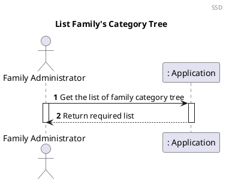
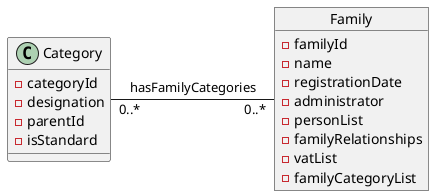
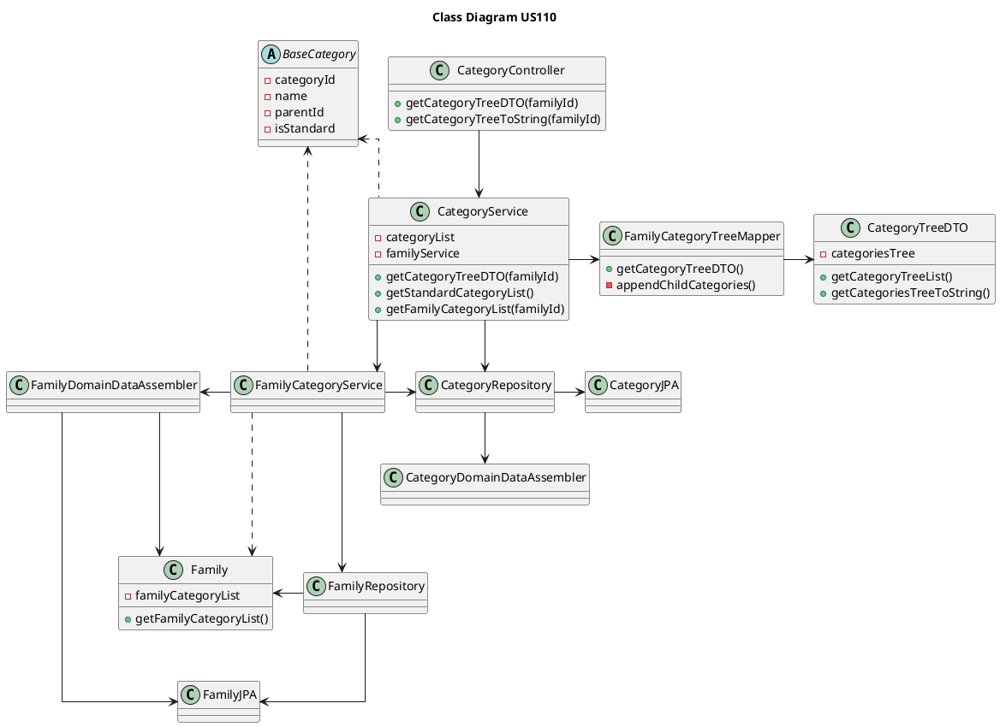

# US110 Get Family Category Tree

# 1. Requirements

_As a family administrator, I want to get the list of the categories on the
family’s category tree._

Following the required fields given from the proposition, we need to know the
administrator's family identification number.

## 1.1 System Sequence Diagram

This is the SSD representing the interactions between the user and the system.



# 2. Analysis

## 2.1 Family Category Tree entry

According to what was presented, a family category tree is created upon request
from the Family Administrator using its family identification number as a
reference this actor's family.

The family category tree is the resultant merge of the standard category list
and the family category list.

The categories are stored in a list where each category has multiple attributes
as stated in the Create Standard Category
document ([US001](US001_Create_Standard_Category.md)).

Each category in the family category tree should have the following attributes:

| **_Attributes_**    | **_Rules_**       |
| :--------------------------------- | :----------------- |
| **categoryId**      | Unique, required, integer, auto-incrementing |
| **name**        | Required, integer |
| **parentId**    | integer |
| **isStandard**    | boolean |

The default isStandard value is false.

## 2.2 Domain Model Excerpt

For quick reference, there's a relevant extract of the domain model.



# 3. Design

## 3.1. Functionality Development

The Sequence Diagram is the following:

```puml
autonumber
header SD
title Get Family Category Tree
actor "Family Administrator" as FA
participant ": UI" as UI
participant ": Category\nController" as CC
participant ": Category\nService" as CS
participant ": Category\nRepository" as CR
participant ": FamilyCategory\nTreeMapper" as FCM

FA -> UI : Get the list of the categories \non the family’s category tree
activate FA
activate UI

UI -> CC : getFamilyCategoryTree(familyId)
activate CC
CC -> CS : getFamilyCategoryTree(familyId)
activate CS

CS -> CR : getStandardCategories()
activate CR
ref over CR
  getStandardCategories()
end
CR --> CS : standardCategories
deactivate CR

CS -> CR : getFamilyCategories(familyId)
activate CR
ref over CR
  getFamilyCategories(familyId)
end
CR --> CS : familyCategories
deactivate CR

CS -> CS : unorderedFamilyCategoryList(standardCategoryList, familyCategoryList)
CS -> FCM : getFamilyCategoryTreeDTO(unorderedCategoryList)
activate FCM
ref over FCM
  toDTO(unorderedCategoryList)
end
FCM --> CS : familyCategoryTreeDTO
deactivate FCM 

CS --> CC : familyCategoryTreeDTO
deactivate CS
CC --> UI : familyCategoryTreeDTO
deactivate CC
UI --> FA : Show family category list
deactivate UI

deactivate FA
```

```puml

header ref
title Get Standard Category List
participant ": Category\nRepository" as CR
participant ": iCategory\nRepository" as iR
participant ": CategoryDomain\nDataAssembler" as CDDA
participant "aStandardCategory: \nStandardCategory" as SC

[-> CR : getStandardCategoryList()

activate CR
CR -> iR : findAllStandardCategories()
activate iR
iR --> CR : iterableStandardCategoryJPAlist
deactivate iR
alt for each standardJpa category in the list
CR -> CDDA : fromDataToDomainCategoryName(standardCategoryJPA)
activate CDDA
CDDA --> CR : categoryName
deactivate CDDA
CR -> CDDA : fromDataToDomainCategoryId(standardCategoryJPA)
activate CDDA
CDDA --> CR : parentCategoryId
deactivate CDDA
CR -> SC ** : create(categoryName)
activate SC
SC -> SC : setDataBaseId()
deactivate SC
CR -> CR : add(aStandardCategory)
end

[<-- CR : standardCategorylist
deactivate CR

```

```puml

header ref
title Get Family Category List
participant ": Category\nRepository" as CR
participant ": iCategory\nRepository" as iR
participant ": CategoryDomain\nDataAssembler" as CDDA
participant "aFamilyCategory: \nFamilyCategory" as SC

[-> CR : getFamilyCategoryList()

activate CR
CR -> iR : findAllFamilyCategories(familyId)
activate iR
iR --> CR : convertFamilyIterabletoList(familyJpaIterable)
deactivate iR
alt for each familyJpa category in the list
CR -> CDDA : fromDataToDomainCategoryName(familyCategoryJPA)
activate CDDA
CDDA --> CR : categoryName
deactivate CDDA
CR -> CDDA : fromDataToDomainCategoryId(familyCategoryJPA)
activate CDDA
CDDA --> CR : parentCategoryId
deactivate CDDA
CR -> SC ** : create(categoryName)
activate SC
SC -> SC : setDataBaseId()
deactivate SC
CR -> CR : add(aFamilyCategory)
end

[<-- CR : familyCategorylist
deactivate CR
```

```puml
autonumber
title getFamilyCategoriesTreeDTO()

participant "FamilyCategoryTreeMapper\n: FamilyCategoryTreeMapper" as mapper
participant "categoriesTreeDTO\n: categoriesTreeDTO" as DTO
participant "baseCategory\n: baseCategory" as SC
participant "categoryDTOs\n: List<categoryDTO>" as SCL
participant "filetredCategories\n: List<BaseCategory>" as FC
participant "childCategories\n: List<categoryDTO>" as SCCL
participant "categoryDTO\n: CategoryDTO" as SCDTO

-> mapper : getFamilyCategoriesTreeDTO(unorderedCategoryList)
activate mapper


mapper -> mapper : mapFamilyCategoriesTree(unordered, null)

mapper --> SCL** : create()
activate mapper

mapper -> FC** : unorderedCategories.stream().filter(getParentId() != parentId)

loop for each baseCategory in unorderedCategoryList

mapper -> SC : getId()
activate SC

return categoryIdVO
deactivate SC

mapper -> SC : getParentId()
activate SC

return parentCategoryIdVO

mapper -> mapper : result = isSameCategory(parentCategoryIdVO, parentId)

alt result == true 

    mapper -> SCCL** : mapFamilyCategoriesTree(filteredCategories, categoryIdVO)
    
    mapper -> SCDTO** : toDTO(baseCategory)
        
    mapper -> SCDTO : setChildCategories(childCategories)
    activate SCDTO
    deactivate SCDTO
    
    mapper -> SCL : add(categoryDTO)
    activate SCL
    deactivate SCL
    deactivate mapper
    
end loop

end alt

|||

mapper -> DTO** : create(categoriesTreeDTO)

<-- mapper: familyCategoriesTreeDTO
    deactivate mapper


```


## 3.2. Class Diagram



## 3.3. Applied Patterns

In order to achieve best practices in software development, to implement this US
we're using the following:

- _Single Responsibility Principle_ - Classes should have one responsibility;
- _Information Expert_ - Assign a responsibility to the class that has the
  information needed to fulfill it;
- _Pure Fabrication_ - Category Service was implemented to manage everything
  related to categories.
- _Controller_ - ListFamilyCategoryTree was created;
- _Low Coupling_ - ListFamilyCategoryTreeService is the only class responsible
  to return the list of family's category tree.
- _High Cohesion_ - ListFamilyCategoryTreeService is the only class responsible
  to return the list of family's category tree.

## 3.4. Tests

**Note:** Every test requires a family to be created in order to store in the
familyCategoryList and also standard categories previously created to build the
tree.

**Test 1:** Obtain the Family Category List Tree as a DTO:

```java
 @Test
    void getCategoryTreeDTO_AsExpected() {
            createMockDataToCreateFamilyCategoryTesting();
            List<Category> expectedList = createMockDataToCreateExpectedCategoryTreeTesting();
        
            CategoryTreeDTO expectedDTO = new CategoryTreeDTO(expectedList);

        CategoryTreeDTO resultDTO = getFamilyCategoryTreeController.getCategoryTreeDTO(familyId);

        assertEquals(expectedDTO.getCategoryTreeList(), resultDTO.getCategoryTreeList());
        }
```

**Test 2:** Obtain the Family Category List Tree as a String:

```java
 @Test
    void getCategoryTreeToString_AsExpected() {
            createMockDataToCreateFamilyCategoryTesting();
            
            String expected = createMockDataToCreateExpectedCategoryTreeToStringTesting();

            String result = getFamilyCategoryTreeController.getCategoryTreeToString(familyId);

            assertEquals(expected, result);
            }
```

**Test 3:** Get an empty category tree list:

```java
    @Test
    void getCategoryTreeDTO_NullList() {
            String familyName = "Silva Costa";
            CreateFamilyController familyController = new CreateFamilyController(application);
            Family family = familyController.createFamily(familyName);
            familyId = family.getFamilyId();

            
            List<Category> expectedList = new ArrayList<>();
        CategoryTreeDTO expectedDTO = new CategoryTreeDTO(expectedList);

        CategoryTreeDTO resultDTO = getFamilyCategoryTreeController.getCategoryTreeDTO(familyId);

        assertEquals(expectedDTO.getCategoryTreeList(), resultDTO.getCategoryTreeList());
        }
```

**Test 4:** Throw exception when family doesn't exist:

```java
@Test
    void getCategoryTreeDTO_FamilyNull() {
            createMockDataToCreateFamilyCategoryTesting();
            UUID familyId = UUID.randomUUID();

            assertThrows(IllegalArgumentException.class, () -> getFamilyCategoryTreeController.getCategoryTreeDTO(familyId));
        }
```

# 4. Implementation

The major challenge on this user story was merging the two  different category 
lists and getting the category's hierarchy right.


# 5. Integration/Demonstration

This user story is dependent on the user story Create Standard
Category ([US001](US001_Create_Standard_Category.md)) in order to be able to
address the CategoryController.

At the moment, no other user stories are dependent on this one, so its
integration with other functionalities cannot be tested further.

# 6. Observations
