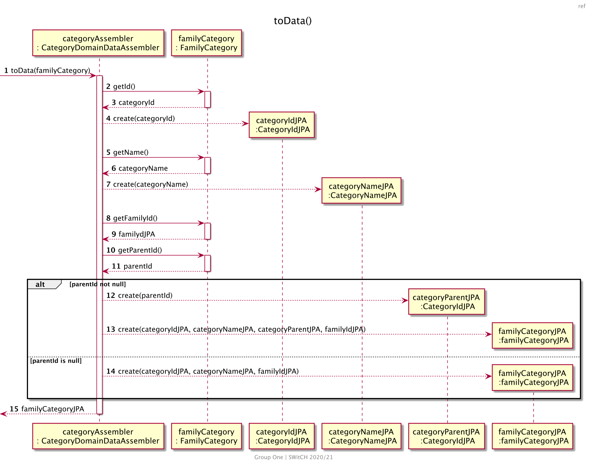

# US111v2 Add Category To Family Category Tree

# 1. Requirements

_As a family administrator, I want to add a custom category to the family’s category tree "extended"
from either external or internal standard categories._

_"SWS provides a standard category tree that can be customized by the family, i.e. the addition of
new branches and leaves"_

The functionality created to respond to the User Story (US) and requirement above will allow a
family administrator to add a customized transaction category to the family’s category tree.

## 1.1 System sequence diagram

<!---
@startuml US111_SSD

header ssd
title US111 Add a category to the family category tree
autonumber
actor "Family Administrator" as fa
actor ": Application" as app

fa -> app ++: Create a new family category
activate fa

return present category list
fa -> app ++: select parent category
return ask category name

fa -> app ++: input name
return inform success

@enduml
-->


# 1.2. Dependency of other user stories

This US is dependent on [US001] and [US002]. US001 will allow the creation of a customized category.
Without the creation of a new category, it would be impossible to add it to the family's category
tree. We also need US002 to present the categories to the user

The functionality developed for this US will be necessary for [US110] because, without it, no
customized family categories would exist in the list to be retrieved, only standard ones.

# 2. Analysis

The analysis of this user story is divided in two main sections:

## 2.1 Customized Category Tree entry

The customized category is created upon request from the family administrator and it can only be
used within the same family.

It should be created with an alphanumeric string as its name/designation.

The development team decided that the implementation would go through the following steps:

1. The category is created;
2. There is a verification to check if its name is valid (it is considered not valid if it contains
   spaces or if it is an empty string). If it isn't, an exception will be thrown.
3. There is a second verification to check if this category doesn't have the same name and the same
   parent Id as any other category in the family category list. This means that categories with the
   same name can be created, but not with the same parent category.
4. The category is added to the family's customized category list. If the category to be created is
   a child category, then the parent category Id is also validated on step 2 (to check if the parent
   category exists).

To present the full list of categories a Family can use, it is necessary to implement [US110]. This
full list is called Family's category tree.

As mentioned in [US001], each category in the family's category tree should have the following
attributes:

| **_Attributes_** | **_Rules_**                    |
| :--------------- | :----------------------------- |
| **categoryId**   | Unique, required, UUID, random |
| **name**         | Required, String               |
| **parentId**     | Unique, UUID, random           |
| **isStandard**   | boolean                        |

The default isStandard value is false, which means that it will be a customized category.

### 2.2 Relevant domain model excerpt

Below is the excerpt of the domain model relevant for this user story.


# 3. Design

## 3.1. Functionality development

In the diagrams below, it is possible to see the implementation strategy for this user story.

### 3.1.1 Sequence diagrams


- To create a family root category, the sequence action createFamilyCategory(categoryName, familyId)
  is the following:


- To create a family child category, the sequence action createFamilyCategory(categoryName,
  parentCategoryId, familyId) is the following:





## 3.2. Class Diagram

In the diagram below, all classes involved in this US are represented, as well as their
interactions.


<!----->

## 3.3. Applied patterns

- _Single Responsibility Principle (SRP)_ - Classes should have one responsibility, which means,
  only one reason to change;
- _Controller_ - CreateCategoryController receives and coordinates system operations, as it connects
  the UI layer to the application logic layer.
- _Information Expert_ - To each class were assigned responsibilities that can be fulfilled because
  they have the information needed to do so;
- _Creator_ - CategoryService was assigned the responsibility to manage all things related to adding
  a Category.
- _Pure Fabrication_ - CategoryService is a class that does not represent a domain concept, and it
  was assigned a set of responsibilities to support high cohesion, low coupling and reuse.
- _Low Coupling_ - Classes were assigned responsibilities so that coupling remains as low as
  possible, reducing the impact of any changes made to objects later on;
- _High Cohesion_ - Classes were assigned responsibilities so that cohesion remains high (they are
  strongly related and highly focused). This helps to keep objects understandable and manageable,
  and also goes hand in hand with the low coupling principle.

## 3.4. Unit tests

Referring different aspects of the Categories attributes, it is necessary to establish a set of unit
tests in relation to the domain classes, namely the **FamilyCategory** and the Value Objects that
make up the aggregate. The unit tests done in the Controller are defined below, organized by
description of the test:

- **Unit Test 1:** Assert the creation of a new root family category.

```java
 @Test
    void createRootFamilyCategory(){
            //arrange
            String name="Shopping";
            CategoryInputDTO categoryInputDTO=new CategoryInputDTO();
            categoryInputDTO.setName(name);
            CategoryId categoryId=new CategoryId(new Random().nextInt());
            long idDatabase=new Random().nextLong();
            long familyId=new Random().nextLong();

            FamilyCategoryOutputDTO categoryDTO=new FamilyCategoryOutputDTO(categoryId.getId(),name,familyId,idDatabase);
            when(categoryService.createFamilyCategory(categoryInputDTO,familyId)).thenReturn(categoryDTO);

            ResponseEntity<Object> result;
        HttpStatus expected=HttpStatus.CREATED;

        //act
        result=categoryController.createFamilyCategory(categoryInputDTO,familyId);


        //assert
        assertNotNull(result);
        assertEquals(expected,result.getStatusCode());
        assertEquals(categoryDTO,result.getBody());
        }
```

- **Unit Test 2:** Assert the creation of a new child family category.

```java
@Test
    void createChildFamilyCategory(){
            //arrange
            //parent category
            String name="Clothing";
            CategoryInputDTO categoryInputDTO=new CategoryInputDTO();
            categoryInputDTO.setName(name);
            CategoryId categoryId=new CategoryId(new Random().nextInt());
            long idDatabase=new Random().nextLong();
            long familyId=new Random().nextLong();

            FamilyCategoryOutputDTO categoryDTO=new FamilyCategoryOutputDTO(categoryId.getId(),name,familyId,idDatabase);
            when(categoryService.createFamilyCategory(categoryInputDTO,familyId)).thenReturn(categoryDTO);
            categoryController.createFamilyCategory(categoryInputDTO,familyId);

            //child category
            String childName="Shopping";
            CategoryInputDTO categoryChildInputDTO=new CategoryInputDTO();
            categoryChildInputDTO.setName(childName);
            categoryChildInputDTO.setParentId(categoryId.getId());
            CategoryId childId=new CategoryId(new Random().nextInt());
            long idDatabaseChild=new Random().nextLong();
            FamilyCategoryOutputDTO categoryChildDTO=new FamilyCategoryOutputDTO(childId.getId(),childName,categoryId.getId(),familyId,idDatabaseChild);
            when(categoryService.createFamilyCategory(categoryChildInputDTO,familyId)).thenReturn(categoryChildDTO);

            ResponseEntity<Object> result;
        HttpStatus expected=HttpStatus.CREATED;

        //act
        result=categoryController.createFamilyCategory(categoryChildInputDTO,familyId);

        //assert
        assertNotNull(result);
        assertEquals(expected,result.getStatusCode());
        assertEquals(categoryChildDTO,result.getBody());
        }
```

- **Unit Test 3:** Throw an error when creating a family category with invalid name.

```java
@ParameterizedTest
@NullAndEmptySource
    void ensureRootFamilyCategoryNotCreatedWhenInvalidName(String name){
            //arrange
            CategoryInputDTO categoryInputDTO=new CategoryInputDTO();
            categoryInputDTO.setName(name);
            long familyId=new Random().nextLong();
            when(categoryService.createFamilyCategory(categoryInputDTO,familyId)).thenThrow(InvalidNameException.class);

        ResponseEntity<Object> result;
        HttpStatus expected=HttpStatus.BAD_REQUEST;

        //act
        result=categoryController.createFamilyCategory(categoryInputDTO,familyId);

        //assert
        assertEquals(expected,result.getStatusCode());
        }
```

- **Unit Test 4:** Do not create family category already existing.

```java
@Test
    void ensureExistingFamilyRootCategoryNotCreatedAgain(){
            //arrange
            String name="Shopping";
            CategoryId categoryId=new CategoryId(new Random().nextInt());
            CategoryInputDTO categoryInputDTO=new CategoryInputDTO();
            categoryInputDTO.setName(name);
            long idDatabase=new Random().nextLong();
            long familyId=new Random().nextLong();
            FamilyCategoryOutputDTO categoryDTO=new FamilyCategoryOutputDTO(categoryId.getId(),name,familyId,idDatabase);
            when(categoryService.createFamilyCategory(categoryInputDTO,familyId)).thenReturn(categoryDTO);
            categoryController.createFamilyCategory(categoryInputDTO,familyId);

            when(categoryService.createFamilyCategory(categoryInputDTO,familyId)).thenThrow(DuplicateObjectException.class);

        ResponseEntity<Object> result;
        HttpStatus expected=HttpStatus.BAD_REQUEST;

        //act
        result=categoryController.createFamilyCategory(categoryInputDTO,familyId);

        //assert
        assertEquals(expected,result.getStatusCode());
        }
```

- **Unit Test 5:** Create a hild family category with mocked parent external standard category.

```java
 @Test
    void createChildFamilyCategoryWithMockedParentExternalCategory(){
            //arrange
            //external parent standard category
            String healthCategoryId="http://vs260.dei.isep.ipp.pt:8080/api/categories/0490a571-824a-4e41-b9f3-b195de67abc6";
            String healthCategoryName="HEALTH";
            CategoryInputDTO categoryInputDTO=new CategoryInputDTO();
            categoryInputDTO.setName(healthCategoryName);
            CategoryId categoryId=new CategoryId(healthCategoryId);
            long idDatabase=0;
            long familyId=new Random().nextLong();
            FamilyCategoryOutputDTO categoryDTO=new FamilyCategoryOutputDTO(categoryId.getId(),healthCategoryName,familyId,idDatabase);

            when(categoryService.createFamilyCategory(categoryInputDTO,familyId)).thenReturn(categoryDTO);
            categoryController.createFamilyCategory(categoryInputDTO,familyId);

            //family child category
            String childName="Shopping";
            Object parentId=categoryId.getId();
            CategoryInputDTO categoryChildInputDTO=new CategoryInputDTO();
            categoryChildInputDTO.setName(childName);
            categoryChildInputDTO.setParentId(parentId);
            CategoryId childId=new CategoryId(new Random().nextInt());
            long idDatabaseChild=new Random().nextLong();
            FamilyCategoryOutputDTO categoryChildDTO=new FamilyCategoryOutputDTO(childId.getId(),childName,parentId,familyId,idDatabaseChild);
            when(categoryService.createFamilyCategory(categoryChildInputDTO,familyId)).thenReturn(categoryChildDTO);

            ResponseEntity<Object> result;
        HttpStatus expected=HttpStatus.CREATED;

        //act
        result=categoryController.createFamilyCategory(categoryChildInputDTO,familyId);

        //assert
        assertNotNull(result);
        assertEquals(expected,result.getStatusCode());
        assertEquals(categoryChildDTO,result.getBody());
        }

```

### 3.4.2 Integration Tests

In order to ensure that of all parts of the system and functionalities are working correctly (e.g.
Controller, Service, Repository, Model), it is necessary to define a set of Integration Tests that
will simulate the system use cases, such as:

- **Integration Test 1:** Assert the creation of a new root family category.

```java
 @Test
    void ensureRootFamilyCategoryIsCreated(){
            //arrange
            String name="Shopping";
            long familyId=familyOutputDTO.getFamilyId();
            ResponseEntity<Object> result;

        CategoryInputDTO categoryInputDTO=new CategoryInputDTO();
        categoryInputDTO.setName(name);

        //act
        result=categoryController.createFamilyCategory(categoryInputDTO,familyId);

        //assert
        assertNotNull(result);
        assertEquals(HttpStatus.CREATED,result.getStatusCode());
        }
```

- **Integration Test 2:** Assert the creation of a new child family category.

```java
@Test
    void ensureFamilyCategoryChildOfStandardCategoryIsCreated(){
            //arrange
            String name="Shopping";
            CategoryInputDTO categoryInputDTO=new CategoryInputDTO();
            categoryInputDTO.setName(name);

            StandardCategoryOutputDTO categoryDTO=
            (StandardCategoryOutputDTO)categoryController.createStandardCategory(categoryInputDTO).getBody();
            Object parentId=categoryDTO.getCategoryId();

            String childName="Clothing";
            long familyId=familyOutputDTO.getFamilyId();
            CategoryInputDTO childInputDTO=new CategoryInputDTO();
            childInputDTO.setName(childName);
            childInputDTO.setParentId(parentId);

            ResponseEntity<Object> result;
        HttpStatus expected=HttpStatus.CREATED;

        //act
        result=categoryController.createFamilyCategory(childInputDTO,familyId);

        //assert
        assertNotNull(result);
        assertEquals(expected,result.getStatusCode());
        }
```

- **Integration Test 3:** Do not create a family category with a family that does not exist.

```java
@Test
    void ensureFamilyRootCategoryNotCreatedWhenFamilyDoesNotExist(){
            //arrange
            String name="Groceries";
            long familyId=123456789;
            CategoryInputDTO categoryInputDTO=new CategoryInputDTO();
            categoryInputDTO.setName(name);

            ResponseEntity<Object> result;
        HttpStatus expected=HttpStatus.BAD_REQUEST;

        //act
        result=categoryController.createFamilyCategory(categoryInputDTO,familyId);

        //assert
        assertEquals(expected,result.getStatusCode());
        }
```

- **Integration Test 4:** Do not create a family root category that already exists.

```java
 @Test
    void ensureExistingFamilyRootCategoryNotCreatedAgain(){
            //arrange
            String name="Groceries";
            long familyId=familyOutputDTO.getFamilyId();
            CategoryInputDTO categoryInputDTO=new CategoryInputDTO();
            categoryInputDTO.setName(name);
            categoryController.createFamilyCategory(categoryInputDTO,familyId);

            ResponseEntity<Object> result;
        HttpStatus expected=HttpStatus.BAD_REQUEST;

        //act
        result=categoryController.createFamilyCategory(categoryInputDTO,familyId);

        //assert
        assertEquals(expected,result.getStatusCode());
        }
```  

- **Integration Test 5:** Do not create family child category that already exists.

```java
@Test
    void ensureExistingFamilyChildCategoryNotCreatedAgain(){
            //arrange
            String name="Shopping";
            long familyId=familyOutputDTO.getFamilyId();
            CategoryInputDTO categoryInputDTO=new CategoryInputDTO();
            categoryInputDTO.setName(name);
            FamilyCategoryOutputDTO categoryDTO=
            (FamilyCategoryOutputDTO)categoryController.createFamilyCategory(categoryInputDTO,familyId).getBody();

            Object childParentId=categoryDTO.getCategoryId();
            String childName="Clothing";
            CategoryInputDTO childInputDTO=new CategoryInputDTO();
            childInputDTO.setName(childName);
            childInputDTO.setParentId(childParentId);
            categoryController.createFamilyCategory(childInputDTO,familyId);

            ResponseEntity<Object> result;
        HttpStatus expected=HttpStatus.BAD_REQUEST;

        //act
        result=categoryController.createFamilyCategory(childInputDTO,familyId);

        //assert
        assertNotNull(result);
        assertEquals(expected,result.getStatusCode());
        }
```

# 4. Implementation

The main challenges that were found while implementing this functionality were:

- The refactoring of code made for previous category-related US, to accommodate the new
  functionality;
- Thinking of a solution to not restrict categories' designations if a category with the same name
  already exists.

To minimize these difficulties, research and a lot of group discussion was done.

So that we could present a reliable functionality, many tests were written, to identify as many
possible errors in the implementation as possible.

# 5. Integration/Demonstration

As mentioned before, this US will be necessary for [US110]
because, without it, no customized family categories would exist in the list to be retrieved, only
standard ones. When testing the functionality developed for [US110], this functionality will also be
indirectly tested.

At the moment, no other user stories are dependent on this one, so its integration with other
functionalities cannot be tested further.

# 6. Observations

At the moment, the implementation of this US is simple and functional, but if, in the future, more
differences were to be added to the category types, then the development team would have to make
some changes to allow this.

Possible modifications might include splitting the Category class into two (StandardCategory and
FamilyCategory), and each would extend a BaseCategory abstract class. This would help incorporate
the open-closed principle into this functionality, as well as bring a bigger degree of abstraction
to the implementation. The diagram bellow can illustrate these changes.

[us001]: US001_Create_Standard_Category.md

[us002]: US002_Get_Standard_Categories.md

[us110]: US110_Get_Family_Category_Tree.md
