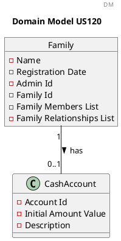
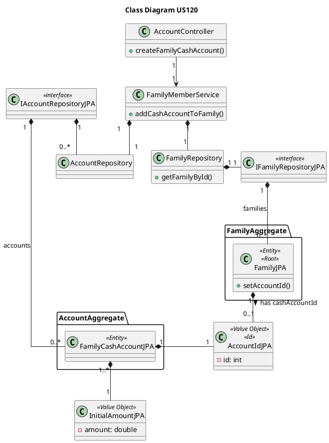

US120 Create Family Cash Account
=======================================

# 1. Requirements

*As a family administrator, I want to create a family cash account.*

Following the required fields given from the project proposal, a family cash account must have:

- Account identification number
- Initial cash amount
- Description

According to the requirements, a family can have only **one** cash account.

```puml
autonumber
header SSD
title Create a Family Cash Account

actor "Family Administrator" as FA
participant ": Application" as App

FA -> App : Create a family cash account
activate FA
activate App
return asks data
FA -> App : inputs data
activate App
return Informs success
deactivate App
deactivate FA
```

# 2. Analysis

## 2.1 Family Cash Account entry

According to what was presented, a family cash account is created upon request from the Family
Administrator.

Using this strategy, we decided that it would be better to verify first if the given family already
has a cash account and if not, the family cash account can be created.

A family cash account instance should have the following attributes:

| Attributes         | Rules                                        |
| ------------------ | -------------------------------------------- |
| accountId          | Unique, required, integer, auto-incrementing |
| initialAmountValue | Required, amount (double) and currency (enum)|
| description        | Required, string                             |

## 2.2 Domain Model Excerpt

For quick reference, there's a relevant extract of the domain model.



# 3. Design

## 3.1. Functionality Development

The System Diagram is the following:

```puml
autonumber
header SD
title Create a Family Cash Account

participant ": CreateFamilyCashAccount\nController" as CFCAC
participant "familyAccountService\n:FamilyAccountService" as FAS
participant "accountDTOAssembler\n :AccountDTOAssembler" as AA
participant "familyId\n :FamilyId" as FamId
participant "initialAmountValue\n :initialAmountValue" as IA
participant "accountDescription\n :AccountDescription" as ADes
participant "familyRepository\n :FamilyRepository" as FR
participant "familyDomainService\n :FamilyDomainService" as FDS
participant "family\n:Family" as Fam <<Entity>> <<Root>>
participant ":FamilyCashAccount" as FCA <<Entity>> <<Root>>
participant "accountRepository\n:AccountRepository" as AR
participant "savedCashAccount\n :FamilyCashAccount" as SFCA


[-> CFCAC : createFamilyCashAccount(inputDTO)
activate CFCAC

CFCAC -> FAS : createFamilyCashAccount(inputDTO)
activate FAS
FAS -> AA : fromDTOToFamilyId(inputDTO)
activate AA
AA --> FamId **: create(inputDTO.getFamilyId())
return familyId

FAS --> FR: getDatabaseSavedFamily(familyId)
activate FR
ref over FR
getDatabaseSavedFamily(familyId)
end
return family

FAS -> FDS: checkIfFamilyHasCashAccount(family)
activate FDS

FDS -> Fam: hasCashAccount()
activate Fam
return boolean
deactivate FDS

FAS -> AA : fromDTOToInitialAmountValue(inputDTO)
activate AA
AA --> IA **: create(inputDTO.getInitialAmount() \n inputDTO.getCurrency())
return initialAmountValue

FAS -> AA : fromDTOToAccountDescription(inputDTO)
activate AA
AA --> ADes **: create(inputDTO.getDescription())
return accountDescription

FAS --> FCA **: create(initialAmountValue, accountDescription)

FAS -> AR: saveCashAccount(cashAccount)
activate AR
ref over AR
saveCashAccount()
end
return savedCashAccount

FAS -> SFCA: getAccountId()(cashAccount)
activate SFCA
return newAccountId

FAS -> Fam: setAccountId(newAccountId)
activate Fam
deactivate Fam

FAS -> FR: saveFamilyWithAccount(family)
activate FR
ref over FR
saveFamilyWithAccount(family)
end
deactivate FR

FAS -> AA : accountToOutputDTO(savedCashAccount)
activate AA
ref over AA
accountToOutputDTO()
end
return accountOutputDTO
return accountOutputDTO
return accountOutputDTO

```

```puml
autonumber
header ref
title getDatabaseSavedFamily(familyId)

participant "familyRepository\n :FamilyRepository" as FR
participant "familyId:\nFamilyId" as FIJPA
participant ":IFamilyRepository" as IFR <<interface>>
participant "familyDomainDataAssembler\n:FamilyDomainDataAssembler" as ADA
participant "family\n:Family" as Fam <<Entity>> <<Root>>

[-> FR: getDatabaseSavedFamily(familyId)
activate FR
FR --> FIJPA : getFamilyId()
activate FIJPA
return databaseFamilyId
FR -> IFR ++: findById(databaseFamilyId)
return familyJPA
FR -> ADA : toDomainVOs(familyJPA)
activate ADA
return familyOutputVOs
FR --> Fam ** : create(familyOutputVOs)
return family
```

```puml
autonumber
header ref
title saveCashAccount(cashAccount)

participant "accountRepository\n : AccountRepository" as AR
participant "accountsDomainDataAssembler\n:AccountsDomainDataAssembler" as ADA
participant "accountsDomainDataAssembler\n:AccountsDomainDataAssembler" as ADA
participant "cashAccount\n :FamilyCashAccount" as FCA
participant "initialAmountValueJPA\n : InitialAmountValueJPA" as IAVJPA
participant "accountDescriptionJPA\n : AccountDescriptionJPA" as ADJPA
participant "cashAccountJPA\n :CashAccountJPA" as CAJPA
participant ":IAccountRepositoryJPA" as iRJPA <<interface>>
participant "newAccountId\n : AccountId" as AId
participant "initialAmountValue\n : InitialAmountValue" as IA
participant "accountDescription\n : AccountDescription" as AD
participant "savedCashAccount\n :FamilyCashAccount" as SFCA

[-> AR: saveCashAccount(cashAccount)
activate AR
AR -> ADA: toData(cashAccount)
activate ADA
ADA -> FCA: getInitialAmountValue()
activate FCA
return amount
ADA -> FCA: getCurrency()
activate FCA
return currency
ADA --> IAVJPA ** : create(amount, currency)
ADA -> FCA: getAccountDescription()
activate FCA
return accountDescription
ADA --> ADJPA ** : create(accountDescription)

ADA --> CAJPA ** : create(initialAmountValueJPA, accountDescriptionJPA)
return cashAccountJPA

AR -> iRJPA: save(cashAccountJPA)
activate iRJPA
deactivate iRJPA
 
AR -> CAJPA: getAccountId()
activate CAJPA
return newAccountId

AR --> AId ** : create(newAccountId)

AR -> ADA: fromDataToInitialAmountValue(cashAccountJPA)
activate ADA
ADA -> CAJPA: getInitialAmountValue()
activate CAJPA
return amount
ADA -> CAJPA: getCurrency()
activate CAJPA
return currency

ADA --> IA ** : create(amount, currency)
ADA --> AR: initialAmountValue
deactivate ADA

AR -> ADA: fromDataToAccountDescription(cashAccountJPA)
activate ADA
ADA -> CAJPA: getAccountDescription()
activate CAJPA
return accountDescription
ADA --> AD ** : create(accountDescription)
ADA --> AR: accountDescription

deactivate ADA

AR --> SFCA ** : create(initialAmountValue, accountDescription)
AR --> SFCA: setAccountId(newAccountId)
activate SFCA
deactivate SFCA
return savedCashAccount


```

```puml
autonumber
header ref
title saveFamilyWithAccount(family)

participant "familyRepository\n :FamilyRepository" as FR
participant "family\n:Family" as Fam <<Entity>> <<Root>>
participant ":IFamilyRepository" as IFR <<interface>>
participant "familyJPA:\nFamilyJPA" as FamJPA

[-> FR: saveFamilyWithAccount(family)
activate FR
FR -> Fam: getAccountId()
activate Fam
return accountId

FR -> Fam: getFamilyId()
activate Fam
return databaseFamilyId
FR -> IFR ++: findById(databaseFamilyId)
return familyJPA
FR -> FamJPA: setAccountId(accountId)
activate FamJPA
deactivate FamJPA
FR -> IFR: save(FamilyJPA)
activate IFR
deactivate IFR
deactivate FR

```

```puml
autonumber
header ref
title accountToOutputDTO(savedCashAccount)

participant "accountDTOAssembler\n :AccountDTOAssembler" as AA
participant "savedCashAccount\n :FamilyCashAccount" as SFCA
participant "accountOutputDTO\n :aAccountOutputDTO" as DTO


[-> AA: accountToOutputDTO(savedCashAccount)
activate AA
AA -> SFCA: getAccountId()
activate SFCA
return accountId
AA -> SFCA: getInitialAmount()
activate SFCA
return initialAmount
AA -> SFCA: getCurrency()
activate SFCA
return currency
AA -> SFCA: getAccountDescription()
activate SFCA
return accountDescription
AA -> DTO *: create(accountId, initialAmount, currency, accountDescription)
return accountOutputDTO

```

## 3.2. Class Diagram



## 3.3. Applied Patterns

In order to achieve best practices in software development, to implement this US we're using the
following:

- *Single Responsibility Principle* - Classes should have one responsibility;
- *Information Expert* - Assign a responsibility to the class that has the information needed to
  fulfill it;
- *Pure Fabrication* - FamilyCashAccount Service was implemented to manage everything related to
  family cash accounts.
- *Creator* - Family cash accounts are created by FamilyCashAccount Service;
- *Controller* - FamilyCashAccountController was created;
- *Low Coupling* - FamilyCashAccountService is the only class responsible to return the result from
  requests to create family cash accounts.
- *High Cohesion* - FamilyCashAccountService is the only class responsible to return the result from
  requests to create family cash accounts.

## 3.4. Tests

**Test 1:** Create a family cash account successfully

```java
@Test
    void createFamilyCashAccountSuccessfully(){
            HttpStatus expectedStatus=HttpStatus.CREATED;
            FamilyCashAccountInputDTO inputDTO=new FamilyCashAccountInputDTO(familyId.getFamilyId()
            ,30);

            ResponseEntity<Object> result=cashAccountController.createFamilyCashAccount(inputDTO);

        assertNotNull(result);
        assertNotNull(result.getBody());
        assertEquals(expectedStatus,result.getStatusCode());
        }
```

**Test 2:** Fail to create a family cash account where a family cash account already exists

```java
@Test
    void failToCreateMoreThanOneFamilyCashAccount() {
            HttpStatus expectedStatus = HttpStatus.BAD_REQUEST;
            String expectedMessage = "Family already has a cash account.";
            FamilyCashAccountInputDTO inputDTO = new FamilyCashAccountInputDTO(familyId.getFamilyId()
            ,30);

            familyAccountService.createFamilyCashAccount(inputDTO);

            ResponseEntity<Object> result = cashAccountController.createFamilyCashAccount(inputDTO);

        assertNotNull(result);
        assertNotNull(result.getBody());
        assertEquals(expectedMessage, result.getBody().toString());
        assertEquals(expectedStatus, result.getStatusCode());
        }
```

**Test 3:** Fail to create a family cash account with an invalid amount

```java
@Test
    void failToCreateFamilyCashAccount_WithInvalidAmount() {
            HttpStatus expectedStatus = HttpStatus.BAD_REQUEST;
            String expectedMessage = "The initial cash amount cannot be negative.";
            FamilyCashAccountInputDTO inputDTO = new FamilyCashAccountInputDTO(familyId.getFamilyId()
            ,-10);

            ResponseEntity<Object> result = cashAccountController.createFamilyCashAccount(inputDTO);

        assertNotNull(result);
        assertNotNull(result.getBody());
        assertEquals(expectedMessage, result.getBody().toString());
        assertEquals(expectedStatus, result.getStatusCode());
        }
```

**Test 4:** Fail to create a family cash account with no existing family

```java
@Test
    void failToCreateFamilyCashAccount_WithNoExistingFamily() {
            FamilyId nonExistingFamilyId = new FamilyId(1);
            HttpStatus expectedStatus = HttpStatus.BAD_REQUEST;
            String expectedMessage = "Family does not exist.";
            FamilyCashAccountInputDTO inputDTO = new FamilyCashAccountInputDTO(nonExistingFamilyId.getFamilyId()
            ,30);

            ResponseEntity<Object> result = cashAccountController.createFamilyCashAccount(inputDTO);

        assertNotNull(result);
        assertNotNull(result.getBody());
        assertEquals(expectedMessage, result.getBody().toString());
        assertEquals(expectedStatus, result.getStatusCode());
        }
```

# 4. Implementation

# 5. Integration/Demonstration

At the moment, no other user stories are dependent on this one, so its integration with other
functionalities cannot be tested further.

# 6. Observations


