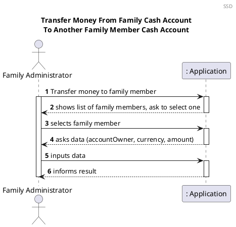
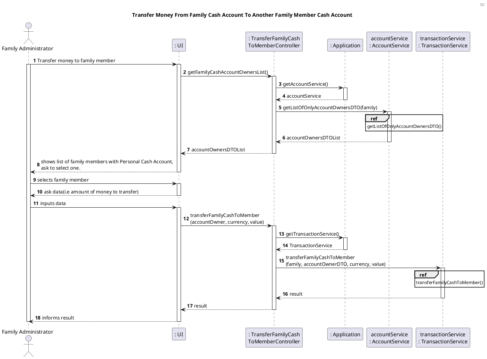
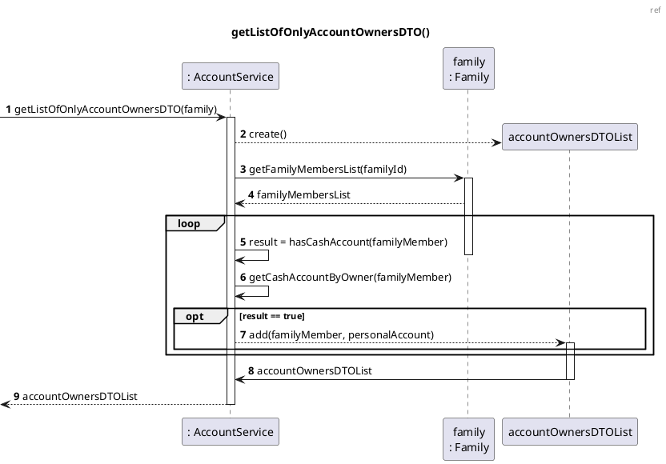
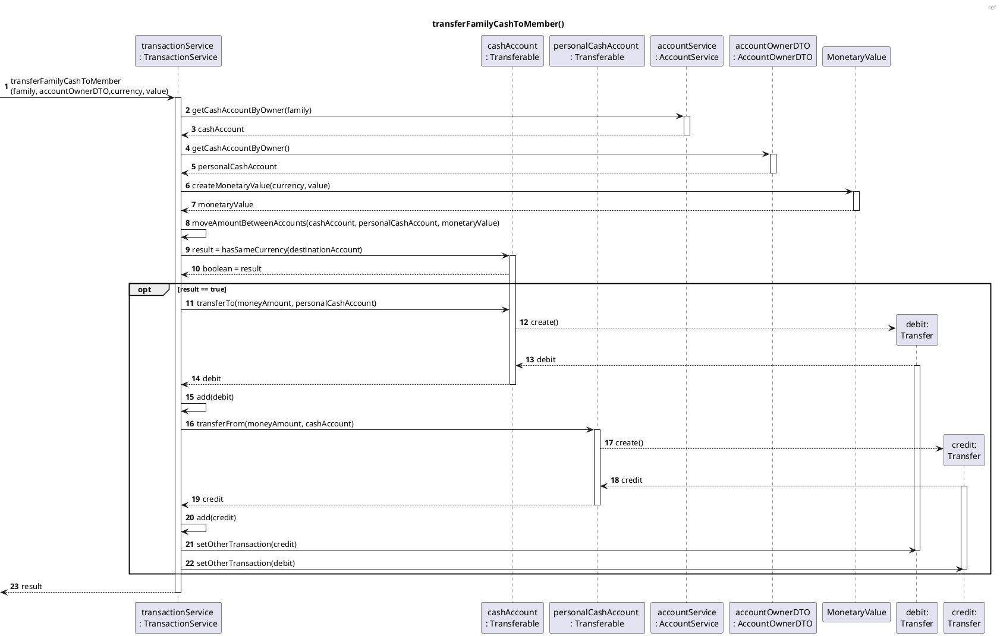
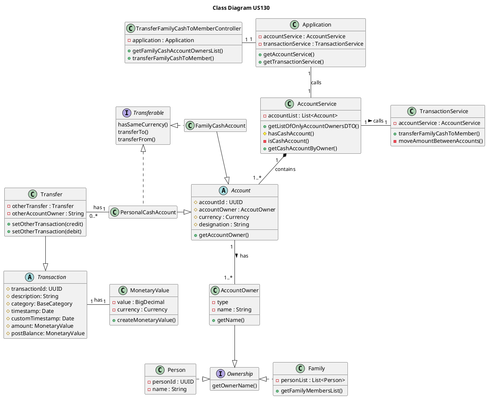

# US130 Transfer Money From Family Cash Account To Another Family Member Cash Account

# 1. Requirements

_As a family administrator, I want to transfer money from the family’s cash
account to another family member’s cash account._

According to this requirement, the family administrator would like to transfer money from the
family cash account to a designated member of the family cash account.
Therefore, in order to transfer the money between the family cash account
and the family member cash account, both the family member and the family need to have a cash account.
In addition, the balance of the family cash account must be greater than the amount of money to transfer.

These criteria have to be fulfilled, otherwise the money transfer from the family’s cash
account to another family member’s cash account won't be successful.

The family and family member can have none or one cash account:\
_"Each family member may have a cash account to represent the amount of cash (s)he has.\
The family may also have a cash account, but no bank and debit/credit card accounts."_

## 1.1 System Sequence Diagram

The below System Sequence Diagram (SSD) captures the interaction between the Family Administrator and the Application
when the Family Administrator wants to transfer money from the family's cash account to another family member's cash
account.



## 1.2 Dependency of other User Stories

This User Story has dependencies with the [US010], [US011] and [US101]
because a family, a family administrator and family members must exist in order to get the list of family members and to
create their cash accounts.

In addition, this User Story has dependencies with the [US120] and [US170], since it will be necessary to have a family
cash account, and a family member cash account.

# 2. Analysis

## 2.1 Transfer Entry

According to what was presented in the US, a transfer of money between the Family's cash account and the Family member's cash account implies the need to have a transaction upon request from the Family Administrator.

These entries will be used for both cash and electronic transfers.

With that said, a Transfer object should have the following attributes:

| Attributes        | Class       | Type, notes          |
| ----------------- | ----------- | -------------------- |
| transactionId     | Transaction | UUID                 |
| timestamp         | Transaction | Date                 |
| amount            | Transaction | MonetaryValue        |
| postBalance       | Transaction | MonetaryValue        |
| description       | Transaction | alphanumeric, String |
| category          | Transaction | BaseCategory             |
| customTimestamp   | Transaction | Date                 |
| otherTransfer     | Transfer    | Transfer             |
| otherAccountOwner | Transfer    | String               |

MonetaryValue is a business class, tailored to our needs, that encapsules a real world monetary value.

| Attributes | Type       |
| ---------- | ---------- |
| currency   | Currency   |
| amount     | BigDecimal |

## 2.2 Domain Model Excerpt

The relevant extract of the domain model is represented below:

```plantuml

@startuml

title Domain model
header DM
hide empty members

object Family {
  - familyId
  - name
  - registrationDate
  - personList
  - familyRelationships
  - administrator
  - vatList
}

hide FamilyCashAccount attributes
object FamilyCashAccount {
}

object Account {
  - accountId
  - accountOwner
  - balance
  - currency

}

object Person {
  - personId
  - name
  - birthDate
  - phone
  - email
  - vatNumber
  - adress
  - emailAdressList
}
hide PersonalCashAccount attributes

object PersonalCashAccount {
}

object Transfer {
  - otherTransfer
  - otherAccountOwner
}

object Transaction {
  - transactionId
  - timestamp
  - amount
  - postBalance
  - description
  - category
  - customTimestamp
}

Person "1" *- "0..*" PersonalCashAccount : has >
PersonalCashAccount -|> Account
Family "1" *-- "0..1" FamilyCashAccount : has >
FamilyCashAccount --|> Account
Account "1" *- "1..*" Transaction : has >
Transfer --|> Transaction


@enduml
```

# 3. Design

## 3.1. Functionality Development

The System Diagram is the following:







## 3.2. Class Diagram

The Class Diagram is the following:



## 3.3. Applied Patterns

The applied patterns were the following:

- _Single Responsibility Principle (SRP)_ - All classes have one
  responsibility, which means, only one reason to change;
- _Controller_ - The controller receives and coordinates system operations
  connecting the UI layer to the App's logic layer;
- Information Expert - Each class was assigned responsibilities that can be
  fulfilled because they have the information needed to do so;
- _Pure Fabrication_ - The TransactionService and AccountService are a type of class that do not represent a problem
  domain concept, nevertheless it were assigned a set of responsibilities to
  support high cohesion, low coupling and reuse;
- _Low Coupling_ - Classes were assigned responsibilities so that coupling
  remains as low as possible, reducing the impact of any changes made to objects
  later on;
- _High Cohesion_ - Classes were assigned responsibilities so that cohesion
  remains high(they are strongly related and highly focused). This helps to keep
  objects understandable and manageable, and also goes hand in hand with the low
  coupling principle.

## 3.4. Tests

### 3.4.1 Unit Tests

The Unit Tests are defined below:


**Unit test 1:** Obtain a valid DTO with the family members with personal account.
```java
@Test
    void ensureValidFamilyMembersList() {
        List<AccountOwnerDTO> accountOwnerDTOS = controller.getFamilyMembersList();
        int expected = 1;
        int result;

        result = accountOwnerDTOS.size();

        assertEquals(expected, result);
        assertNotNull(accountOwnerDTOS);
    }

```
**Unit test 2:** Ensure that a transfer is made successfully.
```java
 @Test
    void transferFamilyCashToMemberSuccessfully() {
        double initialAmount = 500;
        accountService.createFamilyCashAccount(family, initialAmount, "EUR");
        String currency = "EUR";
        double value = 120;

        boolean result = controller.transferFamilyCashToMember(accountOwner, currency, value);

        assertTrue(result);
    }
```

**Unit test 3:** Verify that a transfer is unsuccessfully, when the amount is below zero.
```java
@Test
    void transferFamilyCashToMemberUnsuccessfullyWithNegativeMoneyAmount() {
        double initialAmount = 500;
        accountService.createFamilyCashAccount(family, initialAmount, "EUR");
        String currency = "EUR";
        double value = -23;

        assertThrows(InvalidAmountException.class, () -> controller.transferFamilyCashToMember(accountOwner, currency, value));
    }
```

**Unit test 4:** Verify that a transfer is unsuccessfully, when the family cash account doesn't have the amount to
transfer.
```java
 @Test
    void transferFamilyCashToMemberUnsuccessfully() {
        double initialAmount = 500;
        accountService.createFamilyCashAccount(family, initialAmount, "EUR");
        String currency = "EUR";
        double value = 954.6;

        boolean result = controller.transferFamilyCashToMember(accountOwner, currency, value);

        assertFalse(result);
    }
```

# 4. Implementation

The main challenges encountered during the implementation of this functionality were:

- The need to implement a Transferable Interface, since all the transactions are saved in Account and not all accounts
  have the same behaviour,i.e, not all accounts will have the possibility to do a transfer;
- The dependency on other functionalities to implement and test this functionality correctly.

In order to minimize these difficulties and to guarantee a reliable functionality, the tests were done to cover the
maximum scenarios, identifying and correcting the encountered errors.

# 5. Integration/Demonstration

This functionality will be directly necessary for the
[US186], since to obtain the list of movements from one of cash accounts, it will be necessary to do transfers 
between accounts.

In addition, it will also be indirectly necessary for the following
[US135],[US185] and [US188], because the balance of the cash account is obtained through the transactions.

The development of [US135], [US185], [US186], [US188] helps to prove a good integration with this functionality and its
system components.

At the moment, no other user stories are dependent on this one, so its integration with other functionalities cannot be
tested further.

# 6. Observations

As mentioned before, to implement this user story it was considered that the family member, and the family can have none
or one cash account, for the future if either the family or family member can have more than one cash account, a DTO
with the family's cash account could be useful.

[us010]: US010_Create_Family.md
[us011]: US011_Add_Family_Administrator.md
[us101]: US101_Add_Family_Member.md
[us120]: US120_Create_Family_Cash_Account.md
[us170]: US170_Create_Personal_Cash_Account.md
[US135]: US135_Check_Balance_Family_Cash_Account_or_Given_Family_Member.md
[US185]: US185_Check_Balance_Of_One_Account.md
[US188]: US188_Check_Balance_Of_A_Family_s_Children.md
[US186]: US186_Get_Movements_Between_Two_Dates.md

