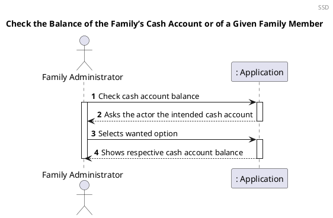
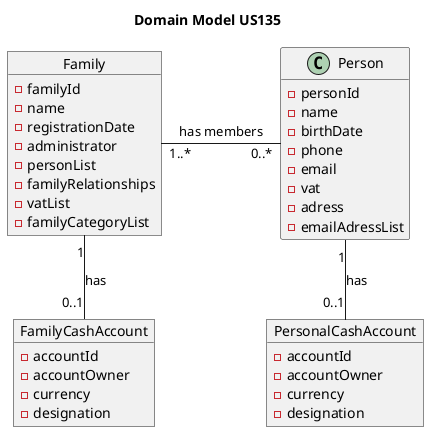
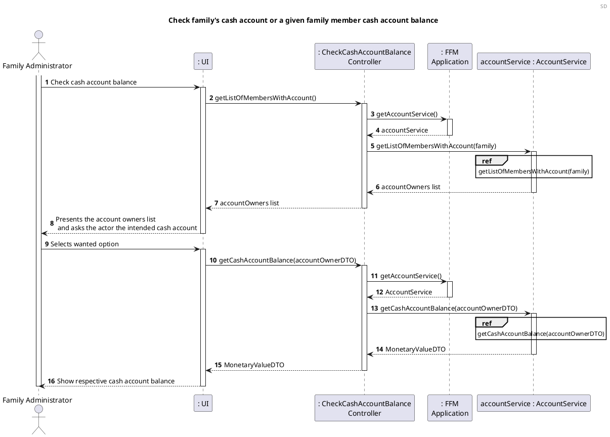
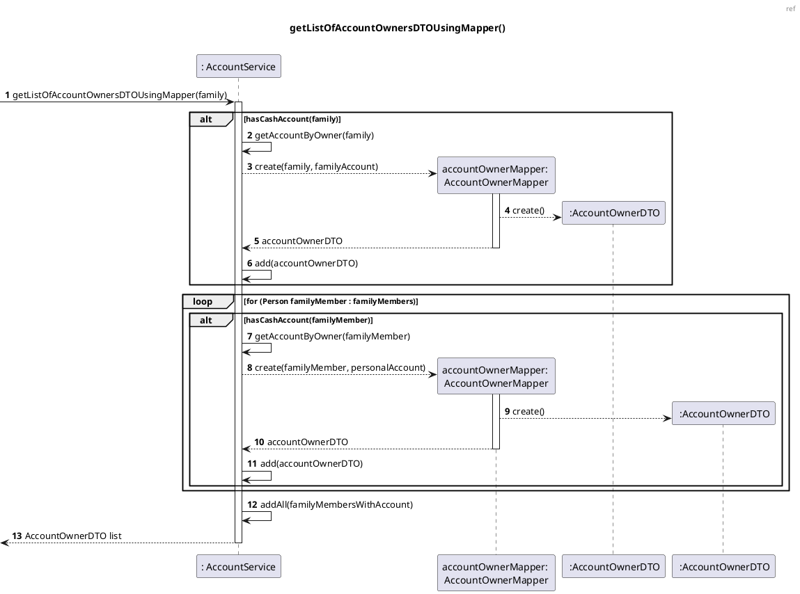
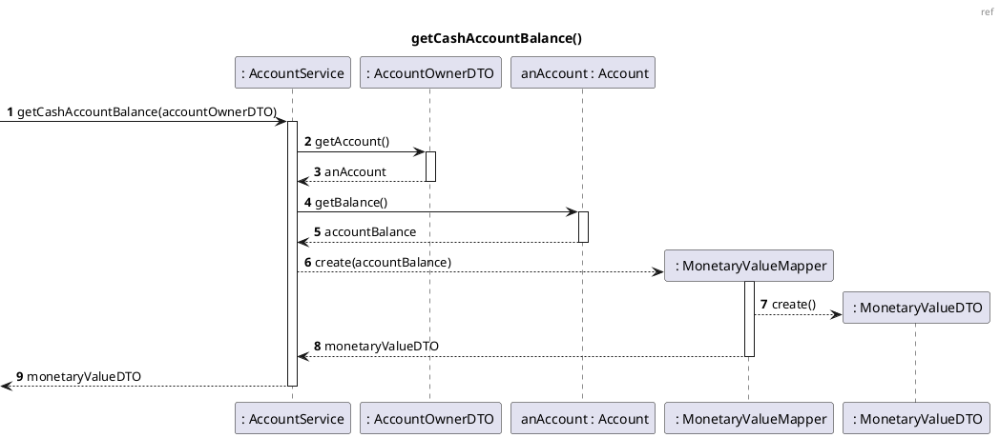
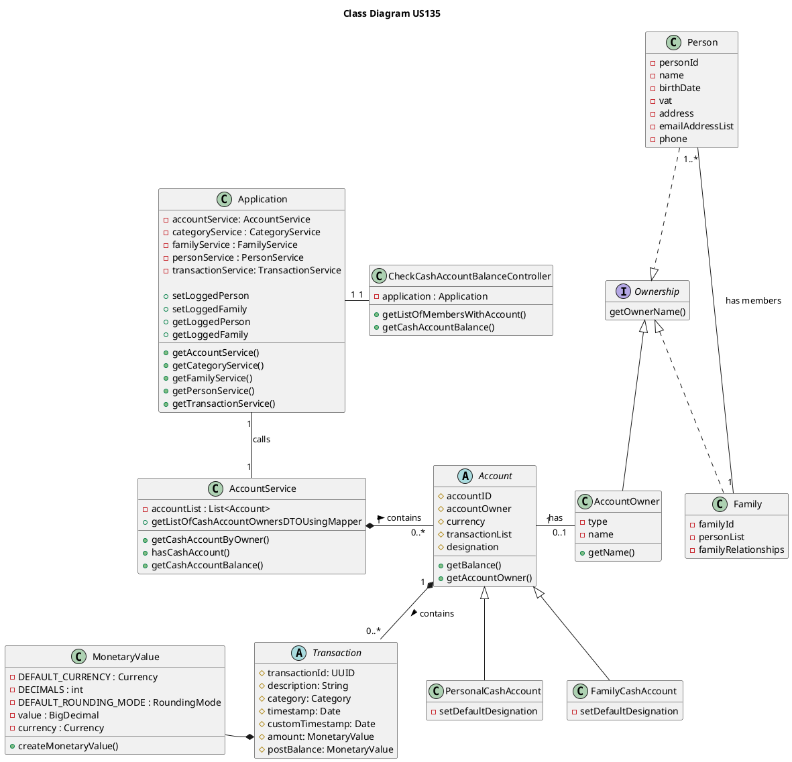

# US135 Check the Balance of the Family’s Cash Account or of a Given Family Member

# 1. Requirements

_As a family administrator, I want to check the balance of the family’s cash account or
of a given family member._

The Family Administrator wants to check either his family's cash account balance or the balance
of a given family member cash account.

## 1.1 System Sequence Diagram

The below System Sequence Diagram (SSD) captures the interaction between the
Family Administrator, and the Application when the Family Administrator wants to
either check the balance of the family's cash account
or of a given family member.



## 1.2 Dependency of other User Stories

US135 is dependent on [US120](US120_Create_Family_Cash_Account.md) and [US170](US170_Create_Personal_Cash_Account.md), 
because a family cash account or a family member and family personal cash account 
must exist in order to get the list of family members.

US135 is also dependent on [US010](US010_Create_Family.md), so the members of a family can be retrieved and displayed on a 
list.

# 2. Analysis

## Get cash account balance

When the family administrator tries to get the "cash account balance", he/she receives a list
with all members of his family who have a personal cash account
and, if the family also has a family cash account, it will also be added to 
that list.

This involves:
- Returning a list of all family members who have a personal cash account:
  - Check for each person in the List personList (in Family) the existence of an account
  with accountOwner == person;
  - If it exists, add this account to the final list;
- Check if the family administrator's family has a cash account saved in AccountService:
  - If it exists, add this account to the final list;
- Return the final cash accounts list to the user.

Upon receiving the final list, the user must select the desired account to verify
their respective balance using the getBalance (account) method.

## 2.2 Domain Model Excerpt



# 3. Design

Regarding checking the balance of a cash account, we should accommodate the requirements specified in [Analysis](#2-analysis).

The System Diagram is the following:

## 3.1. Functionality Development







## 3.2. Class Diagram

The main classes involved in the realization of this requirement/functionality were the following:

- CheckCashAccountBalanceController
- Application
- AccountService
- Family
- Person
- Account
- AccountOwner
- PersonalCashAccount
- FamilyCashAccount
- AccountOwnerMapper
- AccountOwnerDTO
- MonetaryValue

The Class Diagram is the following:



## 3.3. Applied Patterns

The applied patterns were the following:

- _Single Responsibility Principle (SRP)_ - All classes have one
  responsibility, which means, only one reason to change;
- _Controller_ - The controller receives and coordinates system operations
  connecting the UI layer to the App's logic layer;
- Information Expert - Each class was assigned responsibilities that can be
  fulfilled because they have the information needed to do so;
- _Pure Fabrication_ - This user story classes don't represent a problem
  domain concept, nevertheless they were assigned a set of responsibilities to
  support high cohesion, low coupling and reuse;
- _Low Coupling_ - Classes were assigned responsibilities so that coupling
  remains as low as possible, reducing the impact of any changes made to objects
  later on;
- _High Cohesion_ - Classes were assigned responsibilities so that cohesion
  remains high(they are strongly related and highly focused). This helps to keep
  objects understandable and manageable, and also goes hand in hand with the low
  coupling principle.

## 3.4. Tests

### 3.4.1 Unit Tests

The Unit Tests are defined below:

**Controller tests**

**Before each tests:**

```java
@BeforeEach
void beforeEach() {
    app = new Application();
    familyService = app.getFamilyService();
    personService = app.getPersonService();
    accountService = app.getAccountService();
    String testFamily = "TestFamilyName";
    family = familyService.addFamily(testFamily);
    familyId = family.getFamilyId();
    person = this.personService.addPerson("Name", "12/12/2012", "234324234", "sdgvzf@sadjf.pt", 234234234, "sdgvzf", "4800-344", "aergb", this.familyId);
    person1 = this.personService.addPerson("NameOne", "12/12/1930", "234374234", "name@sadjf.pt", 232734234, "sdgvzf", "4800-344", "aergb", this.familyId);
    initialAmount = new MonetaryValue(500);
    ctrl = new CheckCashAccountBalanceController(app);
}
```

**Test 1:** Unsuccessfully try to define a null application.

```java
@Test
void applicationNull() {
    app = null;

    assertThrows(ApplicationException.class, () -> ctrl = new CheckCashAccountBalanceController(app));
}
```

**Test 2:** Try to get the list of members with personal cash accounts where
neither the family nor its members have any cash account.

```java
@Test
void checkAccountBalance_getListOfMembersWithAccount_Null() {
    List<AccountOwnerDTO> expectedList = null;

    List<AccountOwnerDTO> result = ctrl.getListOfMembersWithAccount(family);

    assertEquals(expectedList, result);
}
```

**Test 3:** Try to get the list of members with personal cash accounts where
there is a family cash account and one personal cash account.

```java
@Test
void checkAccountBalance_getListOfMembersWithAccount_Successfully_1FCA_1PCA() {
    List<AccountOwnerDTO> expectedList = new ArrayList<>();
    CheckCashAccountBalanceController controller = new CheckCashAccountBalanceController(app);

    accountService.createFamilyCashAccount(family, new MonetaryValue(10));
    accountService.createPersonalCashAccount(person1, new MonetaryValue(10));

    Account familyAccount = accountService.getAccountByOwner(family);
    Account personalAccount = accountService.getAccountByOwner(person1);
    AccountOwnerMapper accountOwnerMapperFamily = new AccountOwnerMapper(family, familyAccount);
    AccountOwnerMapper accountOwnerMapperPerson = new AccountOwnerMapper(person1, personalAccount);

    expectedList.add(accountOwnerMapperFamily.toDTO());
    expectedList.add(accountOwnerMapperPerson.toDTO());
    List<AccountOwnerDTO> result = controller.getListOfMembersWithAccount(family);

    assertEquals(expectedList, result);
}
```

**Test 4:** Try to get the list of members with personal cash accounts where
there is a family cash account and two personal cash accounts.

```java
@Test
void checkAccountBalance_getListOfMembersWithAccount_Successfully_1FCA_2PCA() {
    List<AccountOwnerDTO> expectedList = new ArrayList();

    accountService.createFamilyCashAccount(this.family, new MonetaryValue(10));
    accountService.createPersonalCashAccount(this.person, new MonetaryValue(10));
    accountService.createPersonalCashAccount(this.person1, new MonetaryValue(200));
    Account familyAccount = accountService.getAccountByOwner(this.family);
    Account personalAccount = accountService.getAccountByOwner(this.person);
    Account personalAccount1 = accountService.getAccountByOwner(this.person1);
    AccountOwnerMapper accountOwnerMapperFamily = new AccountOwnerMapper(this.family, familyAccount);
    AccountOwnerMapper accountOwnerMapperPerson = new AccountOwnerMapper(this.person, personalAccount);
    AccountOwnerMapper accountOwnerMapperPerson1 = new AccountOwnerMapper(this.person1, personalAccount1);

    expectedList.add(accountOwnerMapperFamily.toDTO());
    expectedList.add(accountOwnerMapperPerson.toDTO());
    expectedList.add(accountOwnerMapperPerson1.toDTO());
    List<AccountOwnerDTO> result = this.ctrl.getListOfMembersWithAccount(this.family);

    Assertions.assertEquals(expectedList, result);
}
```

**Test 5:** Try to get the list of members with personal cash accounts where
there is a family cash account and no personal cash accounts.

```java
@Test
void checkAccountBalance_getListOfMembersWithAccount_Successfully_1FCA_0PCA() {
    List<AccountOwnerDTO> expectedList = new ArrayList();

    accountService.createFamilyCashAccount(this.family, new MonetaryValue(10));
    Account familyAccount = this.accountService.getAccountByOwner(family);
    AccountOwnerMapper accountOwnerMapperFamily = new AccountOwnerMapper(family, familyAccount);

    expectedList.add(accountOwnerMapperFamily.toDTO());
    List<AccountOwnerDTO> result = this.ctrl.getListOfMembersWithAccount(family);

    Assertions.assertEquals(expectedList, result);
}
```

**Test 6:** Try to get the list of members with personal cash accounts where
there is no family cash account and two personal cash accounts.

```java
@Test
void checkAccountBalance_getListOfMembersWithAccount_Successfully_0FCA_2PCA() {
    List<AccountOwnerDTO> expectedList = new ArrayList();

    accountService.createPersonalCashAccount(person, new MonetaryValue(20));
    accountService.createPersonalCashAccount(person1, new MonetaryValue(100));
    Account personalAccount = accountService.getAccountByOwner(person);
    Account personalAccount1 = accountService.getAccountByOwner(person1);
    AccountOwnerMapper accountOwnerMapperPerson = new AccountOwnerMapper(person, personalAccount);
    AccountOwnerMapper accountOwnerMapperPerson1 = new AccountOwnerMapper(person1, personalAccount1);

    expectedList.add(accountOwnerMapperPerson.toDTO());
    expectedList.add(accountOwnerMapperPerson1.toDTO());
    List<AccountOwnerDTO> result = ctrl.getListOfMembersWithAccount(family);

    Assertions.assertEquals(expectedList, result);
}
```

**Test 8:** Try to get the balance of a null account.

```java
@Test
void getCashAccountBalance_Null() {
    CheckCashAccountBalanceController controller = new CheckCashAccountBalanceController(app);
    AccountOwnerDTO accountOwnerDTO = new AccountOwnerDTO("TestFamilyName", null);

    assertThrows(NullPointerException.class, () -> controller.getCashAccountBalance(accountOwnerDTO));
}
```

**Test 9:** Try to get the balance of an existent account.

```java
@Test
void checkAccountBalanceFamilyAccount() {
    CheckCashAccountBalanceController controller = new CheckCashAccountBalanceController(app);
    accountService.createFamilyCashAccount(family, new MonetaryValue(10));
    Account familyAccount = accountService.getAccountByOwner(family);
    AccountOwnerDTO accountOwnerDTO = new AccountOwnerDTO("TestFamilyName", familyAccount);

    MonetaryValue expected = new MonetaryValue(10);
    MonetaryValue balance = controller.getCashAccountBalance(accountOwnerDTO);

    assertEquals(expected, balance);
}
```

# 4. Implementation

The biggest challenge for this US was how to decide either if we ask first to the administrator if he wanted to check the family cash account or the member and then show the list or if we already give the list with all accounts in the family, including the family cash account if exists. We choose the second option cause that way we minimize the steps for the user to reach the goal that is check one cash account balance, either family cash account or personal cash account.

# 5. Integration/Demonstration


# 6. Observations


