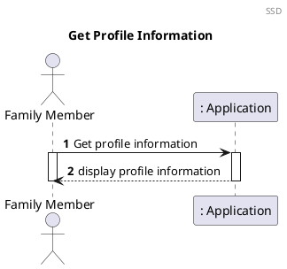
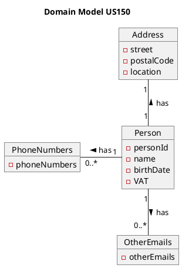
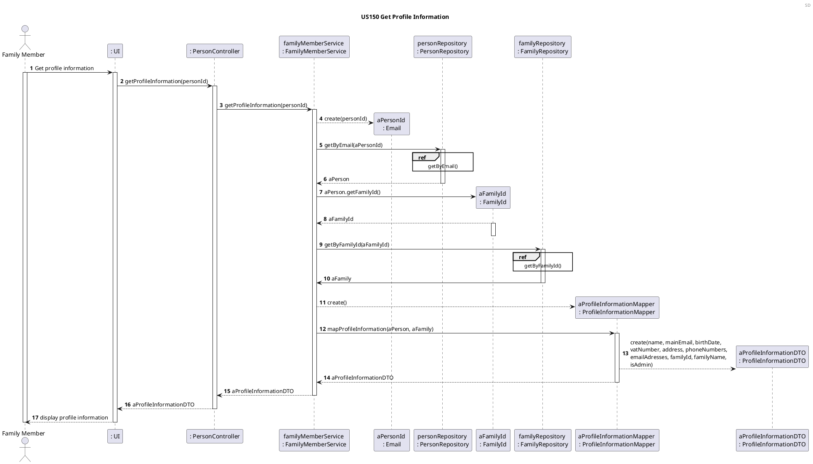
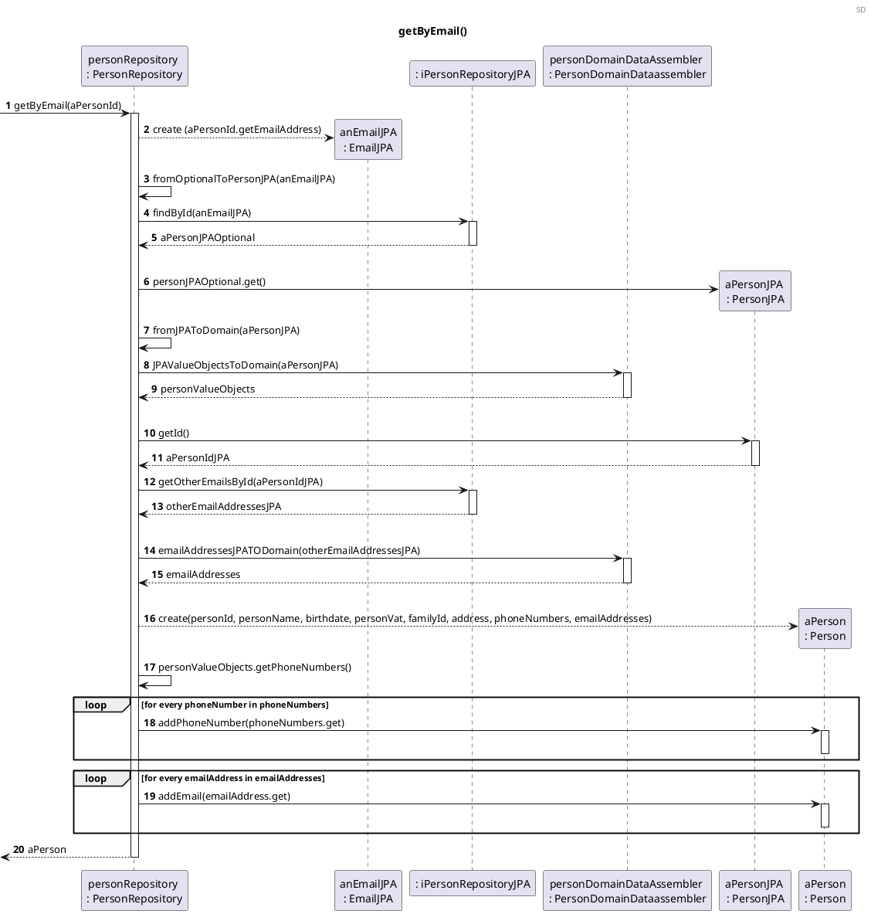
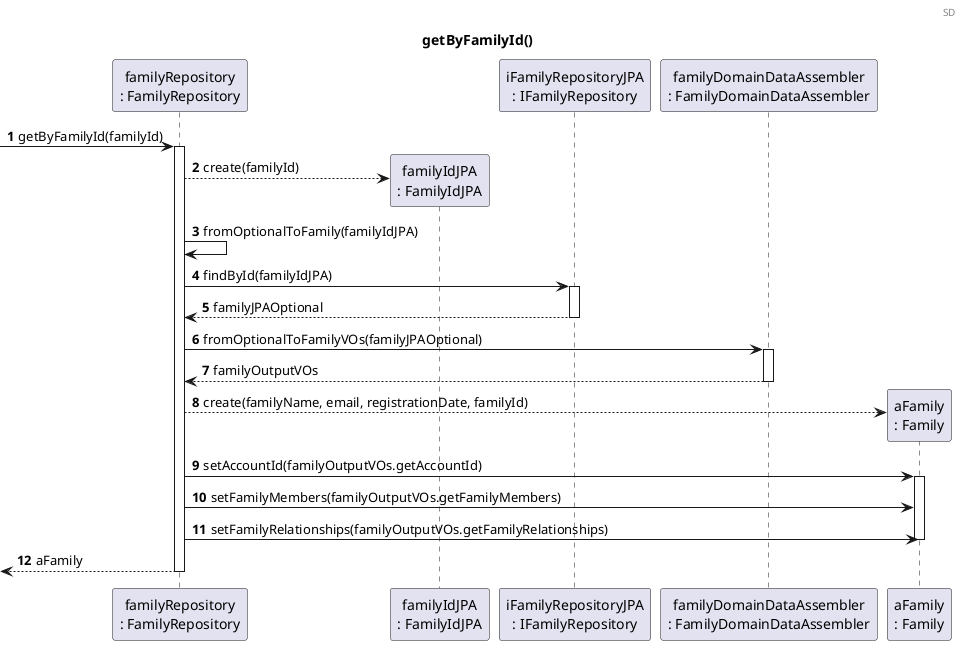
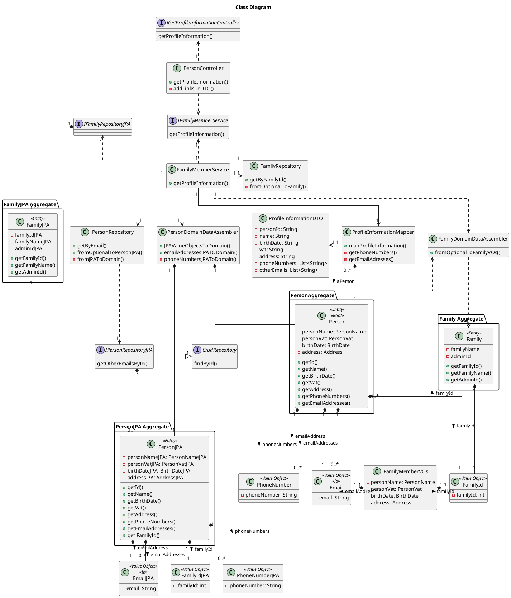
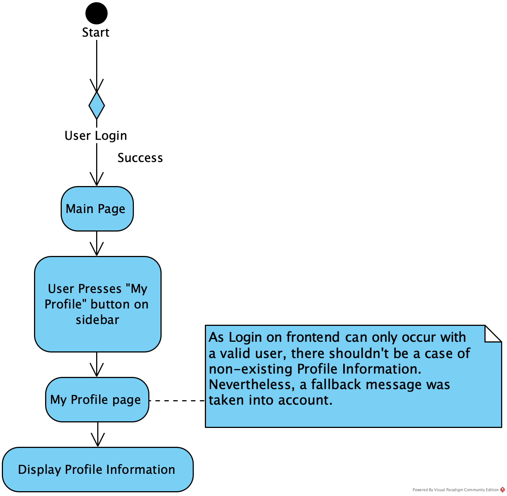
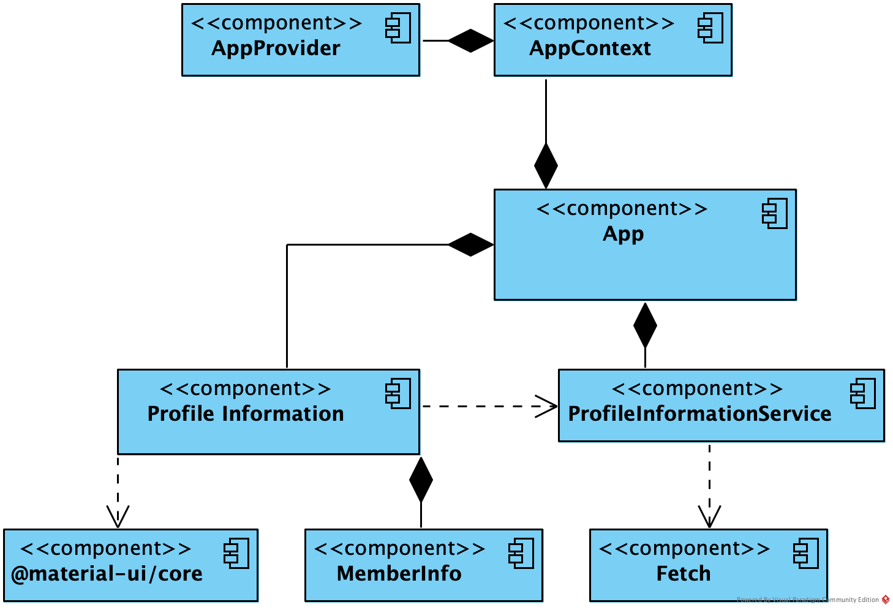

US150 Get Profile Information
=======================================

# 1. Requirements


*A person, i.e. a member of a family that is a user in the application, has a
name, unique ID (email) and VAT number, address, and birthdate. Most
persons will also have one or more telephone numbers and other email accounts.*

*As a family member, I want to get my profile's information.*

This functionality was designed to respond to the user story/requirements
above. It will allow each family member to get access to their own
profile information, which includes their name, birthdate, address, phone 
number(s), VAT number, main email address  and other email addresses.

## 1.1. System Sequence Diagram

The System Sequence Diagram below represents the communication between a Family
Member and the Application.



## 1.2. Dependency of other user stories

This user story is dependent on [US010] and [US101], because without having a
family and at least one family member, it would be impossible to have profile
information to obtain.

# 2. Analysis

According to what was presented, the profile information is obtained upon 
request from the family member, using his/her email address (that works as an identifier for the 
person).

As mentioned above, the profile information provided to the user in this sprint 
includes:

- Name
- Birthdate
- Email account
- Vat number
- Phone number(s)
- Other e-mail accounts
- Address

## 2.1. Relevant domain model excerpt

The excerpt of the Domain Model that is relevant for this user story is as
follows:



# 3. Design

## 3.1. Functionality development

The Sequence Diagram for this functionality is as follows:







## 3.2. Class Diagram

The Class Diagram for this functionality is as follows:



## 3.3. Applied Patterns

- *Single Responsibility Principle (SRP)* - All classes involved in this user
  story follow this principle and this means that they have only one and
  well-defined responsibility, which is to manage the information included
  within them.

- *Controller* - The GetProfileInformationController receives and coordinates
  system operations, as it connects the UI layer to the Application logic layer.

- *Information Expert* - Each class was assigned responsibilities that can be
  fulfilled because they have the information needed to do so.

- *Pure Fabrication* - The PersonRepository class does not represent a
  domain concept, and it was assigned a set of responsibilities to
  support high cohesion, low coupling, and increased reusability.

- *Low Coupling* - Classes were assigned responsibilities so that coupling
  remains as low as possible, reducing the impact of any changes made to objects
  later on. The implementation of PersonRepository class reduced the dependency
  level between them.

- *High Cohesion* - Classes were assigned responsibilities so that cohesion
  remains as high as possible, to keep objects understandable and manageable.
  They are strongly related and highly focused.

## 3.4. Tests

## 3.4.1 Integration tests

- **Test 1:** Ensure that it is possible to get the profile information
  successfully

```java
@Test
void getProfileInformationDTOFromTwoDifferentPersons() {
    //Arrange
    //Create family with administrator
    FamilyInputDTO familyInputDTO = new FamilyInputDTO();
    familyInputDTO.setName("David");
    familyInputDTO.setEmail("admin@gmail.com");
    familyInputDTO.setStreet("David St");
    familyInputDTO.setLocation("Porto");
    familyInputDTO.setPostCode("1234-123");
    familyInputDTO.setPhoneNumber("969999999");
    familyInputDTO.setVat("123456789");
    familyInputDTO.setBirthDate("12/01/2000");
    familyInputDTO.setFamilyName("Rodrigues");
    familyOutputDTO = familyMemberService.createFamily(familyInputDTO);

    //Create first person
    PersonInputDTO firstPersonInputDTO = new PersonInputDTO();
    String expectedNameFirstPerson = "Fabio";
    firstPersonInputDTO.setName(expectedNameFirstPerson);
    firstPersonInputDTO.setVat("227475987");
    String firstPersonEmail = "fabio@gmail.com";
    firstPersonInputDTO.setEmail(firstPersonEmail);
    firstPersonInputDTO.setPhoneNumber("917899987");
    firstPersonInputDTO.setLocation("Porto");
    firstPersonInputDTO.setStreet("Rua das Flores");
    firstPersonInputDTO.setPostCode("4444-333");
    firstPersonInputDTO.setBirthDate("09/11/1988");
    familyMemberService.addFamilyMember(firstPersonInputDTO, familyOutputDTO.getFamilyId());

    ResponseEntity<Object> firstProfileInformationDTO =
    controller.getProfileInformation("fabio@gmail.com");

    //Create second person
    PersonInputDTO secondPersonInputDTO = new PersonInputDTO();
    String expectedNameSecondPerson = "Gervasio";
    secondPersonInputDTO.setName(expectedNameSecondPerson);
    secondPersonInputDTO.setVat("227475777");
    secondPersonInputDTO.setEmail("gervasio@gmail.com");
    secondPersonInputDTO.setPhoneNumber("917899987");
    secondPersonInputDTO.setLocation("Porto");
    secondPersonInputDTO.setStreet("Rua das Flores");
    secondPersonInputDTO.setPostCode("4444-333");
    secondPersonInputDTO.setBirthDate("09/11/1988");
    familyMemberService.addFamilyMember(secondPersonInputDTO, familyOutputDTO.getFamilyId());

    ResponseEntity<Object> secondProfileInformationDTO =
    controller.getProfileInformation("gervasio@gmail.com");


    //Assert
    assertNotNull(firstProfileInformationDTO);
    assertNotNull(secondProfileInformationDTO);
    assertEquals(firstProfileInformationDTO.getStatusCode(), secondProfileInformationDTO.getStatusCode());
    assertNotSame(firstProfileInformationDTO.getBody(), secondProfileInformationDTO.getBody());
    }
```

- **Test 2:** Ensure that it is not possible to get the profile information when the user's id 
  does not exist

```java
@Test
void getProfileInformationDTOFromAnNonExistingPerson() {
    //Arrange
    ResponseEntity<Object> expectedResponse = new ResponseEntity<>("Person does not exist.",
    HttpStatus.BAD_REQUEST);
  
    //Act
    ResponseEntity<Object> result =
    controller.getProfileInformation("gervasio@hotmail.com");
  
    //Assert
    assertEquals(expectedResponse.getBody(), result.getBody());
    }
```

- **Test 3:** Ensure that the profile information obtained is the same as 
  expected

```java
@Test
void getProfileInformationDTOFromAnExistingPerson() {
    //Arrange
    //Create Family with administrator
    FamilyInputDTO familyInputDTO = new FamilyInputDTO();
    familyInputDTO.setName("David");
    familyInputDTO.setEmail("admin@gmail.com");
    familyInputDTO.setStreet("David St");
    familyInputDTO.setLocation("Porto");
    familyInputDTO.setPostCode("1234-123");
    familyInputDTO.setVat("123456789");
    familyInputDTO.setBirthDate("12/01/2000");
    familyInputDTO.setFamilyName("Maia");
    familyOutputDTO = familyMemberService.createFamily(familyInputDTO);

    //Create DTO for the expected response
    ProfileInformationDTO expectedProfileInformation = new ProfileInformationDTO();
    expectedProfileInformation.setMainEmailAddress("fabio@gmail.com");
    expectedProfileInformation.setName("Fabio");
    expectedProfileInformation.setVat("227475987");
    expectedProfileInformation.setBirthDate("09/11/1988");
    expectedProfileInformation.setAddress("Rua das Flores, Porto, 4444-333");
    expectedProfileInformation.setEmailAddresses(new ArrayList<>());
    expectedProfileInformation.setPhoneNumbers(new ArrayList<>());
    expectedProfileInformation.setFamilyId(familyOutputDTO.getFamilyId());
    expectedProfileInformation.setFamilyName("Maia");
    expectedProfileInformation.setAdmin(false);
    Email expectedId = new Email("fabio@gmail.com");
    Link familyInformationLink = linkTo(FamilyController.class).slash(familyOutputDTO.getFamilyId()).withRel("accountList");
    Link selfLink = linkTo(PersonController.class).slash(expectedId).withSelfRel();
    Link accountListLink =
    linkTo(AccountController.class).slash(expectedId).withRel("accountList");

    expectedProfileInformation.add(selfLink, familyInformationLink, accountListLink);

    ResponseEntity<Object> expectedResponse =
    new ResponseEntity<>(expectedProfileInformation, HttpStatus.OK);

    //Create DTO for the Person whose information we want to get
    PersonInputDTO personInputDTO = new PersonInputDTO();
    String actualName = "Fabio";
    personInputDTO.setName(actualName);
    personInputDTO.setVat("227475987");
    String email = "fabio@gmail.com";
    personInputDTO.setEmail(email);
    personInputDTO.setLocation("Porto");
    personInputDTO.setStreet("Rua das Flores");
    personInputDTO.setPostCode("4444-333");
    String actualBirthDate = "09/11/1988";
    personInputDTO.setBirthDate(actualBirthDate);
    AddFamilyMemberDTO actualEmail = familyMemberService.addFamilyMember(personInputDTO,
    familyOutputDTO.getFamilyId());

    //Act
    ResponseEntity<Object> actualResponse =
    controller.getProfileInformation(actualEmail.getEmail());

    //Assert
    assertNotNull(actualResponse);
    assertEquals((expectedResponse.getBody()), actualResponse.getBody());
```

## 3.4.2. Unit Tests

- **Test 1:** Ensure that the profile information obtained is the same as
  expected

```java
@Test
void getProfileInformationDTOFromAnExistingPerson() {
    //Arrange
    Link selfLink = linkTo(PersonController.class).slash("fabio@gmail.com").withSelfRel();

    Link familyInformationLink = linkTo(FamilyController.class).slash(12).withRel("accountList");

    Link accountListLink =
    linkTo(AccountController.class).slash("fabio@gmail.com").withRel("accountList");

    when(familyMemberService.getProfileInformation("fabio@gmail.com")).thenReturn(new ProfileInformationDTO("Fabio",
    "fabio@gmail.com", "09/11/1988", "227475987", "Rua das Flores Porto 4444-333",
    new ArrayList<>(), new ArrayList<>(), 12, "Maia", false).add(selfLink, familyInformationLink, accountListLink));

    //Act
    ResponseEntity<Object> profileInformationDTO =
    controller.getProfileInformation("fabio@gmail.com");

    //Assert
    assertNotNull(profileInformationDTO);
    assertEquals(HttpStatus.OK, profileInformationDTO.getStatusCode());
    }
```

- **Test 2:** Ensure that it is not possible to get the profile information when the user's id
  does not exist

```java
@Test
void getProfileInformationDTOFromAnNonExistingPerson() {
    //Arrange
    ResponseEntity<Object> expectedResponse = new ResponseEntity<>("Person does not exist.", HttpStatus.BAD_REQUEST);
    when(familyMemberService.getProfileInformation("gervasio@hotmail.com")).thenThrow(new ObjectDoesNotExistException("Person does not exist."));
  
    //Act
    ResponseEntity<Object> result = controller.getProfileInformation("gervasio@hotmail.com");
  
    //Assert
    assertEquals(expectedResponse.getStatusCode(), result.getStatusCode());
    assertEquals(expectedResponse.getBody(), result.getBody());
    }
```

- **Test 3:** Ensure that the profile information obtained from two different persons is different

```java
@Test
void getProfileInformationDTOFromTwoExistingPersons() {
    //Arrange
    String expectedFirstPersonName = "Fabio";

    when(familyMemberService.getProfileInformation("fabio@gmail.com")).thenReturn(new ProfileInformationDTO(expectedFirstPersonName,
            "fabio@gmail.com", "09/11/1988", "227475987", "Rua das Flores Porto 4444-333",
            new ArrayList<>(), new ArrayList<>(), 12, "Maia", false));

    String expectedSecondPersonName = "Gervasio";

    when(familyMemberService.getProfileInformation("gervasio@gmail.com")).thenReturn(new ProfileInformationDTO(expectedSecondPersonName,
            "gervasio@gmail.com", "09/11/1988", "227475987", "Rua das Flores Porto 4444-333",
            new ArrayList<>(), new ArrayList<>(), 11, "Silva", true));

    //Act
    ResponseEntity<Object> firstProfileInformationDTO = controller.getProfileInformation("fabio@gmail.com");
    ResponseEntity<Object> secondProfileInformationDTO =
            controller.getProfileInformation("gervasio@gmail.com");

    //Assert
    assertNotNull(firstProfileInformationDTO);
    assertNotNull(secondProfileInformationDTO);
    assertNotSame(firstProfileInformationDTO.getBody(), secondProfileInformationDTO.getBody());
    assertEquals(firstProfileInformationDTO.getStatusCode(), secondProfileInformationDTO.getStatusCode());
}
```

## 3.5. Frontend design

The Family Member goal is to review their User Profile information.

### 3.5.1. Taskflow

To accomplish this, the following taskflow was designed:



### 3.5.2. Component Tree

On the frontend implementation, the following components were created:



# 4. Implementation

The main challenges that were found while implementing this functionality were:

- The dependency of other functionalities to be ready, to be able to test the
  implementation properly;

- The novelty of having to design a functionality following the Design 
  Driven Development (DDD) concept.

To minimize these difficulties, research and study of reliable
documentation was done. There was communication with the Product Owner whenever
needed, to clarify some requirements.

So that we could present a reliable functionality, many tests were done, to
identify as many possible errors in the implementation as possible.

# 5. Integration/Demonstration

At the moment, no user stories are dependent on this one, so its integration
with other functionalities cannot be tested.

# 6. Observations

A Data Transfer Object (DTO) was implemented with the purpose of containing the
necessary data from the profile information of the Family Member.

It will be interesting in the future to enable the family member to edit their 
profile information and add other to their own profile, for example, 
information regarding account data (IBAN or account number for example). The 
functionality implemented could be a starting point for that expansion.

[us010]: US010_Create_Family_And_Set_Family_Administrator.md

[us101]: US101_Add_Family_Member.md
