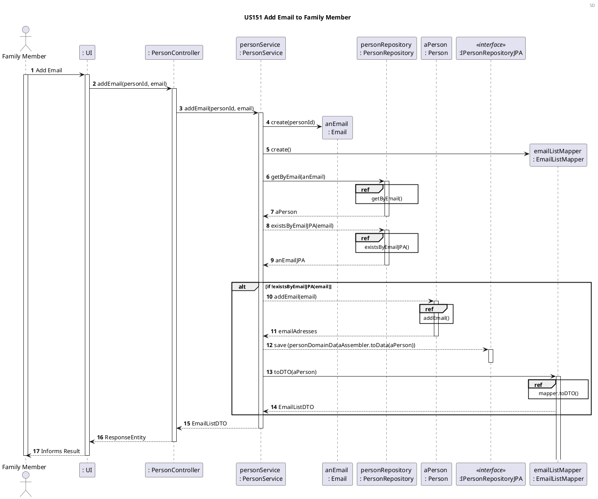
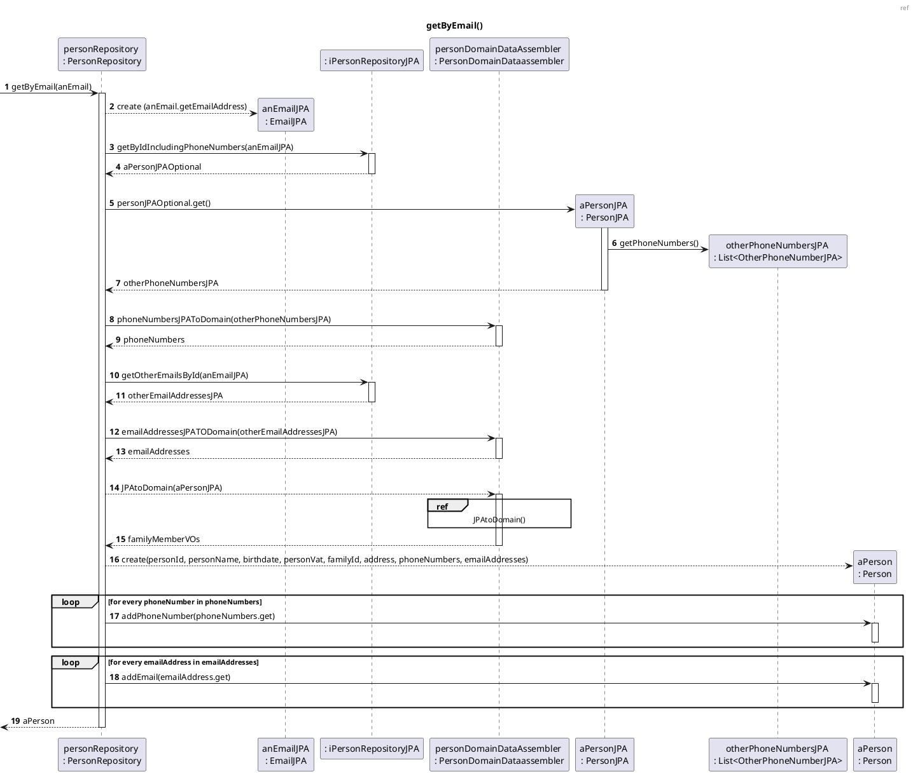
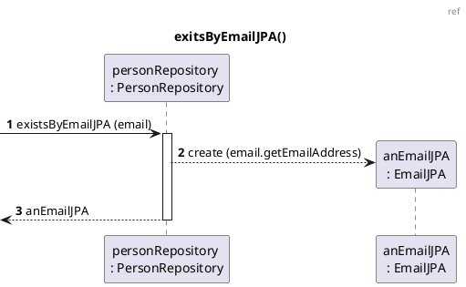
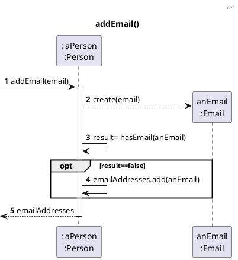
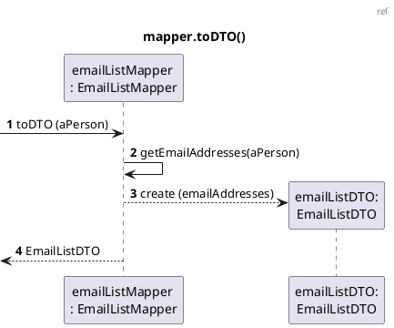
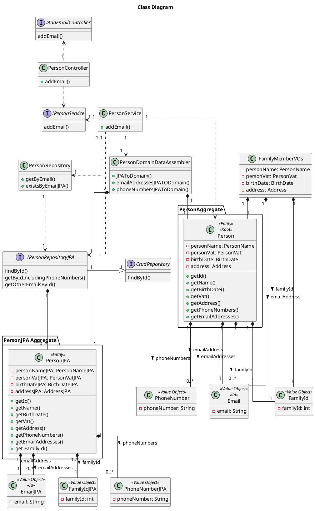

US151 Add Email Account To Family Member Profile
=======================================

# 1. Requirements

*As a family member, I want to add an email account to my profile.*

According to this requirement, the user would like to add an email to its own profile. Therefore, in
order to add the email to the user's profile, the email has to be in a valid email format and should
not exist. These criteria have to be fulfilled, otherwise the email will not be added to the Family
Member's profile.

The family member can have none or more than one email accounts:
*"Most persons will also have one or more telephone numbers and email accounts."*

## 1.1 System Sequence Diagram

The below System Sequence Diagram (SSD) captures the interaction between the Family Member and the
Application when the Family Member wants to add a new email to his profile.

````puml
@startuml
Header SSD
title Add Email Account To Family Member Profile
autonumber

actor "Family Member" as FM

FM -> ": Application" : Add new email
activate FM
activate ": Application"
": Application" --> FM: ask data
deactivate ": Application"

FM -> ": Application": inputs required data
activate ": Application"
": Application" --> FM: informs result
deactivate ": Application"
deactivate FM
@enduml
````

## 1.2 Dependency of other User Stories

This User Story has dependencies with the [US010], [US011] and [US101], since it will be necessary
to have a family with an administrator to be able to add the family members to the family, without
the family member it would not be possible to add an email to its own profile.

# 2. Analysis

## 2.1 Email Account entry

According to what was described, the email account will be added upon request from the Family
Member. The email account should be created with an alphanumeric string as its email address and
repeated emails should not exist.

The email is an instance of {Email}.

To add the email to the Family Member's profile the following attributes are required:

| Attributes   | Rules                                        |
| ------------ | -------------------------------------------- |
| email | unique, required, alphanumeric (String). <br> A regular expression (regex) will be used to validate the email format. |

## 2.2 Domain Model Excerpt

The relevant extract of the domain model is represented below:

````puml
@startuml
title Domain Model
header DM
hide methods

object Person{
- id
- name
- birthDate
- VAT
- address
}

object EmailAddressList{
-email
}

Person "1" - "0..*" EmailAddressList : has

@enduml
````

# 3. Design

## 3.1. Functionality Realization

The requirements specified in [Analysis](#2-analysis) should be taken into account when adding an
email account.

The Sequence Diagram (SD) is the following:













## 3.2. Class Diagram
The Class Diagram is the following:


## 3.3. Applied Patterns

The applied patterns were the following:

- *Single Responsibility Principle (SRP)*  - All classes have one responsibility, which means, only
  one reason to change;
- *Controller* - The controller (AddEmailController) receives and coordinates system operations
  connecting the UI layer to the App's logic layer;
- Information Expert - Each class was assigned responsibilities that can be fulfilled because they
  have the information needed to do so;
- *Pure Fabrication* - The PersonRepository class is a class that does not represent a problem
  domain concept, nevertheless it was assigned a set of responsibilities to support high cohesion,
  low coupling and reuse;
- *Creator* - Person class was assigned the responsibility to instantiate an Email, because it had
  the necessary data that would be passed on to it.
- *Low Coupling* - Classes were assigned responsibilities so that coupling remains as low as
  possible, reducing the impact of any changes made to objects later on;
- *High Cohesion* - Classes were assigned responsibilities so that cohesion remains high(they are
  strongly related and highly focused). This helps to keep objects understandable and manageable,
  and also goes hand in hand with the low coupling principle.

## 3.4. Tests

### 3.4.1 Unit Tests

The Unit Tests are defined below:

- **Unit Test 1:** Assert the creation of an email.

 ```java
  @Test
```

- **Unit Test 2:** Verify that email is not added when email is null.

 ```java
```

- **Unit Test 3:** Verify that email is not added when email has invalid format.

 ```java
```

- **Unit Test 4:** Verify that it is not possible to create an instance of the class Email with an
  empty value.

```java
```  

- **Unit Test 5:** Verify that an existing email address in the list of emails is not added.

 ```java
```

# 4. Implementation

The main challenge encountered during the implementation of this functionality was:

- The dependency on other functionalities to implement and test this functionality correctly.

In order to minimize these difficulties and to guarantee a reliable functionality, the tests were
done to cover the maximum scenarios, identifying and correcting the encountered errors.

# 5. Integration/Demonstration

At the moment, there are no User Stories dependent on the development of this User Story, therefore
its integration with other functionalities/features cannot be tested further.

# 6. Observations

[US010]: US010_Create_Family.md

[US011]: US011_Add_Family_Administrator.md

[US101]: US101_Add_Family_Member.md