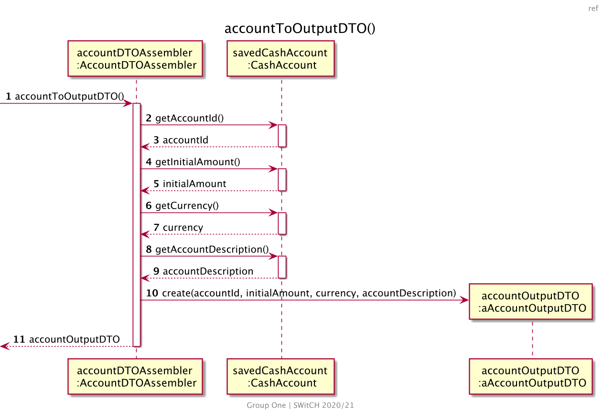

US170 Create a personal cash account
=======================================

# 1. Requirements

*As a family member, I want to create a personal cash account.*

According to this requirement, the user would like to create a personal cash account. Therefore, the
required input information is:

- The person to which the account will belong;
- The initial amount that the account is going to have;
- The currency of the account;
- The description of the account.

## 1.1 System Sequence Diagram

The below System Sequence Diagram (SSD) captures the interaction between the Family Member and the
Application when the Family Member wants to create a personal cash account.


<!-- -->

## 1.2 Dependency of other User Stories

This User Story has dependencies with the [US101], since it will be necessary to have a member, to
create a personal cash account.

# 2. Analysis

## 2.1 Cash Account entry

According to what was presented, a personal cash account is created upon request from the Family
Member.

A personal cash account instance should have the following attributes:

  | Attributes            | Rules                                        |
  | ----------            | -------------------------------------------- |
  | accountId             | Unique, required                             |
  | initialAmountValue    | Required                                     |
  | accountDescription    | Required                                     |        


## 2.2 Domain Model Excerpt

The relevant extract of the domain model is represented below:


<!-- -->

# 3. Design

## 3.1. Functionality Development

Regarding the creation of a personal cash account, we should accommodate the requirements specified
in [Analysis](#2-analysis).

The System Diagram is the following:


<!-- -->


<!-- -->


<!-- -->


<!-- -->


<!-- -->

## 3.2. Class Diagram

The Class Diagram is the following:


## 3.3. Applied Patterns

The applied patterns were the following:

- *Single Responsibility Principle (SRP)*  - All classes have one responsibility, which means, only
  one reason to change;
- *Controller* - The controller (CreatePersonalCashAccountController) receives and coordinates
  system operations connecting the UI layer to the App's logic layer;
- Information Expert - Each class was assigned responsibilities that can be fulfilled because they
  have the information needed to do so;
- *Pure Fabrication* - The AccountService class is a class that does not represent a problem domain
  concept, nevertheless it was assigned a set of responsibilities to support high cohesion, low
  coupling and reuse;
- *Low Coupling* - Classes were assigned responsibilities so that coupling remains as low as
  possible, reducing the impact of any changes made to objects later on;
- *High Cohesion* - Classes were assigned responsibilities so that cohesion remains high(they are
  strongly related and highly focused). This helps to keep objects understandable and manageable,
  and also goes hand in hand with the low coupling principle.

## 3.4. Tests

### 3.4.1 Unit Tests

The Unit Tests are defined below:

**Test 1:** Create a Personal Cash Account Successfully

```java
 @Test
    void ensurePersonalCashAccountIsCreatedSuccessfully() {
            //arrange
            String description = "Personal cash account.";
            double initialAmount = 30;
            int currency = 1;
            AccountInputDTO inputDTO = new AccountInputDTO(initialAmount, currency, description);
            String personId = "joaobonifacio@hotmail.com";

            long accountId = 10;
            Currency outputCurrency = Currency.EUR;
            AccountOutputDTO accountOutputDTO = new AccountOutputDTO(accountId, initialAmount, outputCurrency.name(), description);
            when(personalAccountService.createPersonalCashAccount(inputDTO,personId)).thenReturn(accountOutputDTO);

            HttpStatus expectedStatus = HttpStatus.CREATED;

            //act
            ResponseEntity<Object> result = cashAccountController.createPersonalCashAccount(inputDTO, personId);

        //assert
        assertNotNull(result);
        assertNotNull(result.getBody());
        assertEquals(expectedStatus, result.getStatusCode());
        }
```    

**Test 2:** Ensure Person Can Have More Than One Personal Cash Account

```java
@Test
    void ensurePersonCanHaveMoreThanOnePersonalCashAccount() {
            //arrange
            double initialAmount = 30;
            int currency = 1;
            int otherCurrency = 2;
            String personId = "joaobonifacio@hotmail.com";
            HttpStatus expectedStatus = HttpStatus.CREATED;

            //first personal cash account
            String description = "Personal cash account.";
            AccountInputDTO inputDTO = new AccountInputDTO(initialAmount, currency, description);
            long accountId = 10;
            Currency outputCurrency = Currency.EUR;
            AccountOutputDTO accountOutputDTO = new AccountOutputDTO(accountId, initialAmount, outputCurrency.name(), description);

            when(personalAccountService.createPersonalCashAccount(inputDTO,personId)).thenReturn(accountOutputDTO);
            cashAccountController.createPersonalCashAccount(inputDTO, personId);

            //second personal cash account
            String otherAccountDescription = "Personal american cash account.";
            AccountInputDTO inputDTOOtherAccount = new AccountInputDTO(initialAmount, otherCurrency, otherAccountDescription);
            long otherAccountId = 11;
            Currency otherOutputCurrency  = Currency.USD;
            AccountOutputDTO otherAccountOutputDTO = new AccountOutputDTO(otherAccountId, initialAmount, otherOutputCurrency.name(), otherAccountDescription);

            when(personalAccountService.createPersonalCashAccount(inputDTOOtherAccount,personId)).thenReturn(otherAccountOutputDTO);

            //act
            ResponseEntity<Object> result = cashAccountController.createPersonalCashAccount(inputDTOOtherAccount, personId);

        //assert
        assertNotNull(result);
        assertNotNull(result.getBody());
        assertEquals(expectedStatus, result.getStatusCode());
        }
```

**Test 3:** Fail to create a Personal Cash Account When the Initial Amount is not valid

```java
 @Test
    void ensurePersonalCashAccountNotCreatedWithInvalidAmount() {
            //arrange
            String expectedMessage = "The initial cash amount cannot be negative.";
            String description = "Personal cash account.";
            double initialAmount = -30;
            int currency = 1;
            String personId = "joaobonifacio@hotmail.com";
            AccountInputDTO inputDTO = new AccountInputDTO(initialAmount, currency, description);
            HttpStatus expectedStatus = HttpStatus.BAD_REQUEST;

            when(personalAccountService.createPersonalCashAccount(inputDTO,personId)).thenThrow(new InvalidAmountException("The initial cash amount cannot be negative."));


            //act
            ResponseEntity<Object> result = cashAccountController.createPersonalCashAccount(inputDTO, personId);

        //assert
        assertNotNull(result);
        assertNotNull(result.getBody());
        assertEquals(expectedMessage, result.getBody().toString());
        assertEquals(expectedStatus, result.getStatusCode());
        }
``` 

**Test 4:** Fail to create a personal cash account when the description is not valid

```java
@ParameterizedTest
@NullAndEmptySource
    void ensurePersonalCashAccountNotCreatedWithInvalidDescription(String candidate) {
            //arrange
            String expectedMessage = "Invalid description.";
            double initialAmount = 20;
            int currency = 1;
            String personId = "joaobonifacio@hotmail.com";
            HttpStatus expectedStatus = HttpStatus.BAD_REQUEST;

            AccountInputDTO inputDTO = new AccountInputDTO(initialAmount, currency, candidate);
            when(personalAccountService.createPersonalCashAccount(inputDTO,personId)).thenThrow(new InvalidAmountException("Invalid description."));

            //act
            ResponseEntity<Object> result = cashAccountController.createPersonalCashAccount(inputDTO, personId);

        //assert
        assertNotNull(result);
        assertNotNull(result.getBody());
        assertEquals(expectedMessage, result.getBody().toString());
        assertEquals(expectedStatus, result.getStatusCode());
        }
```

**Test 5:** Fail to create a personal cash account when the person does not exist 

```java
@Test
    void ensurePersonalCashAccountNotCreatedWhenPersonDoesNotExist() {
            //arrange
            String expectedMessage = "Person does not exist.";
            String description = "Personal cash account.";
            double initialAmount = 30;
            int currency = 1;
            String personId = "roberto_carlos@gmail.com";
            HttpStatus expectedStatus = HttpStatus.BAD_REQUEST;

            AccountInputDTO inputDTO = new AccountInputDTO(initialAmount, currency, description);
            when(personalAccountService.createPersonalCashAccount(inputDTO,personId)).thenThrow(new ObjectDoesNotExistException("Person does not exist."));

            //act
            ResponseEntity<Object> result = cashAccountController.createPersonalCashAccount(inputDTO, personId);

        //assert
        assertNotNull(result);
        assertNotNull(result.getBody());
        assertEquals(expectedMessage, result.getBody().toString());
        assertEquals(expectedStatus, result.getStatusCode());
        }
```

### 3.4.1 Integration Tests


**Test 1:** Create a Personal Cash Account Successfully

```java
 @Test
    void ensurePersonalCashAccountIsCreatedSuccessfully() {
            //arrange
            String description = "Personal cash account.";
            double initialAmount = 30;
            int currency = 1;
            AccountInputDTO inputDTO = new AccountInputDTO(initialAmount, currency, description);
            String personId = familyOutputDTO.getAdminId();
            HttpStatus expectedStatus = HttpStatus.CREATED;

            //act
            ResponseEntity<Object> result = cashAccountController.createPersonalCashAccount(inputDTO, personId);

        //assert
        assertNotNull(result);
        assertNotNull(result.getBody());
        assertEquals(expectedStatus, result.getStatusCode());
        }
```    

**Test 2:** Ensure Person Can Have More Than One Personal Cash Account

```java
@Test
    void ensurePersonCanHaveMoreThanOnePersonalCashAccount() {
            //arrange
            double initialAmount = 30;
            int currency = 1;
            String personId = familyOutputDTO.getAdminId();

            //first personal cash account
            String description = "Personal cash account.";
            AccountInputDTO inputDTO = new AccountInputDTO(initialAmount, currency, description);

            //second personal cash account
            int otherCurrency = 2;
            String otherAccountDescription = "Personal american cash account.";
            AccountInputDTO inputDTOOtherAccount = new AccountInputDTO(initialAmount, otherCurrency, otherAccountDescription);

            HttpStatus expectedStatus = HttpStatus.CREATED;

            //act
            cashAccountController.createPersonalCashAccount(inputDTO, personId);
            ResponseEntity<Object> result = cashAccountController.createPersonalCashAccount(inputDTOOtherAccount, personId);

        //assert
        assertNotNull(result);
        assertNotNull(result.getBody());
        assertEquals(expectedStatus, result.getStatusCode());
        }
```

**Test 3:** Fail to create a Personal Cash Account When the Initial Amount is not valid

```java
@Test
    void ensurePersonalCashAccountNotCreatedWithInvalidAmount() {
            //arrange
            String expectedMessage = "The initial cash amount cannot be negative.";
            String description = "Personal cash account.";
            double initialAmount = -30;
            int currency = 1;
            String personId = familyOutputDTO.getAdminId();
            AccountInputDTO inputDTO = new AccountInputDTO(initialAmount, currency, description);
            HttpStatus expectedStatus = HttpStatus.BAD_REQUEST;

            //act
            ResponseEntity<Object> result = cashAccountController.createPersonalCashAccount(inputDTO, personId);

        //assert
        assertNotNull(result);
        assertNotNull(result.getBody());
        assertEquals(expectedMessage, result.getBody().toString());
        assertEquals(expectedStatus, result.getStatusCode());
        }
``` 

**Test 4:** Fail to create a personal cash account when the description is not valid

```java
@ParameterizedTest
@NullAndEmptySource
    void ensurePersonalCashAccountNotCreatedWithInvalidDescription(String candidate) {
            //arrange
            String expectedMessage = "Invalid description.";
            double initialAmount = 20;
            int currency = 1;
            String personId = familyOutputDTO.getAdminId();
            HttpStatus expectedStatus = HttpStatus.BAD_REQUEST;

            AccountInputDTO inputDTO = new AccountInputDTO(initialAmount, currency, candidate);

            //act
            ResponseEntity<Object> result = cashAccountController.createPersonalCashAccount(inputDTO, personId);

        //assert
        assertNotNull(result);
        assertNotNull(result.getBody());
        assertEquals(expectedMessage, result.getBody().toString());
        assertEquals(expectedStatus, result.getStatusCode());
        }
```

**Test 5:** Fail to create a personal cash account when the person does not exist

```java
@Test
    void ensurePersonalCashAccountNotCreatedWhenPersonDoesNotExist() {
            //arrange
            String expectedMessage = "Person does not exist.";
            String description = "Personal cash account.";
            double initialAmount = 30;
            int currency = 1;
            String personId = "roberto_carlos@gmail.com";
            HttpStatus expectedStatus = HttpStatus.BAD_REQUEST;

            AccountInputDTO inputDTO = new AccountInputDTO(initialAmount, currency, description);

            //act
            ResponseEntity<Object> result = cashAccountController.createPersonalCashAccount(inputDTO, personId);

        //assert
        assertNotNull(result);
        assertNotNull(result.getBody());
        assertEquals(expectedMessage, result.getBody().toString());
        assertEquals(expectedStatus, result.getStatusCode());
        }
```


# 4. Implementation

# 5. Integration/Demonstration

This User Story will be necessary for US180, US135, US181, US185, without it, a payment, a transfer or checking the balance will not be possible. When testing the functionality developed for , this functionality will also be indirectly tested.

At the moment, no other user stories are dependent on this one, so its integration with other functionalities cannot be tested further.

# 6. Observations

[US101]: US101_Add_Family_Member.md