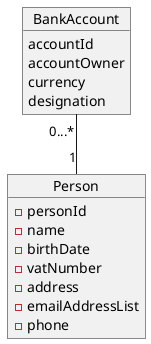
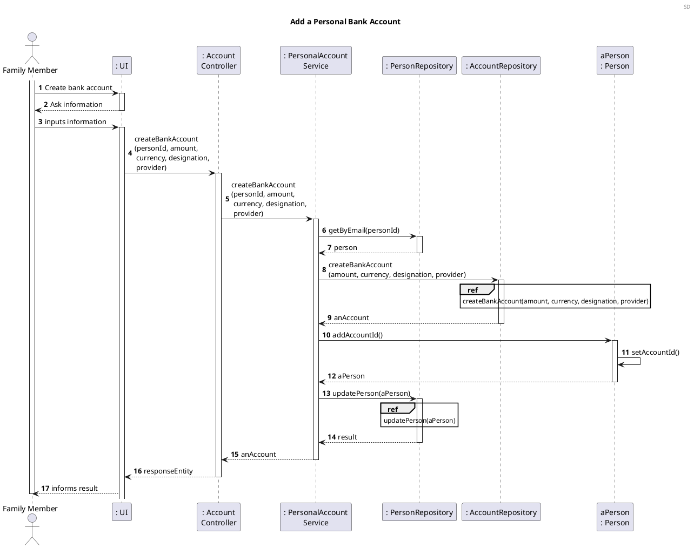
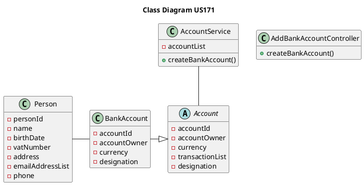

US171 Add a personal bank account
=======================================

# 1. Requirements

*US171 As a family member, I want to add a bank account I have.*

A family member wants to register a personal bank account in the app. According to 
the project requirements, the main points for designing this user story are:

- A bank account is a personal debit account managed by a Bank that exists 
  outside the App;
- A family member can have none or more than one bank accounts associated in 
  the App;
- The initial amount for the bank account balance in the App is set by the user 
  (inputs an approximated value) and later the balance can be imported from 
  financial services providers;
- The balance can be negative.

## 1.1 System Sequence Diagram

````puml
@startuml
Header SSD
autonumber

title Create a personal bank account
actor "Family Member" as FM
participant ": Application" as App

FM -> App : Create bank account
activate FM

activate App
App --> FM : ask information
deactivate App

FM -> App : inputs information
activate App
App --> FM: informs sucess
deactivate App
deactivate FM

@enduml
````

## 1.2. Dependencies

This US171 is dependent on creating an abstract class 
representing a general Account, where the bank, credit, savings and credit 
accounts (subclasses) will inherit its attributes and methods.

# 2. Analysis

## 2.1 Bank Account

A personal bank account derives from the abstract class Account and has the 
following attributes:

| Attributes  | Rules                                        |
| ----------  | -------------------------------------------- |
| accountId   | Unique, required, integer, auto-incrementing |
| amount      | Required, integer                            |
| designation | Required, String                             |

The strategy consists in creating a Bank Account for the family member, using 
the information obtained by the user login (person id) and the information 
regarding the account and then adding it to account data base and associating the account id to the family member.

## 2.2 Domain Model Excerpt



# 3. Design

## 3.1. Functionality Development

The Sequence Diagram for this user story:




## 3.2. Class Diagram



## 3.3. Applied Patterns

- Single Responsibility Principle - All classes have only one and well-defined 
  responsibility.


- Creator - AccountService class has the responsibility to instantiate a 
  BankAccount.
  

- Controller - A controller (CreateBankAccountController) receives and coordinates system operations connecting the UI layer to the App's logic layer.


- Information Expert - The flow of this process is entirely made following this principle: for a particular
  responsibility, it is determined the information needed to fulfill it and where that information is stored.
  
  
- Pure Fabrication - Services classes represent a concept outside the problem's domain, but they have set of responsibilities designed to achieve low coupling, high cohesion and the potential for reuse.


- Low Coupling - Dependencies between classes are at their lowest point possible. The use of Services classes reduced the dependency level between them.


- High Cohesion - Due to low coupling, the responsibilities of each class are highly focused, therefore cohesion's high.


## 3.4. Tests

### 3.4.1 Unit Tests

The Unit Tests are defined below:

- **Test 1:** Create a bank account successfully

(AddBankAccountControllerTest)
```java
@Test
    void createBankAccountSuccessfullyForOnePerson_controllerTest() {
            String description = "A minha conta do Banco X.";

            AddBankAccountController controller = new AddBankAccountController(app);
            boolean result = controller.createBankAccount(initialAmount, currency, description);

            assertTrue(result);
            }
```
- **Test 2:** Create a second bank account for the same person

(AddBankAccountControllerTest)
```java
@Test
    void createTwoBankAccountsSuccessfullyForTheSamePerson_controllerTest() {
            String description1 = "A minha conta do Banco X.";
            String description2 = "A minha conta do Banco Y.";

            AddBankAccountController controller = new AddBankAccountController(app);
            boolean result_firstAccount = controller.createBankAccount(initialAmount, currency, description1);
            boolean result_secondAccount = controller.createBankAccount(initialAmount, currency, description2);

            assertTrue(result_firstAccount);
            assertTrue(result_secondAccount);
            }
```
- **Test 3:** Create a bank account with negative balance
  
(BankAccountTest)

```java
@Test
    void createBankAccountSuccessfullyWithNegativeBalance() {
            Double amount = -50.0;
            String currency = "EUR";
            String designation = "Conta do banco X.";
            MonetaryValue expectedBalance = MonetaryValue.createMonetaryValue(currency, amount);

            BankAccount bankAccount = new BankAccount(owner, amount, currency, designation);

            assertNotNull(bankAccount);
            assertEquals(expectedBalance, bankAccount.getBalance());
            }
```
- **Test 4:** Fail to create a bank account for a null person

(AddBankAccountControllerTest)

```java
@Test
    void failToCreateBankAccountForANullPerson_controllerTest() {
            String description = "A minha conta do Banco X.";
            app.setLoggedPerson(null);

            AddBankAccountController controller = new AddBankAccountController(app);
            boolean result = controller.createBankAccount(initialAmount, currency, description);

            assertFalse(result);
            }
```

- **Test 5:** Fail to create a bank account with wrong currency

(BankAccountTest)

```java
@Test
    void failToCreateBankAccountSuccessfullyWithWrongCurrency() {
            Double amount = 20.0;
            String currency = "EUT";
            String designation = "Conta do banco X.";

            assertThrows(InvalidCurrencyException.class, () -> new BankAccount(owner, amount, currency, designation));
        }
```

# 4. Implementation

No major challenges were observed.

# 5. Integration/Demonstration

The subclass BankAccount will implement Interfaces Payable and Transferable to 
allow future functionalities.

# 6. Observations
//
