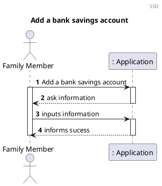
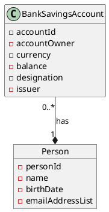
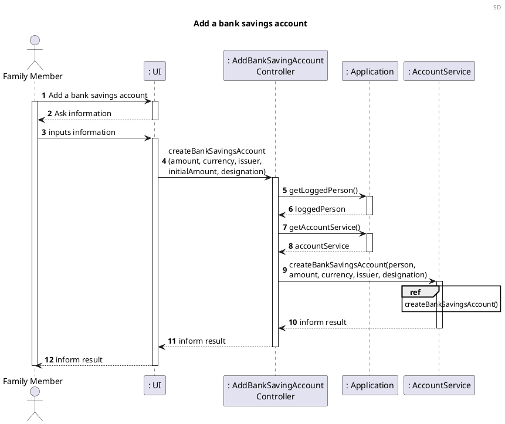
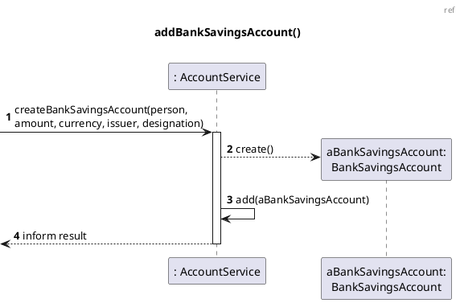
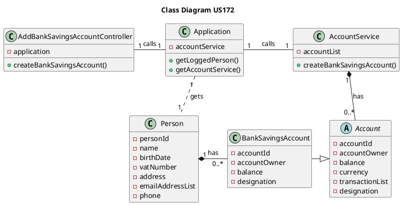

# US172 Add a bank savings account

# 1. Requirements

_US172 As a family member, I want to add a bank savings account I have._

A family member wants to register a bank savings account in the app. According to
the project requirements, the main points for designing this user story are:

- To add the account we first need to know some information like the amount, issuer, currency and designation if intended.
- After that we just need the validation for the input data and to create the account.

## 1.1 System Sequence Diagram



# 2. Analysis

## 2.1 Bank Savings Account

A bank savings account derives from the abstract class Account, so it inherits
the following attributes:

| Attributes   | Rules                                        |
| ------------ | -------------------------------------------- |
| accountId    | Required, UUID                               |
| accountOwner | Required, AccountOwner                       |
| currency     | Currency                                     |
| transactionList | List<Transaction>                         |
| designation  | String                                       |

Apart from these, the bank savings account has some specific attributes:


| Attributes   | Rules                                        |
| ------------ | -------------------------------------------- |
| issuer       | Optional, String                             |
| amount      | Required, double                     |
| currency    | Required, currency                         |
| designation | Optional, String                         |

## 2.2 Domain Model Excerpt



  
# 3. Design

## 3.1. Functionality Development

The Sequence Diagram for this user story:





## 3.2. Class Diagram



## 3.3. Applied Patterns

The applied patterns were the following:

- *Single Responsibility Principle (SRP)*  - All classes have one
  responsibility, which means, only one reason to change;
- *Controller* - The controller (AddBankSavingsAccountController) receives and coordinates
  system operations connecting the UI layer to the App's logic layer;
- *Information Expert* - Each class was assigned responsibilities that can be
  fulfilled because they have the information needed to do so;
- *Pure Fabrication* - The AccountService class is a class that does not
  represent a problem domain concept, nevertheless it was assigned a set of
  responsibilities to support high cohesion, low coupling and reuse;
- *Low Coupling* - Classes were assigned responsibilities so that coupling
  remains as low as possible, reducing the impact of any changes made to objects
  later on;
- *High Cohesion* - Classes were assigned responsibilities so that cohesion
  remains high(they are strongly related and highly focused). This helps to keep
  objects understandable and manageable, and also goes hand in hand with the low
  coupling principle.

## 3.4. Tests

### 3.4.1 Unit Tests

The Unit Tests are defined below:

**Test 1:** Create a bank savings account successfully

```java
@Test
    void createBankSavingsAccountSuccessfully() {
        Double amount = 100.0;
        String currency = "EUR";
        String issuer = "Bank";
        String designation = "";
        CreateBankSavingsAccountController createBankSavingsAccountController = new CreateBankSavingsAccountController(app);;

        boolean result = createBankSavingsAccountController.createBankSavingsAccount(amount,currency,issuer, designation);

        assertTrue(result);
    }
```


**Test 2:** Try to create a bank savings account with negative balance

```java
@Test
    void createBankSavingsAccountWithInvalidBalance() {
        Double amount = -100.0;
        String currency = "EUR";
        String issuer = "Bank";
        String designation = "";
        CreateBankSavingsAccountController createBankSavingsAccountController = new CreateBankSavingsAccountController(app);

        boolean result = createBankSavingsAccountController.createBankSavingsAccount(amount,currency,issuer, designation);

        assertFalse(result);
    }
```

**Test 1:** Create a bank savings account with no person

```java
@Test
    void createBankSavingsAccountWithNullPerson() {
            Double amount = 100.0;
            String currency = "EUR";
            String issuer = "Bank";
            String designation = "";
            CreateBankSavingsAccountController createBankSavingsAccountController = new CreateBankSavingsAccountController(app);
            app.setLoggedPerson(null);

            boolean result = createBankSavingsAccountController.createBankSavingsAccount(amount,currency,issuer, designation);

            assertFalse(result);
            }
```


# 4. Implementation

The biggest challenge for this US was to decide how to create the Bank Savings Account. We already had the abstract 
class account implemented with some methods related to the payment of services that didn't make sense to implement at a bank savings account. So we decided to keep the abstract class and implement two different interfaces: one for the transfers and another for payments. This way each different account class can implement the interface that suits better for its purpose.

# 5. Integration/Demonstration


# 6. Observations
