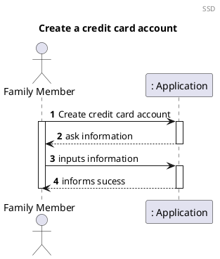
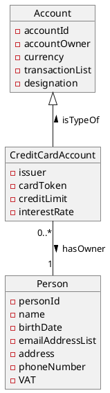
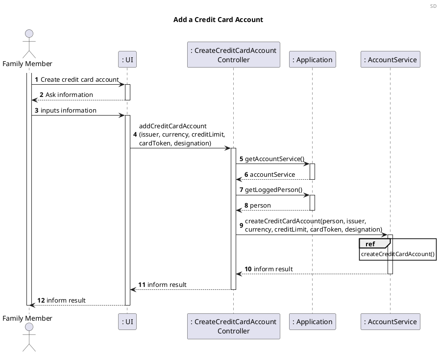
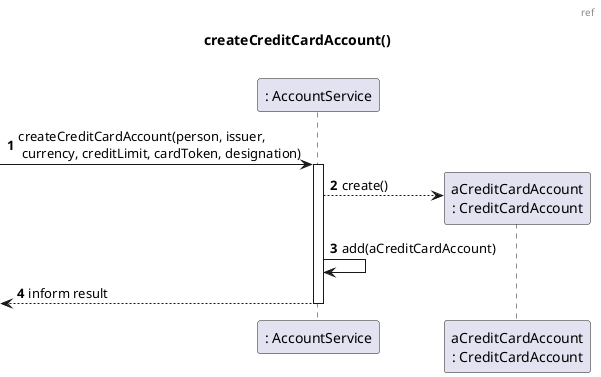
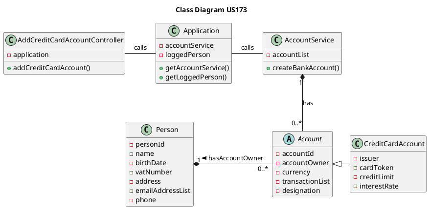

# US173 Add a credit card account

# 1. Requirements

_US173 As a family member, I want to add a credit card account I have._

A family member wants to register a credit card account in the app. According to
the project requirements, the main points for designing this user story are:

- A credit card account is a payment card issued to its owner enabling them to
  pay for goods and services based on the owner's promise to the card issuer to
  pay them for the amounts plus the other agreed charges.
    - Usually there's a revolving account created by a financial institution to
      enable the owner to incur in debt, which is charged to the account, and in
      which the borrower does not have to pay the outstanding balance on that
      account in full every month. The borrower may be required to make a
      minimum payment, based on the balance amount, but normally the borrower
      may pay any amount between the minimum amount required and the full
      balance.
    - If the balance is not paid in full by the end of a monthly billing period,
      the remaining balance will roll over or "revolve" into the next month.
      Interest will be charged on that amount and added to the balance.
- A family member can have none, one or more bank accounts associated in the
  App;
- The credit limit for the account in the App is set by the user
  (inputs a value);
- The balance cannot be negative.

## 1.1 System Sequence Diagram



# 2. Analysis

## 2.1 Credit Card Account

A credit card account derives from the abstract class Account, so it inherits
the following attributes:

| Attributes   | Rules                                        |
| ------------ | -------------------------------------------- |
| accountId    | Required, UUID                               |
| accountOwner | Required, AccountOwner                       |
| currency     | Currency                                     |
| transactionList | List<Transaction>                         |
| designation  | String                                       |

Apart from these, the credit card account has some specific attributes:

| Attributes   | Rules                                        |
| ------------ | -------------------------------------------- |
| issuer       | Optional, String                             |
| creditLimit  | Required, MonetaryValue                      |
| cardToken    | Required, integer, last 4 digits of the card |
| interestRate | Optional, BigDecimal                         |

## 2.2 Domain Model Excerpt



# 3. Design

## 3.1. Functionality Development

The Sequence Diagram for this user story:





## 3.2. Class Diagram



## 3.3. Applied Patterns

## 3.4. Tests

### 3.4.1 Unit Tests

The Unit Tests are defined below:

#### Positive Test Cases:

**Test 1:** Create a credit card account successfully

```java
    @Test
    void createCreditCardAccountSuccessfully(){
        Person person = new Person("Name","12/12/2012","234324534",234235234,"sdgvzf","4800-344","aergb");
        AccountOwner<Person> personAccountOwner = new AccountOwner<>(person);
        String issuer = "SWitCH Bank";
        double limit = 1000;
        String currency = "EUR";
        String cardToken = "1234";
        String designation = null;

        CreditCardAccount creditCardAccount = new CreditCardAccount(personAccountOwner,issuer,currency,limit,cardToken,designation);

        assertNotNull(creditCardAccount);
    }
```

**Test 2:** Create a second credit card account for the same person

```java
    @Test
    void createTwoCreditCardAccountSuccessfully(){
        Person person = new Person("Name","12/12/2012","234324534",234235234,"sdgvzf","4800-344","aergb");
        AccountOwner<Person> personAccountOwner=new AccountOwner<>(person);
        Person person1 = new Person("Name","12/12/2012","234324534",234235234,"sdgvzf","4800-344","aergb");
        AccountOwner<Person> person1AccountOwner = new AccountOwner<>(person1);
        String issuer = "SWitCH Bank";
        double limit = 1000;
        String currency = "EUR";
        String cardToken = "1234";
        String designation = "";

        CreditCardAccount creditCardAccount = new CreditCardAccount(personAccountOwner,issuer,currency,limit,cardToken,designation);
        CreditCardAccount creditCardAccount1 = new CreditCardAccount(person1AccountOwner,issuer,currency,limit,cardToken,designation);

        assertNotEquals(creditCardAccount,creditCardAccount1);
    }
```

**Test 3:** Create a credit card account with no currency

```java
    @Test
    void testAddCreditCardAccountNoCurrency(){
        Application application = new Application();
        AddCreditCardAccountController addCreditCardAccountController = new AddCreditCardAccountController(application);
        PersonService personService = application.getPersonService();
        Person person = personService.addPerson("Name","12/12/2012","234324534","antonio@gmail.com",234235234,"sdgvzf","4800-344","aergb",null);
        application.setLoggedPerson(person);
        String issuer = "SWitCH Bank";
        String currency = null;
        double creditLimit = 500.0;
        String cardToken = "1234";
        String designation = "";
        boolean result;

        result = addCreditCardAccountController.addCreditCardAccount(issuer,currency,creditLimit,cardToken,designation);

        assertFalse(result);
    }
```

#### Negative Test Cases:

**Test 1:** Try to create credit card account with invalid credit limit

```java
    @Test
    void createCreditCardAccountInvalidCreditLimit(){
        Person person = new Person("Name","12/12/2012","234324534",234235234,"sdgvzf","4800-344","aergb");
        AccountOwner<Person> personAccountOwner = new AccountOwner<>(person);
        String issuer = "SWitCH Bank";
        String currency = "EUR";
        double limit = 0;
        String cardToken = "1234";
        String designation = "b";

        assertThrows(InvalidBalanceException.class,()->new CreditCardAccount(personAccountOwner,issuer,currency,limit,cardToken,designation));
    }
```

**Test 2:** Try to create credit card account with negative credit limit

```java
    @Test
    void createCreditCardAccountNegativeCreditLimit(){
        Person person=new Person("Name","12/12/2012","234324534",234235234,"sdgvzf","4800-344","aergb");
        AccountOwner<Person> personAccountOwner = new AccountOwner<>(person);
        String issuer = "SWitCH Bank";
        String currency = "EUR";
        double limit = -50;
        String cardToken = "1234";
        String designation = "b";

        assertThrows(InvalidBalanceException.class,()->new CreditCardAccount(personAccountOwner,issuer,currency,limit,cardToken,designation));
    }
```

**Test 3:** Try to create credit card account with invalid card token

```java
    @Test
    void createCreditCardAccountInvalidToken(){
        Person person = new Person("Name","12/12/2012","234324534",234235234,"sdgvzf","4800-344","aergb");
        AccountOwner<Person> personAccountOwner = new AccountOwner<>(person);
        String issuer = "SWitCH Bank";
        String currency = "EUR";
        double limit = 1000;
        String cardToken = "2";
        String designation = "bla bla bla";

        assertThrows(InvalidCardTokenException.class,()->new CreditCardAccount(personAccountOwner,issuer,currency,limit,cardToken,designation));
    }
```

# 4. Implementation

We chose to implement an abstract class to represent the generic properties that
exists throughout any kind of accounts. This choice allows us to reduce
repetitive code and generalize this business model.

A Credit Card account is owned by a [Family Member]. For our generalization of
Account, we opt to convert whether a [family member] or a [family] to an Account
Owner. This "wrapper" class, through the use of an interface Ownership, allows
Family and Person (domain classes) to be transformed in Owners.

As of Sprint SP02 we do not know the behaviours of this kind of accounts, but
our strategy is through implementing Interfaces to allow behaviours. For now, we
have Payable and Transferable to denote accounts that can transfer to and from
and that can pay for things.

These behaviours can't be generalized upon (Abstract Class) Account because each
kind of account must be able to change the way how transactions work internally.

Especially for Credit payments, other calculations can/will take place.

Nevertheless, an Account only can do two things, debit or credit an amount, and
these behaviours are declared in (Abstract Class) Account.

# 5. Integration/Demonstration

This use case scenario will only take place, as stated
in [Requirements](#1-requirements), with a functioning [Family] and
a [Family Member].

# 6. Observations

- The use of an abstract class reduces code duplication.
  
- At the moment, a credit card account can only be owned by one family member.
  As a possible improvement to the implementation of this US, the team could, in
  the future, allow for the account to have more than one owner.

- The balance probably will need to be calculated differently than other
  accounts. For now, it is being calculated by subtracting Transactions to the
  Credit Limit.

- The Design used in this User Story allows the implementation of Transferable,
  Payable and other interfaces of Transaction uses.

[Family]: US010_Create_Family.md

[Family Member]: US101_Add_Family_Member.md