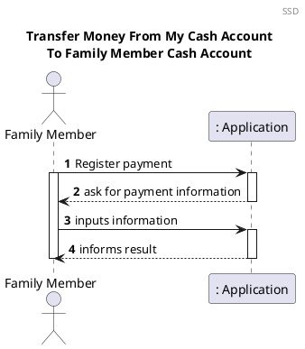
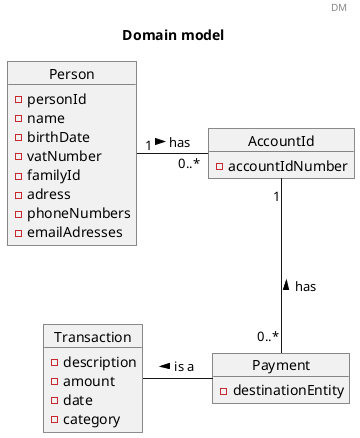
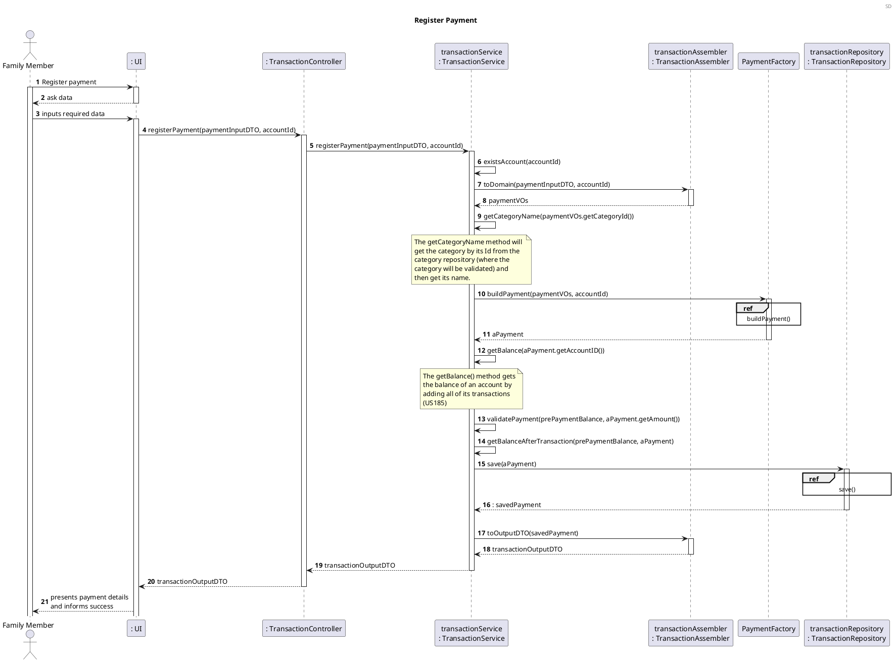
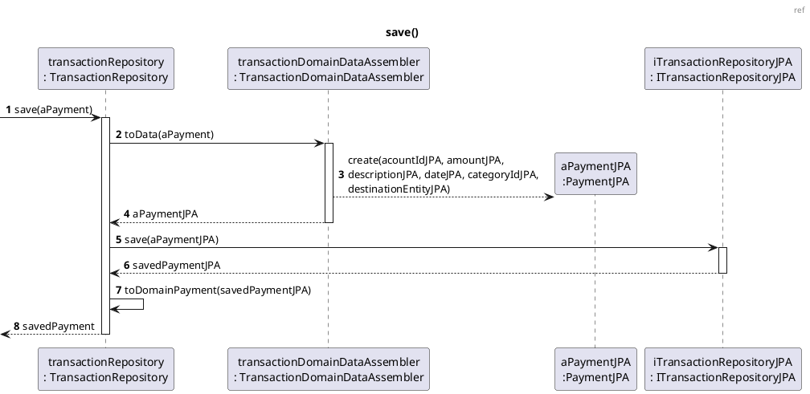
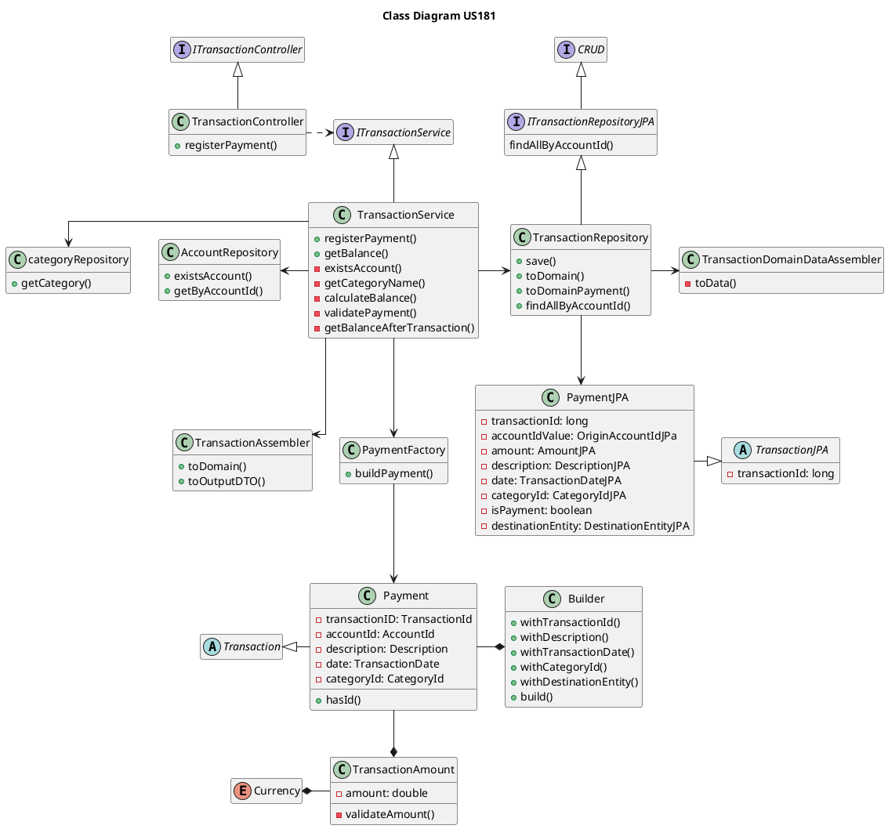

# US181 Register A Payment Using A Cash Account

# 1. Requirements

_As a family member, I want to register a payment that I have made using one of
my cash accounts._

According to this requirement, the family member would like to register a
payment that the family member has done using his/her cash account. Therefore,
in order to register the payment, its amount is required, cannot be negative and
the family member must have sufficient funds in his/her personal cash account to 
register the payment.

These criteria have to be fulfilled, otherwise the registration of the payment
using the family member’s cash account won't be successful.

The family member can have none or one cash account:
_"Each family member may have a cash account to represent the amount of cash (s)
he has.
"_

According to the Product Owner for now we should assume that each family member
will have only one personal cash account:
_"(...), para já, será de assumir que cada membro da família poderá ter apenas
uma cash account pessoal."_

## 1.1 System Sequence Diagram

The below System Sequence Diagram (SSD) captures the interaction between the
Family Member, and the Application when the Family Member wants to register a
payment using his/her cash account.



## 1.2 Dependency of other User Stories

This User Story has dependencies with the [US010], [US011] and [US101]
because a family, a family administrator and family members must exist in order
for the family member to register a payment.

In addition, this User Story has dependencies with the [US170], since the family
member must have a personal cash account to be able to register a payment.

# 2. Analysis

## 2.1 Payment Entry

According to what was described, the payment will be registered upon request
from the Family Member. To register the payment, in the functionality developed
for this US, a Class Payment will be implemented and Payment will extend the
abstract class Transaction. Each transaction will have its accountId, which means
the transaction will know from which account it was registered.

To register a Payment in the Personal Cash Account, the user must fill in the 
following information:

| Attributes        | Rules                                        |    
| --------------    | -------------------------------------------- |    
| amount            |  Required, String                            |               
| currency          |  Required, double                            |
| description       |  Required, double                            |              
| date              |  Optional, String                            |    
| destinationEntity |  Optional, String                            |    
| categoryId        |  Optional, Object                            |    

## 2.2 Domain Model Excerpt

The relevant extract of the domain model is represented below:



# 3. Design

## 3.1. Functionality Development

The System Diagram is the following:



```puml
@startuml
header ref
title buildPayment()
autonumber
participant "PaymentFactory" as PF
participant "Payment.Builder" as PB
participant "description\n: Description" as D
participant "date\n: TransactionDate" as Date
participant "destinationEntity\n: Description" as DE
participant "categoryId\n: CategoryId" as C
participant "transactionId\n: TransactionID" as TID
participant "aPayment\n: Payment" as P

[-> PF : buildPayment(paymentVOs)
activate PF
PF --> PB : buildPayment(paymentVOs.getAccountId(), paymentVOs.getAmount())
activate PB
PB --> D* : withDescription(paymentVOs.getDescription())
PB --> Date* : withTransactionDate(paymentVOs.getDate())
PB --> DE* : withDestinationEntity(paymentVOs.getDestinationEntity())
PB --> C* : withCategory(paymentVOs.getCategoryId())
PB --> TID* : withTransactionId()

PB --> P* : build()
PB--> PF : aPayment
deactivate PB

<-- PF : aPayment
deactivate PF

@enduml

```




## 3.2. Class Diagram

The main classes involved in the realization of this requirement/functionality
were the following:

- RegisterPaymentCashAccountController
- Application
- AccountService
- TransactionService
- Account
- AccountOwner
- PersonalCashAccount
- Transaction
- Payment
- Person
- MonetaryValue

The Class Diagram is the following:



## 3.3. Applied Patterns

The applied patterns were the following:

- _Single Responsibility Principle (SRP)_ - All classes have one responsibility,
  which means, only one reason to change;
- _Controller_ - The controller (TransactionController) receives
  and coordinates system operations connecting the UI layer to the App's logic
  layer;
- _Information Expert_ - Each class was assigned responsibilities that can be
  fulfilled because they have the information needed to do so;
- _Pure Fabrication_ - The TransactionService is a type of
  class that does not represent a problem domain concept, nevertheless it was
  assigned a set of responsibilities to support high cohesion, low coupling and
  reuse;
- _Low Coupling_ - Classes were assigned responsibilities so that coupling
  remains as low as possible, reducing the impact of any changes made to objects
  later on;
- _High Cohesion_ - Classes were assigned responsibilities so that cohesion
  remains high(they are strongly related and highly focused). This helps to keep
  objects understandable and manageable, and also goes hand in hand with the low
  coupling principle.

## 3.4. Tests

### 3.4.1 Unit Tests

The Unit Tests are defined below:

**Unit test 1:** Verify that a payment is registered successfully.

```java
    @Test
    void paymentIsRegisteredFromAccountWithTheRightInformation() {
            //Arrange
            PaymentInputDTO paymentInputDTO = new PaymentInputDTO(20, 3, "Electricity bill", "19/06/2021 12:54", "EDP", 2);
            long accountId = 1;
            PaymentVOs paymentVOs = new PaymentVOs(new AccountId(accountId), new TransactionAmount(-20, Currency.USD), new Description("Electricity bill"), new TransactionDate("19/06/2021 12:54"), new Description("EDP"), new CategoryId(2));
            Payment payment = new Payment.Builder(paymentVOs.getAccountId(), paymentVOs.getAmount())
            .withDescription(paymentVOs.getDescription())
            .withTransactionDate(paymentVOs.getDate())
            .withDestinationEntity(paymentVOs.getDestinationEntity())
            .withCategoryId(paymentVOs.getCategoryId())
            .withTransactionId()
            .build();
            Payment savedPayment = new Payment.Builder(paymentVOs.getAccountId(), paymentVOs.getAmount())
            .withDescription(paymentVOs.getDescription())
            .withTransactionDate(paymentVOs.getDate())
            .withDestinationEntity(paymentVOs.getDestinationEntity())
            .withCategoryId(paymentVOs.getCategoryId())
            .withTransactionId(new TransactionId(3))
            .build();
            CategoryName categoryName = new CategoryName("BILLS");
            StandardCategory category = new StandardCategory(categoryName);
            Balance balance = new Balance(150.00);
            InitialAmountValue initialAmountValue = new InitialAmountValue(150.00, Currency.GBP);
            List<Transaction> transactions = new ArrayList<>();
        TransactionOutputDTO expectedOutputDTO = new TransactionOutputDTO(3, accountId, -20, "GBP", "Electricity bill", "19/06/2021 12:54", "EDP", 2, "BILLS", balance.getAmount());

        doNothing().when(accountRepository).existsAccount(accountId);
        when(transactionAssembler.toDomain(paymentInputDTO, accountId)).thenReturn(paymentVOs);
        when(categoryRepository.getCategory(new CategoryId(2))).thenReturn(category);
        when(transactionRepository.findAllByAccountId(isA(AccountId.class))).thenReturn(transactions);
        when(accountRepository.getByAccountId(isA(AccountId.class))).thenReturn(initialAmountValue);
        when(transactionRepository.save(payment)).thenReturn(savedPayment);
        when(transactionAssembler.toOutputDTO(isA(Payment.class), isA(CategoryName.class), isA(Balance.class))).thenReturn(expectedOutputDTO);

        //Act
        TransactionOutputDTO resultDTO = transactionService.registerPayment(paymentInputDTO, accountId);

        //Assert
        assertNotNull(resultDTO);
        assertEquals(expectedOutputDTO, resultDTO);
        }
```

**Unit test 2:** Verify that the registration of a payment is not successful,
if the account Id is from a nonexistent account.

```java
 @Test
    void paymentIsNotRegisteredIfAccountIdIsFromANonexistentAccount() {
            //Arrange
            PaymentInputDTO paymentInputDTO = new PaymentInputDTO(20, 3, "Electricity bill", "19/06/2021 12:54", "EDP", 2);
            long accountId = 1;

            doThrow(ObjectDoesNotExistException.class).when(accountRepository).existsAccount(accountId);

        //Act and assert
        assertThrows(ObjectDoesNotExistException.class, () -> transactionService.registerPayment(paymentInputDTO, accountId));
        }
```

**Unit test 3:** Verify that the registration of a payment is not successful,
when the balance of the account is lower than the payment's amount.

```java
@Test
    void paymentIsNotRegisteredIfBalanceIsLowerThenPaymentAmount() {
            //Arrange
            PaymentInputDTO paymentInputDTO = new PaymentInputDTO(20, 3, "Electricity bill", "19/06/2021 12:54", "EDP", 2);
            long accountId = 1;
            PaymentVOs paymentVOs = new PaymentVOs(new AccountId(accountId), new TransactionAmount(-20, Currency.USD), new Description("Electricity bill"), new TransactionDate("19/06/2021 12:54"), new Description("EDP"), new CategoryId(2));
            Payment payment = new Payment.Builder(paymentVOs.getAccountId(), paymentVOs.getAmount())
            .withDescription(paymentVOs.getDescription())
            .withTransactionDate(paymentVOs.getDate())
            .withDestinationEntity(paymentVOs.getDestinationEntity())
            .withCategoryId(paymentVOs.getCategoryId())
            .withTransactionId()
            .build();
            Payment savedPayment = new Payment.Builder(paymentVOs.getAccountId(), paymentVOs.getAmount())
            .withDescription(paymentVOs.getDescription())
            .withTransactionDate(paymentVOs.getDate())
            .withDestinationEntity(paymentVOs.getDestinationEntity())
            .withCategoryId(paymentVOs.getCategoryId())
            .withTransactionId(new TransactionId(3))
            .build();
            CategoryName categoryName = new CategoryName("BILLS");
            StandardCategory category = new StandardCategory(categoryName);
            Balance balance = new Balance(150.00);
            InitialAmountValue initialAmountValue = new InitialAmountValue(10, Currency.GBP);
            List<Transaction> transactions = new ArrayList<>();

        doNothing().when(accountRepository).existsAccount(accountId);
        when(transactionAssembler.toDomain(paymentInputDTO, accountId)).thenReturn(paymentVOs);
        when(categoryRepository.getCategory(new CategoryId(2))).thenReturn(category);
        when(transactionRepository.findAllByAccountId(isA(AccountId.class))).thenReturn(transactions);
        when(accountRepository.getByAccountId(isA(AccountId.class))).thenReturn(initialAmountValue);

        assertThrows(InvalidAmountException.class, () -> transactionService.registerPayment(paymentInputDTO, accountId));
        }
```

### 3.4.1 Integration Tests

**Integration test 1:** Verify that a payment is registered successfully from a cash account.

```java
@Test
    void paymentIsRegisteredFromFamilyCashAccountWithTheRightInformation() {
            //Arrange
            //Create family and administrator
            FamilyInputDTO familyInputDTO = new FamilyInputDTO();
            familyInputDTO.setName("António");
            familyInputDTO.setEmail("antonio@gmail.com");
            familyInputDTO.setStreet("Rua clara");
            familyInputDTO.setLocation("Porto");
            familyInputDTO.setPostCode("4000-000");
            familyInputDTO.setPhoneNumber("911111111");
            familyInputDTO.setVat("222333222");
            familyInputDTO.setBirthDate("11/09/1999");
            familyInputDTO.setFamilyName("Silva");
            FamilyOutputDTO familyOutputDTO = familyMemberService.createFamily(familyInputDTO);
            long familyId = familyOutputDTO.getFamilyId();
            //Create family cash account
            AccountInputDTO accountInputDTO = new AccountInputDTO(familyId, 40, 2, "TestDescription");
            AccountOutputDTO accountOutputDTO = familyAccountService.createFamilyCashAccount(accountInputDTO);
            long accountId = accountOutputDTO.getAccountId();
            //Create category
            String name = "G1 TRAVEL";
            Integer parentId = null;
            CategoryInputDTO inputDTO = new CategoryInputDTO();
            inputDTO.setName(name);
            inputDTO.setParentId(parentId);
            StandardCategoryOutputDTO outputDTO = categoryService.createStandardCategory(inputDTO);
            Object categoryId = outputDTO.getCategoryId();
            //Create input DTO with information to create the payment
            PaymentInputDTO paymentInputDTO = new PaymentInputDTO(20, 3, "Electricity bill", "19/06/2021 12:54", "EDP", categoryId);
            //Create expected payment output DTO
            TransactionOutputDTO expectedOutputDTO = new TransactionOutputDTO(accountId, -20, "GBP", "Electricity bill", "19/06/2021 12:54", "EDP", categoryId, name, 20);

            //Act
            TransactionOutputDTO resultDTO = transactionService.registerPayment(paymentInputDTO, accountId);

            //Assert
            assertNotNull(resultDTO);
            assertEquals(expectedOutputDTO, resultDTO);
            }

```

**Integration test 2:** Verify that a payment is not registered if the category does not exist.

```java
@Test
    void paymentIsNotRegisteredFromFamilyCashAccountWithWrongCategoryId() {
            //Arrange
            //Create family and administrator
            FamilyInputDTO familyInputDTO = new FamilyInputDTO();
            familyInputDTO.setName("António");
            familyInputDTO.setEmail("antonio@gmail.com");
            familyInputDTO.setStreet("Rua clara");
            familyInputDTO.setLocation("Porto");
            familyInputDTO.setPostCode("4000-000");
            familyInputDTO.setPhoneNumber("911111111");
            familyInputDTO.setVat("222333222");
            familyInputDTO.setBirthDate("11/09/1999");
            familyInputDTO.setFamilyName("Silva");
            FamilyOutputDTO familyOutputDTO = familyMemberService.createFamily(familyInputDTO);
            long familyId = familyOutputDTO.getFamilyId();
            //Create family cash account
            AccountInputDTO accountInputDTO = new AccountInputDTO(familyId, 20, 2, "TestDescription");
            AccountOutputDTO accountOutputDTO = familyAccountService.createFamilyCashAccount(accountInputDTO);
            long accountId = accountOutputDTO.getAccountId();
            //Create input DTO with information to create the payment
            PaymentInputDTO paymentInputDTO = new PaymentInputDTO(20, 3, "Electricity bill", "19/06/2021 12:54", "EDP", 1234);

            //Act ans assert
            assertThrows(ObjectDoesNotExistException.class, () -> transactionService.registerPayment(paymentInputDTO, accountId));
        }
```

**Integration test 3:** Verify that the registration of a payment is not successful,
if the account's balance is lower than the payment's amount.

```java
    @Test
    void paymentIsNotRegisteredIfBalanceIsLowerThanPaymentAmount() {
        //Arrange
        //Create family and administrator
        FamilyInputDTO familyInputDTO = new FamilyInputDTO();
        familyInputDTO.setName("António");
        familyInputDTO.setEmail("antonio@gmail.com");
        familyInputDTO.setStreet("Rua clara");
        familyInputDTO.setLocation("Porto");
        familyInputDTO.setPostCode("4000-000");
        familyInputDTO.setPhoneNumber("911111111");
        familyInputDTO.setVat("222333222");
        familyInputDTO.setBirthDate("11/09/1999");
        familyInputDTO.setFamilyName("Silva");
        FamilyOutputDTO familyOutputDTO = familyMemberService.createFamily(familyInputDTO);
        long familyId = familyOutputDTO.getFamilyId();
        //Create family cash account
        AccountInputDTO accountInputDTO = new AccountInputDTO(familyId, 10, 2, "TestDescription");
        AccountOutputDTO accountOutputDTO = familyAccountService.createFamilyCashAccount(accountInputDTO);
        long accountId = accountOutputDTO.getAccountId();
        //Create category
        String name = "G1 TRAVEL";
        Integer parentId = null;
        CategoryInputDTO inputDTO = new CategoryInputDTO();
        inputDTO.setName(name);
        inputDTO.setParentId(parentId);
        StandardCategoryOutputDTO outputDTO = categoryService.createStandardCategory(inputDTO);
        Object categoryId = outputDTO.getCategoryId();
        //Create input DTO with information to create the payment
        PaymentInputDTO paymentInputDTO = new PaymentInputDTO(20, 3, "Electricity bill", "19/06/2021 12:54", "EDP", categoryId);

        //Act and assert
        assertThrows(InvalidAmountException.class, () -> transactionService.registerPayment(paymentInputDTO, accountId));
    }
```

# 4. Implementation

The main challenges encountered during the implementation of this functionality
were:

- Figuring out the logic of a transaction, when it is the transaction that knows the account 
  it was registered from ans the account does not know its transactions;
  
- The dependency of this US on other functionalities being implemented first.

In order to minimize these difficulties and to guarantee a reliable
functionality, the tests were done to cover the maximum scenarios, identifying
and correcting the encountered errors.

# 5. Integration/Demonstration

This functionality will be necessary for the
[US186] (_"As a family member, I want to get the list of movements on one of my
accounts between to dates."_), since to obtain the list of movements from one of
cash accounts, it will be necessary to have the registered payments.

In addition, it will be indirectly necessary for the following
[US135] (_"As a family administrator, I want to check the balance of the
family’s cash account or of a given family member."_),
[US185] (_"As a family member, I want to check the balance of one of my
accounts."_) and
[US188] (_"As a parent, I want to check the balance of one of my children’s cash
account."_), because the cash accounts have transactions that will influence the
balance of the accounts.

The development of [US135], [US185], [US186], [US188] helps to prove a good
integration with this functionality and its system components.

At the moment, no other user stories are dependent on this one, so its
integration with other functionalities cannot be tested further.

# 6. Observations

There's one feature that was not yet implemented on this user story: the validation of the 
transaction date, so that this date could not be in the future time. Unfortunately, there was not 
enough time in this sprint to implement this, so this feature will have to be implemented in 
the next one.

[us010]: US010_Create_Family.md

[us011]: US011_Add_Family_Administrator.md

[us101]: US101_Add_Family_Member.md

[us170]: US170_Create_Personal_Cash_Account.md

[us186]: US186_Get_Movements_Between_Two_Dates.md

[us135]: US135_Check_Balance_Family_Cash_Account_or_Given_Family_Member.md

[us185]: US185_Check_Balance_Of_One_Account.md

[us188]: US188_Check_Balance_Of_A_Family_s_Children.md


