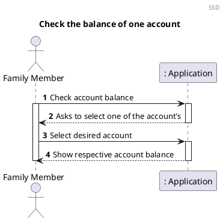
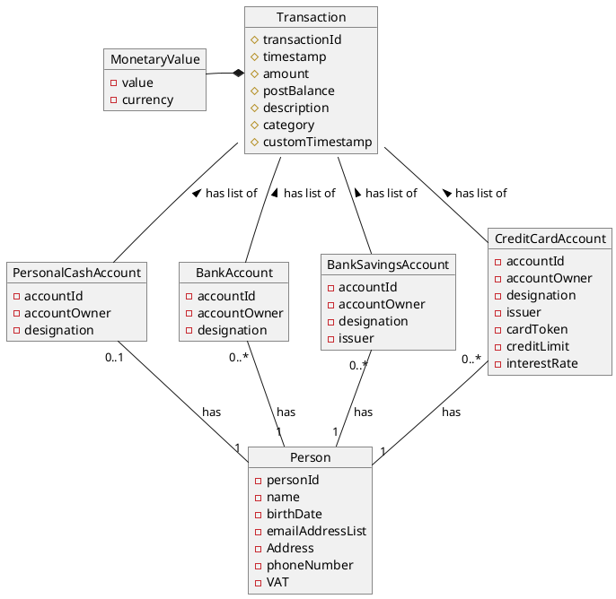
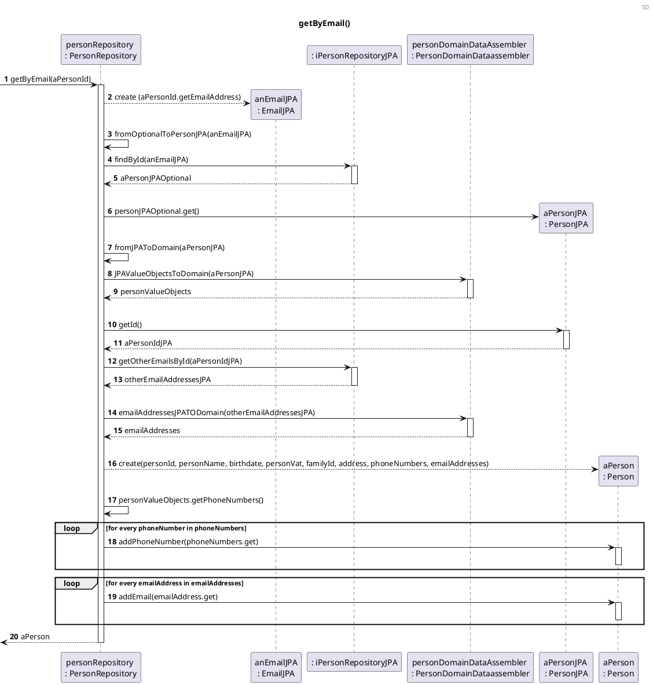
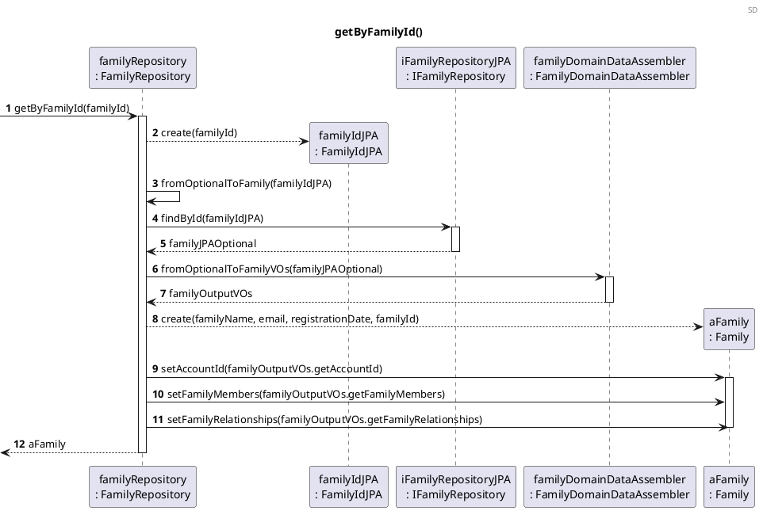
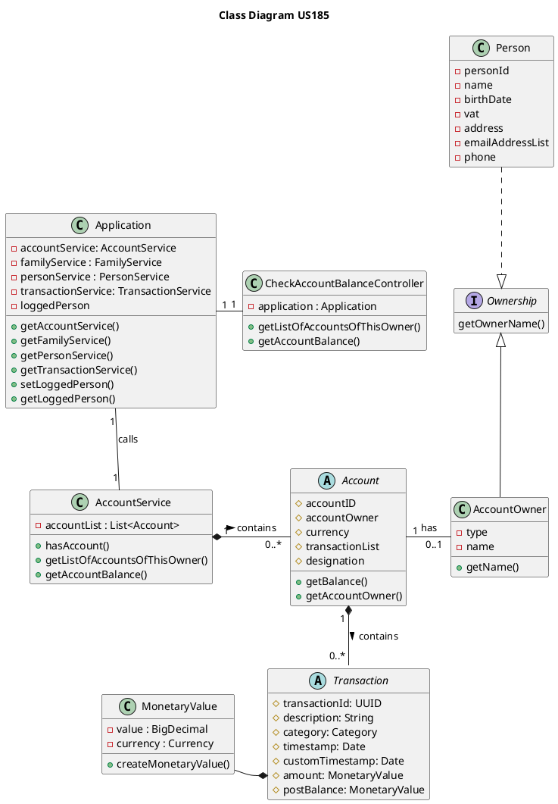

US185 Check The Balance Of One Of My Accounts
=======================================

# 1. Requirements

*As a family member, I want to check the balance of one of my accounts.*

From the project proposal: *"(...) the balance of a current/checking account usually reflects the difference between
deposits and withdrawals, while the balance of a credit card account is the amount due at that moment, including
interest (...)"*

The functionality will allow a family member to check the balance of one of their personal accounts by selecting which
of their personal accounts they want, if they have more than one.

## 1.1 System sequence diagram

The system sequence diagram below represents the interaction between Family Member and the Application.



# 1.2. Dependency of other user stories

This User Story has dependencies with [US010](US010_Create_Family.md), [US011](US011_Add_Family_Administrator.md) and [US101](US101_Add_Family_Member.md)
because a family, a family administrator and family members must exist in order for this US to be operational. This user
story is also dependent on [US170](US170_Create_Personal_Cash_Account.md), [US171](US171_Add_Personal_Bank_Account.md), [US172](US172_Add_Bank_Savings_Account.md) and [US173](US173_Add_Credit_Card_Account.md)
because we need to have accounts added in order to check their balance.

# 2. Analysis

### 2.1 Get Account Balance

An account object should have the following attributes:

| Attributes        | Class                                                                        |                      
| ----------------- | -----------------------------------------------------------------------------|                      
| **accountId**         | Unique, UUID                                                                 |                       
| **accountOwner**      | Required, Ownership                                                          |                      
| **currency**          | Required, Currency                                                           |                      
| **transactionList**   | List of transactions                                                         |                      
| **description**       | String, a default description is provided if left blank by the family member |

### 2.2 Relevant domain model excerpt

The relevant domain concepts for this user story:




# 3. Design

## 3.1. Functionality Development

The process consists in getting the list of all accounts, and then, after getting them, select the desired account
and get the balance. The Sequence Diagram for this user story is as follows:

### 3.1.1 Sequence diagrams

```puml
autonumber
header SD
title Check the balance of one account of this person

actor "Family Member" as FM
participant ": UI" as UI
participant ": CheckPersonalAccount\nController" as CPAC
participant "AccountService\n:AccountService" as FAS
participant "aPersonId \n: Email" as email
participant "accountRepository\n:AccountRepository" as AR
participant "accountListOutputMapper\n:AccountsListOutputMapper" as ALOM
participant "accountListOutputDTO\n:AccountListOutputDTO" as DTO
participant "personRepository\n:PersonRepository" as PR
participant "aFamilyId \n: FamilyId" as familyId
participant "familyRepository\n:FamilyRepository" as FR

FM -> UI : Show account list
activate FM
activate UI
UI-> CPAC : getAccountList(personId)
activate CPAC

CPAC -> FAS : getAccountList(personId)
activate FAS

FAS --> email** : create(personId)
FAS -> PR : getByEmail(aPersonId)
activate PR
ref over PR
  getByEmail()
end ref
PR --> FAS : aPerson
deactivate PR
FAS --> PR: aPerson.getPersonalAccounts(aPerson)
activate PR
ref over PR
getPersonalAccountsList()
end ref
PR --> FAS: personalAccountsIds
deactivate PR

FAS -> familyId** : aPerson.getFamilyId()
familyId --> FAS : aFamilyId
activate familyId
deactivate familyId
FAS -> FR : getByFamilyId(aFamilyId)
activate FR
ref over FR
  getByFamilyId()
end ref
return aFamily

FAS -> FR: getFamilyCashAccount(aFamily)
activate FR
ref over FR
getFamilyCashAccount()
end ref
return familyCashAccountId
deactivate FR

FAS --> ALOM**: create

FAS -> ALOM : mapAccountList(personalAccountsIds, familyCashAccountId)
activate ALOM
ALOM --> DTO** : create (List<>)
return accountListOutputDTO


FAS --> CPAC:  accountListOutputDTO
deactivate FAS
CPAC --> UI: accountListOutputDTO
deactivate CPAC

UI --> FM : Show List of accounts of this member
deactivate UI

FM -> UI : Select account
activate UI 

UI -> CPAC : getAccountBalance(accountId)
activate CPAC
CPAC -> FAS : getAccountBalance(accountId)
activate FAS
FAS -> AR : getBalance(accountId)
activate AR
ref over AR
getBalance()
end ref
AR --> FAS : balance
deactivate AR
FAS --> CPAC : balance 
deactivate FAS
CPAC --> UI : balance
deactivate CPAC
UI --> FM : Show balance of selected account
deactivate UI
deactivate FM


```





## 3.2. Class Diagram

The Class Diagram is the following:



## 3.3. Applied patterns

_Place_Holder_

## 3.4. Testes

### 3.4.1 Unit Tests

The Unit tests are the following:

### Success Cases

**Test 1:** Get the balance of a cash account successfully.

```java
    @Test
    void getCashAccountBalanceSuccessfully_OneAccount(){
            accountService.createPersonalCashAccount(person,initialAmount,currency);
            Account account=accountService.getCashAccountByOwner(person);
            AccountDTO accountDTO=new AccountDTO(account.getAccountId(),account.getDesignation());
            MonetaryValue money=new MonetaryValue(500);
            MonetaryValueMapper expected=new MonetaryValueMapper(money);

            MonetaryValueDTO result=accountService.getAccountBalance(accountDTO);

            assertEquals(expected.toDTO(),result);
            }
```

**Test 2:** Get the balance of a bank account successfully when the user has a bank account, and a personal cash
account.

```java
    @Test
    void getBankAccountBalanceSuccessfully_BetweenTwoDifferentTypeOfAccounts(){
            accountService.createPersonalCashAccount(person,initialAmount,currency);
            Account account=accountService.getCashAccountByOwner(person);
            accountService.createBankAccount(person,initialAmount,currency,designation);
            Account account1=accountService.getBankAccountByOwner(person);
            AccountDTO accountDTO=new AccountDTO(account1.getAccountId(),account1.getDesignation());
            MonetaryValue money=new MonetaryValue(500);
            MonetaryValueMapper expected=new MonetaryValueMapper(money);

            MonetaryValueDTO result=accountService.getAccountBalance(accountDTO);

            assertEquals(expected.toDTO(),result);
            }
```

**Test 3:** Get the balance of a bank savings account successfully when the user has a bank account, a personal cash
account and a bank savings account.

```java
@Test
    void getBankSavingsAccountBalanceSuccessfully_BetweenFourDifferentTypeOfAccounts(){
            accountService.createPersonalCashAccount(person,initialAmount,currency);
            Account account=accountService.getCashAccountByOwner(person);
            accountService.createBankAccount(person,initialAmount,currency,designation);
            Account account1=accountService.getBankAccountByOwner(person);
            accountService.createBankSavingsAccount(person,initialAmount,currency,issuer,designation);
            Account account2=accountService.getBankSavingsAccountByOwner(person);
            AccountDTO accountDTO=new AccountDTO(account2.getAccountId(),account2.getDesignation());
            MonetaryValue money=new MonetaryValue(500);
            MonetaryValueMapper expected=new MonetaryValueMapper(money);

            MonetaryValueDTO result=accountService.getAccountBalance(accountDTO);

            assertEquals(expected.toDTO(),result);
            }
```

### Unsuccessful Cases:

# 4. Implementation

Some challenges encountered during the development process and implementation of this functionality
were:

- The dependency on other functionalities to be fully operational to implement and test this
  functionality correctly;
- The need to implement two DTO, one to have the list of accounts of a particular family member, 
  and another DTO to show to the desired account balance.

In order to minimize these problems and to guarantee a reliable
functionality, the tests were done to cover the maximum scenarios, identifying
and correcting the encountered errors. In addition, there was communication with
the Product Owner whenever needed, to clarify some requirements in relation to this specific
functionality.


# 5. Integration/Demonstration

As stated in the [Requirements](#1-requirements), the use-case scenario will only be possible if some
other functionalities are fully operational.

# 6. Observations

- Abstract classes are used in order to reduce code duplication.

[us010]: US010_Create_Family.md

[us101]: US101_Add_Family_Member.md

[us105]: US105_Create_Relationship.md

[us170]: US170_Create_Personal_Cash_Account.md

[us171]: US171_Add_Personal_Bank_Account.md

[us172]: US172_Add_Bank_Savings_Account.md

[us173]: US173_Add_Credit_Card_Account.md

