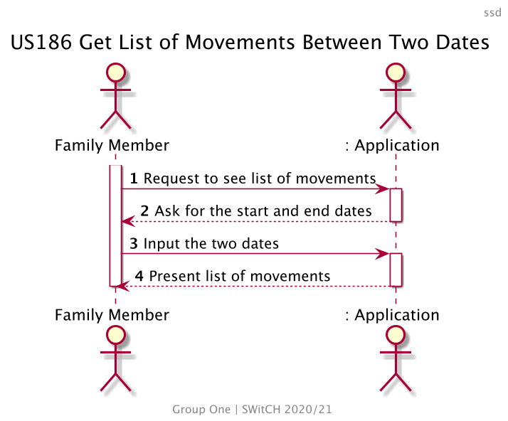

US186 Get List of Movements Between Two Dates
=======================================

# 1. Requirements

*As a family member, I want to get the list of movements on one of my accounts between two dates.*

The functionality will allow a family member to check the list of movements in one of his/her
accounts, between two dates specified by him/her. It was designed to respond to the User Story (US)
referred above.

## 1.1 System sequence diagram

<!---
@startuml US186_SSD

header ssd
title US186 Get List of Movements Between Two Dates
autonumber

actor "Family Member" as fm
actor ": Application" as app

activate fm
fm -> app ++: Request to see list of movements
return Ask for the start and end dates
fm -> app ++: Input the two dates
return Present list of movements
deactivate fm

@enduml
-->



# 1.2. Dependency of other user stories

This US is dependent on [US170], [US171], [US172]and [US173], because the user would not be able to
check the movements of an account if there is no functionality that allows to add a personal account
first.

Indirectly, this US is also dependent on [US180],[US130] and [US181], because without them,
movements that include transfers from different cash accounts and payments made using a cash account
would not be shown in the movements list.

# 2. Analysis

### 2.1 Movements

By movement, it is meant a transaction of money from a place to another. At this moment,
transactions can be payments or transfers.

In the functionality developed for this US, the family member will to obtain the list of movements
that occurred on a given period of time, specified by him/her, on a given personal account. The list
of movements is, for now, stored in an abstract class Account. Each transaction has set of
attributes (timestamp, amount, postBalance, description and category), whose values will be obtained
with the list.

Certain accounts ask for an initial amount upon creation, and the transfer of this amount to the
account counts as a valid transaction that can be included in the movement list.

When choosing the time period, the start date will be mandatory to choose, but the end date will be
set to the current system date by default. The start date must always be earlier, or the same as the
end date.

### 2.2 Relevant domain model excerpt

Below is the excerpt of the domain model that is relevant for this user story.

<!--
@startuml US186_DM
title Relevant Domain Model US186
header DM
skinparam linetype ortho
hide methods

object Account {
  - accountId
  - accountOwner
  - initialAmount
  - movementList
  - designation
}

Account "1" - "0..*" Movement : has

object Movement {

}

@enduml
-->


# 3. Design

## 3.1. Functionality development

In the diagrams below, it is possible to see the implementation strategy for this user story.

### 3.1.1 Sequence diagrams

<!--
@startuml US186_SD

header sd
title US186 Get Account Movements Between Two Dates
autonumber
actor "Family Member" as fm
participant ": UI" as ui
participant ": AccountController" as controller
participant ": TransactionService" as service
participant ": TransactionRepository" as MR
participant "transactionList\n: List<Transaction>" as movementList
participant ": TransactionDomainService" as domainService
participant "TransactionsMapper" as mapper

activate fm
fm -> ui ++: get the list of movements of the\naccount on a given period of time
return ask to define a start and an end date
fm -> ui ++: select start and end date
ui -> controller ++: getAccountTransactionsBetweenDates\n(accountId, startDate, endDate)
controller -> service ++: getAccountTransactionsBetweenDates\n(accountId, startDate, endDate)
service -> MR ++: getByAccountId(accountId)
MR -> movementList ** : create()
return transactionList
service -> domainService ++: getTransactionsBetweenDates(transactionList, startDate, endDate)
ref over domainService
  getTransactionsBetweenDates()
end ref
return transactionsBetweenDates
service -> mapper ++: mapTransactions(transactionsBetweenDates)
ref over mapper
  toDTO()
end ref
return transactionListDTO
return transactionListDTO
return transactionListDTO
return present list of account\n movements between two dates
@enduml
-->


<!--
@startuml US186_Ref1
header ref
title getTransactionsBetweenDates()
autonumber

participant ": TransactionsDomainService" as domainService
participant "transaction\n: Transaction" as movement
participant "transactionsBetweenDates\n: List<Transaction>" as movementList

-> domainService ++: getTransactionsBetweenDates(movementList, startDate, endDate)
domainService -> movementList**: create()
loop for each transaction in transactionList
  domainService -> movement ++: isAfter(startDate) && isBefore(endDate)
  return result
  opt true
    domainService -> movementList ++: add(transaction)
    deactivate movementList
  end
return transactionsBetweenDates

@enduml
-->


<!--
@startuml US186_Ref2

header ref
title toDTO()
autonumber

participant " TransactionsMapper" as mapper
participant "transactionDTO\n: TransactionDTO" as dto
participant "transactionListDTO\n: TransactionListDTO" as dtoList

-> mapper: mapTransactions(transactionsBetweenDates)
activate mapper
mapper -> dtoList**: create()
loop for each transaction in transactionsBetweenDates
  mapper -> mapper ++: mapTransaction(transaction)
  mapper -> dto **: create(transaction)
  return transactionDTO
  mapper -> dtoList ++: add(transactionDTO)
  deactivate dtoList
end
return transactionListDTO

@enduml
-->


## 3.2. Class Diagram


## 3.3. Applied patterns and principles

- *Single Responsibility Principle (SRP)* - Transaction and Account classes follow this principle,
  as they have one responsibility, which is to manage the information included within them.
- *Open-Closed Principle* - This functionality was designed to accept extension without having to
  add changes to the methods already implemented. If more information is to be presented about each
  transaction or the account, this can be easily added.
- *Dependency inversion principle* - This functionality depends on the abstract classes Account and
  Transaction, and not on the concrete classes that implement these.
- *Controller* - GetAccountMovementsController receives and coordinates system operations, as it
  connects the UI layer to the application logic layer.
- *Information Expert* - To each class were assigned responsibilities that can be fulfilled because
  they have the information needed to do so;
- *Creator* - The TransactionService class was assigned the responsibility to instantiate the
  mapper (class that compiles all the information needed to create the DTO), because it had the
  necessary data that would be passed on to it.
- *Pure Fabrication* - The TransactionService and the AccountMovementsMapper classes are classes
  that do not represent a domain concept, and they were assigned a set of responsibilities to
  support high cohesion, low coupling and reuse.
- *Low Coupling* - Classes were assigned responsibilities so that coupling remains as low as
  possible, reducing the impact of any changes made to objects later on;
- *High Cohesion* - Classes were assigned responsibilities so that cohesion remains high (they are
  strongly related and highly focused). This helps to keep objects understandable and manageable,
  and also goes hand in hand with the low coupling principle.

## 3.4. Domain tests

### 3.4.1. Unit testing

**Unit test 1:** Verify that the obtained transactions are the same as the registered in the account

```java
@Test
    void getAccountTransactionsBetweenDates() {
            long accountId = 1;
            String startDate = "01/01/2020";
            String endDate = "01/01/2021";
            DateRangeDTO dateRangeDTO = new DateRangeDTO(startDate, endDate);

            List<Transaction> transactionList = new ArrayList<>();
        PaymentVOs paymentVOs = new PaymentVOs(new AccountId(accountId), new TransactionAmount(-20, Currency.USD), new Description("Electricity bill"), new TransactionDate("18/06/2020 12:54"), new Description("EDP"), new CategoryId(2));
        Payment payment = new Payment.Builder(paymentVOs.getAccountId(), paymentVOs.getAmount())
        .withDescription(paymentVOs.getDescription())
        .withTransactionDate(paymentVOs.getDate())
        .withDestinationEntity(paymentVOs.getDestinationEntity())
        .withCategoryId(paymentVOs.getCategoryId())
        .withTransactionId()
        .build();
        transactionList.add(payment);
        long destinationAccountId = 2;
        TransferVOs transferVOs = new TransferVOs(new AccountId(accountId), new AccountId(destinationAccountId), new TransactionAmount(-20, Currency.USD), new Description("Electricity bill"), new TransactionDate("19/06/2020 12:54"), new CategoryId(2));
        Transfer transfer = new Transfer.TransferBuilder(transferVOs.getOriginAccountId(), transferVOs.getDestinationAccountId(), transferVOs.getAmount())
        .withDescription(transferVOs.getDescription())
        .withTransactionDate(transferVOs.getDate())
        .withCategoryId(transferVOs.getCategoryId())
        .withTransactionId()
        .build();
        transactionList.add(transfer);

        when(transactionRepository.findAllByAccountId(new AccountId(accountId)))
        .thenReturn(transactionList);
        String categoryName = "Shopping";
        BaseCategory category = new StandardCategory(new CategoryName(categoryName));
        when(categoryRepository.getCategory(isA(CategoryId.class))).thenReturn(category);

        List<TransactionOutputDTO> expectedList = new ArrayList<>();
        TransactionOutputDTO transactionOne = new TransactionOutputDTO(payment.getTransactionId().getTransactionIdValue(), payment.getAmount().getAmount(), payment.getAmount().getCurrency().toString(), payment.getDescription().getAccountDescription(), payment.getDate().toString(), categoryName.toUpperCase());
        TransactionOutputDTO transactionTwo = new TransactionOutputDTO(transfer.getTransactionId().getTransactionIdValue(), transfer.getAmount().getAmount(), transfer.getAmount().getCurrency().toString(), transfer.getDescription().getAccountDescription(), transfer.getDate().toString(), categoryName.toUpperCase());
        expectedList.add(transactionOne);
        expectedList.add(transactionTwo);
        TransactionListDTO expected = new TransactionListDTO(expectedList);

        TransactionListDTO result = transactionService.getAccountTransactionsBetweenDates(accountId, dateRangeDTO);

        assertNotNull(result);
        assertEquals(expected, result);
        }

```

**Unit test 2:** Verify that, if no transactions were registered in the specified dates, an empty
list of movements is returned.

```java

@Test
void getEmptyAccountMovementListDTO_DatesBetweenTomorrowAndAfterTomorrow(){
        //Arrange
        UUID personalCashAccountId=personalCashAccount.getAccountId();
        List<Transaction> transactionList=personalCashAccount.getTransactionList();
        Calendar today=Calendar.getInstance();
        Calendar tomorrow=Calendar.getInstance();
        tomorrow.add(Calendar.DATE,1);
        Calendar afterTomorrow=Calendar.getInstance();
        afterTomorrow.add(Calendar.DATE,2);

        transactionList.get(0).setCustomTimestamp(today.getTime());
        transactionList.get(1).setCustomTimestamp(today.getTime());
        transactionList.get(2).setCustomTimestamp(today.getTime());

        GetAccountMovementsController controller=new GetAccountMovementsController(app);
        int expectedListSize=0;

        //Act
        AccountMovementListDTO accountMovementListDTO=controller.getAccountMovementsBetweenTwoDates(personalCashAccountId,tomorrow.getTime(),afterTomorrow.getTime());
        List<AccountMovementDTO> accountMovementDTOList=accountMovementListDTO.getAccountMovementsDTOList();
        int resultListSize=accountMovementDTOList.size();

        //Assert
        assertEquals(expectedListSize,resultListSize);
        assertNotNull(accountMovementDTOList);
        assertNotNull(accountMovementListDTO);
        }

```

**Unit test 3:** Verify that if the end date is not specified, the current system date is adopted.

```java

@Test
void getAccountMovementListDTOSuccessfully_EndDateIsNullAndSetToDefault(){
        //Arrange
        UUID personalCashAccountId=personalCashAccount.getAccountId();
        List<Transaction> transactionList=personalCashAccount.getTransactionList();
        Calendar today=Calendar.getInstance();
        Calendar yesterday=Calendar.getInstance();
        yesterday.add(Calendar.DATE,-1);
        Calendar tomorrow=Calendar.getInstance();
        tomorrow.add(Calendar.DATE,1);

        transactionList.get(0).setCustomTimestamp(today.getTime());
        transactionList.get(1).setCustomTimestamp(yesterday.getTime());
        transactionList.get(2).setCustomTimestamp(tomorrow.getTime());

        GetAccountMovementsController controller=new GetAccountMovementsController(app);
        int expectedListSize=3;

        //Act
        AccountMovementListDTO accountMovementListDTO=controller.getAccountMovementsBetweenTwoDates(personalCashAccountId,yesterday.getTime(),null);
        List<AccountMovementDTO> accountMovementDTOList=accountMovementListDTO.getAccountMovementsDTOList();
        int resultListSize=accountMovementDTOList.size();
        //Assert
        assertEquals(expectedListSize,resultListSize);
        assertNotNull(accountMovementDTOList);
        assertNotNull(accountMovementListDTO);
        }

```

# 4. Implementation

The main challenge on implementing this functionality was finding a solution on how to present the
necessary data to the end user without exposing information from domain classes. The answer to this
was creating a DTO for each account transaction and its information and a DTO for the list of the
transaction DTOs. This solution allows the addition of other information to the DTOs if needed in
the future, without having to change the implementation.

# 5. Integration/Demonstration

As mentioned before, this US is dependent on [US180], [US130] and [US181], because without them,
movements that include transfers from different cash accounts and payments made using a cash account
would not be shown in the movements list. Because of this dependence and by testing this
functionality, it is possible to test its integration with the USs mentioned above.

# 6. Observations

[US130]: US130_Transfer_Money_From_Family_Cash_Account_To_Family_Member_Cash_Account.md

[US170]: US170_Create_Personal_Cash_Account.md

[US171]: US171_Add_Bank_Account.md

[US172]: US172_Add_Bank_Savings_Account.md

[US173]: US173_Add_Credit_Card_Account.md

[US180]: US180_Transfer_Money_From_Cash_Account_To_Another_Cash_Account.md

[US181]: US181_Register_Payment_Made_Using_A_Cash_Account.md