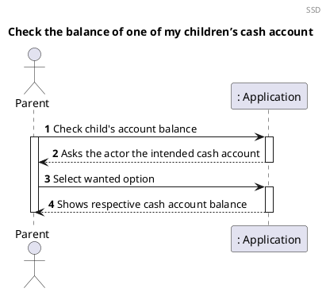
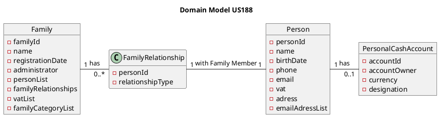
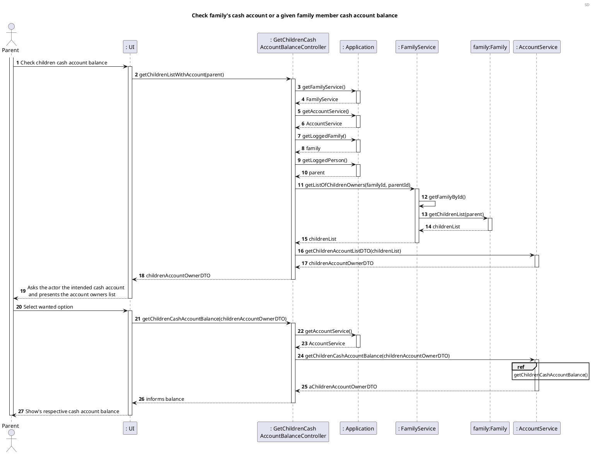
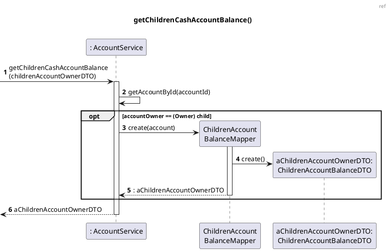
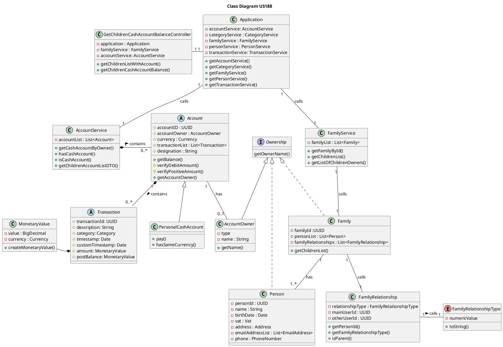

# US188 Check the balance of one of my children’s cash account

# 1. Requirements

_As a parent, I want to check the balance of one of my children’s cash account._

According to this requirement, the parent would like to check the balance of one
of his children’s cash account. Therefore, in order to check the balance of the
cash account of his child, the parent and children need to have a relationship
of the type parent-child, and the children has to have a cash account. The
parent must select which of his children's account he would like to check the
balance, if the parent has more than one child. The relationship is considered
to be between two family members.

These criteria have to be fulfilled, otherwise the parent won't be able to check
the balance of one of his children’s cash account.

## 1.1 System Sequence Diagram

The System Sequence Diagram (SSD) below captures the interaction between the
Parent and the Application when they want to check the balance of their child's
cash account.



## 1.2 Dependency of other User Stories

US188 is dependent on [US010], [US101], [US105], [US104], [US170], [US135]. In
order to establish a parent-child relationship we need a family and its members.
The child must have a personal cash account and it should be able to check their
balance.

# 2. Analysis

## Get children's cash account balance

The parent will ask for their children's list, to be able to pick a specific
child, in order to check their balance.

This involves:

- Returning a list of family members who have a personal cash account AND have a
  parent-child relationship between the requiring family member:
    - Check if person has a parent-child relation. This relation is created from
      the point of view of the parent. In other words, the reverse relation is
      inferred (if their parent has a parent relation with them).
    - Check if that child Person in the List personList (in Family) has a
      personal cash account with accountOwner == person;
    - If it exists, add this account to the final list;
- Return the final children cash accounts list to the parent user.

Upon receiving the final list, the user must select the desired account to
verify their respective balance using the getBalance (account) method.

## 2.2 Domain Model Excerpt



# 3. Design

Regarding this User Story, the requirements specified in
[Analysis](#2-analysis), should be accommodated.

The System Diagram is the following:

## 3.1. Functionality Development





## 3.2. Class Diagram
The main classes involved in the realization of this
requirement/functionality were the following:

- RegisterPaymentCashAccountController
- Application
- AccountService
- FamilyService
- Family
- Person
- Account
- AccountOwner
- PersonalCashAccount
- Transaction
- MonetaryValue

The Class Diagram is the following:



## 3.3. Applied Patterns

The applied patterns were the following:

- _Single Responsibility Principle (SRP)_ - All classes have one responsibility,
  which means, only one reason to change;
- _Controller_ - The GetChildrenCashAccountBalanceController receives and
  coordinates system operations connecting the UI layer to the App's logic
  layer;
- _Information Expert_ - Each class was assigned responsibilities that can be
  fulfilled because they have the information needed to do so;
- _Pure Fabrication_ - The FamilyService and AccountService are a type of class
  that do not represent a problem domain concept, nevertheless they were
  assigned a set of responsibilities to support high cohesion, low coupling and
  reuse;
- _Low Coupling_ - Classes were assigned responsibilities so that coupling
  remains as low as possible, reducing the impact of any changes made to objects
  later on;
- _High Cohesion_ - Classes were assigned responsibilities so that cohesion
  remains high(they are strongly related and highly focused). This helps to keep
  objects understandable and manageable, and also goes hand in hand with the low
  coupling principle.

## 3.4. Tests

### 3.4.1 Unit Tests

The Unit Tests are defined below:

**Unit test 1:** Obtain a valid children's account list.

```java
@Test
    void getChildrenListWithAccount() {
            List<AccountOwnerDTO> expected = new ArrayList<>();
        List<AccountOwnerDTO> result;
        result = ctrl.getChildrenListWithAccount();
        Account childOneAccount = accountService.getCashAccountByOwner(childOne);
        Account childTwoAccount = accountService.getCashAccountByOwner(childTwo);
        AccountOwnerMapper accountOwnerMapperChildOne = new AccountOwnerMapper(childOne, childOneAccount);
        AccountOwnerMapper accountOwnerMapperChildTwo = new AccountOwnerMapper(childTwo, childTwoAccount);

        expected.add(accountOwnerMapperChildOne.toDTO());
        expected.add(accountOwnerMapperChildTwo.toDTO());
        assertNotNull(result);
        assertEquals(expected, result);
        }
```

**Unit test 2:** Obtain the cash account balance of one of the children.

```java
@Test
    void getChildOneCashAccountBalance(){
            Account childOneAccount=accountService.getCashAccountByOwner(childOne);
            AccountOwnerDTO childOneAccountDTO=new AccountOwnerDTO("ChildOne",childOneAccount);
            MonetaryValue money=new MonetaryValue(500);
            MonetaryValueMapper expected=new MonetaryValueMapper(money);

            MonetaryValueDTO result=ctrl.getChildrenCashAccountBalance(childOneAccountDTO);

            assertEquals(expected.toDTO(),result);
            }
```

# 4. Implementation

The main challenges encountered during the implementation of this functionality
were:

- The need to implement two DTO, one to have the list of the children's with
  the account, and a DTO to show to the parent the balance of his child account.
- The dependency on other functionalities to implement and test this
  functionality correctly;
- The necessity to have to interpret a user story that may contain a few
  ambiguities;

In order to minimize these difficulties and to guarantee a reliable
functionality, the tests were done to cover the maximum scenarios, identifying
and correcting the encountered errors. In addition, there was communication with
the Product Owner whenever needed, to clarify some requirements.

# 5. Integration/Demonstration

At the moment, no other user stories are dependent on this one, so its
integration with other functionalities cannot be tested further.

# 6. Observations

[us010]: US010_Create_Family.md

[us101]: US101_Add_Family_Member.md

[us105]: US105_Create_Relationship.md

[us104]: US104_Get_List_Of_Members_And_Relations.md

[us170]: US170_Create_Personal_Cash_Account.md

[us135]: US135_Check_Balance_Family_Cash_Account_or_Given_Family_Member.md
