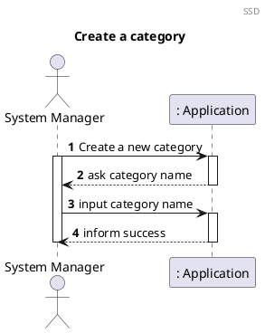
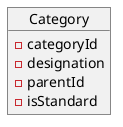
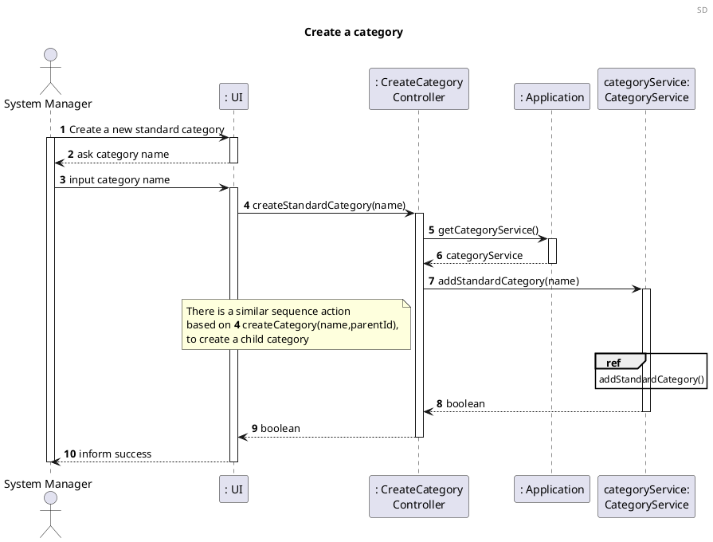
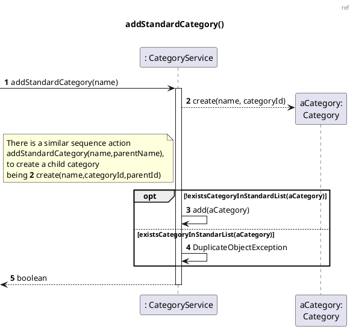
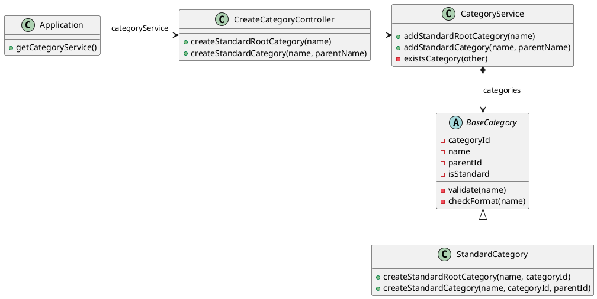

# US001 Create standard category

# 1. Requirements

_As a system manager I want to create a standard category._

To create a standard category we first need to know if the name already exists. If it
does not exist, then we can add it to the category list.

This US has no dependencies of any other User Story but [US002] needs some
categories to present data and [US110] needs categories associated with some
instance of Family [US010].



# 2. Analysis

## 2.1 Category entry

According to what was presented in the US, a standard category is created upon
request from the System Manager.

These categories can be used by any user of the Application.

A category should be created with an alphanumeric string as its
description/title, and repeated categories (i.e. with the same title) should not exist among the standard categories names.

Using this strategy, we decided that it would be better to create the category,
verify if its name already exists and, if not, then add it to the list of
categories.

Categories should have a unique identification across the application for two
reasons:

- It prevents user errors choosing a category;
- It prevents repeated additions of the same referring category.

Regarding [US002], categories should also have a tree structure (i.e. levels),
such as:

```
CATEGORIES
|-- Shopping (1)
|   |-- Groceries (1.1)
|   |   |-- Vegetables (1.1.1)
|   |   |-- Protein (1.1.2)
|   |   |-- Carbs (1.1.3)
|   |-- Clothes (1.2)
|-- Bills (2)
|   |-- Energy (2.1)
(...)
```

With that said, a Category object should have the following attributes:

| Attributes | Rules                                                          |
| ---------- | -------------------------------------------------------------- |
| categoryId | unique, required, integer, auto-incrementing                   |
| name       | required, alphanumeric, String                                 |
| parentId   | the id of a Category instance parent of this instance          |
| isStandard | a boolean to identify what categories are shipped with the Application |

## 2.2 Domain Model Excerpt

For quick reference, there's a relevant extract of the domain model.



# 3. Design

## 3.1. Functionality Development

Regarding the creation of a new family, we should accommodate the requirements
specified in [Analysis](#2-analysis).

The System Diagram is the following:





When the System Manager inputs the required data for a category to be created,
the Controller should then operate the required methods creating a new and valid
category.

## 3.2. Class Diagram

The Class Diagram is the following:



## 3.3. Applied Patterns

In order to achieve best practices in software development, to implement this US
we're using the following:

- *Single Responsibility Principle* - Classes should have one responsibility,
  which means, only one reason to change;
- *Information Expert* - Assign a responsibility to the class that has the
  information needed to fulfill it;
- *Pure Fabrication* - CategoryService was implemented to manage all things
  related to add a Category.
- *Creator* - To create a category we need to check if the category name doesn't
  exist.
- *Controller* - CreateCategoryController was created;
- *Low Coupling* - Classes were assigned responsibilities so that coupling
  remains as low as possible, reducing the impact of any changes made to objects
  later on;
- *High Cohesion* - Classes were assigned responsibilities so that cohesion
  remains high(they are strongly related and highly focused). This helps to keep
  objects understandable and manageable, and also goes hand in hand with the low
  coupling principle.

## 3.4. Tests

### 3.4.1 Unit Tests

Referring different aspects of the Categories attributes, we should test the
following:

- designation

    - **Unit Test 1:** Throw an error when creating a category with empty string.

      ```java
          @Test
           void createCategoryWithEmptyName() {
              CategoryService categoryService = new CategoryService();
              String designation = "";
              assertThrows(IllegalArgumentException.class, () -> categoryService.addStandardCategory(designation));
            }
        ```

- Category

    - **Unit Test 1:** Assert the creation of a new category.

      ```java
          @Test
          void createStandardCategoryWithAName(){
              String designation="TestCategory";
              Category category=Category.createStandardRootCategory(designation,0);
              String expected="Category{categoryId=0, name='TestCategory', parentId=-1, isStandard=true}";
              String result;
              result=category.toString();
              assertEquals(expected,result);
          }
      ```
        - **Unit Test 2:** Do not create repeating categories.

      ```java
      @Test
      void addRepeatedCategory() {
          CategoryService categoryService = new CategoryService();
          categoryService.addStandardRootCategory("shopping");
          categoryService.addStandardRootCategory("shopping");

          int expected = 1;
          int result = categoryService.getSize();

          assertEquals(expected, result);
      }
      ```

# 4. Implementation

The main challenges that were found while implementing this functionality were:

- How to distinguish a standard root category from a standard not root category;
- The need to identify a parent id;

To minimize these difficulties, a lot of research and study of reliable
documentation was done.

So that we could present a reliable functionality, many tests were done, to
identify as many possible errors in the implementation as possible.

# 5. Integration/Demonstration

As mentioned before, this functionality will be indirectly necessary for [US002]
because we need to have standard categories, so we can get them and for [US110]
that needs categories associated with some instance of Family [US010].

At the moment, no other user stories are dependent on this one, so its
integration with other functionalities cannot be tested further.

# 6. Comments

Possible modifications to the implementation might be done in the future, so as
to improve code reuse and simplicity, by implementing the use of interfaces and
inheritance principles.


[us002]: US002_Get_Standard_Categories.md
[us010]: US010_Create_Family.md
[us110]: US110_Get_Family_Category_Tree.md
