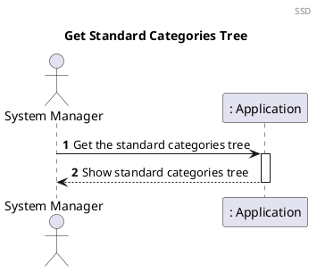
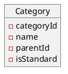
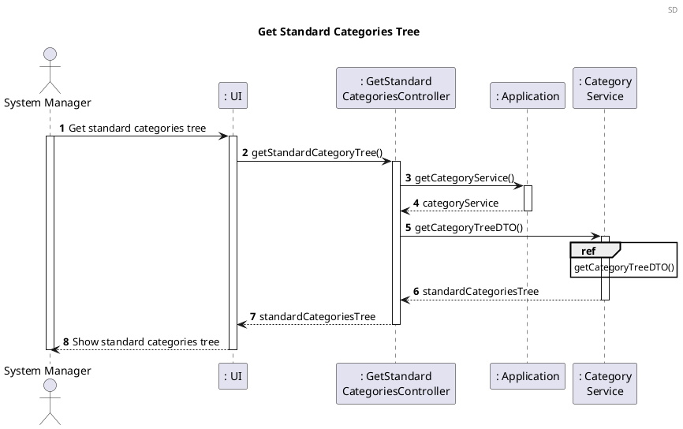
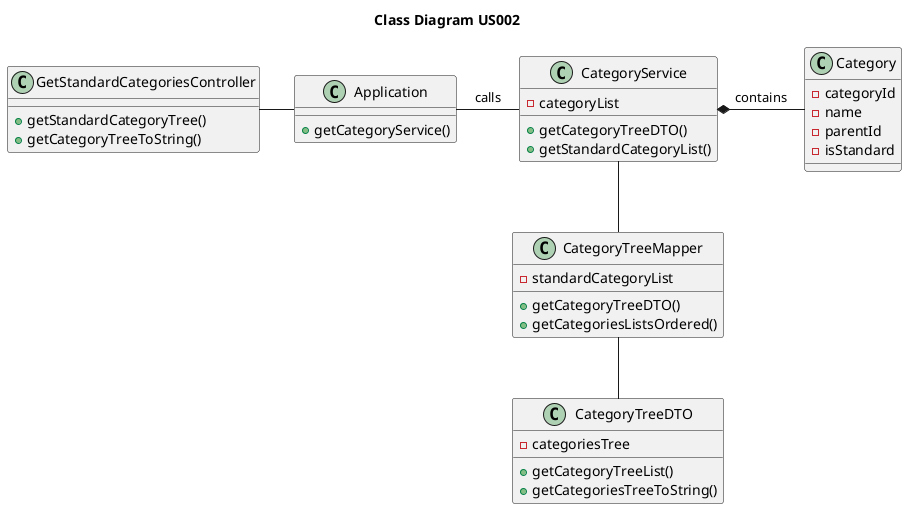

US002 Get Standard Categories
=======================================

# 1. Requirements

*As a system manager, I want to get the standard categories tree.*

This US depends on the [US001](US001_Create_Standard_Category.md) because we first need to have categories, so we can present the category tree.



# 2. Analysis

Categories are a concept of our domain model, in which it will be possible to
create standard and non-standard categories.

This distinction makes us assume that every standard category should be
accessible by any family and every non-standard category should be associated
with those standard ones. (*SWS provides a standard category tree that can be
customized by the family, i.e. the addition of new branches and leaves.*)

The standard categories should be stored in a place that every family has access
to, allowing a single change to be applied to all families.

Of this standard categories tree should also derive another tree, containing
categories created by said family.

## 2.1 Domain Model Excerpt

For quick reference, there's a relevant extract of the domain model.



# 3. Design

## 3.1. Functionality Development

The Sequence Diagram for this user story:


```puml
autonumber
header ref
title getCategoryTreeDTO()
participant ": Category\nService" as CS
participant ": CategoryTreeMapper" as Mapper

[-> CS : getCategoryTreeDTO()

activate CS
CS -> CS: getStandardCategoryList()
CS-->Mapper** : create (standardCategoryList)
activate Mapper

ref over Mapper 
getCategoryTreeDTO()
end ref

Mapper-->CS: standardCategoriesTree
deactivate Mapper

[<-- CS: standardCategoriesTree

deactivate CS
```

```puml
autonumber
title getCategoryTreeDTO()
participant ": CategoryTreeMapper" as Mapper
participant ": CategoryTreeDTO" as DTO

[-> Mapper : getCategoryTreeDTO()
activate Mapper

Mapper -> Mapper: getCategoriesListsOrdered()

Mapper --> DTO** : create(categoryTreeListOrdered)
activate DTO
DTO -> DTO: getCategoriesTreeToString()
DTO -->Mapper: standardCategoriesTree

deactivate DTO

[<-- Mapper: standardCategoriesTree
deactivate Mapper

```

## 3.2. Class Diagram



## 3.3. Applied Patterns

In order to achieve best practices in software development, to implement this US
we're using the following:

- *Single Responsibility Principle* - Classes should have one responsibility,
  which means, only one reason to change;
- *Information Expert* - Assign a responsibility to the class that has the
  information needed to fulfill it;
- *Pure Fabrication* - Category Service was implemented to manage all things
  category related.
- *Creator* - Standard categories are created by Category Service;
- *Controller* - GetStandardCategoriesTreeController was created;
- *Low Coupling* - CategoryService is the only class responsible to return the
  tree.
- *High Cohesion* - CategoryService is the only class responsible to return the
  tree.

## 3.4. Tests

### 3.4.1 Unit Tests

**Test 1:** Obtain the Standard Category List Tree as a DTO:

```java
@Test
    void getStandardCategoryTree_AsExpected() {
            String name = "Shopping";
            CreateStandardCategoryController createStandardCategoryController = new CreateStandardCategoryController(application);
            createStandardCategoryController.createStandardCategory(name);

            CategoryTreeDTO result = getStandardCategoryController.getStandardCategoryTree();

            assertNotNull(result);
            }
```

**Test 2:** Obtain the Standard Category List Tree as a String:

```java
@Test
    void getStandardCategoryToString_AsExpected() {
            String name = "Shopping";
            String expected = "|-- Shopping";
            CreateStandardCategoryController createStandardCategoryController = new CreateStandardCategoryController(application);
            createStandardCategoryController.createStandardCategory(name);

            String result = getStandardCategoryController.getStandardCategoryToString();

            assertEquals(expected, result);
            }
```

**Test 3:** Get an empty category tree list:
```java
@Test
    void getStandardCategoryTree_NullList() {
        List<Category> expectedList = new ArrayList<>();
        CategoryTreeDTO expectedDTO = new CategoryTreeDTO(expectedList);

        CategoryTreeDTO resultDTO = getStandardCategoryController.getStandardCategoryTree();

        assertEquals(expectedDTO.getCategoryTreeList(), resultDTO.getCategoryTreeList());
    }
```

# 4. Implementation

The main challenges found while implementing this functionality were:
 
 - The dependency on other functionalities to implement and test this functionality correctly.
 
 To minimize this difficulty, a lot of research and study of reliable documentation was done.
 
 In order to have a reliable functionality, many tests were done, 
 to identify as many possible errors in the
 implementation as possible.

# 5. Integration/Demonstration
As mentioned before, this functionality has dependency from [US001](US001_Create_Standard_Category.md). 
The development of this functionality helps to prove a good integration 
of the [US001](US001_Create_Standard_Category.md) functionality and its system components.

At the moment, there are no User Stories dependent on the development of this User Story, 
therefore its integration with other functionalities/features
cannot be tested further.

# 6. Observations
A feature that would be interesting to implement, in the future, is the possibility to add, remove or edit standard categories.