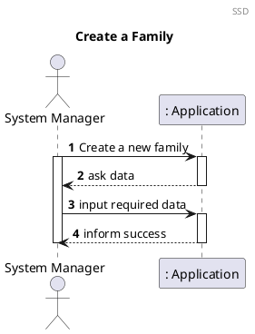
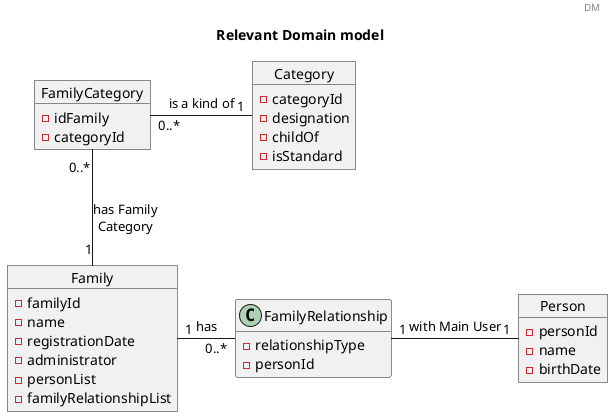
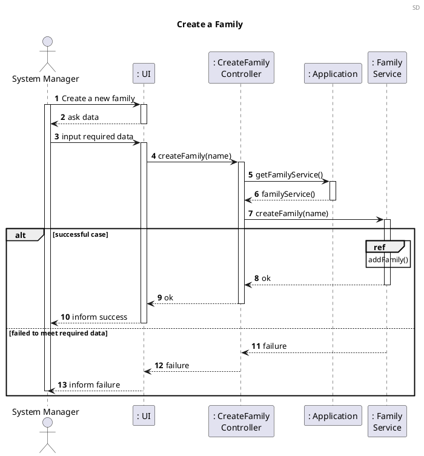
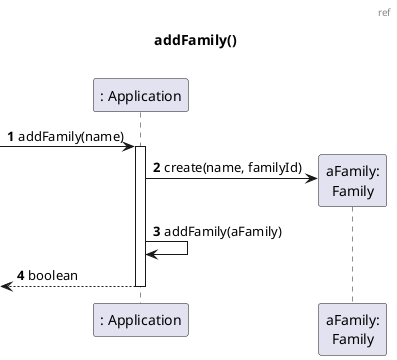
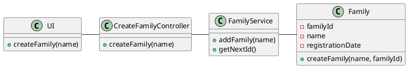

# US010 Create a Family

# 1. Requirements

_As a system manager, I want to create a family._

When creating a family, there are some criteria that must be met. Otherwise, the
family must not be created.

Following the required fields given from the proposition, a family will have

- name,
- registration date,
- its members (a collection of Person),
- administrator (one of its members).

Besides family members ([US101]), there's also the importance of relationships
between two members of the same family, relying on [US105].

## 1.1 System Sequence Diagram

This is the SSD representing the interactions between the user and the system.



# 2. Analysis

## 2.1 Family entity

According to what was presented to us, a Family should aggregate their members,
and a number of properties specific to that family.

A Family instance should have the following attributes:

| Attributes                                          | Rules                                                                                                                   |
| --------------------------------------------------- | ----------------------------------------------------------------------------------------------------------------------- |
| familyId                                            | Unique, required, integer, auto-incrementing                                                                            |
| name                                                | Required, only letters                                                                                                  |
| registrationDate                                    | java.time.Date object                                                                                                   |
| administrator:Person                                | A Person object referring to the family administrator                                                                   |
| personList:List\<Person\>                           | This should aggregate all Person objects that belongs to one family                                                     |
| familyRelationships:</br>List\<FamilyRelationship\> | This should aggregate all Relationship objects that belongs to one family                                               |
| vatList:List\<Vat\>                                 | This should aggregate all Vat objects that belongs to one family, Vat being the (Value Added Tax Identification Number) |
| familyCategoryList:</br>List\<Category\>            | This should aggregate all non-standard Category objects that belongs to one family                                      |

Our analysis of this User Story relies on its sum importance to the core
development of this app. Families gather the core responsibility of aggregating
users, and it is about the whole family that the app structure will work.

## 2.2 Domain Model Excerpt

For quick reference, there's a relevant extract of the domain model.



# 3. Design

## 3.1. Functionality Development

Regarding the creation of a new family, we should accommodate the requirements
specified in [Analysis](#2-analysis).

The System Diagram is the following:





Families should be created at the upmost level of our application, because of
their dependencies and following the requirements of the US.

When the System Manager inputs the required data for a family to be created then
the Controller should operate the required methods creating a new and valid
family.

A Family is always created because multiple Surnames can be used to identify
different families. A verification regarding this attribute can't be used to
differ families.

## 3.2. Class Diagram

The Class Diagram is the following:



Only relevant attributes are represented above.

## 3.3. Applied Patterns

In order to achieve best practices in software development, to implement this US
we're using the following:

- _Single Responsibility Principle_ - Classes should have one responsibility;
- _Information Expert_ - Assign a responsibility to the class that has the
  information needed to fulfill it;
- _Pure Fabrication_ - FamilyService was implemented to manage everything
  related to family.
- _Controller_ - CreateFamilyController was created;
- _Low Coupling_ - The controller delegates to FamilyService the responsibility
  of creating an instance of Family.
- _High Cohesion_ - The controller delegates to FamilyService the responsibility
  of creating an instance of Family.

## 3.4. Tests

### 3.4.1 Unit Tests

Referring different aspects of the Family attributes, we should test the
following:

- Name
    
    - **Unit Test 1:** Throw an error when creating a family with no name.

        ```java
        @Test
            void createFamilyWithNullName() {
                String name = null;
                assertThrows(IllegalArgumentException.class, () -> {
                    Family result = Family.createFamily(name, 0);
                });
            }
        ```

- Family
  
    - **Unit Test 1:** Assert the creation of a family with some name.
    
        ```java
            @Test
            void createFamilyWithAName(){
                String name="TestFamily";
                Family result=Family.createFamily(name,0);
                assertNotNull(result);
            }
        ```

    - **Unit Test 2:** Assert the creation of a family with some name containing spaces.
      
        ```java
        @Test
        void createFamilyNameWithSpaces(){
            String name="Silva Costa";
            Family result=Family.createFamily(name,0);
            assertNotNull(result);
        }
        ```
    

# 4. Implementation

No implementation notes worth of mention.

# 5. Integration/Demonstration

As a top level class, there are no integration directly performed by this user story.
Its integration tests are implemented by other user stories.

# 6. Observations

Other user stories that refer to this user story:

[US101](US101_Add_Family_Member.md) - Add family member;

[US105](US105_Create_Relationship.md) - Create relationship.
