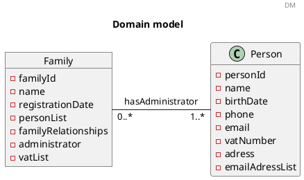
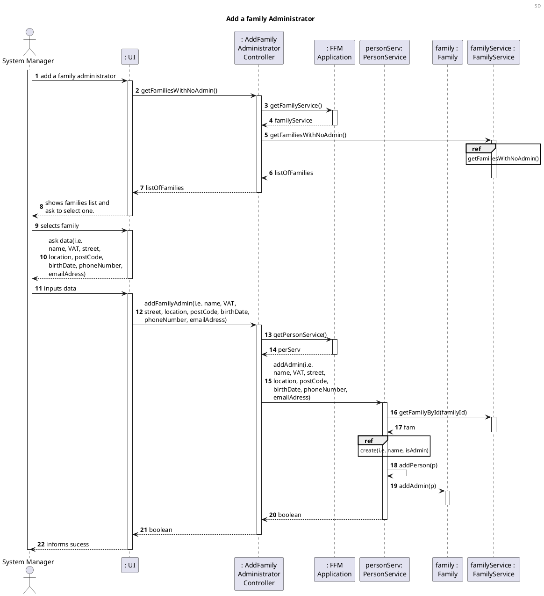
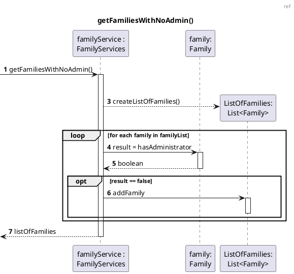
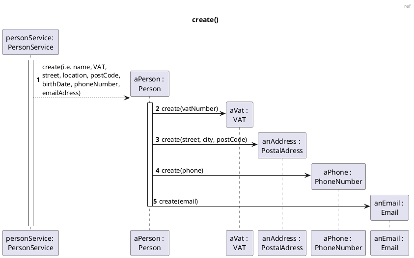
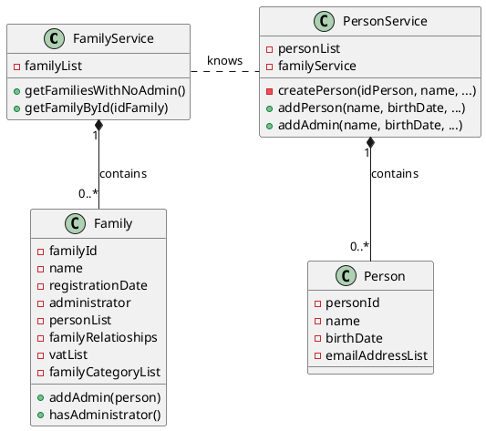

US011 Add Family Administrator
=======================================


# 1. Requirements


*As a system manager I want to add a family administrator.*

To add a family administrator we first need to see the families with no administrator.
After that, the system manager can choose one of those families and add an administrator.

Following the required fields given from the proposition, an administrator must have:

- name,
  
- VAT,
  
- street, location, post code,
  
- birthdate,
  
- phone number,
  
- e-mail address.

This user story is dependent of [US010] because we need to have, at least, one family created to add the administrator.

However, the user stories [US101], [US104], [US105], [US110], [US120], [US150] and [US151] depend on this functionality to add a family administrator.

The [US101], [US104], [US105], [US110] and [US120] are directly related to this one because, if we are not able to add a family administrator, none of the other functionalities is possible. By consequence, if I can't add members we will not be able to perform the [US150] and [US151].

## 1.1 System Sequence Diagram

This is the SSD representing the interactions between the user and the system.
```puml

header SSD
title Add a family Administrator
autonumber
actor "System Manager" as SM
participant ": Application" as app

activate SM

SM-> app : add a family administrator
activate app
app --> SM : shows families list with no administrator. Ask to select one.

deactivate app

SM -> app : selects family
activate app
app --> SM : ask data(name, VAT, street, location, postCode, birthDate, phoneNumber, emailAdress)
deactivate app

SM-> app : inputs data
activate app
app --> SM : informs sucess
deactivate app
deactivate SM 

```

# 2. Analysis

## 2.1 Administrator entry

The administrator is an instance of {Person}.

A Person instance to add one administrator should have the following attributes:

| **_Attributes_**    | **_Rules_**       |
| :--------------------------------- | :----------------- |
| **personId**      | Unique, required, integer, auto-incrementing |
| **name**          | Required, follows the regex : `^[-'a-zA-ZÀ-ÖØ-öø-ÿ\s]*$`|
| **VAT**           | Unique, required, follows the regex : `^[123][0-9]{8}$` |
| **street**        | Required, follows the regex : `^[-'a-zA-ZÀ-ÖØ-öø-ÿ\s,]+[0-9]*$`|
| **location**      | Required, follows the regex : `^[-'a-zA-ZÀ-ÖØ-öø-ÿ\s]*$`|
| **postCode**      | Required, follows the regex : `^[1-9][0-9]{3}(?:-[0-9]{3})$`|
| **birthDate**     | Required, alphanumeric (String), with format "31/12/2021" |
| **phoneNumber**   | Required, follows the regex : `^9[1236][0-9]{7}$^2[1-9][0-9]{7}$`|
| **emailAddress**  | Unique, required, follows the regex: `^[a-zA-Z0-9_+&*-]+(?:\\." +"[a-zA-Z0-9_+&*-]+)*@" + "(?:[a-zA-Z0-9-]+\\.)+[a-z" + "A-Z]{2,7}$"` |

## 2.2 Domain Model Excerpt

For quick reference, there's a relevant extract of the domain model.



# 3. Design

In order to fulfill this requirement, we need to:

- get a list of families without an administrator;
- choose one of those families;
- insert data to create the administrator;
- add the administrator to the family.


## 3.1. Functionality Development

Regarding the add of the administrator, we should accommodate the requirements specified in [Analysis](#2-analysis).

The System Diagram is the following:






The family administrator should be added at the one of upmost level of our application, because of their dependencies and following the requirements of the US.

When the System Manager inputs the required data for an administrator to be added then the Controller should operate the required methods to add the administrator to one of the families with no administrator.

The administrator is always added to a family with no administrator cause each family can only have one.


##3.2 Class Diagram

The Class Diagram is the following:




## 3.3. Applied Patterns


In order to achieve best practices in software development, to implement this US
we're using the following:

- *Single Responsibility Principle* - Classes should have one responsibility,
  which means, only one reason to change;
- *Information Expert* - Assign a responsibility to the class that has the
  information needed to fulfill it;
- *Pure Fabrication* - Person Service and Family Service was implemented to manage all things related to add an administrator.
- *Creator* - To add an administrator we first need to create the person. First the Person Service creates the person and then de Family Service adds the administrator to the family.
- *Controller* - AddFamilyAdministratorController was created;
- *Low Coupling* - The family class depends on the person class because we always need to create the person first and then added to the family.
- *High Cohesion* - The class Person at this US is the more cohesive class for this US. 
  
## 3.4. Tests 

**Test 1:** List all families without administrator

```java
@Test
void returnListOfFamiliesWithNoAdminAllFamilies() {
Family family = familyService.getFamilyById(0);
Family family1 = familyService.getFamilyById(1);
Family family2 = familyService.getFamilyById(2);
List<Family> expected = new ArrayList<>();

        expected.add(family);
        expected.add(family1);
        expected.add(family2);

        List<Family> result = familyAdministratorController.getFamiliesWithNoAdmin();

        assertArrayEquals(expected.toArray(), result.toArray());
        assertNotSame(expected, result);
    }
```

**Test 2:** All families have administrator

```java
@Test
void returnListOfFamiliesWithNoAdminNull() {
personService.addAdmin("Rita", "23/04/1998", "5426573", "adk856fhsaefk@sadjf.pt", 2347568, "Rua xdfg", "3500-425", "qwertyu", 2);
personService.addAdmin("adminName", "12/12/12", "234324234", "resfvesf@gea.pt", 234234234, "sdgvzf0", "3440-344", "aergb", 0);
personService.addAdmin("adminName1", "12/12/20", "234324734", "resfvetf@gea.pt", 234234274, "sdgvzf0", "4300-344", "aergb", 1);

        List<Family> result = familyAdministratorController.getFamiliesWithNoAdmin();

        assertNull(result);
    }
```

**Test 3:** Some families have administrator and other don't

```java
@Test
void returnListOfFamiliesWithNoAdminTwoOutOfThree() {
Family family = familyService.getFamilyById(0);
Family family1 = familyService.getFamilyById(1);
personService.addAdmin("Rita", "23/04/1998", "5426573", "adk856fhsaefk@sadjf.pt", 2347568, "Rua xdfg", "5334-425", "qwertyu", 2);

        List<Family> expected = new ArrayList<>();

        expected.add(family);
        expected.add(family1);

        List<Family> result = familyAdministratorController.getFamiliesWithNoAdmin();

        assertArrayEquals(expected.toArray(), result.toArray());
        assertNotSame(expected, result);
    }
```

**Test 4:** Add successfully and administrator to a family without Administrator

```java
@Test
void addFamilyAdmin() {
Family family = familyService.getFamilyById(0);
int familyId = family.getFamilyId();
String name = "Pedro";
String birthDate = "30/11/1980";
String phoneNumber = "916666666";
String email = "pedro@gmail.com";
int vatNumber = 203040231;
String street = "Rua da Alegria";
String postalCode = "4400-000";
String location = "Gaia";

        boolean result = familyAdministratorController.addFamilyAdmin(name, birthDate, phoneNumber, email, vatNumber, street, postalCode, location, familyId);

        assertTrue(result);
    }
```

**Test 5:** Fails to create the person cause data is invalid

```java
@Test
    void invalidDataToTheAdministrator() {
        int familyId = 0;
        String name = "Pedro";
        String birthDate = "30/11/1980";
        String phoneNumber = "926666666";
        String email = "pedro@gmail.com";
        int vatNumber = 223440231;
        String street = "Rua da Alegria";
        String postalCode = "44-000";
        String location = "Gaia";

        boolean result = familyAdministratorController.addFamilyAdmin(name, birthDate, phoneNumber, email, vatNumber, street, postalCode, location, familyId);

        assertFalse(result);
    }
```

# 4. Implementation

On this user story we think that the major challenge was to find a way to don't allow the application to create two different persons with the same data, and how we should characterize the administrator.

To fulfill all the requirements, we decided that we can create two persons with the same data and different id's, but we can't allow that person to be added twice in the same family. The best way to do that was to add a verification on the family for the VAT and don't allow adding two persons with the same VAT on the same family.

For the administrator characterization, we decided that would be better to have an attribute on the family that is the person Administrator. This person will also be added to the family member list.

# 5. Integration/Demonstration

As mention before, this user story is crucial for proper operation of another user stories that depend on adding family members, relationships, get the list of relationships, get the family category tree and creat family cash account.

# 6. Observations

Other user stories that refer to this user story:

[US104](US104_Get_List_Of_Members_And_Relations.md) - Get list of members and relations;

[US105](US105_Create_Relationship.md) - Create relationship;

[US010](US010_Create_Family.md) - Create family;

[US011](US011_Add_Family_Administrator.md) - Add family administrator;

[US101](US101_Add_Family_Member.md) - Add family member;

[US110](US110_Get_Family_Category_Tree.md) - List family category tree;

[US120](US120_Create_Family_Cash_Account.md) - Create family cash account;

[US150](US150_Get_Profile_Information.md) - Get profile information;

[US151](US151_Add_EmailAccount.md) - Add email account.

