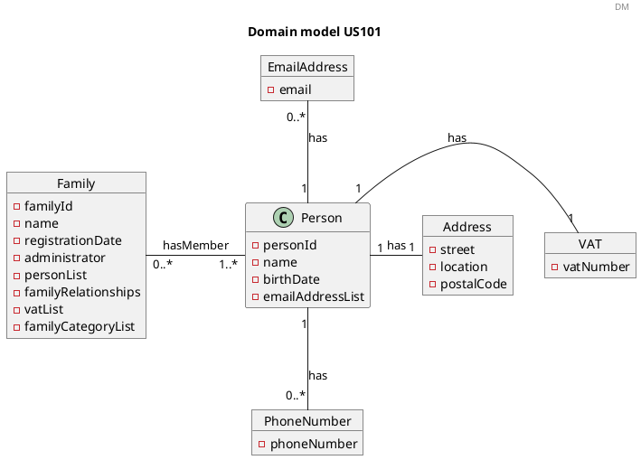
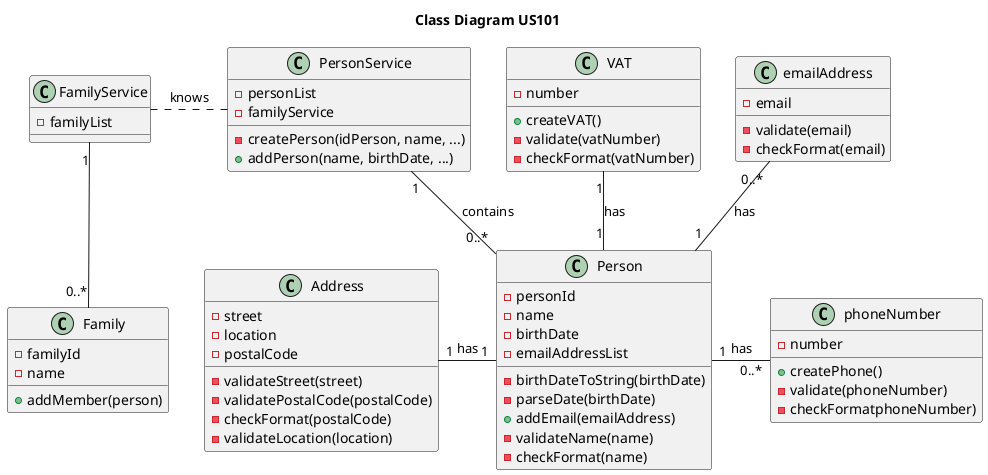

US101 Add Family Members
=======================================

# 1. Requirements

*As a family administrator, I want to add family members.*

This functionality will allow the family administrator to add members to the family.

The addition of family members is crucial to the objective of this app which is to manage all the finances of a given
family.

To include a family member the following data must be provided:

- name,

- VAT,

- street, location, post code,

- birthdate,

- phone number,

- e-mail address.
  
This user story is dependent of [US010](US010_Create_Family.md) because we need to have at least one family created to add a member
and in the same line of thought [US011](US011_Add_Family_Administrator.md) is also crucial to the functioning of this user story because 
it will be the administrator that adds new members to a given family.

However, the user stories [104 - As a family administrator, I want to get the list of family members and their relations], [105 - As a family administrator, I want to create a relation between two family members], [150 - As a family member I want to get my profile's information] and [151 - As a family member, I want to add an email account to my profile] depend on this functionality to add a family member.

The user story 104, 105, 150 and 151 are directly related to this one because if we are not able to add a family member none of the other functionalities will be possible.
## 1.1 System Sequence Diagram

```puml

header SSD
title Add a Family Member
autonumber
actor "Family Administrator" as Ad
participant ": App" as App


Ad-> App : add a family member
activate Ad
activate App
App-> Ad : Ask data
deactivate App


Ad-> App : Input data
activate App
App --> Ad : inform result
deactivate App
deactivate Ad 

```

# 2. Analysis

## 2.1 Person Entry

The Member is an instance of {Person}.

A Person instance to add one member should have the following attributes:

| **_Attributes_**    | **_Rules_**       |
| :--------------------------------- | :----------------- |
| **personId**      | Unique, required, integer, auto-incrementing |
| **name**          | Required, follows the regex : `^[-'a-zA-ZÀ-ÖØ-öø-ÿ\s]*$`|
| **VAT**           | Unique, required, follows the regex : `^[123][0-9]{8}$` |
| **street**        | Required, follows the regex : `^[-'a-zA-ZÀ-ÖØ-öø-ÿ\s,]+[0-9]*$`|
| **location**      | Required, follows the regex : `^[-'a-zA-ZÀ-ÖØ-öø-ÿ\s]*$`|
| **postCode**      | Required, follows the regex : `^[1-9][0-9]{3}(?:-[0-9]{3})$`|
| **birthDate**     | Required, alphanumeric (String), with format "31/12/2021" |
| **phoneNumber**   | Optional, follows the regex : `^9[1236][0-9]{7}$^2[1-9][0-9]{7}$`|
| **emailAddress**  | Unique, optional, follows the regex: `^[a-zA-Z0-9_+&*-]+(?:\\." +"[a-zA-Z0-9_+&*-]+)*@" + "(?:[a-zA-Z0-9-]+\\.)+[a-z" + "A-Z]{2,7}$"` |


## 2.2 Domain Model



# 3. Design

## 3.1. Functionality Development

### 3.1.1 Sequence Diagrams

```puml

header SD
title Add a Family member
autonumber
actor "Family Administrator" as Ad
participant ": UI" as UI
participant ": AddFamilyMember\nController" as AFM
participant ": Application" as app
participant ":PersonService" as ps


Ad-> UI : add a person
activate Ad
activate UI
UI-> Ad : ask data
deactivate UI

Ad-> UI : Inputs data
activate UI
UI-> AFM : addFamilyMember()
activate AFM
AFM-> app : getPersonService()
activate app
app-->AFM : personService
deactivate app
    
AFM-> ps : addFamilyMember()
activate ps
ref over ps: addFamilyMember()
ps --> AFM : boolean
deactivate ps
AFM --> UI: boolean
deactivate AFM
UI--> Ad : Inform result
deactivate UI 
deactivate Ad

```

```puml
header ref
title addFamilyMember()
autonumber
participant " :PersonService" as app

participant "personList\n: List<Person>" as ml

[-> app: addFamilymember()

activate app

app-> Person as "aPerson\n:Person"**: create()
activate Person
Person->"aVAT\n:VAT"** : create(VAT)
Person->"anAddress:\nAddress"** : create(address)
Person->"aPhoneNumber\n:PhoneNumber"** : create(phoneNumber)
Person->"anEmailAdress\n:EmailAddress"** : create(emailAddress)
Person-->app : boolean
deactivate Person

app -> ml: add(aPerson)
activate ml
deactivate ml

[<-- app : boolean
deactivate app

```

## 3.2. Class Diagram



## 3.3. Applied Standards

As to achieve the best practices in software development, in order to implement this US
we used the following:

- *Single Responsibility Principle* - Classes should have one responsibility,
  which means, only one reason to change;
  

- *Information Expert* - Assign a responsibility to the class that has the
  information needed to fulfill it;
  

- *Pure Fabrication* - Person Service was implemented to manage all things related to adding a member.
  

- *Creator* - To add a member we first need to create the person. First the Person Service creates the person and then the Family Service adds the member to the family.


- *Controller* - AddFamilyMemberController was created;
  

- *Low Coupling* - The family class depends on the person class because we always need to create the person first and then add to the family.


- *High Cohesion* - The class Person in this US is the more cohesive class.


## 3.4. Tests

**Test 1:** Invalid Name
```java
@Test
public void creatingInvalidName() {
        int personId = 1;
        String birthDate = "30/11/1980";
        String phoneNumber = "916666666";
        String email = "pedro@gmail.com";
        int vatNumber = 203040231;
        String street = "Rua da Alegria";
        String postalCode = "4400-000";
        String location = "Gaia";
        Throwable exception =
        assertThrows(IllegalArgumentException.class, () -> {
        Person name = new Person(personId, "123", birthDate, phoneNumber, email, vatNumber, street, postalCode, location);
        });
        }
```

**Test 2:** Invalid Street
```java
@Test
public void creatingInvalidStreetAddressWithSpecialCharacter() {
String postalCode = "4000-123";
String location = "Porto";
Throwable exception =
assertThrows(IllegalArgumentException.class, () -> {
Address street = new Address("Rua da/ Cruz", postalCode, location);
});
}
```
**Test 3:** Invalid Postal Code
```java
@Test
public void createInvalidPostalCode() {
String street = "Rua da Cruz";
String location = "Porto";
Throwable exception =
assertThrows(IllegalArgumentException.class, () -> {
Address postalCode = new Address(street, "0000-000", location);
});
}
```
**Test 4:** Invalid Location
```java
@Test
public void creatingInvalidLocation() {
String postalCode = "4000-123";
String street = "Rua da Cruz";
Throwable exception =
assertThrows(IllegalArgumentException.class, () -> {
Address location = new Address(street, postalCode, "123");
});
}
```
**Test 5:** Invalid Phone Number
```java
@Test
public void creatingPhoneNumberWithAnInvalidFirstDigit() {
String invalidPhoneNumber = "191958568";
Throwable exception =
assertThrows(IllegalArgumentException.class, () -> {
PhoneNumber phoneNumber = new PhoneNumber(invalidPhoneNumber);
});
}
```

**Test 6:** Invalid VAT
```java
@Test
public void creatingInvalidVatWithLessThanNineNumbers() {
Throwable exception =
assertThrows(IllegalArgumentException.class, () -> {
Vat vatNumber = new Vat(12345678);
});
}
```

# 4. Implementation

As this particular functionality was being implemented some challenges were found when trying to make it work, which were:

- The need for some functionalities to be fully working so as to implement this user story correctly.

- Having to deal with, to some extend, an ambiguous user story.

To minimize these difficulties, a lot of research and study of reliable documentation was done. There was communication with the Product Owner whenever needed, to clarify some of the requirements.

So that we could present a reliable functionality, many tests were done, to identify as many possible errors in the
implementation as possible.


# 5. Integration/Demonstration
The implementation of this user story is fundamental to the core objective of this application since its purpose is managing the finances of several people in the same family is only possible if there are members added to said family. 

# 6. Observations

https://stackoverflow.com/questions/19105134/regex-for-date-of-birth
https://howtodoinjava.com/java/regex/us-postal-zip-code-validation/
https://stackoverflow.com/questions/201323/how-to-validate-an-email-address-using-a-regular-expression
https://stackoverflow.com/a/48925757

