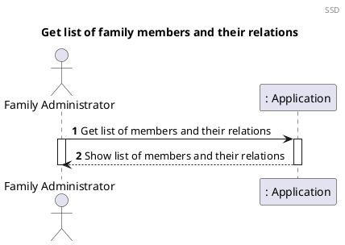
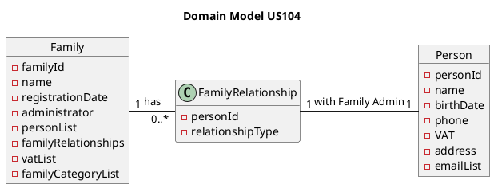
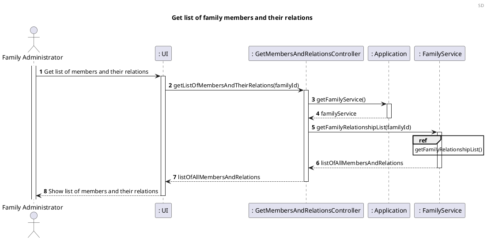
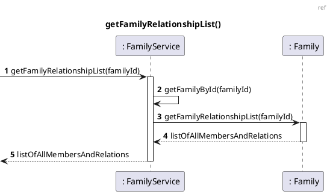
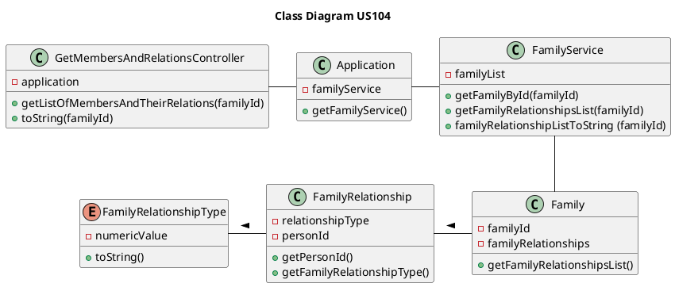

US104 Get list of family members and their relations
=======================================


# 1. Requirements

*As a family administrator, I want to get the list of family members and their relations.*

The Family Administrator wants to get access to all the members from his/her family and the relationships towards the main user (in this case him/herself). This list is represented by the family member and the designation of the relationship type.

## 1.1 System sequence diagram

The system sequence diagram below represents the communication between Family Administrator and the Application.


## 1.2. Dependency of other user stories

US104 is dependent on [US010], [US011] and [US101], because a family, a family administrator and family members (at 
least one) must exist in order to get the list of family members.

US104 is also dependent on [US105], so the relation between members in a family can be retrieved and displayed on a 
list.


# 2. Analysis

The scope of this problem is the family of the Family Administrator. For this requirement, the information about all 
members and relationships between them is in the Family class. The other information needed is the familyId, that 
will eventually be provided by the system, but for now, is provided by the tester.

Following [US105], a Family Relation towards the Family Administrator is characterized by the relationship type 
(designation of the relation) and the member (id). Once it is created, it's added to the family. So this information 
belongs to the family.

In the future, for visualization and UI purposes, the list might be displayed with the name of the family member and 
the corresponding relationship type. 

## 2.1. Domain Model Excerpt

The relevant domain concepts for this user story:



# 3. Design

## 3.1. Functionality Development

The process consists in getting the list of all family members and their relations, providing the family Id, so the 
corresponding family can be retrieved from the list of all families in the application.




## 3.2. Class Diagram

The Classes involved in this US are:



## 3.3. Applied Patterns

- Single Responsibility Principle - All classes have only one and well-defined responsability.


- Controller - A controller (GetMembersAndRelationsController) receives and coordinates system operations connecting the UI layer to the App's logic layer.


- Information Expert - The flow of this process is entirely made following this principle: for a particular 
  responsibility, it is determined the information needed to fulfill it and where that information is stored.


- Pure Fabrication - Services classes represent a concept outside the problem's domain, but they have set of responsibilities designed to achieve low coupling, high cohesion and the potential for reuse.


- Low Coupling - Dependencies between classes are at their lowest point possible. The use of Services classes reduced the dependency level between them.


- High Cohesion - Due to low coupling, the responsibilities of each class are highly focused, therefore cohesion's high.


## 3.4. Tests

**Test 1:** Get a valid list
```java
@Test
    void returnSuccessfullyFamilyRelationshipsList() {

        Family family = createMockDataToCreateRelationshipTesting();
        int familyId = family.getFamilyId();
        familyService.createRelationship(family.getFamilyId(), 0, FamilyRelationshipType.Spouse);
        familyService.createRelationship(family.getFamilyId(), 1, FamilyRelationshipType.Child);
        List<FamilyRelationship> relationshipList = familyService.getFamilyRelationshipsList(familyId);

        int expectedListSize = 2;
        int actualListSize = relationshipList.size();

        assertEquals(expectedListSize, actualListSize);
        assertNotNull(relationshipList);
    }
```

**Test 2:** Get a valid String list
```java
@Test
    void returnSuccessfullyFamilyRelationshipsStringList() {

        Family family = createMockDataToCreateRelationshipTesting();
        int familyId = family.getFamilyId();
        familyService.createRelationship(family.getFamilyId(), 0, FamilyRelationshipType.Spouse);
        familyService.createRelationship(family.getFamilyId(), 1, FamilyRelationshipType.Child);
        familyService.createRelationship(family.getFamilyId(), 2, FamilyRelationshipType.Child);
        List<String> relationshipStringListResult = familyService.familyRelationshipsListToString(familyId);

        List<String> expectedStringList = Arrays.asList("Maria - Spouse", "José - Child", "Rita - Child");

        int expectedListSize = 3;
        int actualListSize = relationshipStringListResult.size();

        assertEquals(expectedStringList, relationshipStringListResult);
        assertEquals(expectedListSize, actualListSize);
        assertNotNull(relationshipStringListResult);
    }
```

**Test 3:** Get an empty list
```java
@Test
    void returnAnEmptyFamilyRelationshipsList() {

        Family family = createMockDataToCreateRelationshipTesting();
        int familyId = family.getFamilyId();

        List<FamilyRelationship> relationshipList = familyService.getFamilyRelationshipsList(familyId);

        int expectedListSize = 0;
        int actualListSize = relationshipList.size();

        assertEquals(expectedListSize, actualListSize);
    }
```

**Test 4:** Get an empty String list
```java
@Test
    void returnAnEmptyFamilyRelationshipsStringList() {

        Family family = createMockDataToCreateRelationshipTesting();
        int familyId = family.getFamilyId();
            
        List<String> relationshipStringListResult = familyService.familyRelationshipsListToString(familyId);

        List<String> expectedStringList = Collections.emptyList();

        int expectedListSize = 0;
        int actualListSize = relationshipStringListResult.size();

        assertEquals(expectedStringList, relationshipStringListResult);
        assertEquals(expectedListSize, actualListSize);
    }
```

**Test 5:** Test exception when the family doesn't exist
```java
@Test
    void returnFamilyRelationshipsListWithFamilyIdThatDoesNotExist() {

        Family family = createMockDataToCreateRelationshipTesting();

        assertThrows(IllegalArgumentException.class, () -> {
            familyService.getFamilyRelationshipsList(1);
        });
    }
```

# 4. Implementation

The implementation of this user story had a coordination with the user story 105, due to their close dependency. No major challenges were observed.


# 5. Integration/Demonstration

The functionalities developed for this user story were successfully integrated with the US105. Right now no other user stories depend on this one.


# 6. Comments

Thinking of further functionalities regarding the family members and their relationships list, the implementation included methods to fulfill the requirements returning a List < String >. Also, a feature that can be related to this user story in the future would be about editing the list of relationships.

It can be also useful to implement a Data Transfer Object (DTO) class.


[us011]: US011_Add_Family_Administrator.md
[us010]: US010_Create_Family.md
[us101]: US101_Add_Family_Member.md
[us105]: US105_Create_Relationship.md