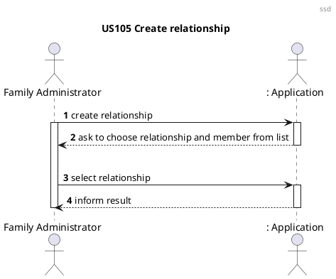
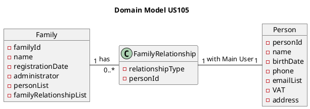
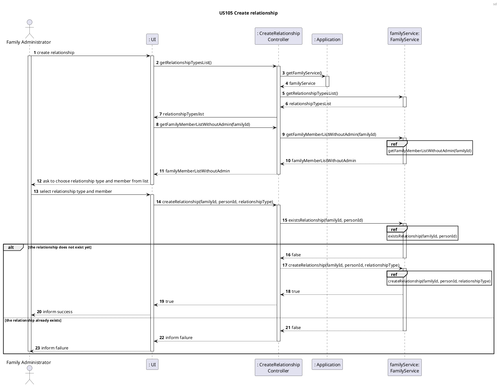
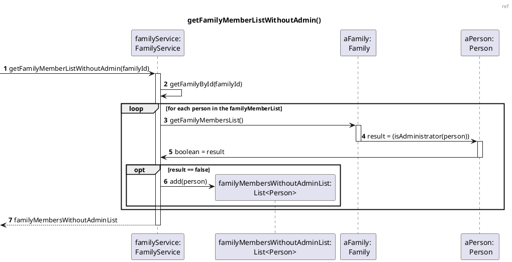
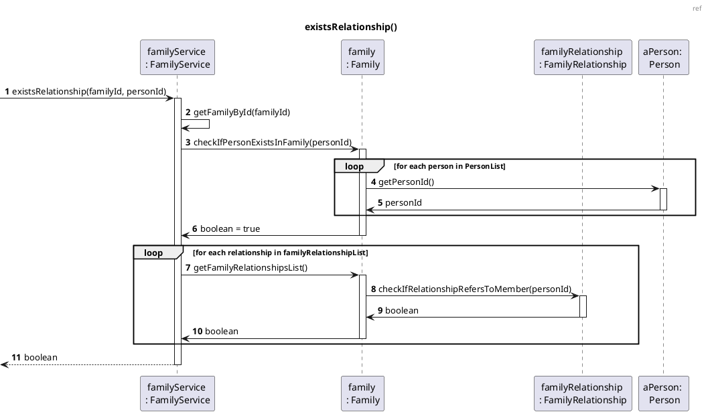
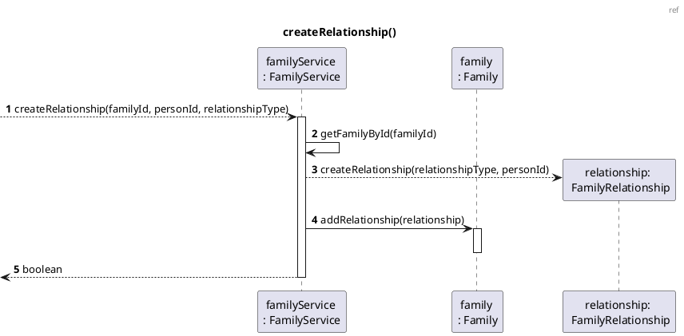
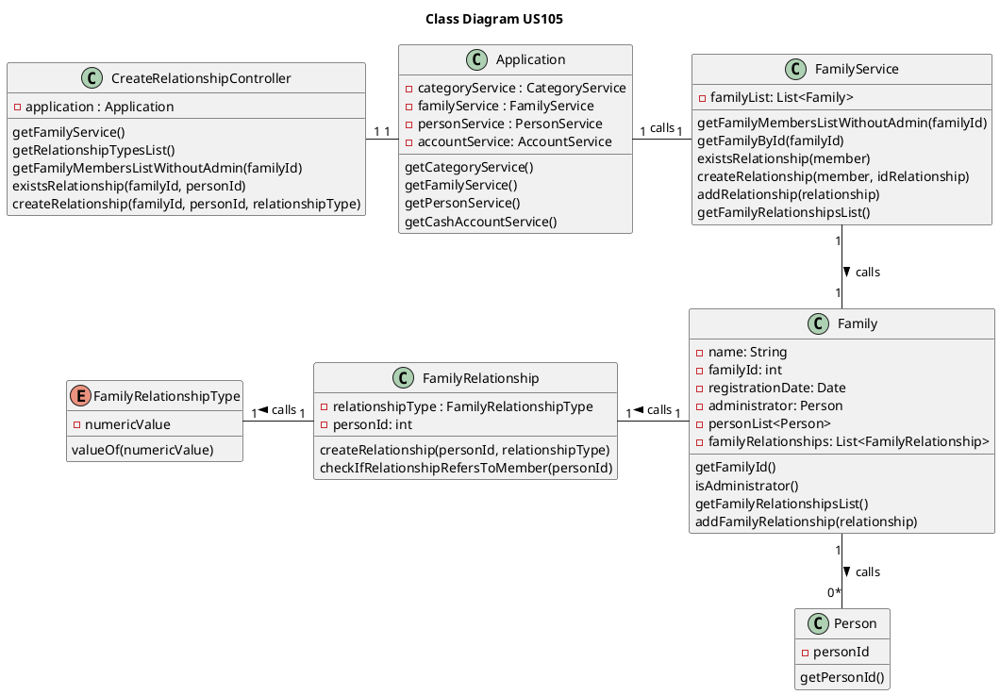

US105 Create a Relation Between Two Family Members
=======================================

# 1. Requirements

*As a family administrator, I want to create a relation between two family
members.*

From the project proposal: *"There are family relations in a family (son,
daughter, husband, wife, father, mother, etc.). All relations use the level of
the main user as a reference."*

The functionality will allow a family administrator to create a relationship
between themselves and another member of the same family. It was designed to
respond to the user story/requirement referred above.

The development team designed this functionality to allow the creation these
relationships only between members of the family in relation to the family
administrator, in order to simplify the information provided to the user.

## 1.1 System sequence diagram

# 1.2. Dependency of other user stories

This user story is dependent on [US010], [US011] and [US101], because without
having a family with an administrator and at least another family member, it
would be impossible to create a relationship.

Directly, this functionality will be necessary for [US104] because without it no
relationships between members would exist to be retrieved.

# 2. Analysis

The analysis of this user story is divided in two main sections:

### 2.1 Relationship creation

The relationship object, that corresponds to the relationship between the
administrator and another member of the same family, as mentioned before, will
have the following attributes:

Attributes       | Rules
-----------------|------------------
relationshipType | required, enum type constant
personId         | unique, required, integer

The possible relationship types implemented in this sprint are:

- Husband/Wife
- Partner
- Parent
- Child
- Sibling
- Grandparent
- Grandchild
- Uncle/Aunt
- Nephew/Niece
- Cousin

Each of these types will be represented by an _enum_ type constant, with a
numeric value attributed to it. Either the constant value and its numeric value
can be used to choose a relationship type. This list can be incremented in the
future, if necessary, with no repercussions.

### 2.2 Relevant domain model excerpt

Below is the excerpt of the domain model that is relevant for this user story.

# 3. Design

## 3.1. Functionality development

In the diagrams below, it is possible to see the implementation strategy for
this user story.

### 3.1.1 Sequence diagrams

## 3.2. Class Diagram

In the diagram below, all classes involved in this US are represented, as well
as their interactions.

## 3.3. Applied patterns

- *Single Responsibility Principle (SRP)* - FamilyRelationship and
  FamilyRelationshipType classes follow this principle, as they have one
  responsibility, which is to manage the information included within them.
- *Controller* - CreateRelationshipController receives and coordinates system
  operations, as it connects the UI layer to the application logic layer.
- *Information Expert* - To each class were assigned responsibilities that can
  be fulfilled because they have the information needed to do so;
- *Creator* - FamilyService class was assigned the responsibility to instantiate
  a FamilyRelationship, because it had the necessary data that would be passed
  on to it.
- *Pure Fabrication* - FamilyService class is a class that does not represent a
  domain concept, and it was assigned a set of responsibilities to support high
  cohesion, low coupling and reuse.
- *Low Coupling* - Classes were assigned responsibilities so that coupling
  remains as low as possible, reducing the impact of any changes made to objects
  later on;
- *High Cohesion* - Classes were assigned responsibilities so that cohesion
  remains high (they are strongly related and highly focused). This helps to
  keep objects understandable and manageable, and also goes hand in hand with
  the low coupling principle.

## 3.4. Domain tests

### 3.4.1. Integration testing

Below is the list of integration tests, organized by the correspondent class:

- **Controller**
    - **Integration test 1:** Verify that it is possible to get the list of
      relationship types successfully;
    - **Integration test 2:** Verify that it is possible to get the list of
      members, except the administrator, of a family successfully (two cases);
    - **Integration test 3:** Verify that it is not possible to get the list of
      members, except the administrator, of a family when the family Id does not
      exist;
    - **Integration test 4:** Verify that it is possible to create a
      relationship successfully;
    - **Integration test 5:** Verify that it is not possible to create a
      relationship with a family id that does not exist;
    - **Integration test 6:** Verify that it is not possible to create a
      relationship with a person id that does not exist;
    - **Integration test 7:** verify that it is not possible to create a
      relationship when the family member already has one with the
      administrator;

- **FamilyService**
    - **Integration test 1:** Verify that it is possible to get the list of
      relationship types successfully (three cases);
    - **Integration test 2:** Verify that it is possible to get the list of
      members, except the administrator, of a family successfully (three cases);
    - **Integration test 3:** Verify that it is possible to create a
      relationship successfully (two cases);
    - **Integration test 4:** Verify that it is not possible to create a
      relationship with a family id that does not exist;
    - **Integration test 5:** Verify that it is not possible to create a
      relationship with a person id that does not exist;
    - **Integration test 6:** Verify that it is possible to check that a
      relationship between the family member and the administrator already
      exists;
    - **Integration test 7:** Verify that it is possible to check that a
      relationship between the family member and the administrator doesn't exist
      yet;

- **Family**
    - **Integration test 1:** Verify that a person exists in a family
      successfully (two cases);
    - **Integration test 2:** Verify that a person does not exist in a family
      successfully;
    - **Integration test 3:** Verify that it is possible to get the family
      administrator successfully (two cases);
    - **Integration test 4:** Verify that, when there is no administrator, it is
      not possible to get the family administrator;
    - **Integration test 5:** Verify that it is possible to get the list of
      family relationships successfully, even when there are no relationships
      yet (three cases);
    - **Integration test 6:** Verify that it is possible to add a new
      relationship to the family relationships list successfully;

### 3.4.1. Unit testing

Below is the list of integration tests, organized by the correspondent class:

- **FamilyRelationship**
    - **Unit test 1:** Verify that it is possible to create a new relationship
      with the valid relationship type and person Id;
    - **Unit test 2:** Verify that it is not possible to create a new
      relationship with an invalid person Id;
    - **Unit test 3:** Verify that it is possible to create a new relationship
      with a valid relationship numeric value and person Id;
    - **Unit test 4:** Verify that it is not possible to create a new
      relationship with an invalid relationship numeric value (two cases);

- **FamilyRelationshipType**
    - **Unit test 1:** Verify that it is possible to return a family
      relationship type with the corresponding numeric value as input (two
      cases)
    - **Unit test 2:** Verify that it is not possible to return a family
      relationship type when the numeric value input doesn't correspond to any
      relationship type (two cases)

# 4. Implementation

The main challenges that were found while implementing this functionality were:

- The need for a strategy to store the relationship types that would allow the
  tester to choose from a numeric value if necessary;
- The dependency of other functionalities to be ready, to be able to test the
  implementation properly;
- The novelty of having to interpret a user story that may contain a few
  ambiguities;

To minimize these difficulties, a lot of research and study of reliable
documentation was done. There was communication with the Product Owner whenever
needed, to clarify some requirements.

So that we could present a reliable functionality, many tests were done, to
identify as many possible errors in the implementation as possible.

# 5. Integration/Demonstration

As mentioned before, this functionality will be indirectly necessary for
[US104] (*"As a family administrator, I want to get the list of family members
and their relations"*). The development of [US104] helps to prove a good
integration with this functionality and its system components.

At the moment, no other user stories are dependent on this one, so its
integration with other functionalities cannot be tested further.

# 6. Observations

As mentioned before, at the moment, only relationships between the administrator
and another family member are possible. For future sprints, broadening this
functionality so that relationships could be created between any two family
members is a possibility, if agreed or seen as necessary by the Product Owner.

# 7. Changelog

02/02/2021, Jaqueline Andre:
The team saw the need to change the implementation of this user story, so as to allow the 
creation of a relationship between any two members of the family and not just with the administrator and another 
family member. This facilitates the implementation of [US188].

[US010]: US010_Create_Family.md
[US011]: US011_Add_Family_Administrator.md
[US101]: US101_Add_Family_Member.md
[US104]: US104_Get_List_Of_Members_And_Relations.md
[US188]: [US188_Check_Balance_Of_A_Family_s_Children.md]