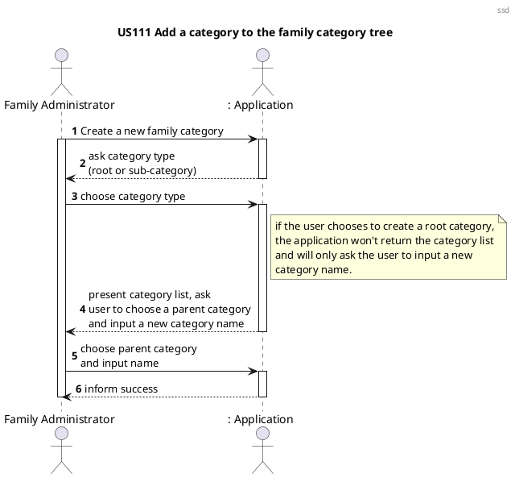
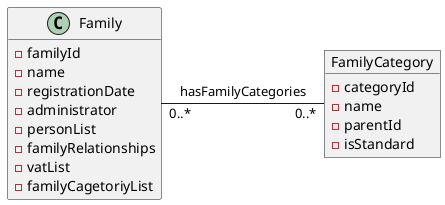
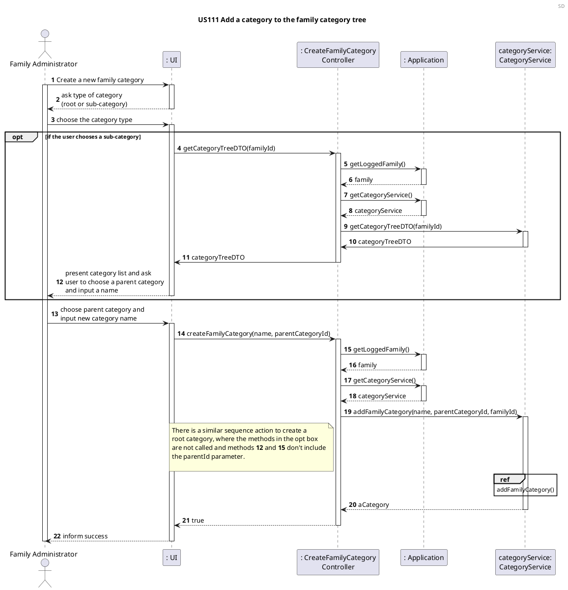
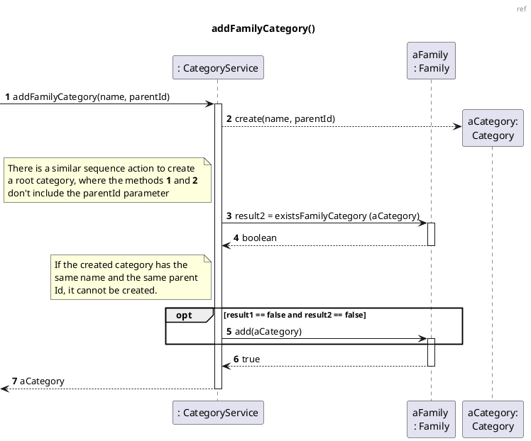
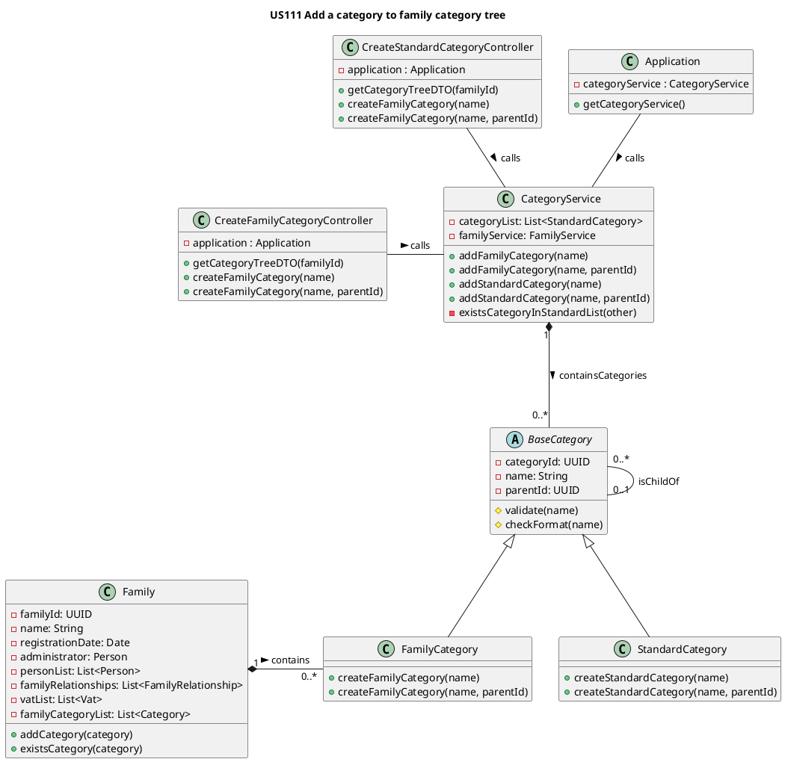

# US111 Add Category To Family Category Tree

# 1. Requirements

*As a family administrator, I want to add a category to the family’s category tree.*

*"SWS provides a standard category tree that can be customized by the family, i.e. the addition of new branches and 
leaves"*

The functionality created to respond to the User Story (US) and requirement above will allow a family administrator to 
add a customized transaction category to the family’s category tree.

## 1.1 System sequence diagram



# 1.2. Dependency of other user stories

This US is dependent on [US001](US001_Create_Standard_Category.md), because the functionality developed for it will allow 
the creation of a customized category as well. Without the creation of a new category, it would be impossible to add 
it to the family's category tree.

The functionality developed for this US will be necessary for [US110](US110_Get_Family_Category_Tree.md) because, 
without it, no customized family categories would exist in the list to be retrieved, only standard ones.

# 2. Analysis

The analysis of this user story is divided in two main sections:

## 2.1 Customized Category Tree entry

The customized category is created upon request from the family administrator and it can only be used within family.

It should be created with an alphanumeric string as its name/designation.

The development team decided that the implementation would go through the following steps:
1. The category is created;
2. There is a verification to check if its name is valid (it is considered not valid if it consists of only spaces 
   or if it is an empty string). If it isn't, an exception will be thrown.
3. There is a second verification to check if this category doesn't have the same name and the same parent Id as any 
   other category in the family category list. This means that categories with the same name can be created, but not 
   with the same parent category.
4. The category is added to the family's customized category list.
If the category to be created is a child category, then the parent category Id is also validated on step 2 (to 
check if the parent category exists).
   
This family's customized category list will then be merged with the standard category list, to form the family's 
category tree. This last step was already implemented in [US110](US110_Get_Family_Category_Tree.md).

As mentioned in [US001](US001_Create_Standard_Category.md), each category in the family's category tree should have the 
following attributes:

| **_Attributes_**    | **_Rules_**       |
| :------------------ | :---------------- |
| **categoryId**      | Unique, required, UUID, random |
| **name**            | Required, String |
| **parentId**        | Unique, UUID, random  |
| **isStandard**      | boolean |

The default isStandard value is false, which means that it will be a customized category.

### 2.2 Relevant domain model excerpt

Below is the excerpt of the domain model relevant for this user story.



# 3. Design

## 3.1. Functionality development

In the diagrams below, it is possible to see the implementation strategy for this user story.

### 3.1.1 Sequence diagrams





## 3.2. Class Diagram

In the diagram below, all classes involved in this US are represented, as well as their interactions.



## 3.3. Applied patterns

- *Single Responsibility Principle (SRP)* - Classes should have one responsibility, which means, only one reason to 
  change;
- *Controller* - CreateCategoryController receives and coordinates system operations, as it connects the UI layer 
  to the application logic layer.
- *Information Expert* - To each class were assigned responsibilities that can be fulfilled because they have the 
  information needed to do so;
- *Creator* - CategoryService was assigned the responsibility to manage all things related to adding a Category.
- *Pure Fabrication* - CategoryService is a class that does not represent a domain concept, and it was assigned a 
  set of responsibilities to support high cohesion, low coupling and reuse.
- *Low Coupling* - Classes were assigned responsibilities so that coupling remains as low as possible, reducing 
  the impact of any changes made to objects later on;
- *High Cohesion* - Classes were assigned responsibilities so that cohesion remains high (they are strongly related 
  and highly focused). This helps to keep objects understandable and manageable, and also goes hand in hand with 
  the low coupling principle.

## 3.4. Domain tests

- **Unit Test 1:** Verify that a root family category can be created successfully.

```java
@Test
void createCustomRootCategorySuccessfully() {
    String designation = "TestCategory";
    FamilyCategory category = FamilyCategory.createFamilyCategory(generatedId, designation);

    assertNotNull(category);
}
```
- **Unit Test 2:** Verify that a child family category can be created successfully.

```java
@Test
void createCustomChildCategorySuccessfully() {
    String rootName = "Shopping";
    FamilyCategory rootCat = FamilyCategory.createFamilyCategory(generatedId, rootName);
    UUID rootCatId = rootCat.getCategoryId();
    String childName = "Groceries";
    UUID generatedId2 = UUID.randomUUID();
    FamilyCategory childCat = FamilyCategory.createFamilyCategory(generatedId2, childName, rootCatId);
    UUID parentId = childCat.getParentId();
    
    assertNotNull(childCat);
    assertEquals(rootCatId, parentId);
    assertNotEquals(rootCat.hashCode(), childCat.hashCode());
}
```

- **Unit Test 3:** Verify that a category can't be created with an invalid name.

```java
@Test
void createCustomCategoryWithEmptyName() {
    String designation = "";
    
    assertThrows(InvalidNameException.class, () -> FamilyCategory.createFamilyCategory(generatedId, designation));
}
```

- **Unit Test 4:** Verify that a family category is successfully added to a family.

```java
@Test
void addChildFamilyCategorySuccessfully() {
    Family family = familyService.addFamily("Silva");
    UUID generatedId = UUID.randomUUID();
    FamilyCategory rootCategory = FamilyCategory.createFamilyCategory(generatedId,"RootCategory");
    UUID rootCategoryId = rootCategory.getCategoryId();
    UUID generatedId2 = UUID.randomUUID();
    FamilyCategory childCategory = FamilyCategory.createFamilyCategory(generatedId2,"ChildCategory", rootCategoryId);

    boolean result = family.addCategory(childCategory);

    assertTrue(result);
}
```

# 4. Implementation

The main challenges that were found while implementing this functionality were:

- The refactoring of code made for previous category-related US, to accommodate the new functionality;
- Thinking of a solution to not restrict categories' designations if a category with the same name already exists.

To minimize these difficulties, research and a lot of group discussion was done.

So that we could present a reliable functionality, many tests were written, to
identify as many possible errors in the implementation as possible.


# 5. Integration/Demonstration

As mentioned before, this US will be necessary for [US110](US110_Get_Family_Category_Tree.md) because,
without it, no customized family categories would exist in the list to be retrieved, only standard ones. When 
testing the functionality developed for [US110](US110_Get_Family_Category_Tree.md), this functionality will also be 
indirectly tested.

At the moment, no other user stories are dependent on this one, so its integration with other functionalities 
cannot be tested further.

# 6. Observations

At the moment, the implementation of this US is simple and functional, but if, in the future, more differences 
were to be added to the category types, then the development team would have to make some changes to allow this.

Possible modifications might include splitting the Category class into two (StandardCategory and 
FamilyCategory), and each would extend a BaseCategory abstract class. This would help incorporate the 
open-closed principle into this functionality, as well as bring a bigger degree of abstraction to the implementation.
The diagram bellow can illustrate these changes.