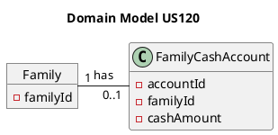
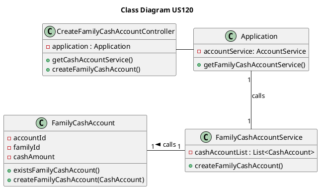

US120 Create Family Cash Account
=======================================

# 1. Requirements

*As a family administrator, I want to create a family cash account.*

Following the required fields given from the project proposal, a cash account
must have

- Account identification number,
- Family (owner) identification number,
- Its cash amount.

```puml
autonumber
header SSD
title Create a Family Cash Account

actor "Family Administrator" as FA
participant ": Application" as App

FA -> App : Create a family cash account
activate FA
activate App
App --> FA : Inform success
deactivate App
deactivate FA
```

# 2. Analysis

## 2.1 Family Cash Account entry

According to what was presented, a family cash account is created upon request
from the Family Administrator using its family identification number as a
reference to this actor's family.

Using this strategy, we decided that it would be better to verify if an account
with the same the family identification number as the administrator already
exists, if not then the family cash account is created.

A family cash account instance should have the following attributes:

| Attributes | Rules                                        |
| ---------- | -------------------------------------------- |
| accountId  | Unique, required, integer, auto-incrementing |
| familyId   | Required, integer                            |
| cashAmount | Required, integer                            |

The default cashAmount value is zero.

## 2.2 Domain Model Excerpt

For quick reference, there's a relevant extract of the domain model.



# 3. Design

## 3.1. Functionality Development

The System Diagram is the following:

```puml
autonumber
header SD
title Create a Family Cash Account
actor "Family Administrator" as FA
participant ": UI" as UI
participant ": CreateFamilyCashAccount\nController" as CFCAC
participant ": Application" as App
participant ": FamilyCashAccount\nService" as CAS


FA -> UI : Create a family cash account
activate FA
activate UI

UI -> CFCAC : createFamilyCashAccount()
activate CFCAC

CFCAC -> App : getCashAccountService()
activate App
return CashAccountService
deactivate App

CFCAC -> CAS : createFamilyCashAccount()
activate CAS

alt successful case
    ref over CAS
    createFamilyCashAccount()
    end ref

    CAS --> CFCAC  : ok

    CFCAC --> UI : ok

    UI --> FA : inform success

else failed to meet requirements

    CAS --> CFCAC : failure
    deactivate CAS

    CFCAC --> UI : failure
    deactivate CFCAC

    UI --> FA : inform failure
    deactivate UI

end
deactivate FA
```

```puml
autonumber
header ref
title createFamilyCashAccount()
participant ": FamilyCashAccountService" as CAS
participant ": FamilyCashAccount" as FCA

[-> CAS : createFamilyCashAccount()
activate CAS


CAS -> FCA : existsFamilyCashAccount(familyCashAccountList, newFamilyCashAccount)
FCA -> CAS : result

alt result == false

CAS -> newFamCashAccount as "familyCashAccountList:\ncashAccountList" ** : add(cashAccount)

end

[<-- CAS: createFamilyCashAccount Status

deactivate CAS
```

When the Family Administrator gives the order on the UI to create a family cash
account, the Controller should operate the required methods creating a new and
valid family cash account.

A Family Cash Account is always created using the family administrator's family
identification number (familyId) because they can only create a cash account for
their own family.

Also, there is the restriction to only allow a single family cash account per
family.

## 3.2. Class Diagram



## 3.3. Applied Patterns

In order to achieve best practices in software development, to implement this US
we're using the following:

- *Single Responsibility Principle* - Classes should have one responsibility;
- *Information Expert* - Assign a responsibility to the class that has the
  information needed to fulfill it;
- *Pure Fabrication* - FamilyCashAccount Service was implemented to manage
  everything related to family cash accounts.
- *Creator* - Family cash accounts are created by FamilyCashAccount Service;
- *Controller* - FamilyCashAccountController was created;
- *Low Coupling* - FamilyCashAccountService is the only class responsible to
  return the result from requests to create family cash accounts.
- *High Cohesion* - FamilyCashAccountService is the only class responsible to
  return the result from requests to create family cash accounts.

## 3.4. Tests

**Test 1:** Create a family cash account successfully.

```java
@Test
void createFamilyCashAccount(){
    Application application = new Application();
    CreateFamilyCashAccountController controller = new CreateFamilyCashAccountController(application);
    boolean result = controller.createFamilyCashAccount();
    assertTrue(result);
}
```

**Test 2:** Fail to create a family cash account where a family cash account
already exists.

```java
@Test
void createFamilyCashAccount_WhereFamilyCashAccountAlreadyExists(){
    Application application = new Application();
    CreateFamilyCashAccountController controller1 = new CreateFamilyCashAccountController(application);
    controller1.createFamilyCashAccount();
    boolean result = controller1.createFamilyCashAccount();
    assertFalse(result);
}
```

**Test 3:** Create a family cash account directly from the
FamilyCashAccountService.

```java
@Test
void createFamilyCashAccount(){
        int familyId=0;
        FamilyCashAccountService service=new FamilyCashAccountService();

        boolean result=service.createFamilyCashAccount(familyId);
        assertTrue(result);
}
```

**Test 4:** Fail to create a family cash account directly from the
FamilyCashAccountService.

```java
@Test
void createFamilyCashAccount_WhereFamilyCashAccountAlreadyExists(){
    int familyId = 0;
    FamilyCashAccountService service = new FamilyCashAccountService();

    service.createFamilyCashAccount(familyId);
    boolean result = service.createFamilyCashAccount(familyId);
    assertFalse(result);
}
```

**Test 5:** Fail to create a family cash account from the
CreateFamilyCashAccountController because there is no application reference.

```java
@Test
void createFamilyCashAccount_NoApplication(){
        Application application = null;

        Exception exception = assertThrows(RuntimeException.class,()->{
    CreateFamilyCashAccountController controller=new CreateFamilyCashAccountController(application);
    });

    String expectedMessage = "Application cannot be null.";
    String actualMessage = exception.getMessage();

    assertTrue(actualMessage.contains(expectedMessage));
}
```

Note: Since the family identification number equals the family administrator
family identification number, there is no need for a test that verifies if the
familyId is valid. That verification is done previously, during the Family
Administrator login to the system.

# 4. Implementation

On this user story we think that there were no major obstacles or difficulties.

# 5. Integration/Demonstration

At the moment, no other user stories are dependent on this one, so its
integration with other functionalities cannot be tested further.

# 6. Observations

There is the need to pass the familyId by value in the createFamilyCashAccount
constructors in both the FamilyCashAccountController and
FamilyCashAccountService until there is a familyId available of the
authenticated family administrator.

