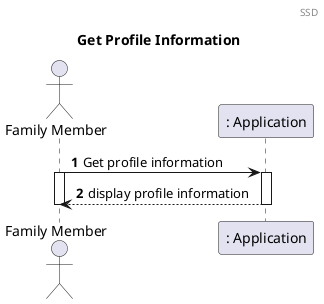
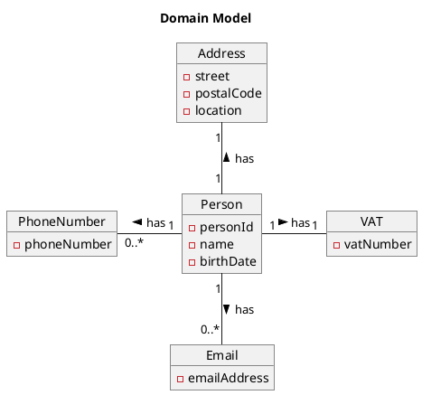
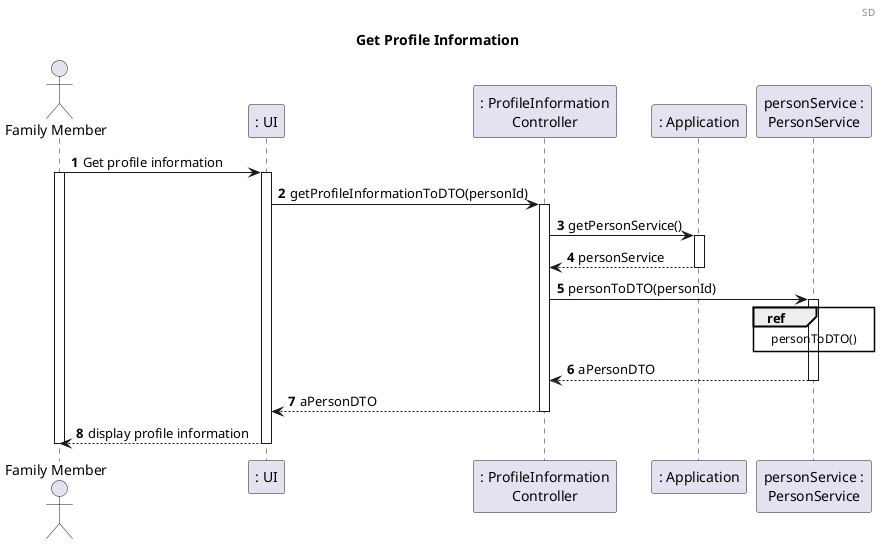
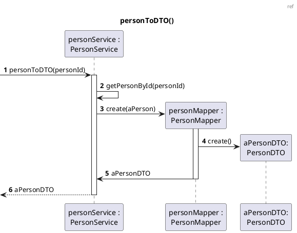
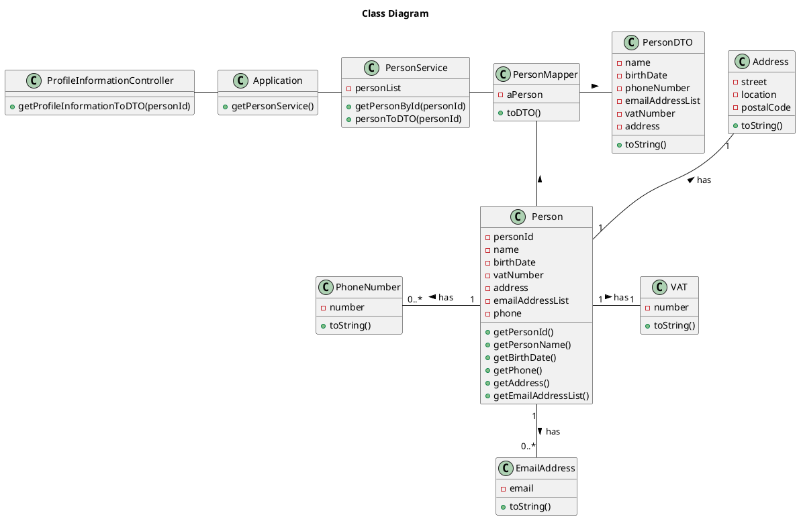

US150 Get Profile Information
=======================================

# 1. Requirements

*As a family member, I want to get my profile's information.*

This functionality will allow each family member to get access to their own
profile information. It was designed to respond to the user story/requirement
above.

The development team designed this functionality to provide to the family member
their name, birthdate, phone number, email account, vatNumber number and address.

## 1.1. System Sequence Diagram

The System Sequence Diagram below represents the communication between a Family
Member and the Application.



## 1.2. Dependency of other user stories

This user story is dependent on [US010] and [US101], because without having a
family and at least one family member, it would be impossible to have a profile
information and obtain that.

# 2. Analysis

According to what was presented, a profile information is obtained upon request
from the family member using its person identification number as a reference the
person object.

At this point, the Application has the information about the unique
identification number of the person who wants to have access to the information
in their own profile.

The profile information provided to the user in this sprint are:

- Name
- Birthdate
- Phone number
- Email account
- Vat number
- Address

## 2.1. Relevant domain model excerpt

The excerpt of the Domain Model that is relevant for this user story is as
follows:



# 3. Design

## 3.1. Functionality Realization

The implementation strategy for this user story consists in getting the person
object providing the unique identification number, so your profile information
can be converted in a string and shown to the user.

The Sequence Diagram for realizing the functionality of this user story is as
follows:





## 3.2. Class Diagram

The Class Diagram of the functionality of this user story is as follows:



## 3.3. Applied Patterns

- *Single Responsibility Principle (SRP)* - All classes involved in this user
  story follow this principle and this means that they have only one and
  well-defined responsibility, which is to manage the information included
  within them.

- *Controller* - The GetProfileInformationController receives and coordinates
  system operations, as it connects the UI layer to the Application logic layer.

- *Information Expert* - Each class was assigned responsibilities that can be
  fulfilled because they have the information needed and where that information
  stored.

- *Pure Fabrication* - The PersonService class is a class that does not
  represent a domain concept, and it was assigned a set of responsibilities to
  support high cohesion, low coupling, and the potential for a reuse.

- *Low Coupling* - Classes were assigned responsibilities so that coupling
  remains as low as possible, reducing the impact of any changes made to objects
  later on. The implementation of PersonService class reduced the dependency
  level between them.

- *High Cohesion* - Classes were assigned responsibilities so that cohesion
  remains as high as possible, to keep objects understandable and manageable.
  They are strongly related and highly focused. Like the low coupling principle,
  the PersonService class increased the level of cohesion between them.

## 3.4. Tests

Below is the list of tests, organized by the correspondent class:
**Controller**

- **Test 1:** Ensure that it is possible to get the profile information
  successfully

```java
    @Test
    void ensureProfileInformationIsEqual(){
            GetProfileInformationController profInfoCtrl = new GetProfileInformationController(app);
            String expected = "Test; 31/12/2012; 919999999; test@email.com; 123456789; Rua das Pedras; 6000-320; Porto";
            PersonDTO aPersonDTO = profInfoCtrl.getProfileInformationToDTO(personId);
            String result;

            result = aPersonDTO.toString();

            assertEquals(expected, result);
            }
```

- **Test 2:** Ensure that it is not possible to get the profile information when
  some information is not equal

```java
    @Test
    void ensureProfileInformationIsNotEqual(){
            GetProfileInformationController profInfoCtrl = new GetProfileInformationController(app);
            String expected = "Test1; 31/12/2012; 919999999; test@email.com; 123456789; Rua das Pedras; 6000-320; Porto";
            String result;

            result = profInfoCtrl.getProfileInformation(personId);

            assertNotEquals(expected, result);
            }
```

- **Test 3:** Ensure that it is not possible to get the profile information when
  the person id does not exist

```java
    @Test
    void ensureIllegalArgumentException(){
            GetProfileInformationController profInfoCtrl = new GetProfileInformationController(app);
            int personId=10;

            assertThrows(IllegalArgumentException.class,()->{
        profInfoCtrl.getProfileInformation(personId);
        });
        }
```

- **Test 4:** Ensure that it is possible to get the profile information
  successfully when Email is null

```java
@Test
    void getProfileInformationToDTOWithNullEmail(){
            String name="Test";
            String birthDate="31/12/2012";
            String phoneNumber="919999999";
            String email=null;
            int vatNumber=123456789;
            String street="Rua das Pedras";
            String postalCode="6000-320";
            String location="Porto";
            int newPersonId=1;
            personService.addPerson(name,birthDate,phoneNumber,email,vatNumber,street,postalCode,location,familyId);
            GetProfileInformationController profInfoCtrl=new GetProfileInformationController(app);
            PersonDTO result=profInfoCtrl.getProfileInformationToDTO(newPersonId);
            String expected="Test; 31/12/2012; 919999999; null; 123456789; Rua das Pedras; 6000-320; Porto";
            assertEquals(expected,result.toString());
            }
```

**PersonService**

- **Test1:** Ensure that it is possible to get the person who corresponds to the
  introduced person id successfully

```java
    @Test
    void ensurePersonByIdIsEquals(){
            Person expected=new Person(0,"Pedro","30/11/1980","916666666",203040231,"Rua da Alegria","4400-000","Gaia");
            Person result;
            int personId=0;

            result=personService.getPersonById(personId);

            assertEquals(expected,result);
            }
```

- **Test2:** Ensure that it is not possible to get the person with a person id
  that does not exist

```java
    @Test
    void ensurePersonByIdIsNotEquals(){
            Person expected=new Person(0,"Pedro","30/11/1980","916666666",203040231,"Rua da Alegria","4400-000","Gaia");
            Person result;
            int personId=2;

            result=personService.getPersonById(personId);

            assertNotEquals(expected,result);
            }
```

- **Test3:** Ensure that it is not possible to get the person with a person id
  that does not exist

```java
    @Test
    void ensurePersonByIdIsNull(){
            Person expected=null;
            Person result;
            int personId=1;

            result=personService.getPersonById(personId);

            assertEquals(expected,result);
            }
```

- **Test4:** Assert creation of PersonDTO

```java
@Test
    void personToDTO(){
            PersonDTO result=personService.personToDTO(personId1);
            assertNotNull(result);
            }
```

- **Test5:** Ensure that it is not possible to get the personDTO when Person
  does not exist

```java
@Test
    void nullPersonToDTO(){
            int nullPersonId=123;
            assertThrows(IllegalArgumentException.class,()->personService.personToDTO(nullPersonId));
        }
```

**Person**

- **Test1:** Ensure that it is possible to get the person correspondent to the
  person id

```java
    @Test
    void ensurePersonIdIsEquals(){
            int expected=0;
            int result;

            result=aPersonOne.getPersonId();

            assertEquals(expected,result);
            }
```

- **Test2:** Ensure that it is not possible to get the person correspondent to a
  person id that does not exist

```java
    @Test
    void ensurePersonIdIsNotEquals(){
            int expected=1;
            int result;

            result=aPersonOne.getPersonId();

            assertNotEquals(expected,result);
            }
```

- **Test3:** Ensure that it is possible to return a string with profile
  information with the corresponding person Id as input

```java
    @Test
    void ensureToStringIsEquals(){
            aPersonOne.addEmail("test@email.com");
            String expected="Test; 31/12/2012; 919999999; test@email.com; 123456789; Rua das Pedras; 6000-320; Porto";
            String result;

            result=aPersonOne.toString();

            assertEquals(expected,result);
            }
```

- **Test4:** Ensure that it is possible to return a string with profile
  information without a phone number with the corresponding person Id as input

```java
    @Test
    void ensureToStringIsEqualsWithNullPhoneNumber(){
            aPersonTwo.addEmail("test@email.com");
            String expected="Pedro; 30/11/1980; null; test@email.com; 203040231; Rua da Alegria; 4400-000; Gaia";
            String result;

            result=aPersonTwo.toString();

            assertEquals(expected,result);
            }
```

- **Test5:** Ensure that it is possible to return a string with profile
  information without an email account with the corresponding person Id as input

```java
    @Test
    void ensureToStringIsEqualsWithNullEmail(){
            String expected="Pedro; 30/11/1980; 916666666; null; 203040231; Rua da Alegria; 4400-000; Gaia";
            String result;

            result=aPersonThree.toString();

            assertEquals(expected,result);
            }
```

- **Test6:** Ensure that it is not possible to return a string with profile
  information when some information is not equal

```java
    @Test
    void ensureToStringIsNotEquals(){
            String expected="Test1; 31/12/2012; 919999999; test@email.com; 123456789; Rua das Pedras; 6000-320; Porto";
            String result;

            result=aPersonOne.toString();

            assertNotEquals(expected,result);
            }
```

# 4. Implementation

The main challenges that were found while implementing this functionality were:

- The dependency of other functionalities to be ready, to be able to test the
  implementation properly

- The novelty of having to interpret a user story that may contain a few
  ambiguities

To minimize these difficulties, a lot of research and study of reliable
documentation was done. There was communication with the Product Owner whenever
needed, to clarify some requirements.

So that we could present a reliable functionality, many tests were done, to
identify as many possible errors in the implementation as possible.

# 5. Integration/Demonstration

At the moment, no user stories are dependent on this one, so its integration
with other functionalities cannot be tested.

# 6. Observations

There is the need to pass the person identification number by value in the
method getProfileInformation() in the GetProfileInformationController class
until there is a person id available of the authenticated family member.

It was implemented a DTO, i.e, a PersonDTO class with the purpose to have the
profile information of the Family Member.

It will be interesting to enable the family member to edit their profile
information and add other to their own profile, namely information regarding
account data (IBAN or account number for example).

[us010]: US010_Create_Family.md

[us101]: US101_Add_Family_Member.md
