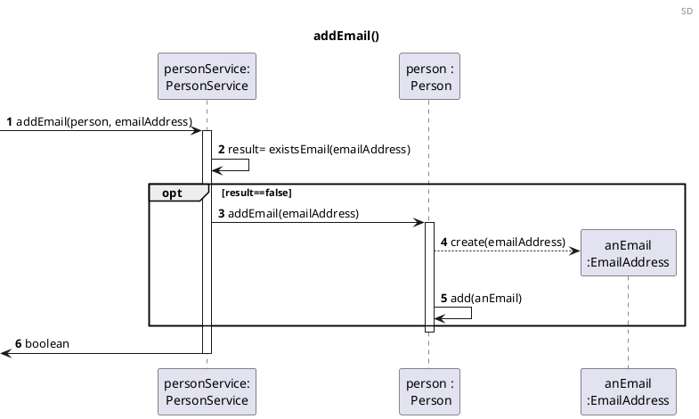

US151 Add Email Account To Family Member Profile
=======================================

# 1. Requirements

*As a family member, I want to add an email account to my profile.*

According to this requirement, the user would like to add an email to its own
profile. Therefore, in order to add the email to the user's profile, the email
has to be in a valid email format and should not exist. These criteria have to
be fulfilled, otherwise the email will not be added to the Family Member's
profile.

The family member can have none or more than one email accounts:
*"Most persons will also have one or more telephone numbers and email
accounts."*

## 1.1 System Sequence Diagram

The below System Sequence Diagram (SSD) captures the interaction between the
Family Member and the Application when the Family Member wants to add a new
email to his profile.

````puml
@startuml
Header SSD
title Add Email Account To Family Member Profile
autonumber

actor "Family Member" as FM

FM -> ": Application" : Add new email
activate FM
activate ": Application"
": Application" --> FM: ask data
deactivate ": Application"

FM -> ": Application": inputs required data
activate ": Application"
": Application" --> FM: informs result
deactivate ": Application"
deactivate FM
@enduml
````

## 1.2 Dependency of other User Stories

This User Story has dependencies with the [US010], [US011] and [US101], since it
will be necessary to have a family with an administrator to be able to add the
family members to the family, without the family member it would not be possible
to add an email to its own profile.

# 2. Analysis

## 2.1 Email Account entry

According to what was described, the email account will be added upon request
from the Family Member. The email account should be created with an alphanumeric
string as its email address and repeated emails should not exist. The input of
the ID of the Family Member will also be required.

The email is an instance of {EmailAddress}.

To add the email to the Family Member's profile the following attributes are
required:

| Attributes   | Rules                                        |
| ------------ | -------------------------------------------- |
| emailAddress | unique, required, alphanumeric (String). <br> A regular expression (regex) will be used to validate the email format. |

## 2.2 Domain Model Excerpt

The relevant extract of the domain model is represented below:

````puml
@startuml
title Domain Model
header DM
hide methods

object Person{
- personId
- name
- birthDate
- phone
- emailAddressList
- VAT
- address
}

object EmailAddress{
-emailAddress
}

Person "1" - "0..*" EmailAddress : hasEmail 

@enduml
````

# 3. Design

## 3.1. Functionality Realization

The requirements specified in [Analysis](#2-analysis) should be taken into
account when adding an email account.

The Sequence Diagram (SD) is the following:

````puml
@startuml

Header SD
title Add Email Account To Family Member Profile
autonumber

actor "Family Member" as FM

participant ": UI" as UI
participant ": AddEmail\nController" as AddEmailC
participant ": Application" as App
participant " personService:\nPersonService" as pServ

FM -> UI : Add new email
activate FM
activate UI
UI --> FM: ask data 
deactivate UI

FM -> UI : inputs required data
activate UI

UI -> AddEmailC : addEmail(emailAddress)
activate AddEmailC

AddEmailC -> App : getLoggedPerson()
activate App

App-->AddEmailC : person
deactivate App

AddEmailC -> App : getPersonService()
activate App

App-->AddEmailC : personService
deactivate App


AddEmailC -> pServ : addEmail(person, emailAddress)
ref over pServ :addEmail()

activate pServ
pServ --> AddEmailC : boolean

deactivate pServ


AddEmailC-->UI : boolean
deactivate AddEmailC

UI-->FM : informs result
deactivate UI

deactivate FM
@enduml
````



## 3.2. Class Diagram

The main classes involved in the realization of this requirement/functionality
were the following:

- AddEmailController
- Application
- PersonService
- Person
- EmailAddress

The Class Diagram is the following:

````puml
@startuml
title Class Diagram US151
class AddEmailController{
-application : Application
+getPersonService()
+addEmail()
}

class Application{
- categoryService : CategoryService
- familyService : FamilyService
- personService : PersonService
- accountService: AccountService
+ getCategoryService()
+ getFamilyService()
+ getPersonService()
+ getCashAccountService()
}

class PersonService{
-personList : List<Person>
+ getPersonById()
+addEmail()
-existsEmail()
}

class Person{
- personId
- name
- birthDate
- phone
- emailAddressList : List<EmailAddress>
- VAT
- address
+hasEmail()
+addEmail()
}

class EmailAddress{
-emailAddress
}

AddEmailController "1"--"1" Application 
Application "1"-"1" PersonService : calls
AddEmailController "1"-"1" PersonService 

PersonService " 1  "--" 1..* " Person : calls 
Person "  1 " -l- " 0..* " EmailAddress : hasEmail >

@enduml
````

## 3.3. Applied Patterns

The applied patterns were the following:

- *Single Responsibility Principle (SRP)*  - All classes have one
  responsibility, which means, only one reason to change;
- *Controller* - The controller (AddEmailController) receives and coordinates
  system operations connecting the UI layer to the App's logic layer;
- Information Expert - Each class was assigned responsibilities that can be
  fulfilled because they have the information needed to do so;
- *Pure Fabrication* - The PersonService class is a class that does not
  represent a problem domain concept, nevertheless it was assigned a set of
  responsibilities to support high cohesion, low coupling and reuse;
- *Creator* - Person class was assigned the responsibility to instantiate
  an EmailAddress, because it had the necessary data that would be passed
  on to it and Person contains EmailAddress.
- *Low Coupling* - Classes were assigned responsibilities so that coupling
  remains as low as possible, reducing the impact of any changes made to objects
  later on;
- *High Cohesion* - Classes were assigned responsibilities so that cohesion
  remains high(they are strongly related and highly focused). This helps to keep
  objects understandable and manageable, and also goes hand in hand with the low
  coupling principle.
  

## 3.4. Tests

### 3.4.1 Unit Tests

The Unit Tests are defined below:

- **Unit Test 1:** Assert the creation of an email.

 ```java
  @Test
void ensureValidEmailAdded() {
        //Arrange
        application = new Application();
        familyService = application.getFamilyService();
        Family family = familyService.addFamily("Martins");
        UUID familyId = family.getFamilyId();
        personService = application.getPersonService();
        Person person = personService.addPerson("António", "31/12/2012", "919999993", "antonio@gmail.com", 123436789, "Rua das Flores", "6000-420", "Porto", familyId);
        application.setLoggedPerson(person);
        AddEmailController controller = new AddEmailController(application);
        String emailAddress = "antonio_margarida@gmail.com";

        //Act
        boolean result = controller.addEmail(emailAddress);

        //Assert
        assertTrue(result);
        }
```

- **Unit Test 2:** Verify that email is not added when email is null.

 ```java
  @Test
    void ensureNullEmailNotAdded() {
            //Arrange
            application = new Application();
            familyService = application.getFamilyService();
            Family family = familyService.addFamily("Martins");
            UUID familyId = family.getFamilyId();
            personService = application.getPersonService();
            Person person = personService.addPerson("António", "31/12/2012", "919999993", "antonio@gmail.com", 123436789, "Rua das Flores", "6000-420", "Porto", familyId);
            application.setLoggedPerson(person);
            String emailAddress = null;
            AddEmailController controller = new AddEmailController(application);
            boolean result;

            //Act
            result = controller.addEmail(emailAddress);

            //Assert
            assertFalse(result);
            }
```

- **Unit Test 3:** Verify that email is not added when email has invalid format.

 ```java
  @Test
    void ensureInvalidEmailNotAdded() {
            //Arrange
            application = new Application();
            familyService = application.getFamilyService();
            Family family = familyService.addFamily("Martins");
            UUID familyId = family.getFamilyId();
            personService = application.getPersonService();
            Person person = personService.addPerson("António", "31/12/2012", "919999993", "antonio@gmail.com", 123436789, "Rua das Flores", "6000-420", "Porto", familyId);
            application.setLoggedPerson(person);
            String emailAddress = "joão.gmail.com";
            AddEmailController controller = new AddEmailController(application);
            boolean result;

            //Act
            result = controller.addEmail(emailAddress);

            //Assert
            assertFalse(result);
            }
```

- **Unit Test 4:** Verify that it is not possible to create an instance of the
  class Email with an empty value.

```java
 @Test
    void ensureEmptyEmailNotAdded() {
            //Arrange
            application = new Application();
            familyService = application.getFamilyService();
            Family family = familyService.addFamily("Martins");
            UUID familyId = family.getFamilyId();
            personService = application.getPersonService();
            Person person = personService.addPerson("António", "31/12/2012", "919999993", "antonio@gmail.com", 123436789, "Rua das Flores", "6000-420", "Porto", familyId);
            application.setLoggedPerson(person);
            String emailAddress = "";
            AddEmailController controller = new AddEmailController(application);
            boolean result;

            //Act
            result = controller.addEmail(emailAddress);

            //Assert
            assertFalse(result);
            }
```  

- **Unit Test 5:** Verify that an existing email address in the list of emails
  is not added.

 ```java
  @Test
    void ensureExistingEmailInPersonNotAdded() {
            //Arrange
            application = new Application();
            familyService = application.getFamilyService();
            Family family = familyService.addFamily("Martins");
            UUID familyId = family.getFamilyId();
            personService = application.getPersonService();
            Person person = personService.addPerson("António", "31/12/2012", "919999993", "antonio@gmail.com", 123436789, "Rua das Flores", "6000-420", "Porto", familyId);
            application.setLoggedPerson(person);
            AddEmailController controller = new AddEmailController(application);
            String emailAddress = "antonio@gmail.com";
            boolean result;

            //Act
            result = controller.addEmail(emailAddress);

            //Assert
            assertFalse(result);
            }
```

# 4. Implementation

The main challenge encountered during the implementation of this functionality
was:

- The dependency on other functionalities to implement and test this
  functionality correctly.

In order to minimize these difficulties and to guarantee a reliable
functionality, the tests were done to cover the maximum scenarios, identifying
and correcting the encountered errors.

# 5. Integration/Demonstration

At the moment, there are no User Stories dependent on the development of this
User Story, therefore its integration with other functionalities/features cannot
be tested further.

# 6. Observations

For the implementation of this functionality it was necessary to input the
personId along with the email address, in order to identify the family member to
add the email. In the future, the family member's personId will be obtained by
authenticating the family member, therefore the personId input won't be
required.


[US010]: US010_Create_Family.md

[US011]: US011_Add_Family_Administrator.md

[US101]: US101_Add_Family_Member.md