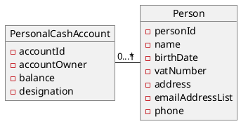
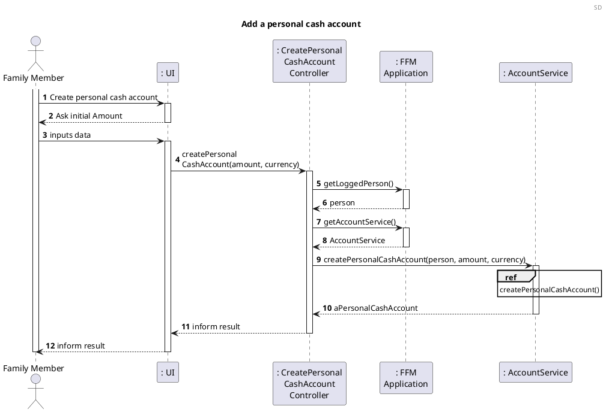
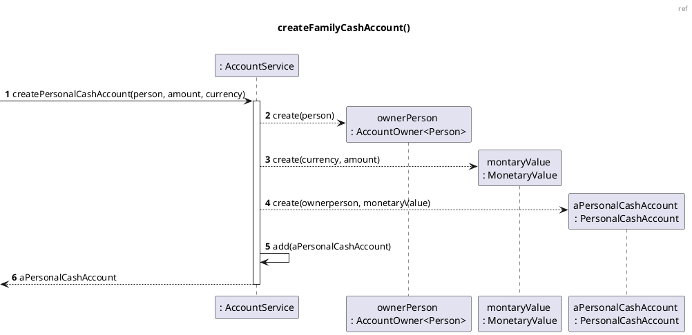
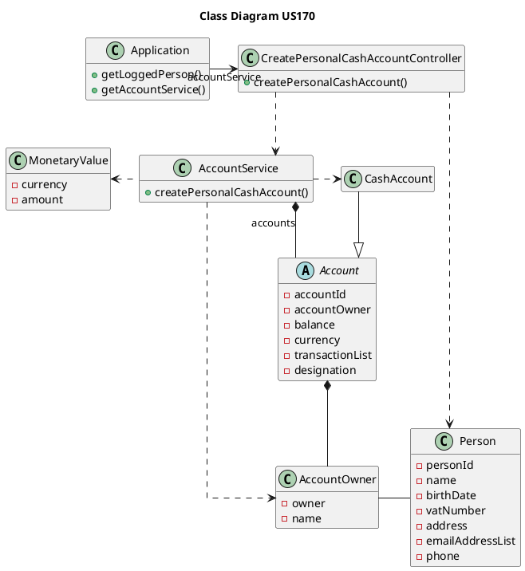
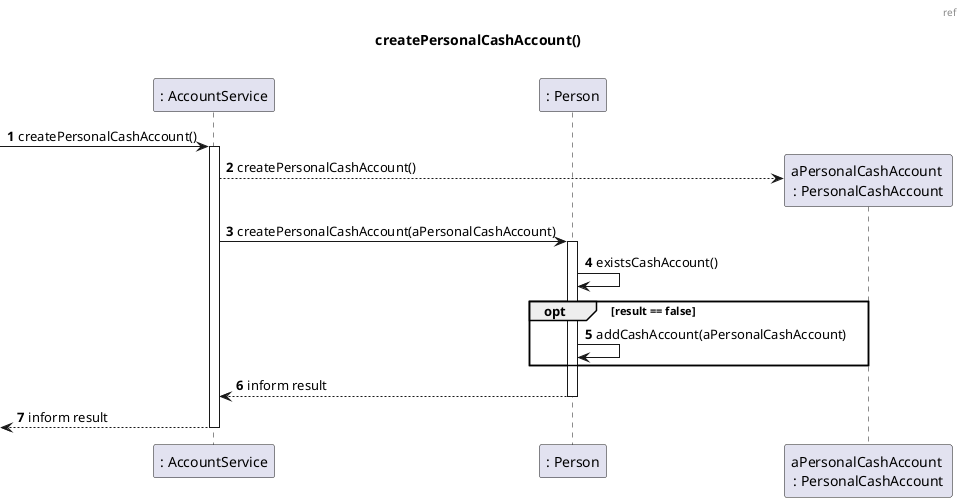

US170 Create a personal cash account
=======================================

# 1. Requirements

*As a family member, I want to create a personal cash account.*

According to this requirement, the user would like to create a personal cash account. Therefore, the required fields given from the project proposal, a cash account must have:

- Account unique identification number,
- The person it belongs to,
- Its cash amount.

## 1.1 System Sequence Diagram

The below System Sequence Diagram (SSD) captures the interaction between the
Family Member and the Application when the Family Member wants to create a personal cash account.

````puml
@startuml
Header SSD
title Create a personal cash account
autonumber

actor "Family Member" as FM
participant ": Application" as app

FM -> app : Create personal cash account
activate FM
activate app
app --> FM : ask initial amount
deactivate app

FM -> app : inputs data
activate app
app --> FM: informs result
deactivate app
deactivate FM
@enduml
````

## 1.2 Dependency of other User Stories

This User Story has dependencies with the [US101], since it
will be necessary to have a member, so we can create a personal cash account.

# 2. Analysis

## 2.1 Cash Account entry

According to what was presented, a personal cash account is created upon request from the Family Member.

A personal cash account instance should have the following attributes:

| Attributes | Rules                                        |
| ---------- | -------------------------------------------- |
| accountId  | Unique, required, UUID |
| owner   | Required, object                            |
| cashAmount | Required, double                            |

The default cashAmount value is zero.

## 2.2 Domain Model Excerpt

The relevant extract of the domain model is represented below:



# 3. Design

## 3.1. Functionality Development

Regarding the creation of a personal account, we should accommodate the requirements specified in [Analysis](#2-analysis).

The System Diagram is the following:





## 3.2. Class Diagram

The main classes involved in the realization of this requirement/functionality were the following:

- CreatePersonalCashAccountController
- AccountService
- Person
- PersonalCashAccount

The Class Diagram is the following:



## 3.3. Applied Patterns

The applied patterns were the following:

- *Single Responsibility Principle (SRP)*  - All classes have one
  responsibility, which means, only one reason to change;
- *Controller* - The controller (CreatePersonalCashAccountController) receives and coordinates
  system operations connecting the UI layer to the App's logic layer;
- Information Expert - Each class was assigned responsibilities that can be
  fulfilled because they have the information needed to do so;
- *Pure Fabrication* - The AccountService class is a class that does not
  represent a problem domain concept, nevertheless it was assigned a set of
  responsibilities to support high cohesion, low coupling and reuse;
- *Low Coupling* - Classes were assigned responsibilities so that coupling
  remains as low as possible, reducing the impact of any changes made to objects
  later on;
- *High Cohesion* - Classes were assigned responsibilities so that cohesion
  remains high(they are strongly related and highly focused). This helps to keep
  objects understandable and manageable, and also goes hand in hand with the low
  coupling principle.

## 3.4. Tests

### 3.4.1 Unit Tests

The Unit Tests are defined below:

**Test 1:** Creat a Personal Account Successfully
```java
@Test
void createPersonalCashAccountSuccessfully() {
boolean result = accountService.createPersonalCashAccount(person, 10);

        assertTrue(result);
}
```    
**Test 2:** Fail to create because already as one 
```java
@Test
void createPersonalCashAccountUnsuccessfully() {
    accountService.createPersonalCashAccount(person, 10);
    
    boolean result = accountService.createPersonalCashAccount(person, 10);

    assertFalse(result);
}
```

**Test 3:** Create two successful accounts
```java
@Test
void createPersonalCashAccountSuccessfullyForTwoPersons() {
    Person person1 = new Person(1, "Name", "12/12/2012", "234324534", 234235234, "sdgvzf", "4800-344", "aergb");
    accountService.createPersonalCashAccount(person1, 10);

    boolean result = accountService.createPersonalCashAccount(person, 10);

    assertTrue(result);
}
``` 

**Test 4:** Fail to create a account with no person
```java
@Test
void createPersonalCashAccountWithNoPerson() {
    boolean result = accountService.createPersonalCashAccount(null, 0);

    assertFalse(result);
}
```

# 4. Implementation

On this user story we think that the major challenge was to find a way to storage the account.

First we though that the best solution was to storage the account as a person attribute. After some discussion we got to the conclusion that maybe the best way was to create a service responsible for all accounts and to storage all created accounts at one list.

This is possible because we created a generic class for the account owner, that allow us to have either a person or a family as account owner. That way we can have all on the same list.



# 5. Integration/Demonstration


# 6. Observations


[US101]: US101_Add_Family_Member.md