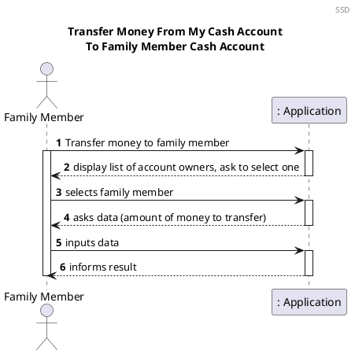
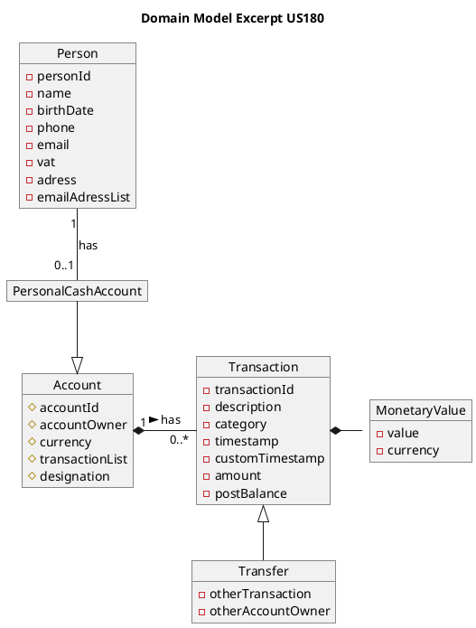
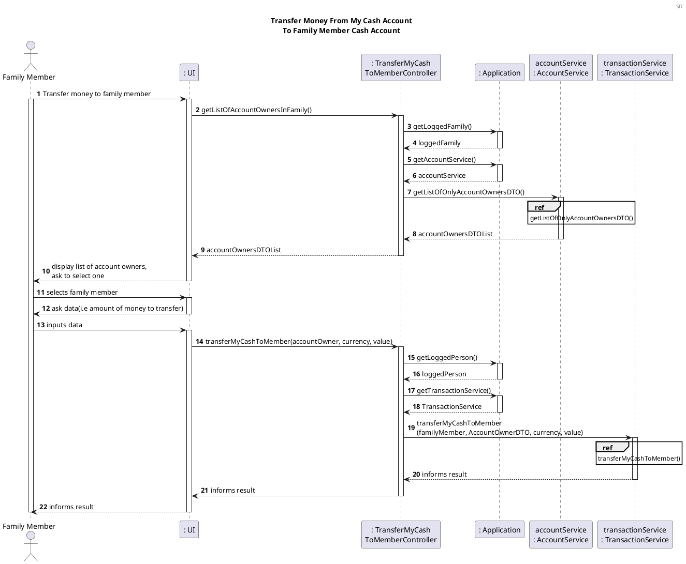
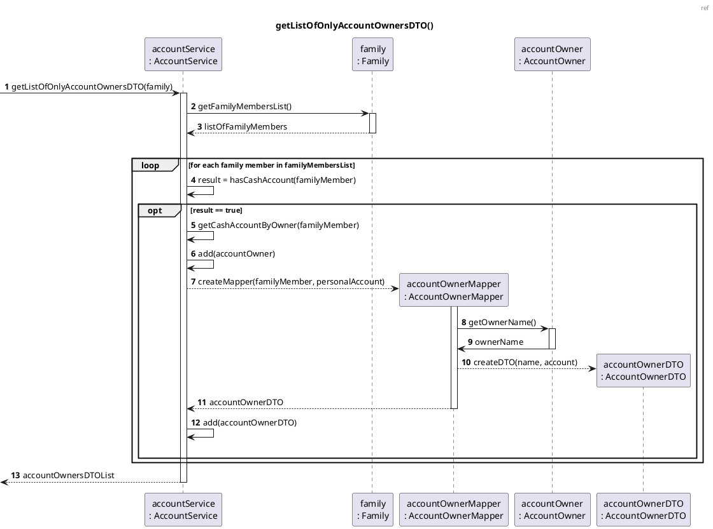
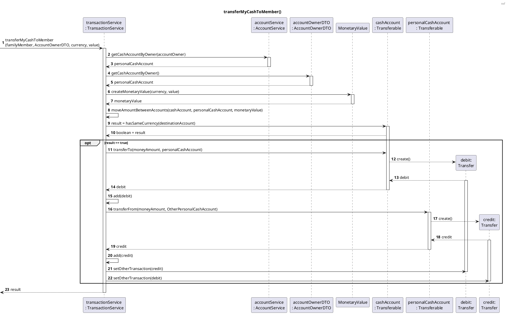
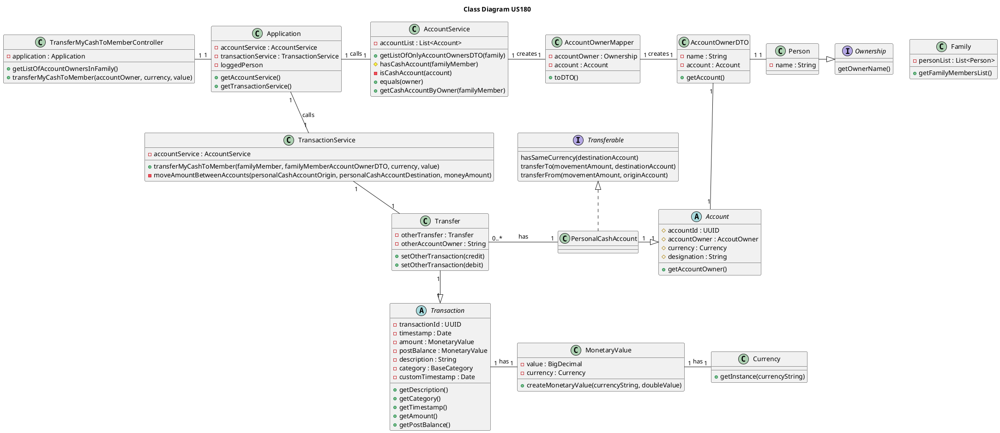

US180 Transfer Money From My Cash Account To Family Member Cash Account
=======================================

# 1. Requirements

*As a family member, I want to transfer money from my cash account to another family member’s cash account.*

From the project proposal: *"Each family member may have a cash account to represent the amount of cash (s)he has."*, so the family member can have one or none cash account.

This functionality will allow each family member with cash account to transfer money from your own cash account to other family member's cash account. It was designed to fulfill to the user story/requirement
above.

The development team designed this functionality to allow money transfer only when both family members have a cash account. Also, the balance of the family member's origin cash account (account were the money will come from) must be greater than the amount of money to be transferred.

Transferring money from the family member´s cash account to another family member´s cash account will only be successful if these criteria are fulfilled.

## 1.1. System Sequence Diagram

The System Sequence Diagram below represents the communication between a Family Member and the Application.



## 1.2. Dependency of other user stories`

This user story is dependent on [US010](US010_Create_Family.md) and [US101](US101_Add_Family_Member.md) because without having a family and family members, it would be impossible to get the list of family members and to create their cash account.

In addition, this user story is dependent on [170](US170_Create_Personal_Cash_Account.md) because it will be necessary to have a family member's cash account.


# 2. Analysis

## 2.1. Transaction Entry

The transfer of money between the family member's cash account and the other family member's cash account implies the need to have a transaction.

The transaction object, will have the following attributes:

Attributes      | Rules
----------------|----------------
**transactionId**     | unique, required, UUID, random
**timestamp**         | required, Date
**amount**           | required, double
**currency**          | required, String
**postBalance**       | required, MonetaryValue
**description**     | alphanumeric, String
**category**          | alphanumeric, String
**customTimeStamp**   | optional, Date
**otherTransfer**     | Transfer
**otherAccountOwner** | required, accountOwnerDTO

## 2.2. Relevant domain model excerpt

The excerpt of the Domain Model that is relevant for this user story is as follows:




# 3. Design

## 3.1. Functionality Realization

The Sequence Diagram for realizing the functionality of this user story is as follows:







## 3.2. Class Diagram

The Class Diagram of the functionality of this user story is as follows:



## 3.3. Applied Patterns

- *Single Responsibility Principle (SRP)* - All classes involved in this user story follow this principle and this means that they have only one and well-defined responsibility, which is to manage the information included within them.

- *Controller* - The TransferMyCashToMemberController receives and coordinates system operations, as it connects the UI layer to the Application logic layer.

- *Information Expert* - Each class was assigned responsibilities that can be fulfilled because they have the information needed and where that information stored.

- *Pure Fabrication* - The AccountService and TransactionService classes are classes that does not represent a domain concept, and it was assigned a set of responsibilities to support high cohesion, low coupling, and the potential for a reuse.

- *Low Coupling* - Classes were assigned responsibilities so that coupling remains as low as possible, reducing the impact of any changes made to objects later on. The implementation of AccountService and TransationService classes reduced the dependency level between them.

- *High Cohesion* - Classes were assigned responsibilities so that cohesion remains as high as possible, to keep objects understandable and manageable. They are strongly related and highly focused. Like the low coupling principle, the AccountService and TransationService classes increased the level of cohesion between them.

## 3.4. Tests

Below is the list of unit tests:

- **Test 1:** Obtain a valid DTO with a list of family members with personal cash account.

```java
    @Test
    void getAccountOwnersInFamily_Successfully_TwoPerson() {
            //arrange
            List<AccountOwnerDTO> expectedList = new ArrayList<>();
        double initialAmount = 500;
        accountService.createPersonalCashAccount(Maria, initialAmount, "EUR");
        accountService.createPersonalCashAccount(Rita, initialAmount, "EUR");
        personalAccountMaria = accountService.getCashAccountByOwner(Maria);
        personalAccountRita = accountService.getCashAccountByOwner(Rita);
        AccountOwnerMapper accountOwnerMapperMaria = new AccountOwnerMapper(Maria, personalAccountMaria);
        AccountOwnerMapper accountOwnerMapperRita = new AccountOwnerMapper(Rita, personalAccountRita);

        //act
        expectedList.add(accountOwnerMapperMaria.toDTO());
        expectedList.add(accountOwnerMapperRita.toDTO());
        List<AccountOwnerDTO> result = controller.getListOfAccountOwnersInFamily();

        //assert
        assertEquals(expectedList, result);
    }
```

- **Test 2:** Ensure that a transfer is successful.

```java
    @Test
    void transferMyCashToMember_Successfully() {
        //arrange
        double initialAmount = 500;
        accountService.createPersonalCashAccount(Maria, initialAmount, "EUR");
        String currency = "EUR";
        double value = 50.5;

        //act
        boolean result = controller.transferMyCashToMember(accountOwnerRita, currency, value);

        //assert
        assertTrue(result);
    }
```

- **Test 3:** Ensure that a transfer is unsuccessful, when the family member's origin cash account have the insufficient money amount.

```java
    @Test
    void transferMyCashToMember_Unsuccessfully_InsufficientMoneyAmount() {
            //arrange
            double initialAmount = 100;
            accountService.createPersonalCashAccount(Maria, initialAmount, "EUR");
            String currency = "EUR";
            double value = 200;

            //act
            boolean result = controller.transferMyCashToMember(accountOwnerRita, currency, value);

            //assert
            assertFalse(result);
    }
```

- **Test 4:** Ensure that a transfer is unsuccessful, when the amount to transfer is negative.

```java
    @Test
    void transferMyCashToMember_Unsuccessfully_NegativeMoneyAmount() {
            //arrange
            double initialAmount = 100;
            accountService.createPersonalCashAccount(Maria, initialAmount, "EUR");
            String currency = "EUR";
            double value = -50;

            //act && assert
            assertThrows(InvalidAmountException.class, () -> controller.transferMyCashToMember(accountOwnerRita, currency, value));
    }
```


# 4. Implementation

The main challenge that were found while implementing this user story was to integrate classes related to accounts, namely cash account, with the functionality of this user story, which was transferring money between family member's cash account.

To minimize these difficulties, a lot of research and study of reliable documentation was done. There was communication with the Product Owner whenever
needed, to clarify some requirements.

So that we could present a reliable functionality, many tests were done, to identify as many possible errors in the implementation as possible.


# 5. Integration/Demonstration

This user story will be indirectly necessary for [US186](US186_Get_Movements_Between_Two_Dates.md) because, without it, the correspondent movement would not exist in the list to be retrieved. When testing the functionality developed for the user story mentioned above, this functionality will also be indirectly tested.

At the moment, no other user stories are dependent on this one, so its integration with other functionalities cannot be tested further.


# 6. Observations

It was implemented a DTO, i.e, a AccountOwnerDTO class with the purpose to display the list of a family members with cash account in a family.