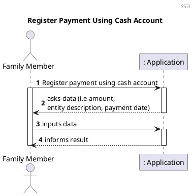
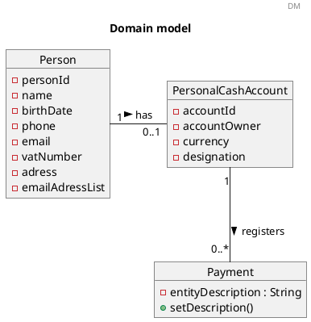
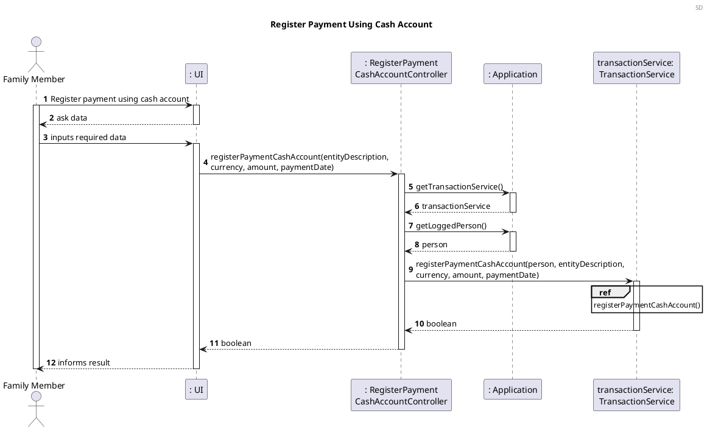
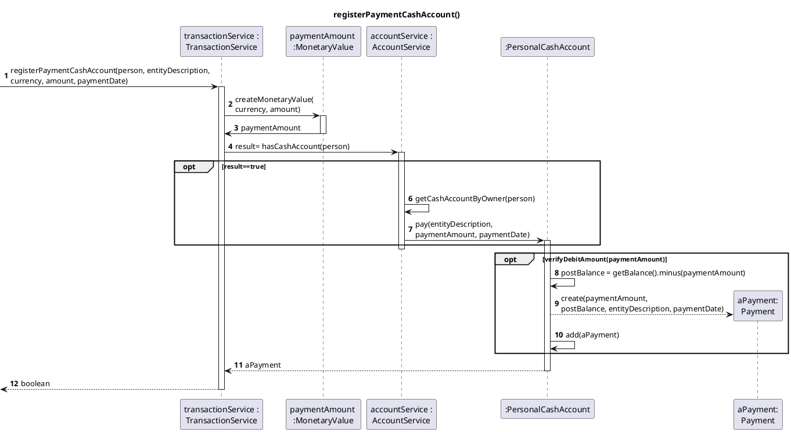
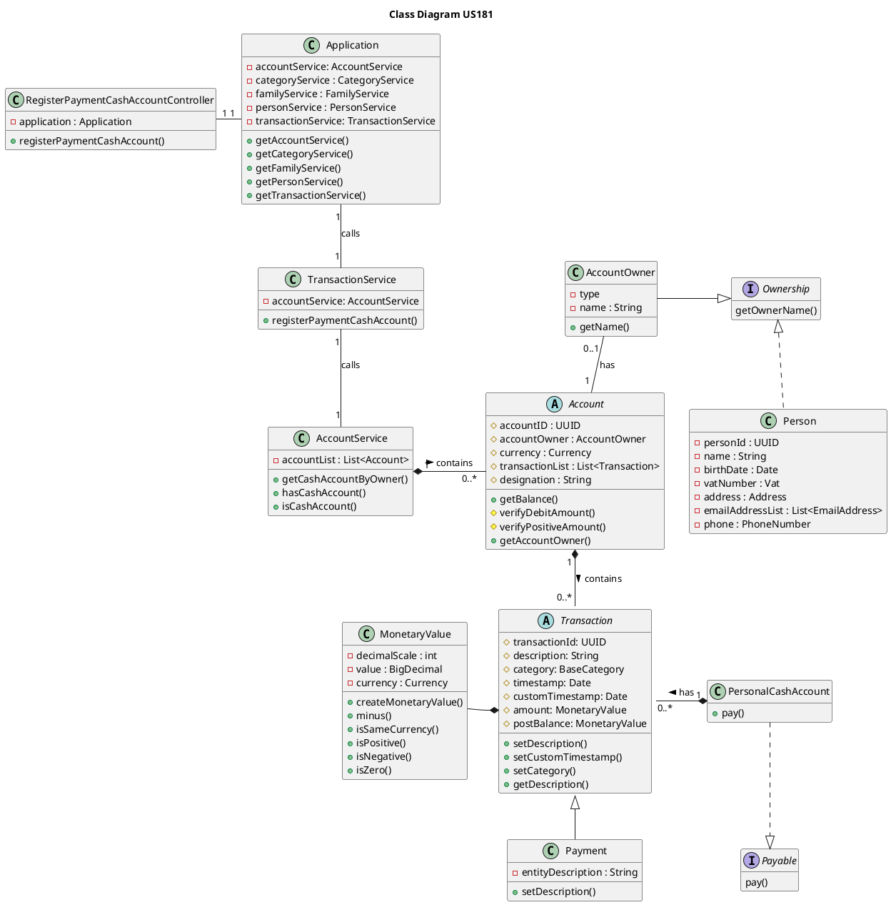
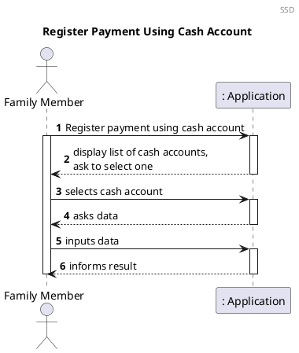
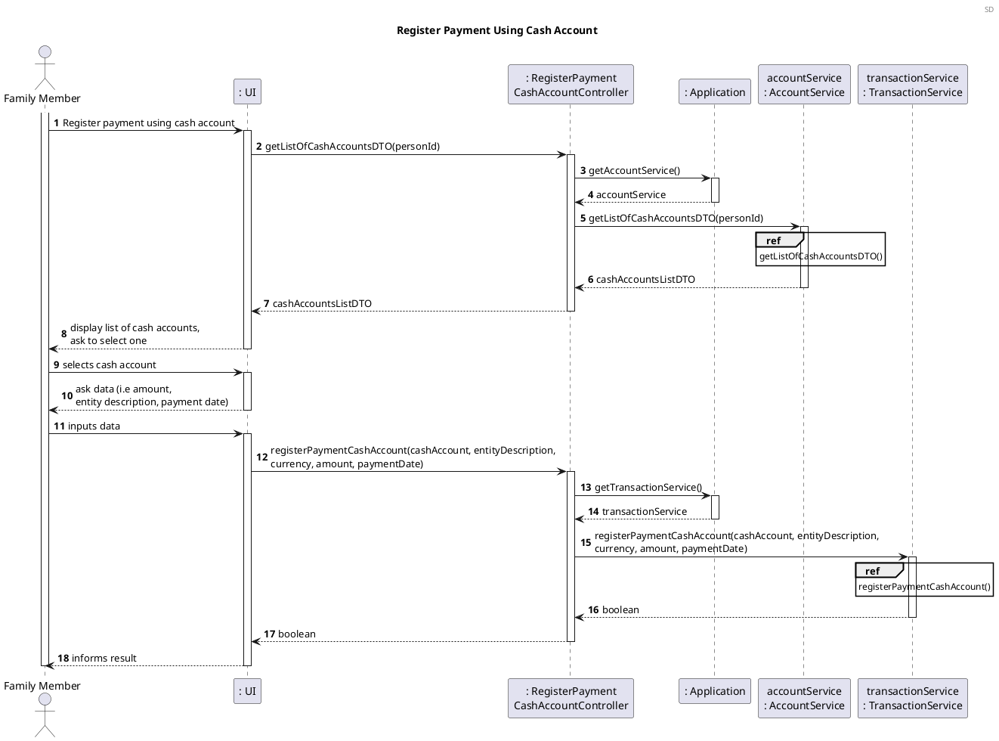
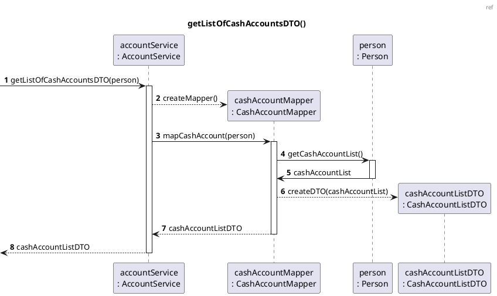
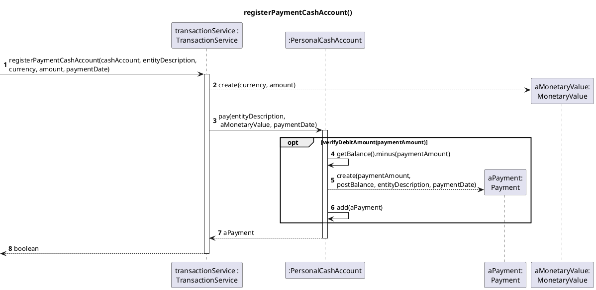

# US181 Register A Payment Using A Cash Account

# 1. Requirements

_As a family member, I want to register a payment that I have made using one of
my cash accounts._

According to this requirement, the family member would like to register a
payment that the family member has done using his/her cash account. Therefore,
in order to register the payment between his cash account the amount concerning
the payment is required and cannot be negative and, the family member must have
sufficient funds in his/her personal cash account to register the payment.

These criteria have to be fulfilled, otherwise the registration of the payment
using the family member’s cash account won't be successful.

The family member can have none or one cash account:
_"Each family member may have a cash account to represent the amount of cash (s)
he has.
"_

According to the Product Owner for now we should assume that each family member
will have only one personal cash account:
_"(...), para já, será de assumir que cada membro da família poderá ter apenas
uma cash account pessoal."_

## 1.1 System Sequence Diagram

The below System Sequence Diagram (SSD) captures the interaction between the
Family Member, and the Application when the Family Member wants to register a
payment using his/her cash account.



## 1.2 Dependency of other User Stories

This User Story has dependencies with the [US010], [US011] and [US101]
because a family, a family administrator and family members must exist in order
for the family member to register a payment.

In addition, this User Story has dependencies with the [US170], since the family
member must have a personal cash account.

# 2. Analysis

## 2.1 Payment Entry

According to what was described, the payment will be registered upon request
from the Family Member. To register the payment, in the functionality developed
for this US a Class Payment will be implemented and Payment will extend the
abstract class Transaction. The list of transactions is, for now, stored in an
abstract class Account, and each transaction has a description attribute. When
choosing the payment date, which is optional, if the payment date is not
inputted by the user or if the payment date is a future date, the payment date
will be set to the current system date, otherwise the payment date is the one
chosen by the user.

To register a Payment in the Personal Cash Account the following attributes are
required:

| Attributes        | Rules                                        |    
| --------------    | -------------------------------------------- |    
| entityDescription |  Required, String                            |               
| currency          |  Required, String                            |
| amount            |  Required, double                            |              
| paymentDate       |  Optional, String                            |    

## 2.2 Domain Model Excerpt

The relevant extract of the domain model is represented below:



# 3. Design

## 3.1. Functionality Development

The System Diagram is the following:





## 3.2. Class Diagram

The main classes involved in the realization of this requirement/functionality
were the following:

- RegisterPaymentCashAccountController
- Application
- AccountService
- TransactionService
- Account
- AccountOwner
- PersonalCashAccount
- Transaction
- Payment
- Person
- MonetaryValue

The Class Diagram is the following:



## 3.3. Applied Patterns

The applied patterns were the following:

- _Single Responsibility Principle (SRP)_ - All classes have one responsibility,
  which means, only one reason to change;
- _Controller_ - The controller (RegisterPaymentCashAccountController) receives
  and coordinates system operations connecting the UI layer to the App's logic
  layer;
- _Information Expert_ - Each class was assigned responsibilities that can be
  fulfilled because they have the information needed to do so;
- _Pure Fabrication_ - The AccountService and TransactionService are a type of
  class that do not represent a problem domain concept, nevertheless they were
  assigned a set of responsibilities to support high cohesion, low coupling and
  reuse;
- _Low Coupling_ - Classes were assigned responsibilities so that coupling
  remains as low as possible, reducing the impact of any changes made to objects
  later on;
- _High Cohesion_ - Classes were assigned responsibilities so that cohesion
  remains high(they are strongly related and highly focused). This helps to keep
  objects understandable and manageable, and also goes hand in hand with the low
  coupling principle.

## 3.4. Tests

### 3.4.1 Unit Tests

The Unit Tests are defined below:

**Unit test 1:** Verify that a payment is registered successfully.

```java
 @Test
    void registerPaymentCashAccountSuccessfully(){
            family=familyService.addFamily("Martins");
            familyId=family.getFamilyId();
            person=personService.addPerson("Raul","12/12/2012","234324534","raul_antonio@gmail.com",234235234,"sdgvzf","4800-344","aergb",familyId);
            application.setLoggedPerson(person);
            double amount=10;
            accountService.createPersonalCashAccount(person,amount,currency);
            String entityDescription="Continente";
            String paymentDate="21/02/2019";

            boolean result=controller.registerPaymentCashAccount(entityDescription,currency,amount,paymentDate);

            assertTrue(result);
            }

```

**Unit test 2:** Verify that the registration of a payment is unsuccessfully,
when balance in cash account is insufficient.

```java
 @Test
    void registerPaymentUnsuccessfullyWhenInsufficientFunds(){
            accountService.createPersonalCashAccount(person,initialAmount,currency);
            String entityDescription="GALP";
            String paymentDate="22/01/2021";
            double moneyAmount=1000;

            assertThrows(InvalidBalanceException.class,()->transactionService.registerPaymentCashAccount(person,entityDescription,currency,moneyAmount,paymentDate));
        }
```

**Unit test 3:** Verify that the registration of a payment is unsuccessfully,
when value of payment is negative.

```java
@Test
    void registerPaymentUnsuccessfullyWhenNegativeAmount(){
            accountService.createPersonalCashAccount(person,initialAmount,currency);
            String entityDescription="GALP";
            String paymentDate="22/01/2021";
            double moneyAmount=-10;

            assertThrows(InvalidAmountException.class,()->transactionService.registerPaymentCashAccount(person,entityDescription,currency,moneyAmount,paymentDate));
        }
```

**Unit test 4:** Verify that the registration of a payment is unsuccessfully,
when person does not have cash account.

```java
 @Test
    void registerPaymentUnsuccessfullyWhenPersonDoesntHaveCashAccount(){
            String entityDescription="GALP";
            String paymentDate="22/01/2021";
            double amount=10;

            boolean result=transactionService.registerPaymentCashAccount(person,entityDescription,currency,amount,paymentDate);

            assertFalse(result);
            }
```

**Unit test 5:** Verify that the registration of a payment is unsuccessfully,
when not using cash account.

```java
@Test
    void registerPaymentUnsuccessfullyWhenNotUsingCashAccount(){
            String issuer="SWitCH Bank";
            String currency=null;
            double creditLimit=500.0;
            String cardToken="1234";
            String designation="";
            accountService.createCreditCardAccount(person,issuer,currency,creditLimit,cardToken,designation);
            String entityDescription="GALP";
            String paymentDate="22/01/2021";
            double amount=10;

            boolean result=transactionService.registerPaymentCashAccount(person,entityDescription,currency,amount,paymentDate);

            assertFalse(result);
            }

```

# 4. Implementation

The main challenges encountered during the implementation of this functionality
were:

- The need to implement a Payable Interface, since all the transactions are
  saved in Account and not all accounts have the same behaviour,i.e, not all
  accounts will have the possibility to do a payment;
- The dependency on other functionalities to implement and test this
  functionality correctly.

In order to minimize these difficulties and to guarantee a reliable
functionality, the tests were done to cover the maximum scenarios, identifying
and correcting the encountered errors.

As mentioned before, to implement this user story it was considered that the
family member can have none or one cash account. Nevertheless, for the future if
a family member can have none or several cash accounts the following Sequence
System Diagram and System Diagram could be an alternative:









# 5. Integration/Demonstration

This functionality will be necessary for the
[US186] (_"As a family member, I want to get the list of movements on one of my
accounts between to dates."_), since to obtain the list of movements from one of
cash accounts, it will be necessary to have the registered payments.

In addition, it will be indirectly necessary for the following
[US135] (_"As a family administrator, I want to check the balance of the
family’s cash account or of a given family member."_),
[US185] (_"As a family member, I want to check the balance of one of my
accounts."_) and
[US188] (_"As a parent, I want to check the balance of one of my children’s cash
account."_), because the cash accounts have transactions that will influence the
balance of the accounts.

The development of [US135], [US185], [US186], [US188] helps to prove a good
integration with this functionality and its system components.

At the moment, no other user stories are dependent on this one, so its
integration with other functionalities cannot be tested further.

# 6. Observations

[us010]: US010_Create_Family.md

[us011]: US011_Add_Family_Administrator.md

[us101]: US101_Add_Family_Member.md

[us170]: US170_Create_Personal_Cash_Account.md

[us186]: US186_Get_Movements_Between_Two_Dates.md

[us135]: US135_Check_Balance_Family_Cash_Account_or_Given_Family_Member.md

[us185]: US185_Check_Balance_Of_One_Account.md

[us188]: US188_Check_Balance_Of_A_Family_s_Children.md


